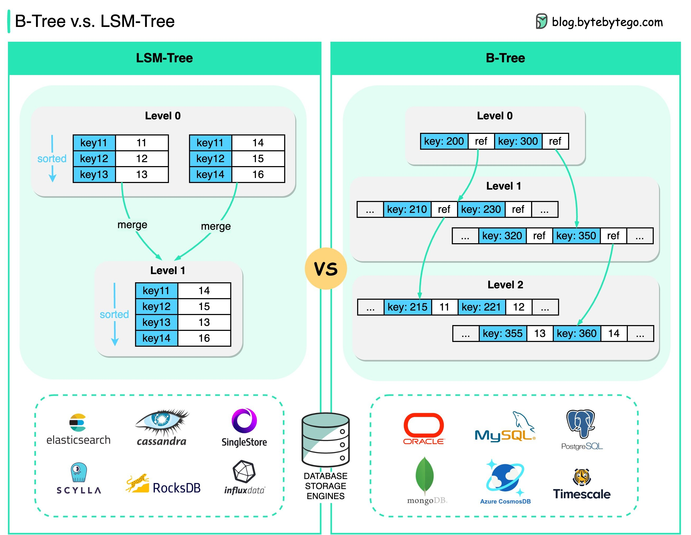

# B-Tree and LSM-Tree

## B-Tree

B-Tree is the most widely used indexing data structure in almost all relational databases.

The basic unit of information storage in B-Tree is usually called a “page”. To look up a key, it traces down the range of keys until the actual value is found.

## LSM-Tree

LSM-Tree (Log-Structured Merge Tree) is widely used by many NoSQL databases, such as Cassandra, LevelDB, and RocksDB.

LSM-trees maintain key-value pairs and are persisted to disk using a Sorted Strings Table (SSTable), in which the keys are sorted.

## Level 0

Level 0 segments are periodically merged into Level 1 segments. This process is called **compaction**.

The biggest difference is probably this:

🔹B-Tree enables faster reads
🔹LSM-Tree enables fast writes