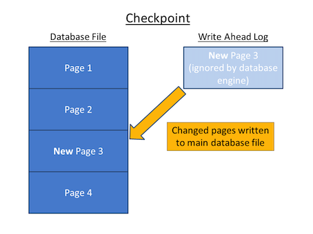
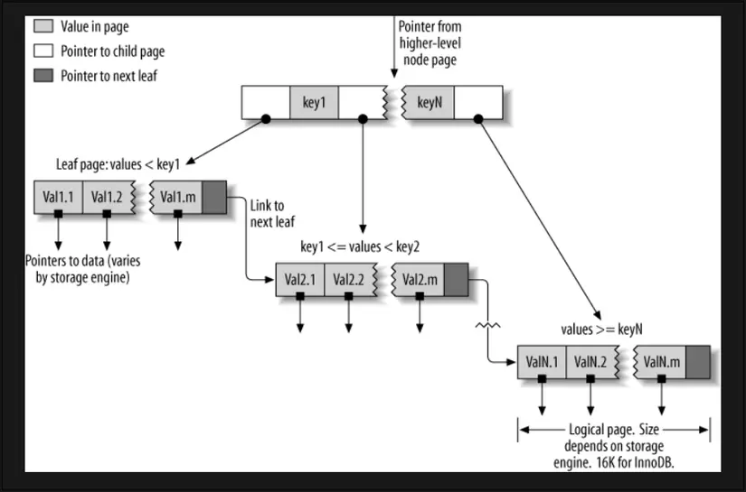
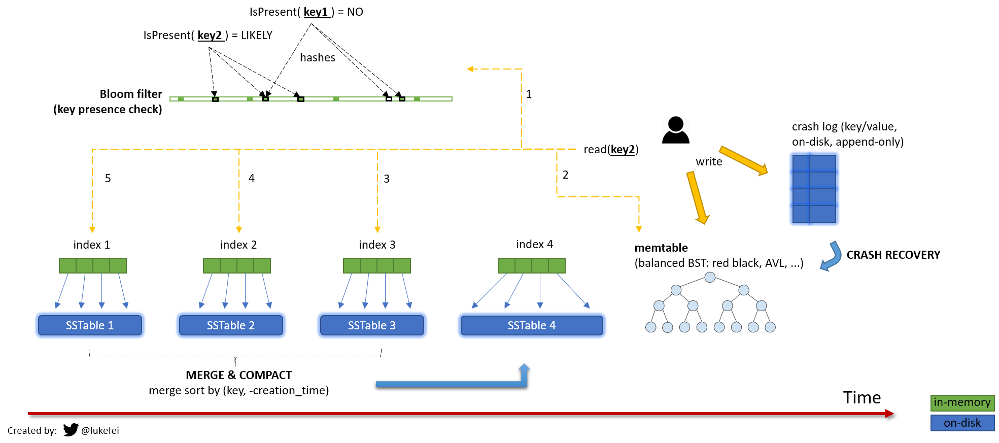
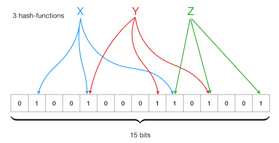

# Data structure

## [Skiplist](https://en.wikipedia.org/wiki/Skip_list)
- a common in-memory index type
- to build the `Sorted Set`
- allows for fast lookups, range queries, and other operations
- DB used: Redis

https://www.geeksforgeeks.org/skip-list/

https://www.npmjs.com/package/ts-skiplist

## Log Structured Storage

Log Structured Storage là trường phái Database dựa trên Append-only Log, tức là dữ liệu được ghi lưu lại dưới dạng log, chỉ có ghi xuống cuối file chứ không thể ghi đè.

## Write ahead log (WAL)
- Must force the log record for an update before the correspoding data gets to disk
- Must write all log records for a Xact before commit



- Guarantees Atomicity
- Guarantees Durability

### How it works
- Each log record has unique **Log Sequence Number (LSN)** (increment)
- Each data page contains a pageLSN, the LSN of the most recent log record for an update to that page
- System keeps track of flushedLSN
- WAL: before a page is written `pageLSN <= flushedLSN`

http://redbook.cs.berkeley.edu/redbook3/aries/sld013.htm

## Tree 

## Trie 

## Suffix Tree 

https://www.geeksforgeeks.org/ukkonens-suffix-tree-construction-part-1/


## Binary tree

### AVL Tree
AVL Tree = Adelson-Velsky and Landis Tree = self-balancing binary search tree

AVL tree is a self-balancing Binary Search Tree (BST) where the difference between heights of left and right subtrees cannot be more than one for all nodes. 

### Red-Black Tree

Red-Black tree is a binary search tree in which every node is colored with either red or black. It is a type of self balancing binary search tree. It has a good efficient worst case running time complexity.

https://www.geeksforgeeks.org/insertion-in-an-avl-tree/

https://www.geeksforgeeks.org/introduction-to-red-black-tree/

- Node Packages [bintrees](https://www.npmjs.com/package/bintrees) (Bin Tree & RB Tree)


## Hash Index aka HashTable
- allows for fast lookups, insertions & deletions

https://stackoverflow.com/questions/61745927/why-sequential-write-is-faster-than-random-write-on-hdd/61753068#61753068

## BTree



https://viblo.asia/p/mot-it-ve-b-tree-XL6lAPPrZek

## LSM tree

LSM tree = Log-Structured Merge-Tree

Sparse index in memory = LSM Tree Index

- DB used: RocksDB, LevelDB, Cassandra, HBase,  BigTable, Lucene


Big picture


### SSTable 

SSTable = Sorted Strings Table

Về bản chất thì nó khá giống với kiến trúc Log file

Điểm khác biệt duy nhất đó là: mỗi key trong SSTable đều chỉ xuất hiện 1 lần duy nhất (không có chuyện trùng lặp Key), và các row được sắp xếp theo Key.

- to store data on disk in sorted order
- file-based data structure that used to store large amounts of data in a highly compressed & efficient format

immutable on-disk “Map” implementation


### MemTable 
- use data structure AVL Tree or Red Black Tree 

## Bloom filter

A Bloom filter is a **space-efficient probabilistic** data structure that is used to test whether an element is a member of a set.



Use case: 
- avoid attack miss cache attack 

Refs
- Node Package [bloom-filters](https://www.npmjs.com/package/bloom-filters)
- [Bloom filters Introduction](https://www.geeksforgeeks.org/bloom-filters-introduction-and-python-implementation/?ref=gcse)


https://www.scylladb.com/glossary/sstable/


## Data structure

A good engineer needs to recognize how data structures are used in our daily lives.

- **list**: keep your Twitter feeds
- **stack**: support undo/redo of the word editor
- **queue**: keep printer jobs, or send user actions in-game
- **heap**: task scheduling
- **tree**: keep the HTML document, or for AI decision
- **suffix tree**: for searching string in a document
- **graph**: for tracking friendship, or path finding
- **r-tree**: for finding the nearest neighbor
- **vertex buffer**: for sending data to GPU for rendering

---

## SSTable
What database uses SSTable?

SSTable is a file format used in several databases, including Apache Cassandra, HBase, and LevelDB. It is a simple and efficient way to store data on disk, allowing for fast read and write operations.

In Apache Cassandra, SSTables are the primary storage format for data. Each SSTable contains a sorted set of key-value pairs, with each key being unique. The data is stored in a compressed format, allowing for efficient use of disk space. When data is written to Cassandra, it is first written to a commit log, and then to an in-memory data structure called a memtable. Once the memtable reaches a certain size, it is flushed to disk as an SSTable. Cassandra uses a process called compaction to merge multiple SSTables into a single file, reducing disk usage and improving read performance.

HBase also uses SSTables as its primary storage format. In HBase, SSTables are called HFiles. Each HFile contains a sorted set of key-value pairs, with each key being unique. HBase uses a process called compaction to merge multiple HFiles into a single file, reducing disk usage and improving read performance.

LevelDB is a key-value store developed by Google. It also uses SSTables as its primary storage format. Each SSTable contains a sorted set of key-value pairs, with each key being unique. LevelDB uses a process called compaction to merge multiple SSTables into a single file, reducing disk usage and improving read performance.

In conclusion, SSTable is a file format used in several databases, including Apache Cassandra, HBase, and LevelDB. It is a simple and efficient way to store data on disk, allowing for fast `read` and `write` operations.

## LSM Tree

LSM tree stands for Log-Structured Merge Tree. It is a data structure used in databases to efficiently manage write-intensive workloads. The LSM tree is designed to optimize write operations by minimizing the number of disk writes required to store data.

In an LSM tree, data is first written to an in-memory buffer called a memtable. Once the memtable is full, it is flushed to disk as an immutable sorted file called a sstable. The sstable is then merged with other sstables in a process called compaction. During compaction, the sstables are merged into a new sstable, which is then written to disk. This process is repeated until all the sstables are merged into a single sstable.

The LSM tree has several advantages over other data structures used in databases. First, it is optimized for write-intensive workloads, making it ideal for applications that require high write throughput. Second, it is designed to minimize disk writes, which reduces the wear and tear on the disk and improves performance. Finally, it is fault-tolerant, meaning that it can recover from crashes and other failures without losing data.

Here is an example of how an LSM tree might be implemented in code:

```py
class LSMTree:
    def __init__(self):
        self.memtable = {}
        self.sstables = []

    def write(self, key, value):
        self.memtable[key] = value
        if len(self.memtable) >= 1000:
            self.flush_memtable()

    def flush_memtable(self):
        sstable = sorted(self.memtable.items())
        self.sstables.append(sstable)
        self.memtable = {}

    def get(self, key):
        for sstable in reversed(self.sstables):
            for k, v in sstable:
                if k == key:
                    return v
        return None
```

In this example, the LSM tree is implemented as a Python class. The `write` method adds a key-value pair to the memtable. When the memtable reaches a certain size (in this case, 1000 items), it is flushed to disk as an sstable using the `flush_memtable` method. The `get` method searches for a key in the sstables by iterating over them in reverse order (since the most recent data is in the last sstable). If the key is found, the corresponding value is returned. If the key is not found, None is returned.

In conclusion, the LSM tree is a powerful data structure used in databases to optimize `write`

## Bloom filter

A Bloom filter is a probabilistic data structure used in databases to test whether an element is a member of a set. It is named after its inventor, Burton Howard Bloom, who first described the concept in 1970.

The Bloom filter is a space-efficient way to represent a set of items, and it works by using a bit array and a set of hash functions. When an item is added to the set, the hash functions are applied to the item, and the resulting hash values are used to set the corresponding bits in the bit array. When testing whether an item is a member of the set, the hash functions are again applied to the item, and the corresponding bits in the bit array are checked. If all the bits are set, then the item is probably in the set; if any of the bits are not set, then the item is definitely not in the set.

One of the key advantages of Bloom filters is their space efficiency. Because they use a bit array, they can represent a large set of items using a relatively small amount of memory. However, this comes at a cost: Bloom filters have a non-zero probability of false positives, meaning that they may incorrectly report that an item is in the set when it is not. The probability of false positives can be controlled by adjusting the size of the bit array and the number of hash functions used.

Bloom filters are commonly used in databases for tasks such as query optimization and caching. For example, a database might use a Bloom filter to quickly test whether a particular row exists in a table, without having to perform a full table scan. Bloom filters can also be used to reduce the number of disk reads required for certain queries, by caching the results of previous queries in memory.

Here is an example of how to use a Bloom filter in Python:

```py
import hashlib
import bitarray

class BloomFilter:
    def __init__(self, size, hash_count):
        self.size = size
        self.hash_count = hash_count
        self.bit_array = bitarray.bitarray(size)
        self.bit_array.setall(0)

    def add(self, item):
        for i in range(self.hash_count):
            digest = hashlib.sha256(str(i).encode() + str(item).encode()).hexdigest()
            index = int(digest, 16) % self.size
            self.bit_array[index] = 1

    def __contains__(self, item):
        for i in range(self.hash_count):
            digest = hashlib.sha256(str(i).encode() + str(item).encode()).hexdigest()
            index = int(digest, 16) % self.size
            if self.bit_array[index] == 0:
                return False
        return True

bf = BloomFilter(1000000, 10)
bf.add("apple")
bf.add("banana")
bf.add("orange")

print("apple" in bf) # True
print("pear" in bf) # False
```

## Data Capture Change

Data capture change refers to the process of capturing changes made to data in a database. This is important because it allows for tracking and auditing of changes, which can be useful for compliance and security purposes.

There are several ways to capture data changes in a database. One common method is to use triggers, which are special procedures that are automatically executed when certain events occur in the database. For example, a trigger can be set up to capture changes made to a specific table or column, and then log those changes to a separate table or file.

Another method is to use change data capture (CDC) technology, which is built into some database management systems. CDC works by monitoring the transaction log of a database, which contains a record of all changes made to the data. CDC can then extract the relevant changes and store them in a separate location for analysis and reporting.

Capturing data changes can be useful for a variety of purposes, such as:

- Auditing: By tracking changes to data, organizations can ensure compliance with regulations and internal policies.
- Troubleshooting: When problems occur in a database, capturing data changes can help identify the root cause of the issue.
- Reporting: By analyzing data changes over time, organizations can gain insights into trends and patterns that can inform decision-making.

In summary, data capture change is an important aspect of database management that allows for tracking and auditing of changes made to data. There are several methods for capturing data changes, including triggers and CDC technology. By capturing data changes, organizations can improve compliance, troubleshooting, and reporting capabilities.

## Consensus algorithms

**Paxos** is one of the most widely used consensus algorithms in DATABASE systems. It is a **leader-based** algorithm, which means that one node is designated as the leader and is responsible for proposing changes to the database. The other nodes in the system then vote on whether to accept or reject the proposed changes. If a majority of nodes agree to the proposed changes, they are applied to the database.

**Raft** is another consensus algorithm that is gaining popularity in DATABASE systems. It is similar to Paxos in that it is also a **leader-based** algorithm. However, Raft is designed to be more understandable and easier to implement than Paxos. Raft also includes additional features, such as **leader election** and **log compaction**, that make it more robust than Paxos in certain situations.

**Byzantine Fault Tolerance (BFT)** is a consensus algorithm that is designed to be **resilient to malicious nodes in the system**. In a BFT system, nodes are assumed to be potentially malicious, and the algorithm is designed to ensure that the system can still reach consensus even if some nodes are trying to disrupt the process. BFT is often used in systems where security is a top priority, such as financial systems or military applications.

## Refs

https://zzzcode.ai/answer-question