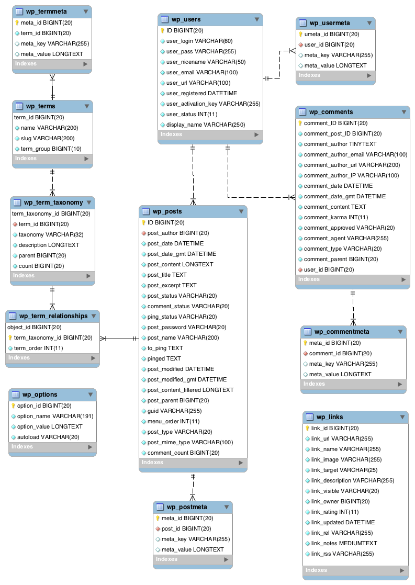

# Database design 

##  Polymorphic DB Table Design

Look at [Example Person and Organization Example](https://dba.stackexchange.com/questions/179654/developing-a-database-for-a-funds-transfers-business-where-a-people-and-organi)

source: 

Key takeaways:
- "As demonstrated, Person and Organization are depicted as mutually exclusive subtypes of Party."
- "The Party **supertype** holds a discriminator (i.e., PartyTypeCode) and all the properties (or attributes) that are common to its **subtypes**, which, in turn, have the properties that apply to each of them."

Result DB diagram. Pay attention to how the polymorphic relationships resolved using this design:
- Person is-a Party
- Organization is-a Party
- PartyTypeCode is the **discriminator**

See more: 
- [3 ways to implement class hierarchies in relational databases](https://stackoverflow.com/questions/9174200/how-to-create-multiple-one-to-ones/9178524#9178524)
- [Single Table Inheritance](https://www.martinfowler.com/eaaCatalog/singleTableInheritance.html)
- [Class Table Inheritance](https://www.martinfowler.com/eaaCatalog/classTableInheritance.html)
- [Concrete Table Inheritance](https://www.martinfowler.com/eaaCatalog/concreteTableInheritance.html)

## Metadata DB Table Design 

Wordpress database is a great example 

[Another one](https://stackoverflow.com/questions/3241033/designing-database-to-hold-different-metadata-information)