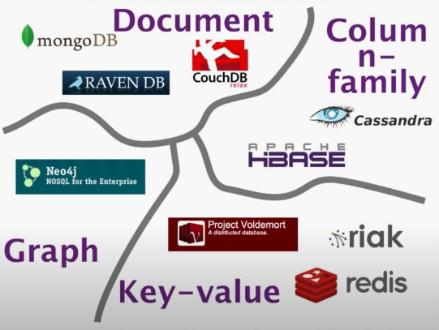
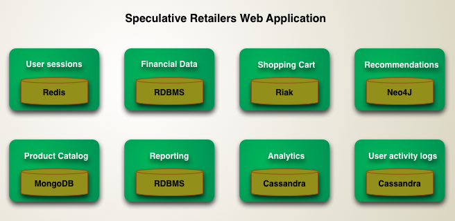
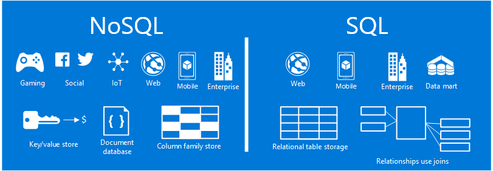
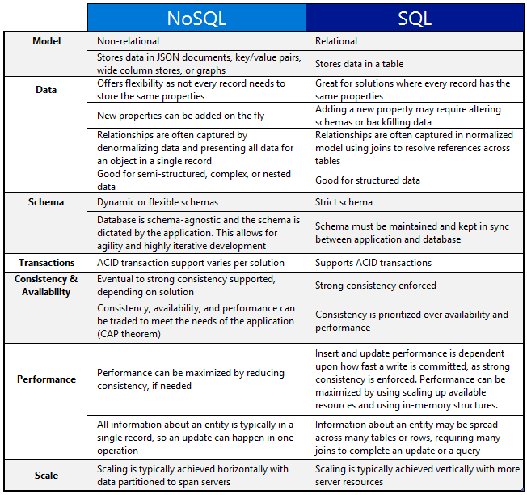

# NoSQL

## Definition

*There's no strong definition of the concept out there, no trademarks, no standard group, not even a manifesto.*

Some characteristics are common amongst these databases, but none are definitional.
- Not using the relational model (nor the SQL language)
- Open source
- Designed to run on large clusters
- Based on the needs of 21st century web properties
- No schema, allowing fields to be added to any record without controls

## Why NoSql?

- Relational databases have been a successful technology for twenty years, providing persistence, concurrency control, and an integration mechanism.
- Application developers have been frustrated with the impedance mismatch between the relational model and the in-memory data structures.
- There is a movement away from using databases as integration points towards encapsulating databases within applications and integrating through services.
- The vital factor for a change in data storage was the need to support large volumes of data by running on clusters. Relational databases are not designed to run efficiently on clusters.
- NoSQL is an accidental neologism. There is no prescriptive definition—all you can make is an observation of common characteristics.
- The most important result of the rise of NoSQL is Polyglot Persistence.

## Data Models

- Document
- Column-family
- Key-value
- Graph

### Aggregate Data Model

An aggregate is a collection of data that we interact with as a unit. Aggregates form the boundaries for ACID operations with the database.

Key-value, document, and column-family databases can all be seen as forms of aggregate-oriented database.

Aggregates make it easier for the database to manage data storage over clusters.

Aggregate-oriented databases **work best when most data interaction is done with the same aggregate**; aggregate-ignorant databases are better when interactions use data organized in many different formations.

## Polygot Persistence

Polyglot persistence is about using different data storage technologies to handle varying data storage needs.

Polyglot persistence can apply across an enterprise or within a single application.

Encapsulating data access into services reduces the impact of data storage choices on other parts of a system.

Adding more data storage technologies increases complexity in programming and operations, so the advantages of a good data storage fit need to be weighed against this complexity.

## Sql vs. NoSql

<!--  -->

|  | NoSQL | SQL
| -- | -------|--------|
| **Model** | Non-relational | Relational |
|    | Stores data in JSON documents. key/value pairs, wide column stores, or graphs | Stores data in a table |
| **Data** | Offers flexibility as not every record needs to store the same properties  | Great for solutions where every record has the same properties |
| | New properties can be added on the fly | Adding a new property may require altering schemas or backfilling data |
| | Relationships are often captured by denormalizing data and presenting all data for an object in a single record | Relationships are often captured in normalized model using joins to resolve references across tables |
| | Good for semi-structured, complex or nested data | Good for structured data |
| **Schema** | Dynamic or flexible schemas | Strict schema |
| |  Database is schema-agnostic and the schema is dictated by the application. This allows for agility and highly itertive development | Schema must be maintained and kept in sync between application and database |
| **Transactions** |  ACID transaction support varies per solution | Supports ACID transactions |
| **Consistency & Availability** |  Eventual to strong consistency supported, depending on solution  | Strong consistency enforced |
| | Consistency, availability, and performance can be traded to meet the needs of the application (CAP theorem) |  Consistency is prioritized over availability and performance |
| **Performance** |  Performance can be maximized by reducing consistency, if needed | Insert and update performance is dependent upon how fast a write is committed, as strong consistency is enforced. Performance can be maximized by using scaling up available resources and using in-memory structures. |
| | All information about an entity is typically in a single record, so an update can happen in one operation | Information about an entity may be spread across many tables or rows, requiring many joins to complete an update or a query | 
| **Scale** | Scaling is typically achieved horizontally with data partitioned to span servers | Scaling is typically achieved vertically with more server resources |

- **SQL**: Structured Query Language
- **UnQL**: Unstructured Query Language
- **ACID**: Atomicity, Consistency, Isolation and Durability
- **CAP**: Consistency, Availability and Partition tolerance 

## References 

- [Key Points from NoSQL Distilled](https://martinfowler.com/articles/nosqlKeyPoints.html)

### Introduction to NoSQL - Martin Fowler
<iframe width="560" height="315" src="https://www.youtube.com/embed/qI_g07C_Q5I" frameborder="0" allow="accelerometer; autoplay; clipboard-write; encrypted-media; gyroscope; picture-in-picture" allowfullscreen></iframe>