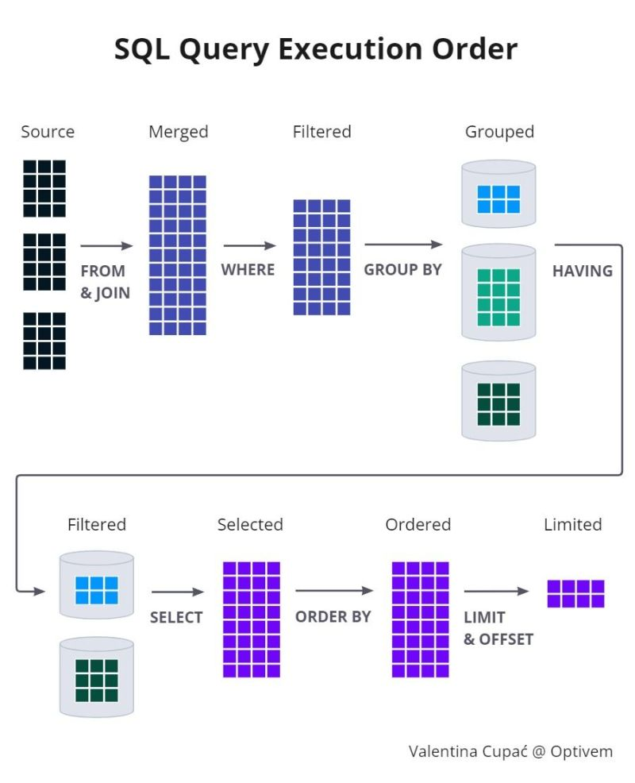

# Tối ưu MySQL (Database Tuning)

::: tip
Database tuning describes a group of activities used to optimize and homogenize the performance of a database. 
:::

## Thứ tự thực thi

## Khóa cửa khóa ngõ
Nếu nhất quán dữ liệu, ràng buộc toàn vẹn không là vấn đề thì bỏ mấy cái quan hệ khóa chính, khóa ngoại. 

## Thiết kế phá chuẩn
Đôi khi thiết kế chuẩn, không dư thừa dữ liệu lại gây ra câu query phức tạp như c, như b, như l... nên phá chuẩn, chấp nhận dư thừa là cách có thể xem xét =))

## Sử dụng có chọn lọc
- Chỉ SELECT những cột cần thiết, đừng `SELECT *` vô tội vạ
- Chỉ JOIN với những bảng cần thiết, nghe cứ như đùa nhưng mà thế éo nào... =))
- Ý thức sort: không chỉ là `ORDER BY` là diễn ra sort mà kể cả `DISTINCT` hay `GROUP BY` hoặc là `UNION` 
    - Không sử dụng `HAVING` nếu có thể dùng `WHERE`. Đơn giản là `WHERE` sẽ giới hạn record trả về trước khi `SORT` rồi `GROUP BY`.
    - Phân biệt giữa 2 cái này: `UNION ALL` hay `UNION`. Cái sau có sử dụng `DISTINCT` để loại bỏ record giống nhau. 

## Index column

Có 4 loại tùy mục đích sử dụng mà lôi ra xài thôi. 

4 loại nào thì [📕 note ở đây](mysql_snippets.md#index)

### Phản khoa học
**Mặc dù đã index nhưng những câu điều kiện dưới đây sẽ bóp d*i đồng đội:**
- Dính tới NULL: `IS NULL`, `IS NOT NULL`
- Phủ định:  `!=`, `<>`,  `NOT IN`, `NOT LIKE`
- `OR` trong điều kiện 
- LIKE 2 lần =)) `LIKE '%tha tim%'`, và ngay cả `LIKE '%tha-tim'` thì cũng chả được tí index nào đâu nha. Cái này thì nhiều khi bất khả kháng =)) chấp nhận thôi 

**Dưới đây là một số cách khách làm giảm hiệu năng index =))**
- Đặt sai thứ tự cột trên index nhiều cột. 
- So sánh 2 lần =)) `WHERE score >= 2`. Cái này bằng với việc `WHERE score > 2 OR score = 2`. NẾUchỉ thao tác với số nguyên thì có thể sửa lại `WHERE score > 1`. 

**Vài lưu ý khác về index:**
- Không nên sử dụng trên bảng nhỏ
- Không nên sử dụng trên bảng thường update / insert 
- không nên sử dụng trên cột thường update / insert 
- Không nên sử dụng trên cột nhiều giá trị `NULL`
- Không nên sử dụng trên cột có ít giá trị. Vd như `active` và `inactive` 

## Sử dụng ORM hợp lý
Cân nhắc lúc nào cần sử dụng Lazy loading, lúc nào cần Eager Loading. Nhất là khi làm việc với Array. 

## Job schedule
Chạy script để thực hiện Job schedule (Crontab)  hoặc Backup database nên thực hiện vào lúc ít người sử dụng sản phẩm nhất.

## EXPLAIN
Sử dụng `EXPLAIN {{query}}` để phân tích câu lệnh :D Xem được đang join cái gì, có index không, bao nhiêu rows,... [Sách ôn thi học sinh giỏi](https://dzone.com/articles/understanding-mysql-queries-with-explain)

## Và sử dụng các mô hình scale
[📕 Xem bài này](./db/architect.md)