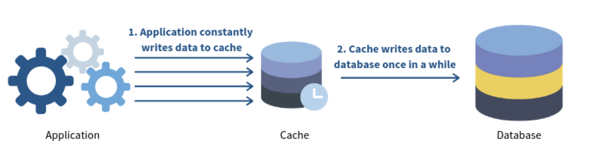
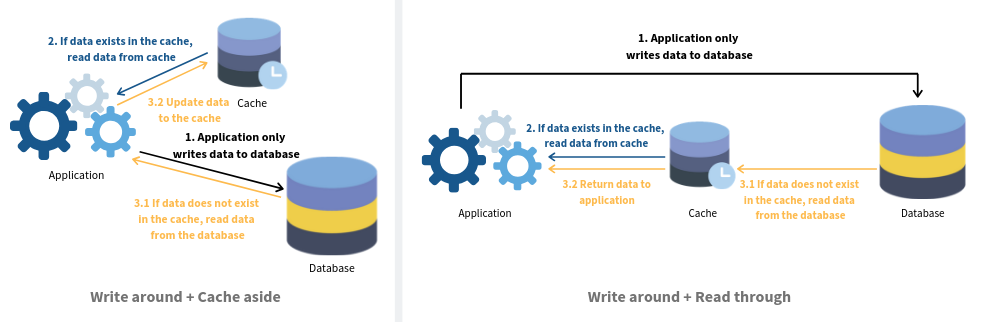

# Redis Notes


- Node Client: [ioredis](https://www.npmjs.com/package/ioredis)

## Communication Patterns

### Use list as event queue

[Code example](https://github.com/luin/ioredis/blob/main/examples/list.js)

```ts
// sending client 
setTimeout(() => {
    // `redis` is in the block mode due to `redis.blpop()`,
    // so we duplicate a new connection to invoke LPUSH command.
    redis.duplicate().lpush("block-list", "hello");
}, 1200);


// block receiving client
const blockPopped = await redis.blpop("block-list", 0); // Resolved after 1200ms.
console.log(blockPopped); // [ 'block-list', 'hello' ]
```

### Pub/sub 

publisher.js
```ts
const message = { foo: Math.random() };
// Publish to my-channel-1 or my-channel-2 randomly.
const channel = `my-channel-${1 + Math.round(Math.random())}`;

// Message can be either a string or a buffer
redis.publish(channel, JSON.stringify(message));
```

subscriber.js
```ts
redis.subscribe("my-channel-1", "my-channel-2", (err, count) => {
    //...
});

redis.on("message", (channel, message) => {
  console.log(`Received ${message} from ${channel}`);
});
```

### Locking 

Package [redis-lock](https://www.npmjs.com/package/redis-lock)

- One worker (and only one) worked to be able to acquire rights to a resource
- Be able to release this lock reliably
- Not deadlock any resource meaning that a resource should be unlocked after a given time period.

### Others 
- Simple Queue: [beequeue](https://www.npmjs.com/package/beequeue)
- GraphQL subscriptions: [https://www.npmjs.com/package/graphql-subscriptions](https://www.npmjs.com/package/graphql-subscriptions), [graphql-redis-subscriptions](https://www.npmjs.com/package/graphql-redis-subscriptions)

## Naming convention for key

```
SET Personal:key1 value
SET Personal:key2 value
```

The above pattern can be extended as required so that we get the benefit for the same key managed by different applications or domains or modules.


### Hash tags for determining slot

- `{user1000}.following` and `{user1000}.followers` => `user1000` hashed
- `foo{}{bar}` => `foo{}{bar}` hashed
- `foo{{bar}}zap` => `{bar` hashed
- `foo{bar}{zap}` => `bar` hashed

## Performance notes

- Consider more keys and smaller values
- Any key above 1024 bytes is not recommended as key size may cause issues considering memory and bandwidth.
- SCAN vs. KEYS
    - KEYS command, which returns all matched elements at once, is risky to use in production. It may cause your Redis server to become inefficient and even exhaust its RAM resources.
    - SCAN commands allow you to inspect data without risking your server being blocked.
        - get the data without requiring the use of a slave.
        - retrieve keys in the keyspace using a cursor.
        - accepts a key name pattern and an optional count argument.

### Sorted Sets as Indexes

[Sorted Sets Docs](https://www.tutorialspoint.com/redis/redis_sorted_sets.htm)

```ts
const data = [
    { country: "china", population: 1409517397 },
    { country: "atican-city", population: 792222 },
    // ... more
];

const key = "countries-by-pop"

await redis.zadd(
    key,
    ...scores.map(({ country, population }) => [population, country])
);

// To retrieve the top five countries
await redis.zrange(key, 0, 4); // string[]

// To retrieve the 5 lowest population
await redis.zrange(key, 0, 4, "REV"); 

// getting the countries with a population between 1,000,000 and 100,000 (e.g. by score) would be:
await redis.zrange(key, 100000, 1000000, "BYSCORE");
```


*Read more*: 
- [Redis besst practices](https://redis.com/redis-best-practices/introduction/)
- [Redis clustering best practices](https://redis.com/blog/redis-clustering-best-practices-with-keys/)
- [Cache best practices (Azure)](https://docs.microsoft.com/en-us/azure/azure-cache-for-redis/cache-best-practices-development)

## Use Lua Scripts

Generate flakeId code for example

```ts
const generateFlakeIdScript = `
local key = KEYS[1]
local cnt = redis.call('get', key) or 0
cnt = cnt + 1
if (cnt > 1023) then
  cnt = 0
end
redis.call('set', key, cnt)
return cnt`;

// define 
redis.defineCommand("generateFlakeId", {
  numberOfKeys: 1,
  lua: generateFlakeIdScript,
});

// usage 
const key = "FLAKE_ID{GENERATOR_ID}"
redis.generateFlakeId(key, (err, result) => {
    const counter = Number.parseInt(result);
    // more code ...
});
```


## Cache Strategies 

Choose strategies for reading / writing cache when using Redis 

### Cache Aside


- The cache is sitting aside the database. 
- The application will first request the data from the cache. 
    - If the data exists **cache hit**, the app will retrieve the data directly. 
    - If not **cache miss**, the app will request data from the database and write it to the cache so that the data can be retrieved from the cache again next time.


### Read through


- The cache sits in between the application and the database. 
- The application only request data from the cache. 
- If a **cache miss** occurs, the cache is responsible to retrieve data from the database, update itself and return data to the application.


### Write through


- The cache sits in between the application and the database. 
- Every writes from the application must go through the cache to the database.

### Write Back (a.k.a Write Behind)



- The application still writes data to the cache. 
- However, there is a delay in writing from the cache to the database. 
- The cache only flushes all updated data to the DB once in a while (e.g. every 2 minutes).

### Write Around



- Write around usually combines with either **cache aside** or **read through** strategy. 
- The application writes directly to the database. 
- Only data that is read goes to the cache.


*Read more*: 
- [💎 Dealing with concurrency issues when miss cache storm](https://stackoverflow.com/questions/23303463/dealing-with-concurrency-issues-when-caching-for-high-traffic-sites): Use a soft expiration for async update data on cache
 