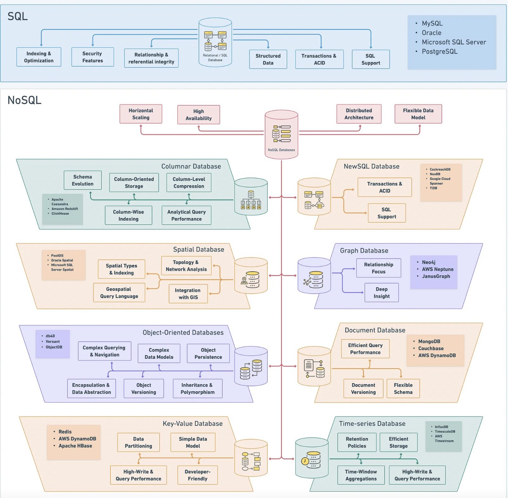
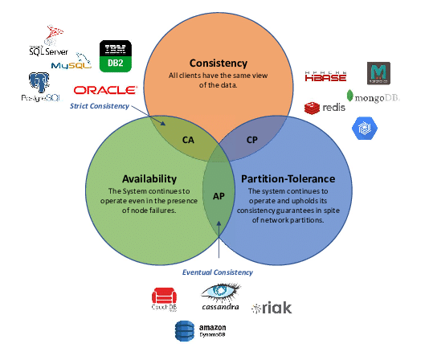

# Choose a data storage

<TagLinks />

There is no super storage for all cases. Here is a few of my notes about it:

## Database types overview



[Ref](https://blog.devgenius.io/mastering-the-database-duality-exploring-the-realm-of-sql-and-nosql-with-cheatsheet-33a73f752460)

## Database Select process


[Original Tweet](https://twitter.com/alexxubyte/status/1653785124474064897/photo/1)

### Select based on CAP



### Polygot Persistence


Polyglot persistence is about using different data storage technologies to handle varying data storage needs.

Polyglot persistence can apply across an enterprise or within a single application.

Encapsulating data access into services reduces the impact of data storage choices on other parts of a system.

Adding more data storage technologies increases complexity in programming and operations, so the advantages of a good data storage fit need to be weighed against this complexity.

## Relational Database

Examples: MySQL, Postgres.

### *When to Use?*
In relational databases, it is **easy to represent the entities as tables and define the relationship between them**. It **supports transactions to write to one or many entities** and supports simple to complex read queries. You’re able to add in an ad-hoc index to improve the read performance at the
expense of write performance. Also, if you have multiple entities with
shared attributes, you can fetch results with a joined or unioned table. Also,
it supports updates for a record well. Some databases are append-only.

However, it doesn’t mean a relational database is efficient at all the queries.
So you need to think about the query you’re making and have some
intuition on whether it’ll be efficient for the relational database.

In a system design interview, you can consider using a relational database
unless you find a better reason to use another database choice.


::: warning Reminder
Don’t fall into the trap of saying relational databases don’t scale.
Relational databases do scale, and all big companies use them. However,
relational databases may not scale for particular use cases, and there are
better options, and you should be clear about why. For example, if the use
case is metrics collection where there’s a high write ingestion without the
need to join tables and is append-only, a relational database probably
“doesn’t scale” for that use case.
:::

### *Advanced Concepts*

Most traditional relational databases use B-Tree based indexing, which is
better for reads and less good for writes.

Relational databases can provide stronger data integrity through transaction
guarantee by enforcing constraint through entities through foreign keys. For
example, if you’re designing a file system with a table folder and a table
file. If the folder table has a column called number_of_files, you may have
a transaction to add a file in that folder and increase number_of_files by 1.
RDBMS does this well by providing transactions to this operation. If the
database increases number_of_files by 1 first and the operation to add a row
to the file table fails, number_of_files will get rolled back.

::: warning Reminder
Many resources will claim that relational databases have good ACID
properties, so it’s worth looking into it quickly. However, ACID is a very
high-level term that isn’t necessarily unique to relational databases. For
example, it’s possible to have transactions on a row or document level in a
NoSQL database. NoSQL also provides strong durability with
replications. So, in an interview, don’t argue for relational databases by
saying it’s ACID compliant and other databases are not.

**Atomicity**: The transaction is all-or-none. If the transaction fails, the
database will roll back the transaction.

**Consistency**: The transaction doesn’t leave part of the data committed if
the transaction fails.

**Isolation**: The transaction keeps other transactions from accessing or
writing to the same data until finished.
Durability: Guarantees the data will not be lost.
:::


### MySql
A unique design characteristic of MySQL is the seperation of query processing and other server tasks from storage engine. This seperation of concerns let you to trade of various features without changing your data model

#### InnoDB
- The default transactional storage engine for MySQL and the most important/widely used. 
- InnoDB uses **Multiversion Concurrency Control (MVCC)** to archive high concurrency.
- The advantages of MVCC is the increased concurrency. The drawback is the additional storage and maintenance work.

#### MyISAM
- This is the original, and oldest. 
- **It doesn't support transaction**. 
- Its design is optimized more for speed and compact data storage.

#### The Archive Engine
- Not a transactional storage engine
- simply optimmized for high-speed inserting and compressed storage.
- The best for **Logging** and **Data acquisition** (e.g: crawl data)

#### The CSV Engine
- helpful as data interchange format
- tables can be constructed from CSV files automatically
- allow access to the files from other programs

#### The memory engine
- formerly called *HEAP* tables stores in memory


## Document Store

Examples: MongoDB, Amazon DocumentDB

### *When to Use?*

You should use a document database if the data you are storing is
unstructured and doesn’t fit well in a relational database. For example, if
you’re storing a product catalog where the schema between each product
catalog could differ significantly, creating a relational table with all the
known columns may be wasteful, since the storage will be sparse.
Documents can use formats such as JSON and XML, and if your data fits
naturally to those representations, then it’s a good fit.

In an interview setting, the data is usually structured unless the interviewer
intentionally sets it up in a way that they’re looking for a document store.
When in doubt, favor relational over document since it’s just easier to deal
with the flexibility of different queries by having tables.

When in doubt, favor relational over document since it’s just easier to deal
with the flexibility of different queries by having tables.

## Columnar Store

Examples: InfluxDB, Pinot

### *When to Use?*

The columnar store has a schema that looks the same as a traditional
relational database. However, columnar stores are more optimized for
OLAP queries to fetch data in a column fashion. For example, assume you
have a table for `time_stamp | metrics_value`. Then, you might query for all
the metrics_value from time_0 to time_1. This query pattern is good for
analytics databases and time-series databases which have a lot of overlaps.

For a time-series database that stores its data in a columnar fashion, writes
happen more frequently than read. Update to any record is rare since most
are append-only. When deletion happens, the deletions happen in batches
instead of an ad-hoc operation like in a relational database.

In a system design interview, a good candidate for a columnar store would
be an analytics dashboard. Most analytics dashboards show some sort of
graph with an x-axis and y-axis. And for each graph, you will want to fetch
a series of data to be displayed on the dashboard. However, this
significantly depends on the dashboard query, so make sure you understand
the datas on the dashboard graphs before committing to a columnar store.

### *Advanced Concepts*
Pretend you have a database table that looks like this:


In a normal row oriented relational database, each row is physically stored together:

1, 1/1, 5, 6500    
2, 1/2, 6, 700    
3, 1/3, 3, 500    

So to get all the data for a given row is efficient. If you want to provide a time series of “date” and “total score,” you will need to access multiple rows, which is inefficient. In a columnar store, data is stored in a columnar fashion:

1, 2, 3    
1/1, 1/2, 1/3  
5, 6, 3    
6500, 700, 500

If you want to provide a time series of “date” and “total score,” you can
fetch the date and total score columns. This difference becomes more
apparent when there are more rows, like in time series and analytics
queries.

Another advantage is the ability to compress the data for more efficient
storage. As a simplified example, 1, 1, 1, 1, 1, 1, 1, 1, 3, 3, 3, 3, 3, 2, 2, 2, 2,
2, 2 can be compressed to 1:8, 3:5, 2:6 and more apparent when the number
of rows becomes longer.

## Object Store

Examples: Amazon S3.

### When to Use?

When you’re designing to store objects like photos, videos, file documents,
etc. You need to handle objects differently due to the potential amount of
data taking up the bandwidth and storage. Blob stores are immutable. Once stored, you can not change the file. You can change by inserting or
appending new data.

If you try to store a blob in a relational database, you will take up a lot of
memory on the table and worsen the performance of the regular OLTP
transactions.

In a system design interview, good candidates for a blob store would be:

Design Instagram: For Instagram, assuming you’re storing videos and
images for each post, you will want to store the videos and images in a blob
store.

Log Storage: When you need to store logs, you can consider using an object
store to store the log dump.

File Storage: For any files that you need to store, you can use object
storage. For example, if the interviewer asks you to design a system that
takes in a pdf of CSV and has a data pipeline to process the files, you may
want to store the pdf or CSV in the object store and have some pipeline pull
from the object store to be processed.

## Wide Column Store

Examples: Big Table, HBase, Cassandra.

### When to Use?

Wide column store works well when there’s a lot of data collected at a very
high write speed. The read performance is also great when the read targets a
row key that is defined.

A wide column store isn’t good when you need to do joins across tables.
Although a wide column store doesn’t support ad-hoc modifications to a
persisted value, the read query does well when it is append-only.

In an interview, a wide column store can be a good candidate for questions like:

Design Facebook Chat: The chat messages usually come into the system
with a high write throughput and typically appends only. On read, it’s
usually reading a list of messages for a chat_id.

Design Metrics Collection: For the metrics collection type of question, the
write throughput is usually very high because metrics are generally
assumed to omit data constantly. Your system has to deal with the high rate
of data collection. The read query targets a group of specific device_id’s
that omit the metrics without a complex query.

### Advanced Discussion

Here’s a brief explanation of a wide column store followed by an example
for a chat application.

Row: Collection of column families   

Column Family: Collection of columns. Column families are loaded together and stored together.   

Column: Consists of name, value, and timestamp. When the database creates a value, it also creates a new version timestamp.

In a system design interview, it’s unlikely you’ll need more than one
column family. For a chat application, one possible schema design would be:

Row: chat_id
Column Family: message
Columns: message_id, message_text, author_id, created_time

And you cluster order by created_time which means the columns are sorted
by created_time since the typical access pattern of chat is to fetch by
timestamp intervals.

From the outside, the term “wide column” is just the schema. However, it’s
coupled with some popular databases like Big Table, HBase, and Cassandra. Internally, those wide column databases use LSM indexing
strategy, which is more optimized for writes. Also, within a column family,
data are stored together physically next to each other for a given row. For
example, for a chat application mentioned above, the data might look like
the following for a chat_id:

message_id: 1, message_text: “hello” author_id: 1, created_time: t1   
message_id: 2, message_text: “sup” author_id: 2, created_time: t2   
message_id: 3, message_text: “nm” author_id: 1, created_time: t3   

Since these records are physically next to each other, it’s much faster to query.

### Replication Strategy

Even within the wide column database type, there are different replication
strategies. HBase uses a leader-follower replication, whereas Cassandra
uses a leaderless replication. Because of the leaderless replication,
Cassandra has to deal with conflicting writes with lower consistency than
HBase. In an interview, you can pick one of the two based on your design
requirement, and it’s worth talking about your strategy on conflict
resolution if you decide to use a leaderless solution like Cassandra.

### Cassandra
Cassandra is a distributed database designed to provide extremely **high levels of availability** and **virtually unlimited scalability**.
- Messaging - many companies use Cassandra for Messaging. More: [Why Discord Moved from MongoDB to Apache Cassandra](https://www.youtube.com/watch?v=86olupkuLlU&ab_channel=HusseinNasser)
- Internet of things
- Social Media Analytics and Recommendation Engine


## Reverse Index Store

Examples: Elastic Search, Lucene.

### When to Use?
When designing for a search-related problem where you need to build
reverse indexes, you can consider a reverse index store.

```
search(search_query) → [item]
search(term) → [item]
```

Internally a reverse index is just a key-value store where the key is the term
token, and the value is a posting list. A posting list is an abstract term for the item you’re searching for. Here’s a canonical example of a search
problem. Imagine you have two documents:

Document 1: “my dog house”
Document 2: “their dog”

The reverse index is going to be:

```
“dog” → [doc1, doc2]
“house” → [doc1]
“my” → [doc1]
“their” → [doc2]
```

When a search query “dog OR house” comes in, we can take the union of “dog” and “house” and combine the result, which is doc1 and doc2. When a
search query “dog AND house” comes in, we can take the intersection of “dog” and “house” and combine the result, which is just doc1.

### Elasticsearch
- Indexing & full text search. 
- Logging & Logs Analysis. Elasticsearch is a popular log and log analysis tool. 
- Search & Query. Elasticsearch's basic full-text search and analytics engine can integrate a wide range of queries, including structured, unstructured, geographical, and metric searches. 
- Metrics Analysis.


## In-Memory Store

Examples: Redis, Memcache.

### When to Use?

Sometimes you may not need to go to disk if the requirement is to achieve
better performance at the cost of worsened durability.

For example, if you need to store the driver locations for a ride-matching
service, it’s not critical to have durability since the location changes
frequently. If you need the locations for analytics, you can write back to
another database. If analytics isn’t a core use case, you don’t need a database here.

For more information on caching strategies, visit the caching chapter.

### Redis

Here are few use cases when we should use Redis:
- **Session cache**: stores as hashes. Because user sessions generally have a lot of I/O.
- **User Profiles, Preferences**
- **Shopping Cart Data**
- **Application cache**: few data applications store/access frequently or rarely change.
- **Distributed lists**: some things could be *top 100 newest list*, *top 100 hottest list*,... 
- **Keep stats**: works with counters
- **Queues and Pub/Sub**: Redis queues and pub/sub channels can use to exchange massages, enabling features such as background workers.

## Geo-Spatial Databases

Examples: Google S2, MongoDB Geo Queries.

### When to Use?
Geospatial databases are great to use for location-based queries. For
example, given a coordinator longitude and latitude, give me all the points
within a radius, polygon, or custom shape supported by the database.
```
find_point_of_interest(coordinate) → [point_of_interest]
create_point_of_interest(point_of_interest) → status
```

Geo-spatial database is helpful for questions like the following:

Design Yelp: For a given point on the map, give me all the interesting points of interest within a particular region.

Design Find My Friend: For a given point on the map, give me all the friends near me.

::: warning Reminder
Sometimes candidates mention Quadtree as if it is a database. A Quadtree is technically an in-memory data structure, not a database.
:::


## ZooKeeper

Examples: Chubby, ZooKeeper

ZooKeeper is more than just a store. But it’s worth talking about storage
since ZooKeeper is commonly used to store configurations and name
registries. In addition, you can use ZooKeeper because it provides strong
consistency with good fault tolerance to the end-user.

In a system design interview, here are some places where A ZooKeeper
may be used:

### Shard Manager
You will have a list of physical nodes you need to call for a given logical
shard. You can store this information in ZooKeeper. Knowing this might
come in handy if the interviewer asks you for more detail about your
sharding architecture.

### Configuration Manager
If you have an application that needs to read a global configuration service
that needs to be strongly consistent, you can consider ZooKeeper.

### Leader Election
When you have a chosen leader-follower replication for your database when
you’re discussing the fault tolerance of your database, you can mention that
ZooKeeper will monitor the health of your leader and follower nodes and
perform an election to elect a new leader.

### Advanced Discussion
The intuition is that ZooKeeper uses a consensus protocol to ensure the
cluster is fault-tolerant by selecting a leader when it is down. It also uses a
consensus protocol to ensure the writes are strongly consistent. Strong
consistency means that multiple clients read the data as if there is just a
single object. In reality, multiple machines are powering this strongly
consistent property. This property is also known as linearizable. Since the
configuration and name registries have low write-to-read ratios, writes are
usually strongly consistent. To scale for reads, you can scale by
asynchronously replicating read replicas at the expense of less consistency

Consensus protocols like Zab, Paxos, and Raft is a very deep and
complicated topic. It is unlikely an interviewer will ask you about the nittygritty of a consensus protocol unless you have deep experience in that area.

There are videos online about Raft to build a good feel of the consensus
protocol, but to ask you to prove a consensus protocol will be outside the
realm of a generalist interview.


## Neo4j

- Connected Data
- Routing, Dispatch, and location-based services
- Recommendation Engines
    - Collaborative Filtering based Recommendation
    - Personalized Recommendation


RDBMS | GraphDB
------- | ---------
Tabular form  | Graph form 
Stores highly structured data | Maintains semi structured data 
Depends on key contraints | Relationships are first-class citizends. Constraints can be represents using relationships
Data is normalized, meaning lots of joins, affecting speed | Better performance (?)
Expensive with join operations | Eliminates the need for an expensive search / match computation

[Read more](https://www.ucssolutions.com/blog/connecting-the-dots-with-neo4j/)

- OLAP: Online Analytical Processing


## Distinction between OLTP and OLAP systems

Features | OLTP System <br /> (Operational Data) | OLAP System <br /> (Data Warehouse)
---------| ------------ | -----------
Data source | From Traditional or original source | From diverse databases
Aim of data  | Organizational basic activities running | For planning and problem solving known Business support system
Data type | images of ongoing business transaction | Business activities from various sections
Insertion and updating | Insert and update are by end users which is fast | Periodic refreshing inform of Batch jobs
Queries | Simple queries that return small records | Complex aggregate queries
Efficiency | Very high speed to answer queries | Takes some time depending on the requirement but can be improved using index
Space hold | holds very small history | Comprehensive history due to aggregation
Database design | Greatly normalized due to many tables involvement | Highly denormalised with few tables using Star and snowflake schema.


https://www.guru99.com/nosql-tutorial.html

https://blog.bytebytego.com/p/understanding-database-types
