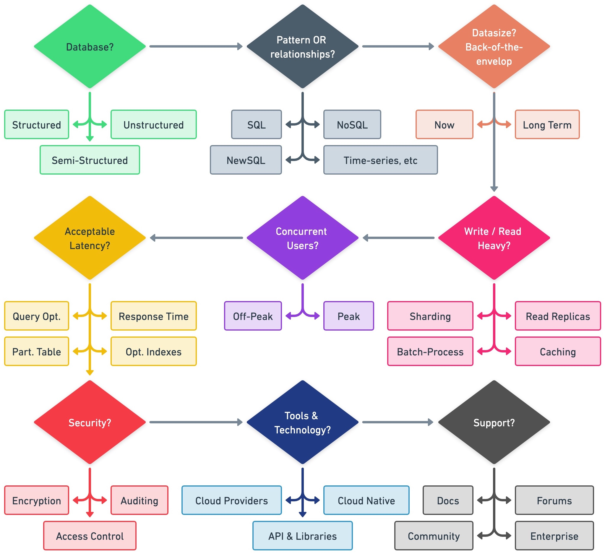

# Choose a data storage

<TagLinks />

There is no super storage for all cases. Here is a few of my notes about it:

# Database Select process

[Original Tweet](https://twitter.com/alexxubyte/status/1653785124474064897/photo/1)

## Polygot Persistence

Polyglot persistence is about using different data storage technologies to handle varying data storage needs.

Polyglot persistence can apply across an enterprise or within a single application.

Encapsulating data access into services reduces the impact of data storage choices on other parts of a system.

Adding more data storage technologies increases complexity in programming and operations, so the advantages of a good data storage fit need to be weighed against this complexity.

## MySql
A unique design characteristic of MySQL is the seperation of query processing and other server tasks from storage engine. This seperation of concerns let you to trade of various features without changing your data model

### InnoDB
- The default transactional storage engine for MySQL and the most important/widely used. 
- InnoDB uses **Multiversion Concurrency Control (MVCC)** to archive high concurrency.
- The advantages of MVCC is the increased concurrency. The drawback is the additional storage and maintenance work.

### MyISAM
- This is the original, and oldest. 
- **It doesn't support transaction**. 
- Its design is optimized more for speed and compact data storage.

### The Archive Engine
- Not a transactional storage engine
- simply optimmized for high-speed inserting and compressed storage.
- The best for **Logging** and **Data acquisition** (e.g: crawl data)

### The CSV Engine
- helpful as data interchange format
- tables can be constructed from CSV files automatically
- allow access to the files from other programs

### The memory engine
- formerly called *HEAP* tables stores in memory

## Based on CAP

Master - Replicas => AP

## Redis
Here are few use cases when we should use Redis:
- **Session cache**: stores as hashes. Because user sessions generally have a lot of I/O.
- **User Profiles, Preferences**
- **Shopping Cart Data**
- **Application cache**: few data applications store/access frequently or rarely change.
- **Distributed lists**: some things could be *top 100 newest list*, *top 100 hottest list*,... 
- **Keep stats**: works with counters
- **Queues and Pub/Sub**: Redis queues and pub/sub channels can use to exchange massages, enabling features such as background workers.

## Cassandra
Cassandra is a distributed database designed to provide extremely **high levels of availability** and **virtually unlimited scalability**.
- Messaging - many companies use Cassandra for Messaging. More: [Why Discord Moved from MongoDB to Apache Cassandra](https://www.youtube.com/watch?v=86olupkuLlU&ab_channel=HusseinNasser)
- Internet of things
- Social Media Analytics and Recommendation Engine

## Neo4j

- Connected Data
- Routing, Dispatch, and location-based services
- Recommendation Engines
    - Collaborative Filtering based Recommendation
    - Personalized Recommendation

RDBMS | GraphDB
------- | ---------
Tabular form  | Graph form 
Stores highly structured data | Maintains semi structured data 
Depends on key contraints | Relationships are first-class citizends. Constraints can be represents using relationships
Data is normalized, meaning lots of joins, affecting speed | Better performance (?)
Expensive with join operations | Eliminates the need for an expensive search / match computation

[Read more](https://www.ucssolutions.com/blog/connecting-the-dots-with-neo4j/)

## Elasticsearch
- Indexing & full text search. 
- Logging & Logs Analysis. Elasticsearch is a popular log and log analysis tool. 
- Search & Query. Elasticsearch's basic full-text search and analytics engine can integrate a wide range of queries, including structured, unstructured, geographical, and metric searches. 
- Metrics Analysis.

https://www.guru99.com/nosql-tutorial.html

https://blog.bytebytego.com/p/understanding-database-types