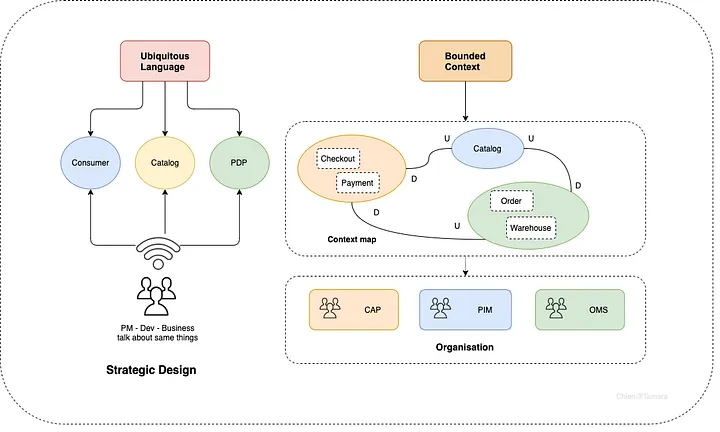
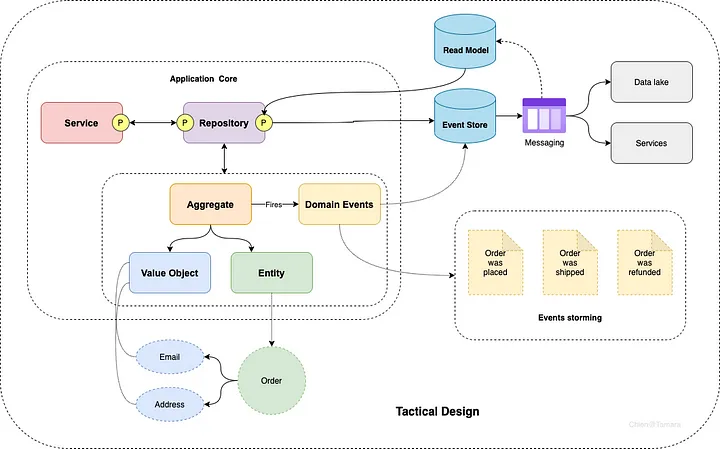
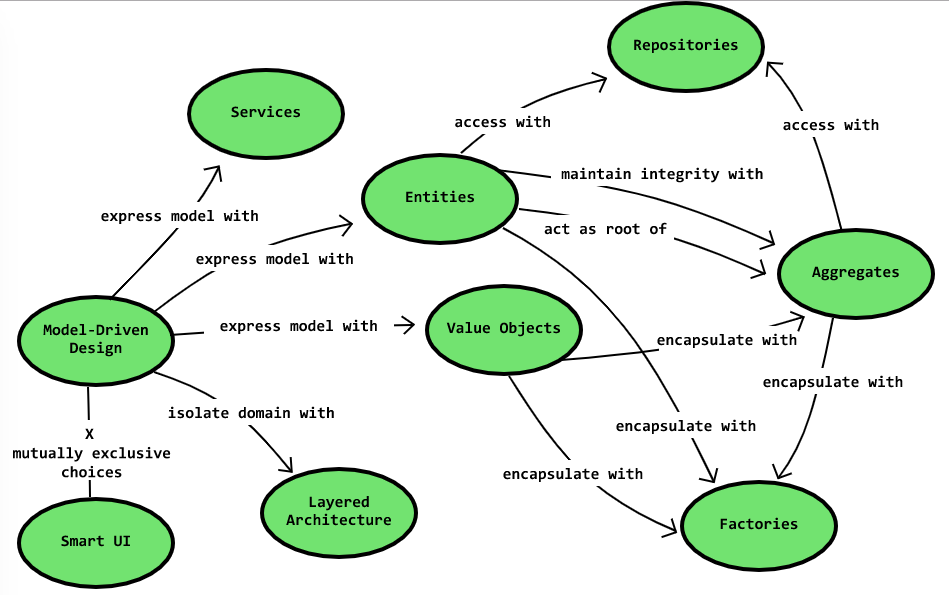
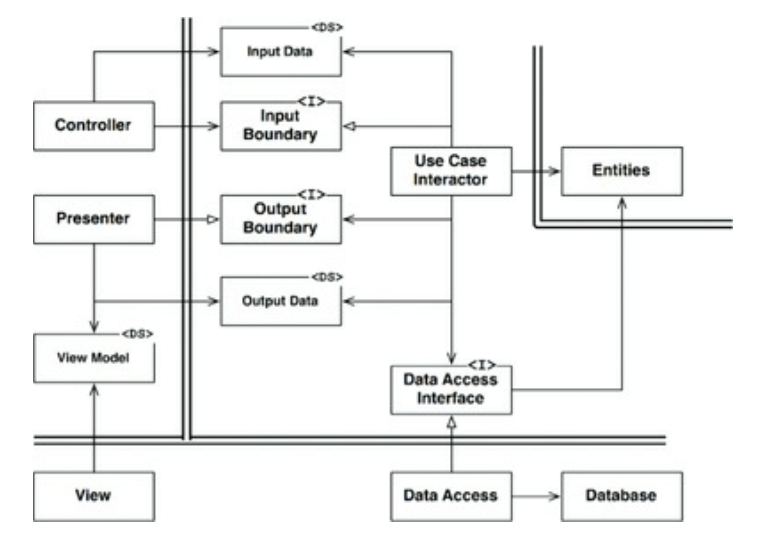
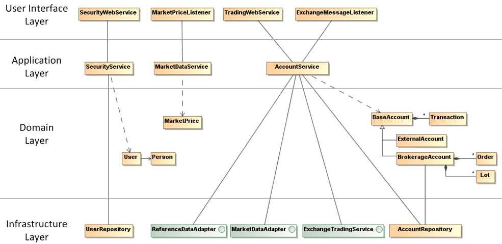

# Domain Driven Design Terms

::: tip Domain-Driven Design
is an approach to software development for complex needs by connecting the implementation to an evolving model:
- placing the project's primary focus on the core domain and domain logic
- basing complex designs on a model of the domain
- initiating a creative collaboration between technical and domain experts to iteratively refine a conceptual model that addresses particular domain problems.
:::

It provides us with `strategic and tactical modeling tools` to aid designing high-quality software that meets our business goals.

## Strategic pattern 
Strategic pattern helps you design your domains, sub-domains that are communicated by the ubiquitous language then support you to organize/structure your teams based on that outcome.

## Tactical pattern 
Tactical pattern will guide you on how to implement your application in a scaling way.

## Concepts

### Context
The setting in which a word or statement appears that determines its meaning;

### Domain
> A sphere of knowledge (ontology), influence, or activity. The subject area to which the user applies a program is the domain of the software;

### Core Domain
> The distinctive part of the model, central to the user’s goals, that differentiates the application and makes it valuable.

### Model
A system of abstractions that describes selected aspects of a domain and can be used to solve problems related to that domain;

### Ubiquitous Language
A language structured around the domain model and used by all team members to connect all the activities of the team with the software.

### Domain Expert
> A member of a software project whose field is the domain of the application, rather than software development. Not just any user of the software, the domain expert has deep knowledge of the subject.

## Strategic domain-driven design

### Bounded Context

> Bounded Context is a central pattern in Domain-Driven Design. It is the focus of DDD's strategic design section which is all about dealing with large models and teams. DDD deals with large models by dividing them into different Bounded Contexts and being explicit about their interrelationships.

### Continuous integration
...

### Context map

> A representation of the [[Bounded Context]]s involved in a project and the actual relationships between them and their models.

## Building blocks

### Entity
> An object that is not defined by its attributes, but rather by a thread of continuity and its identity.

### Value object
> An object that contains attributes but has no conceptual identity. They should be treated as immutable.

### Aggregate

>  A cluster of associated objects that are treated as a unit for the purpose of data changes. External references are restricted to one member of the AGGREGATE, designated as the root. A set of consistency rules applies within the AGGREGATE’S boundaries.

### Modules

> Modules are little mentioned by the developers, however, their use can be very interesting.
> Modules help us segregate concepts, can be defined as a package or a namespace depending on the programming languages, and always follow the Ubiquitous Language.

### Domain Event
> A domain object that defines an event (something that happens). A domain event is an event that domain experts care about.

### Service
> When an operation does not conceptually belong to any object. Following the natural contours of the problem, you can implement these operations in services. 

### Repository
> Methods for retrieving domain objects should delegate to a specialized Repository object such that alternative storage implementations may be easily interchanged.

### Factory
> Methods for creating domain objects should delegate to a specialized Factory object such that alternative implementations may be easily interchanged.

## Layered Architecture

More detail

## Typical Scenario

### Example

## References 

- [BoundedContext](https://martinfowler.com/bliki/BoundedContext.html)
- [Domain-driven design](https://en.wikipedia.org/wiki/Domain-driven_design)
- [DDD - Introduction](https://archfirst.org/domain-driven-design/)
- [DDD - Layered Architecture](https://archfirst.org/domain-driven-design-6-layered-architecture/)
- [Domain-Driven-Design](https://khalilstemmler.com/articles/domain-driven-design-intro/)
- [The 6 Most Common Types of Logic in Large Applications](https://khalilstemmler.com/articles/software-design-architecture/organizing-app-logic/)
- [https://dddcommunity.org/](https://dddcommunity.org/resources/ddd_terms/)