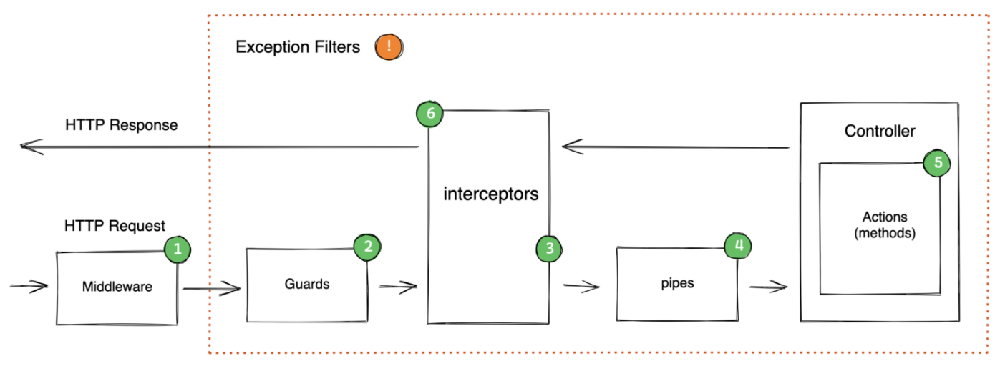

# NestJs Notes

<TagLinks />

## Request lifecycle



```ts
@UseGuards(AuthGuard)
@UseInterceptors(LoggingInterceptor)

app.useGlobalPipes(new ValidationPipe());
app.useGlobalFilters(new HttpExceptionFilter()); @Catch(HttpException)
```