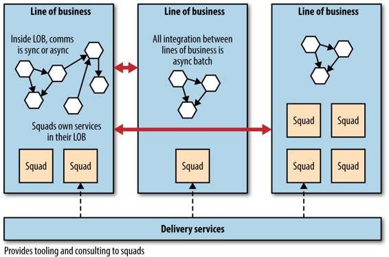

# 10. Conway’s Law and System Design

Much of the book so far has focused on the technical challenges in moving toward a fine-
grained architecture. But there are other, organizational issues to consider as well. As
we’ll learn in this chapter, you ignore your company’s organization chart at your peril!

Our industry is young, and seems to be constantly reinventing itself. And yet a few key
_laws_  have stood the test of time. Moore’s law, for example, which states that the density of
transistors on integrated circuits doubles every two years, has proved to be uncannily
accurate (although some people predict that this trend is already slowing). One law that I
have found to be almost universally true, and far more useful in my day-to-day work, is
Conway’s law.

Melvin Conway’s paper  _How Do Committees Invent_ , published in  _Datamation_  magazine
in April 1968, observed that:

```
Any organization that designs a system (defined more broadly here than just
information systems) will inevitably produce a design whose structure is a copy of the
organization’s communication structure.
```
This statement is often quoted, in various forms, as Conway’s law. Eric S. Raymond
summarized this phenomenon in  _The New Hacker’s Dictionary_  (MIT Press) by stating “If
you have four groups working on a compiler, you’ll get a 4-pass compiler.”


## Evidence

The story goes that when Melvin Conway submitted his paper on this topic to the Harvard
Business Review, they rejected it, claiming he hadn’t proved his thesis. I’ve seen this
theory borne out in so many different situations that I’ve accepted it as true. But you don’t
have to take my word for it: since Conway’s original submission, a lot of work has been
done in this area. A number of studies have been carried out to explore the interrelation of
organizational structure and the systems they create.


## Loose and Tightly Coupled Organizations

In  _Exploring the Duality Between Product and Organizational Architectures_  (Harvard
Business School), the authors Alan MacCormack, John Rusnak, and Carliss Baldwin look
at a number of different software systems, loosely categorized as being created either by
_loosely coupled organizations_  or  _tightly coupled organizations_ . For tightly coupled
organizations, think commercial product firms that are typically colocated with strongly
aligned visions and goals, while loosely coupled organizations are well represented by
distributed open source communities.

In their study, in which they matched similar product pairs from each type of organization,
the authors found that the more loosely coupled organizations actually created more
modular, less coupled systems, whereas the more tightly focused organization’s software
was less modularized.


## Windows Vista

Microsoft carried out an empirical study where it looked at how its own organizational
structure impacted the software quality of a specific product, Windows Vista. Specifically,
the researchers looked at multiple factors to determine how error-prone a component in
the system would be.^4  After looking at multiple metrics, including commonly used
software quality metrics like code complexity, they found that the metrics associated with
organizational structures proved to be the most statistically relevant measures.

So here we have another example of the organizational structure impacting the nature of
the system that organization creates.


## Netflix and Amazon

Probably the two poster children for the idea that organizations and architecture should be
aligned are Amazon and Netflix. Early on, Amazon started to understand the benefits of
teams owning the whole lifecycle of the systems they managed. It wanted teams to own
and operate the systems they looked after, managing the entire lifecycle. But Amazon also
knew that small teams can work faster than large teams. This led famously to its  _two-pizza
teams_ , where no team should be so big that it could not be fed with two pizzas. This driver
for small teams owning the whole lifecycle of their services is a major reason why
Amazon developed Amazon Web Services. It needed to create the tooling to allow its
teams to be self-sufficient.

Netflix learned from this example, and ensured that from the beginning it structured itself
around small, independent teams, so that the services they created would also be
independent from each other. This ensured that the architecture of the system was
optimized for speed of change. Effectively, Netflix designed the organizational structure
for the system architecture it wanted.


## What Can We Do with This?

So evidence, anecdotal and empirical, points to our organizational structure being a strong
influence on the nature (and quality) of the systems we provide. So how does this
understanding help us? Let’s look at a few different organizational situations and
understand what impact each might have on our system design.


## Adapting to Communication Pathways

Let’s first consider a simple, single team. It’s in charge of all aspects of the system design
and implementation. It can have frequent, fine-grained communication. Imagine that this
team is in charge of a single service — say, our music shop’s catalog service. Now
consider the inside of a service: lots of fine-grained method or function calls. As we’ve
discussed before, we aim to ensure our services are decomposed such that the pace of
change inside a service is much higher than the pace of change between services. This
single team, with its ability for fine-grained communication, matches nicely with the
communication pathways of the code within the service.

This single team finds it easy to communicate about proposed changes and refactorings,
and typically has a good sense of ownership.

Now let’s imagine a different scenario. Instead of a single, geolocated team owning our
catalog service, suppose that teams in the UK and India both are actively involved in
changing a service — effectively having joint ownership of the service. Geographical and
time zone boundaries here make fine-grained communication between those teams
difficult. Instead, they rely on more coarse-grained communication via video conferencing
and email. How easy is it for a team member in the UK to make a simple refactoring with
confidence? The cost of communications in a geographically distributed team is higher,
and therefore the cost of coordinating changes is higher.

When the cost of coordinating change increases, one of two things happen. Either people
find ways to reduce the coordination/communication costs, or they stop making changes.
The latter is exactly how we end up with large, hard-to-maintain codebases.

I recall one client project I worked on where ownership of a single service was shared
between two geographical locations. Eventually, each site started specializing what work it
handled. This allowed it to take ownership of part of the codebase, within which it could
have an easier cost of change. The teams then had more coarse-grained communication
about how the two parts interrelated; effectively, the communication pathways made
possible within the organizational structure matched the coarse-grained API that formed
the boundary between the two halves of the codebase.

So where does this leave us when considering evolving our own service design? Well, I
would suggest that geographical boundaries between people involved with the
development of a system can be a great way to drive when services should be
decomposed, and that in general, you should look to assign ownership of a service to a
single, colocated team who can keep the cost of change low.

Perhaps your organization decides that it wants to increase the number of people working
on your project by opening up an office in another country. At this point, think actively
about what parts of your system can be moved over. Perhaps this is what drives your
decisions about what seams to split out next.


It is also worth noting at this point that, at least based on the observations of the authors of
the  _Exploring the Duality Between Product and Organizational Architectures_  report
previously referenced, if the organization building the system is more loosely coupled
(e.g., consisting of geographically distributed teams), the systems being built tend toward
the more modular, and therefore hopefully less coupled. The tendency of a single team
that owns many services to lean toward tighter integration is very hard to maintain in a
more distributed organization.


## Service Ownership

What do I mean by  _service ownership_ ? In general, it means that the team owning a service
is responsible for making changes to that service. The team should feel free to restructure
the code however it wants, as long as that change doesn’t break consuming services. For
many teams,  _ownership_  extends to all aspects of the service, from sourcing requirements
to building, deploying, and maintaining the application. This model is especially prevalent
with microservices, where it is easier for a small team to own a small service. This
increased level of ownership leads to increased autonomy and speed of delivery. Having
one team responsible for deploying and maintaining the application means it has an
incentive to create services that are  _easy_  to deploy; that is, concerns about “throwing
something over the wall” dissipate when there is no one to throw it to!

This model is certainly one I favor. It pushes the decisions to the people best able to make
them, giving the team both increased power and autonomy, but also making it accountable
for its work. I’ve seen far too many developers hand their system over for testing or
deployment phases and think that their work is done at that point.


## Drivers for Shared Services

I have seen many teams adopt a model of shared service ownership. I find this approach
suboptimal, for reasons already discussed. However, the drivers that cause people to pick
shared services are important to understand, especially as we may be able to find some
compelling alternative models that can address people’s underlying concerns.


## Too Hard to Split

Obviously, one of the reasons you may find yourself with a single service owned by more
than one team is that the cost of splitting the service is too high, or perhaps your
organization might not see the point of it. This is a common occurrence with large
monolithic systems. If this is the main challenge you face, then I hope some of the advice
given in Chapter 5 will be of use. You could also consider merging teams together, to align
more closely with the architecture itself.


## Feature Teams

The idea of feature teams (aka feature-based teams) is that a small team drives the
development of a set of features, implementing all functionality required even if it cuts
across component (or even service) boundaries. The goals of feature teams are sensible
enough. This structure allows the team to retain a focus on the end result and ensures that
the work is joined up, avoiding some of the challenges of trying to coordinate changes
across multiple different teams.

In many situations, the feature team is a reaction to traditional IT organizations where
team structure is aligned around technical boundaries. For example, you might have a
team that is responsible for the UI, another that is responsible for the application logic, and
a third handling the database. In this environment, a feature team is a significant step up,
as it works across all these layers to deliver the functionality.

With wholesale adoption of feature teams, all services can be considered shared. Everyone
can change every service, every piece of code. The role of the service custodians here
becomes much more complex, if the role exists at all. Unfortunately, I rarely see
functioning custodians at all where this pattern is adopted, leading to the sorts of issues we
discussed earlier.

But let’s again consider what microservices are: services modeled after a business domain,
not a technical one. And if our team that owns any given service is similarly aligned along
the business domain, it is much more likely that the team will be able to retain a customer
focus, and see more of the feature development through, because it has a holistic
understanding and ownership of all the technology associated with a service.

Cross-cutting changes can occur, of course, but their likelihood is significantly reduced by
our avoiding technology-oriented teams.


## Delivery Bottlenecks

One key reason people move toward shared services is to avoid delivery bottlenecks.
What if there is a large backlog of changes that need to be made in a single service? Let’s
imagine that we are rolling out the ability for a customer to see the genre of a track across
our products, as well as adding a a brand new type of stock: virtual musical ringtones for
the mobile phone. The website team needs to make a change to surface the genre
information, with the mobile app team working to allow users to browse, preview, and buy
the ringtones. Both changes need to be made to the catalog service, but unfortunately half
the team is out with the flu, and the other half is stuck diagnosing a production failure.

We have a couple of options that don’t involve shared services to avoid this situation. The
first is to just wait. The website and mobile application teams move on to something else.
Depending on how important the feature is, or how long the delay is likely to be, this may
be fine or it may be a major problem.

You could instead add people to the catalog team to help them move through their work
faster. The more standardized the technology stack and programming idioms in use across
your system, the easier it is for other people to make changes in your services. The
flipside, of course, as we discussed earlier, is that standardization tends to reduce a team’s
ability to adopt the right solution for the job, and can lead to different sorts of
inefficiencies. If the team is on the other side of the planet, this might be impossible,
however.

Another option could be to split the catalog into a separate general music catalog and a
ringtone catalog. If the change being made to support ringtones is fairly small, and the
likelihood of this being an area in which we will develop heavily in the future is also quite
low, this may well be premature. On the other hand, if there are 10 weeks of ringtone-
related features stacked up, splitting out the service could make sense, with the mobile
team taking ownership.

There is another model that could work well for us, though.


## Internal Open Source

So what if we’ve tried our hardest, but we just can’t find a way past having a few shared
services? At this point, properly embracing the internal open source model can make a lot
of sense.

With normal open source, a small group of people are considered core committers. They
are the custodians of the code. If you want a change to an open source project, you either
ask one of the committers to make the change for you, or else you make the change
yourself and send them a pull request. The core committers are still in charge of the
codebase; they are the owners.

Inside the organization, this pattern can work well too. Perhaps the people who worked on
the service originally are no longer on a team together; perhaps they are now scattered
across the organization. Well, if they still have commit rights, you can find them and ask
for their help, perhaps pairing up with them, or if you have the right tooling you can send
them a pull request.


## Role of the Custodians

We still want our services to be sensible. We want the code to be of decent quality, and the
service itself to exhibit some sort of consistency in how it is put together. We also want to
make sure that changes being made now don’t make future planned changes much harder
than they need to be. This means that we need to adopt the same patterns used in normal
open source internally too, which means separating out a group of trusted committers (the
core team), and untrusted committers (people from outside the team submitting changes).

The core team needs to have some way of vetting and approving the changes. It needs to
make sure the changes are idiomatically consistent — that is, that they follow the general
coding guidelines of the rest of the codebase. The people doing the vetting are therefore
going to have to spend time working with the submitters to make sure the change is of
sufficient quality.

Good gatekeepers put a lot of work into this, communicating clearly with the submitters
and encouraging good behavior. Bad gatekeepers can use this as an excuse to exert power
over others or have religious wars about arbitrary technical decisions. Having seen both
sets of behavior, I can tell you one thing is clear: either way it takes time. When
considering allowing untrusted committers to submit changes to your codebase, you have
to decide if the overhead of being a gatekeeper is worth the trouble: could the core team be
doing better things with the time it spends vetting patches?


## Maturity

The less stable or mature a service is, the harder it will be to allow people outside the core
team to submit patches. Before the key spine of a service is in place, the team may not
know what  _good_  looks like, and therefore may struggle to know what a good submission
looks like. During this stage, the service itself is undergoing a high degree of change.

Most open source projects tend to not take submissions from a wider group of untrusted
committers until the core of the first version is done. Following a similar model for your
own organizations makes sense. If a service is pretty mature, and is rarely changed — for
example, our cart service — then perhaps that is the time to open it up for other
contributions.


## Tooling

To best support an internal open source model, you’ll need some tooling in place. The use
of a distributed version control tool with the ability for people to submit pull requests (or
something similar) is important. Depending on the size of the organization, you may also
need tooling to allow for a discussion and evolution of patch requests; this may or may not
mean a full-blown code review system, but the ability to comment inline on patches is
very useful. Finally, you’ll need to make it very easy for a committer to build and deploy
your software, and make it available for others. Typically this involves having well-
defined build and deployment pipelines and centralized artifact repositories.


## Bounded Contexts and Team Structures

As mentioned before, we look to draw our service boundaries around bounded contexts. It
therefore follows that we would like our teams aligned along bounded contexts too. This
has multiple benefits. First, a team will find it easier to grasp domain concepts within a
bounded context, as they are interrelated. Second, services within a bounded context are
more likely to be services that talk to each other, making system design and release
coordination easier. Finally, in terms of how the delivery team interacts with the business
stakeholders, it becomes easier for the team to create good relationships with the one or
two experts in that area.


## The Orphaned Service?

So what about services that are no longer being actively maintained? As we move toward
finer-grained architectures, the services themselves become smaller. One of the goals of
smaller services, as we have discussed, is the fact that they are simpler. Simpler services
with less functionality may not need to change for a while. Consider the humble cart
service, which provides some fairly modest capabilities: Add to Cart, Remove from Cart,
and so on. It is quite conceivable that this service may not have to change for months after
first being written, even if active development is still going on. What happens here? Who
owns this service?

If your team structures are aligned along the bounded contexts of your organization, then
even services that are not changed frequently still have a de facto owner. Imagine a team
that is aligned with the consumer web sales context. It might handle the website, cart, and
recommendation services. Even if the cart service hasn’t been changed in months, it would
naturally fall to this team to make the change. One of the benefits of microservices, of
course, is that if the team needs to change the service to add a new feature and not find it
to its liking, rewriting it shouldn’t take too long at all.

That said, if you’ve adopted a truly polyglot approach, making use of multiple technology
stacks, then the challenges of making changes to an orphaned service could be
compounded if your team doesn’t know the tech stack any longer.


## Case Study: RealEstate.com.au

REA’s core business is real estate. But this encompasses multiple different facets, each of
which operates as a single line of business (LOB). For example, one line of business deals
with residential property in Australia, another commercial, while another might relate to
one of REA’s overseas businesses. These lines of business have IT delivery teams (or
_squads_ ) associated with them; some may have only a single squad, while the biggest has
four. So for residential property, there are multiple teams involved with creating the
website and listing services to allow people to browse property. People rotate between
these teams every now and then, but tend to stay within that line of business for extended
periods, ensuring that the team members can build up a strong awareness of that part of
the domain. This in turn helps the communication between the various business
stakeholders and the team delivering features for them.

Each squad inside a line of business is expected to own the entire lifecycle of the services
it creates, including building, testing and releasing, supporting, and even
decommissioning. A core delivery services team provides advice and guidance to these
teams, as well as tooling to help it get the job done. A strong culture of automation is key,
and REA makes heavy use of AWS as a key part of enabling the teams to be more
autonomous. Figure 10-1 illustrates how this all works.




*Figure 10-1. An overview of Realestate.com.au’s organizational and team structure, and alignment with architecture*


It isn’t just the delivery organization that is aligned to how the business operates. It
extends to the architecture too. One example of this is integration methods. Within an
LOB, all services are free to talk to each other in any way they see fit, as decided by the
squads who act as their custodians. But between LOBs, all communication is mandated to


be asynchronous batch, one of the few cast-iron rules of the very small architecture team.
This coarse-grained communication matches the coarse-grained communication that exists
between the different parts of the business too. By insisting on it being batch, each LOB
has a lot of freedom in how it acts and manages itself. It could afford to take its services
down whenever it wanted, knowing that as long as it can satisfy the batch integration with
other parts of the business and its own business stakeholders, no one would care.

This structure has allowed for significant autonomy of not only the teams but also the
different parts of the business. From a handful of services a few years ago, REA now has
hundreds, with more services than people, and is growing at a rapid pace. The ability to
deliver change has helped the company achieve significant success in the local market to
the point where it is expanding overseas. And, most heartening of all, from talking to the
people there I get the impression that both the architecture and organizational structure as
they stand now are just the latest iteration rather than the destination. I daresay in another
five years REA will look very different again.

Those organizations that are adaptive enough to change not only their system architecture
but also their organizational structure can yield huge benefits in terms of improved
autonomy of teams and faster time to market for new features and functionality. REA is
just one of a number of organizations that are realizing that system architecture doesn’t
exist in a vacuum.


## Conway’s Law in Reverse

So far, we’ve spoken about how the organization impacts the system design. But what
about the reverse? Namely, can a system design change the organization? While I haven’t
been able to find the same quality of evidence to support the idea that Conway’s law
works in reverse, I’ve seen it anecdotally.

Probably the best example was a client I worked with many years ago. Back in the days
when the Web was fairly nascent, and the Internet was seen as something that arrived on
an AOL floppy disk through the door, this company was a large print firm that had a
small, modest website. It had a website because it was the thing to do, but in the grand
scheme of things it was fairly unimportant to how the business operated. When the
original system was created, a fairly arbitrary technical decision was made as to how the
system would work.

The content for this system was sourced in multiple ways, but most of it came from third
parties who were placing ads for viewing by the general public. There was an input system
that allowed content to be created by the paying third parties, a central system that took
that data and enriched it in various ways, and an output system that created the final
website that the general public could browse.

Whether the original design decisions were right at the time is a conversation for
historians, but many years on the company had changed quite a bit and I and many of my
colleagues were starting to wonder if the system design was fit for the company’s present
state. Its physical print business had diminished significantly, and the revenues and
therefore business operations of the organization were now dominated by its online
presence.

What we saw at that time was an organization tightly aligned to this three-part system.
Three channels or divisions in the IT side of the business aligned with each of the input,
core, and output parts of the business. Within those channels, there were separate delivery
teams. What I didn’t realize at the time was that these organizational structures didn’t
predate the system design, but actually grew up around it. As the print side of the business
diminished, and the digital side of the business grew, the system design inadvertently lay
the path for how the organization grew.

In the end we realized that whatever the shortcomings of the system design were, we
would have to make changes to the organizational structure to make a shift. Many years
later, that process remains a work in progress!


## People

```
No matter how it looks at first, it’s always a people problem.
Gerry Weinberg,  The Second Law of Consulting
```
We have to accept that in a microservice environment, it is harder for a developer to just
think about writing code in his own little world. He has to be more aware of the
implications of things like calls across network boundaries, or the implications of failure.
We’ve also talked about the ability of microservices to make it easier to try out new
technologies, from data stores to languages. But if you’re moving from a world where you
have a monolithic system, where the majority of your developers have just had to use one
language and remain completely oblivious to the operational concerns, then throwing
them into the world of microservices may be a rude awakening for them.

Likewise, pushing power into development teams to increase autonomy can be fraught.
People who have in the past thrown work over the wall to someone else are accustomed to
having someone else to blame, and may not feel comfortable being fully accountable for
their work. You may even find contractual barriers to having your developers carry
support pagers for the systems they support!

Although this book has mostly been about technology, people are not just a side issue to
be considered; they are the people who built what you have now, and will build what
happens next. Coming up with a vision for how things should be done without considering
how your current staff will feel about this or without considering what capabilities they
have is likely to lead to a bad place.

Each organization has its own set of dynamics around this topic. Understand your staff’s
appetite to change. Don’t push them too fast! Maybe you still have a separate team handle
frontline support or deployment for a short period of time, giving your developers time to
adjust to other new practices. You may, however, have to accept that you need different
sorts of people in your organization to make all this work. Whatever your approach,
understand that you need to be clear in articulating the responsibilities of your people in a
microservices world, and also be clear why those responsibilities are important to you.
This can help you see what your skill gaps might be, and think about how to close them.
For many people, this will be a pretty scary journey. Just remember that without people on
board, any change you might want to make could be doomed from the start.


## Summary

Conway’s law highlights the perils of trying to enforce a system design that doesn’t match
the organization. This leads us to trying to align service ownership to colocated teams,
which themselves are aligned around the same bounded contexts of the organization.
When the two are not in alignment, we get tension points as outlined throughout this
chapter. By recognizing the link between the two, we’ll make sure the system we are
trying to build makes sense for the organization we’re building it for.

Some of what we covered here touched on the challenges of working with organizations at
scale. However, there are other technical considerations that we need to worry about when
our systems start to grow beyond a few discrete services. We’ll address those next.

(^4)  And we all know Windows Vista was quite error-prone!

