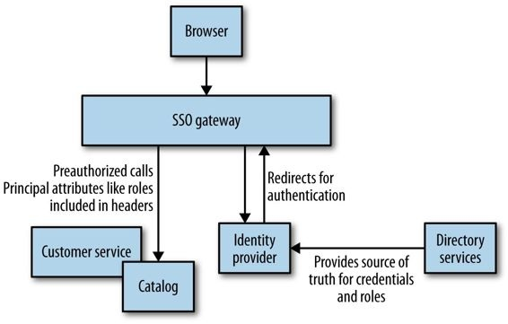
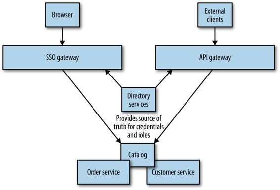
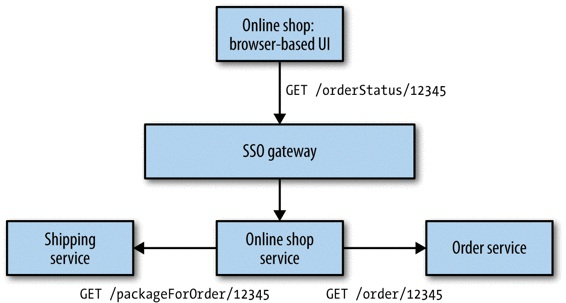
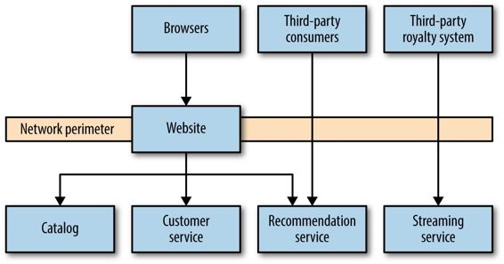
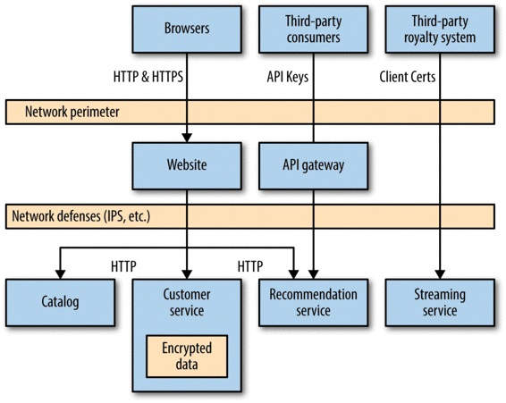

# 9. Security

We’ve become familiar with stories about security breaches of large-scale systems resulting in our data being exposed to all sorts of dodgy characters. But more recently, events like the Edward Snowden revelations have made us even more aware of the value of data that companies hold about us, and the value of data that we hold for our customers in the systems we build. This chapter will give a brief overview of some aspects of
security you should consider when designing your systems. While not meant to be
exhaustive, it will lay out some of the main options available to you and give you a
starting point for your own further research.

We need to think about what protection our data needs while in transit from one point to
another, and what protection it needs at rest. We need to think about the security of our
underlying operating systems, and our networks too. There is so much to think about, and
so much we could do! So how much security do we need? How can we work out what is
_enough_  security?

But we also need to think of the human element. How do we know who a person is, and
what he can do? And how does this relate to how our servers talk to each other? Let’s start
there.

## Authentication and Authorization

Authentication and authorization are core concepts when it comes to people and things
that interact with our system. In the context of security,  _authentication_  is the process by
which we confirm that a party is who she says she is. For a human, you typically
authenticate a user by having her type in her username and password. We assume that only
she has access to this information, and therefore that the person entering this information
must be her. Other, more complex systems exist as well, of course. My phone now lets me
use my fingerprint to confirm that I am who I say I am. Generally, when we’re talking
abstractly about who or what is being authenticated, we refer to that party as the  _principal_.

_Authorization_  is the mechanism by which we map from a principal to the action we are
allowing her to do. Often, when a principal is authenticated, we will be given information
about her that will help us decide what we should let her do. We might, for example, be
told what department or office she works in — pieces of information that our systems can
use to decide what she can and cannot do.

For single, monolithic applications, it is common for the application itself to handle
authentication and authorization for you. Django, the Python web framework, comes out
of the box with user management, for example. When it comes to distributed systems,
though, we need to think of more advanced schemes. We don’t want everyone to have to
log in separately for different systems, using a different username and password for each.
The aim is to have a single identity that we can authenticate once.

## Common Single Sign-On Implementations

A common approach to authentication and authorization is to use some sort of  _single sign-
on (SSO)_  solution. SAML, which is the reigning implementation in the enterprise space,
and OpenID Connect both provide capabilities in this area. More or less they use the same
core concepts, although the terminology differs slightly. The terms used here are from
SAML.

When a principal tries to access a resource (like a web-based interface), she is directed to
authenticate with an  _identity provider_ . This may ask her to provide a username and
password, or might use something more advanced like two-factor authentication. Once the
identity provider is satisfied that the principal has been authenticated, it gives information
to the  _service provider_ , allowing it to decide whether to grant her access to the resource.

This identity provider could be an externally hosted system, or something inside your own
organization. Google, for example, provides an OpenID Connect identity provider. For
enterprises, though, it is common to have your own identity provider, which may be linked
to your company’s  _directory service_ . A directory service could be something like the
Lightweight Directory Access Protocol (LDAP) or Active Directory. These systems allow
you to store information about principals, such as what roles they play in the organization.
Often, the directory service and the identity provider are one and the same, while
sometimes they are separate but linked. Okta, for example, is a hosted SAML identity
provider that handles tasks like two-factor authentication, but can link to your company’s
directory services as the source of truth.

SAML is a SOAP-based standard, and is known for being fairly complex to work with
despite the libraries and tooling available to support it. OpenID Connect is a standard that
has emerged as a specific implementation of OAuth 2.0, based on the way Google and
others handle SSO. It uses simpler REST calls, and in my opinion is likely to make
inroads into enterprises due to its improved ease of use. Its biggest stumbling block right
now is the lack of identity providers that support it. For a public-facing website, you might
be OK using Google as your provider, but for internal systems or systems where you want
more control over and visibility into how and where your data is installed, you’ll want
your own in-house identity provider. At the time of writing, OpenAM and Gluu are two of
the very few options available in this space, compared to a wealth of options for SAML
(including Active Directory, which seems to be everywhere). Until and unless existing
identity providers start supporting OpenID Connect, its growth may be limited to those
situations where people are happy using a public identity provider.

So while I think OpenID Connect is the future, it’s quite possible it’ll take a while to reach
widespread adoption.

## Single Sign-On Gateway

Within a microservice setup, each service could decide to handle the redirection to, and
handshaking with, the identity provider. Obviously, this could mean a lot of duplicated
work. A shared library could help, but we’d have to be careful to avoid the coupling that
can come from shared code. This also wouldn’t help if you had multiple different
technology stacks.

Rather than having each service manage handshaking with your identity provider, you can
use a gateway to act as a proxy, sitting between your services and the outside world (as
shown in Figure 9-1). The idea is that we can centralize the behavior for redirecting the
user and perform the handshake in only one place.

*Figure 9-1. Using a gateway to handle SSO*

However, we still need to solve the problem of how the downstream service receives
information about principals, such as their username or what roles they play. If you’re
using HTTP, it could populate headers with this information. Shibboleth is one tool that
can do this for you, and I’ve seen it used with Apache to great effect to handle integration
with SAML-based identity providers.

Another problem is that if we have decided to offload responsibility for authentication to a
gateway, it can be harder to reason about how a microservice behaves when looking at it
in isolation. Remember in Chapter 7 where we explored some of the challenges in
reproducing production-like environments? If you go the gateway route, make sure your
developers can launch their services behind one without too much work.

One final problem with this approach is that it can lull you into a false sense of security. I
like the idea of defense in depth — from network perimeter, to subnet, to firewall, to

machine, to operating system, to the underlying hardware. You have the ability to
implement security measures at all of these points, some of which we’ll get into shortly. I
have seen some people put all their eggs in one basket, relying on the gateway to handle
every step for them. And we all know what happens when we have a single point of
failure...

Obviously you could use this gateway to do other things. If using a layer of Apache
instances running Shibboleth, for example, you could also decide to terminate HTTPS at
this level, run intrusion detection, and so on. Do be careful, though. Gateway layers tend
to take on more and more functionality, which itself can end up being a giant coupling
point. And the more functionality something has, the greater the attack surface.

## Fine-Grained Authorization

A gateway may be able to provide fairly effective coarse-grained authentication. For
example, it could prevent access to any non-logged-in user to the helpdesk application.
Assuming our gateway can extract attributes about the principal as a result of the
authentication, it may be able to make more nuanced decisions. For example, it is common
to place people in groups, or assign them to roles. We can use this information to
understand what they can do. So for the helpdesk application, we might allow access only
to principals with a specific role (e.g., STAFF). Beyond allowing (or disallowing) access
to specific resources or endpoints, though, we need to leave the rest to the microservice
itself; it will need to make further decisions about what operations to allow.

Back to our helpdesk application: do we allow any staff members to see any and all
details? More likely, we’ll have different roles at work. For example, a principal in the
CALL_CENTER group might be allowed to view any piece of information about a
customer except his payment details. The principal might also be able to issue refunds, but
that amount might be capped. Someone who has the CALL_CENTER_TEAM_LEADER
role, however, might be able to issue larger refunds.

These decisions need to be local to the microservice in question. I have seen people use
the various attributes supplied by identity providers in horrible ways, using really fine-
grained roles like CALL_CENTER_50_DOLLAR_REFUND, where they end up putting
information specific to one part of one of our system’s behavior into their directory
services. This is a nightmare to maintain and gives very little scope for our services to
have their own independent lifecycle, as suddenly a chunk of information about how a
service behaves lives elsewhere, perhaps in a system managed by a different part of the
organization.

Instead, favor coarse-grained roles, modeled around how your organization works. Going
all the way back to the early chapters, remember that we are building software to match
how our organization works. So use your roles in this way too.

## Service-to-Service Authentication and Authorization

Up to this point we’ve been using the term  _principal_  to describe anything that can
authenticate and be authorized to do things, but our examples have actually been about
humans using computers. But what about programs, or other services, authenticating with
each other?

## Allow Everything Inside the Perimeter

Our first option could be to just assume that any calls to a service made from inside our
perimeter are implicitly trusted.

Depending on the sensitivity of the data, this might be fine. Some organizations attempt to
ensure security at the perimeter of their networks, and therefore assume they don’t need to
do anything else when two services are talking together. However, should an attacker
penetrate your network, you will have little protection against a typical  _man-in-the-middle_
attack. If the attacker decides to intercept and read the data being sent, change the data
without you knowing, or even in some circumstances pretend to be the thing you are
talking to, you may not know much about it.

This is by far the most common form of inside-perimeter trust I see in organizations. They
may decide to run this traffic over HTTPS, but they don’t do much else. I’m not saying
that is a good thing! For most of the organizations I see using this model, I worry that the
implicit trust model is not a conscious decision, but more that people are unaware of the
risks in the first place.

## HTTP(S) Basic Authentication

HTTP Basic Authentication allows for a client to send a username and password in a
standard HTTP header. The server can then check these details and confirm that the client
is allowed to access the service. The advantage here is that this is an extremely well-
understood and well-supported protocol. The problem is that doing this over HTTP is
highly problematic, as the username and password are not sent in a secure manner. Any
intermediate party can look at the information in the header and see the data. Thus, HTTP
Basic Authentication should normally be used over HTTPS.

When using HTTPS, the client gains strong guarantees that the server it is talking to is
who the client thinks it is. It also gives us additional protection against people
eavesdropping on the traffic between the client and server or messing with the payload.

The server needs to manage its own SSL certificates, which can become problematic when
it is managing multiple machines. Some organizations take on their own certificate issuing
process, which is an additional administrative and operational burden. Tools around
managing this in an automated fashion are nowhere near as mature as they could be, and it
isn’t just the issuing process you have to handle. Self-signed certificates are not easily
revokable, and thus require a lot more thought around disaster scenarios. See if you can
dodge all this work by avoiding self-signing altogether.

Another downside is that traffic sent via SSL cannot be cached by reverse proxies like
Varnish or Squid. This means that if you need to cache traffic, it will have to be done
either inside the server or inside the client. You can fix this by having a load balancer
terminate the SSL traffic, and having the cache sit behind the load balancer.

We also have to think about what happens if we are using an existing SSO solution, like
SAML, that already has access to usernames and passwords. Do we want our basic service
auth to use the same set of credentials, allowing us one process for issuing and revoking
them? We could do this by having the service talk to the same directory service that backs
our SSO solution. Alternatively, we could store the usernames and passwords ourselves
inside the service, but then we run the risk of duplicating behavior.

One note: in this approach, all the server knows is that the client has the username and
password. We have no idea if this information is coming from a machine we expect; it
could be coming from anyone on our network.

## Use SAML or OpenID Connect

If you are already using SAML or OpenID Connect as your authentication and
authorization scheme, you could just use that for service-to-service interactions too. If
you’re using a gateway, you’ll need to route all in-network traffic via the gateway too, but
if each service is handling the integration itself, this approach should just work out of the
box. The advantage here is that you’re making use of existing infrastructure, and get to
centralize all your service access controls in a central directory server. We’d still need to
route this over HTTPS if we wanted to avoid man-in-the-middle attacks.

Clients have a set of credentials they use to authenticate themselves with the identity
provider, and the service gets the information it needs to decide on any fine-grained
authentication.

This does mean you’ll need an account for your clients, sometimes referred to as a  _service
account_ . Many organizations use this approach quite commonly. A word of warning,
though: if you are going to create service accounts, try to keep their use narrow. So
consider each microservice having its own set of credentials. This makes
revoking/changing access easier if the credentials become compromised, as you only need
to revoke the set of credentials that have been affected.

There are a couple of other downsides, though. First, just as with Basic Auth, we need to
securely store our credentials: where do the username and password live? The client will
need to find some secure way to store this data. The other problem is that some of the
technology in this space to do the authentication is fairly tedious to code for. SAML, in
particular, makes implementing a client a painful affair. OpenID Connect has a simpler
workflow, but as we discussed earlier it isn’t that well supported yet.

## Client Certificates

Another approach to confirm the identity of a client is to make use of capabilities in
Transport Layer Security (TLS), the successor to SSL, in the form of client certificates.
Here, each client has an X.509 certificate installed that is used to establish a link between
client and server. The server can verify the authenticity of the client certificate, providing
strong guarantees that the client is valid.

The operational challenges here in certificate management are even more onerous than
with just using server-side certificates. It isn’t just some of the basic issues of creating and
managing a greater number of certificates; rather, it’s that with all the complexities around
the certificates themselves, you can expect to spend a lot of time trying to diagnose why a
service won’t accept what you believe to be a completely valid client certificate. And then
we have to consider the difficulty of revoking and reissuing certificates should the worst
happen. Using wildcard certificates can help, but won’t solve all problems. This additional
burden means you’ll be looking to use this technique when you are especially concerned
about the sensitivity of the data being sent, or if you are sending data via networks you
don’t fully control. So you might decide to secure communication of very important data
between parties that is sent over the Internet, for example.

## HMAC Over HTTP

As we discussed earlier, the use of Basic Authentication over plain HTTP is not terribly
sensible if we are worried about the username and password being compromised. The
traditional alternative is route traffic HTTPS, but there are some downsides. Aside from
managing the certificates, the overhead of HTTPS traffic can place additional strain on
servers (although, to be honest, this has a lower impact than it did several years ago), and
the traffic cannot easily be cached.

An alternative approach, as used extensively by Amazon’s S3 APIs for AWS and in parts
of the OAuth specification, is to use a  _hash-based messaging code (HMAC)_  to sign the
request.

With HMAC the body request along with a private key is hashed, and the resulting hash is
sent along with the request. The server then uses its own copy of the private key and the
request body to re-create the hash. If it matches, it allows the request. The nice thing here
is that if a man in the middle messes with the request, then the hash won’t match and the
server knows the request has been tampered with. And the private key is never sent in the
request, so it cannot be compromised in transit! The added benefit is that this traffic can
then more easily be cached, and the overhead of generating the hashes may well be lower
than handling HTTPS traffic (although your mileage may vary).

There are three downsides to this approach. First, both the client and server need a shared
secret that needs to be communicated somehow. How do they share it? It could be
hardcoded at both ends, but then you have the problem of revoking access if the secret
becomes compromised. If you communicate this key over some alternative protocol, then
you need to make sure that that protocol is also very secure!

Second, this is a pattern, not a standard, and thus there are divergent ways of
implementing it. As a result, there is a dearth of good, open, and usable implementations
of this approach. In general, if this approach interests you, then do some more reading to
understand the different ways it is done. I’d go as far as to say just look at how Amazon
does this for S3 and copy its approach, especially using a sensible hashing function with a
suitably long key like SHA-256. JSON web tokens (JWT) are also worth looking at, as
they implement a very similar approach and seem to be gaining traction. But be aware of
the difficulty of getting this stuff right. My colleague was working with a team that was
implementing its own JWT implementation, omitted a single Boolean check, and
invalidated its entire authentication code! Hopefully over time we’ll see more reusable
library implementations.

Finally, understand that this approach ensures only that no third party has manipulated the
request and that the private key itself remains private. The rest of the data in the request
will still be visible to parties snooping on the network.

## API Keys

All public APIs from services like Twitter, Google, Flickr, and AWS make use of API
keys. API keys allow a service to identify who is making a call, and place limits on what
they can do. Often the limits go beyond simply giving access to a resource, and can extend
to actions like rate-limiting specific callers to protect quality of service for other people.

When it comes to using API keys to handle your own microservice-to-microservice
approach, the exact mechanics of how it works will depend on the technology you use.
Some systems use a single API key that is shared, and use an approach similar to HMAC
as just described. A more common approach is to use a public and private key pair.
Typically, you’ll manage keys centrally, just as we would manage identities of people
centrally. The gateway model is very popular in this space.

Part of their popularity stems from the fact that API keys are focused on ease of use for
programs. Compared to handling a SAML handshake, API key–based authentication is
much simpler and more straightforward.

The exact capabilities of the systems vary, and you have multiple options in both the
commercial and open source space. Some of the products just handle the API key
exchange and some basic key management. Other tools offer everything up to and
including rate limiting, monetization, API catalogs, and discovery systems.

Some API systems allow you to bridge API keys to existing directory services. This would
allow you to issue API keys to principals (representing people or systems) in your
organization, and control the lifecycle of those keys in the same way you’d manage their
normal credentials. This opens up the possibility of allowing access to your services in
different ways but keeping the same source of truth — for example, using SAML to
authenticate humans for SSO, and using API keys for service-to-service communication,
as shown in Figure 9-2.

_Figure 9-2. Using directory services to synchronize principal information between an SSO and an API gateway_

## The Deputy Problem

Having a principal authenticate with a given microserservice is simple enough. But what
happens if that service then needs to make additional calls to complete an operation? Take
a look at Figure 9-3, which illustrates MusicCorp’s online shopping site. Our online shop
is a browser-based JavaScript UI. It makes calls to a server-side shop application, using
the backends-for-frontends pattern we described in Chapter 4. Calls made between the
browser and server calls can be authenticated using SAML or OpenID Connect or similar.
So far, so good.

When I am logged in, I can click on a link to view details of an order. To display the
information, we need to pull back the original order from the order service, but we also
want to look up shipping information for the order. So clicking the link to
_/orderStatus/12345_  causes the online shop to initiate a call from the online shop service to
both the order service and shipping service asking for those details. But should these
downstream services accept the calls from the online shop? We could adopt a stance of
implicit trust — that because the call came from within our perimeter, it is OK. We could
even use certificates or API keys to confirm that yes, it really is the online shop asking for
this information. But is this enough?

*Figure 9-3. An example where a confused deputy could come into play*

of service-to-service communication refers to a situation where a malicious party can trick
a deputy service into making calls to a downstream service on his behalf that he shouldn’t
be able to. For example, as a customer, when I log in to the online shopping system, I can
see my account details. What if I could trick the online shopping UI into making a request
for someone else’s details, maybe by making a call with my logged-in credentials?

In this example, what is to stop me from asking for orders that are not mine? Once logged
in, I could start sending requests for other orders that aren’t mine to see if I could get

useful information. We could try to protect against this inside the online shop itself, by
checking who the order is for and rejecting it if someone’s asking for things he shouldn’t.
If we have lots of different applications that surface this information, though, we could
potentially be duplicating this logic in lots of places.

We could route requests directly from the UI to the order service and allow it to validate
the request, but then we hit the various downsides we discussed in Chapter 4.
Alternatively, when the online shop sends the request to the order service, it could state
not just what order it wants, but also on whose behalf it is asking. Some authentication
schemes allow us to pass in the original principal’s credentials downstream, although with
SAML this is a bit of a nightmare, involving nested SAML assertions that are technically
achievable — but so difficult that no one ever does this. This can become even more
complex, of course. Imagine if the services the online shop talks to in turn make more
downstream calls. How far do we have to go in validating trust for all those deputies?

This problem, unfortunately, has no simple answer, because it isn’t a simple problem. Be
aware that it exists, though. Depending on the sensitivity of the operation in question, you
might have to choose between implicit trust, verifying the identity of the caller, or asking
the caller to provide the credentials of the original principal.

## Securing Data at Rest

Data lying about is a liability, especially if it is sensitive. Hopefully we’ve done
everything we can to ensure attackers cannot breach our network, and also that they
cannot breach our applications or operating systems to get access to the underlying close
up. However, we need to be prepared in case they do — defense in depth is key.

Many of the high-profile security breaches involve data at rest being acquired by an
attacker, and that data being readable by the attacker. This is either because the data was
stored in an unencrypted form, or because the mechanism used to protect the data had a
fundamental flaw.

The mechanisms by which secure information can be protected are many and varied, but
whichever approach you pick there are some general things to bear in mind.

## Go with the Well Known

The easiest way you can mess up data encryption is to try to implement your own
encryption algorithms, or even try to implement someone else’s. Whatever programming
language you use, you’ll have access to reviewed, regularly patched implementations of
well-regarded encryption algorithms. Use those! And subscribe to the mailing
lists/advisory lists for the technology you choose to make sure you are aware of
vulnerabilities as they are found so you can keep them patched and up to date.

For encryption at rest, unless you have a very good reason for picking something else,
pick a well-known implementation of AES-128 or AES-256 for your platform.^3  Both the
Java and .NET runtimes include implementations of AES that are highly likely to be well
tested (and well patched), but separate libraries exist for most platforms too — for
example, the Bouncy Castle libraries for Java and C#.

For passwords, you should consider using a technique called  _salted password hashing_.

Badly implemented encryption could be worse than having none, as the false sense of
security (pardon the pun) can lead you to take your eye off the ball.

## It’s All About the Keys

As has been covered so far, encryption relies on an algorithm taking the data to be
encrypted and a key and then producing the encrypted data. So, where is your key stored?
Now if I am encrypting my data because I am worried about someone stealing my whole
database, and I store the key I use in the same database, then I haven’t really achieved
much! Therefore, we need to store the keys somewhere else. But where?

One solution is to use a separate security appliance to encrypt and decrypt data. Another is
to use a separate key vault that your service can access when it needs a key. The lifecycle
management of the keys (and access to change them) can be a vital operation, and these
systems can handle this for you.

Some databases even include built-in support for encryption, such as SQL Server’s
Transparent Data Encryption, that aim to handle this in a transparent fashion. Even if your
database of choice does, research how the keys are handled and understand if the threat
you are protecting against is actually being mitigated.

Again, this stuff is complex. Avoid implementing your own, and do some good research!

## Pick Your Targets

Assuming everything should be encrypted can simplify things somewhat. There is no
guesswork about what should or should not be protected. However, you’ll still need to
think about what data can be put into logfiles to help problem identification, and the
computational overhead of encrypting everything can become pretty onerous, needing
more powerful hardware as a result. This is even more challenging when you’re applying
database migrations as part of refactoring schemas. Depending on the changes being
made, the data may need to be decrypted, migrated, and re-encrypted.

By subdividing your system into more fine-grained services, you might identify an entire
data store that can be encrypted wholesale, but even then it is unlikely. Limiting this
encryption to a known set of tables is a sensible approach.

## Decrypt on Demand

Encrypt data when you first see it. Only decrypt on demand, and ensure that data is never
stored anywhere.

## Encrypt Backups

Backups are good. We want to back up our important data, and almost by definition data
we are worried enough about that we want to encrypt it is important enough to back up!
So it may seem like an obvious point, but we need to make sure that  _our backups are also
encrypted_ . This also means that we need to know which keys are needed to handle which
version of data, especially if the keys change. Having clear key management becomes
fairly important.

## Defense in Depth

As I’ve mentioned earlier, I dislike putting all our eggs in one basket. It’s all about defence
in depth. We’ve talked already about securing data in transit, and securing data at rest. But
are there other protections we could put in place to help?

## Firewalls

Having one or more firewalls is a very sensible precaution to take. Some are very simple,
able only to restrict access to certain types of traffic on certain ports. Others are more
sophisticated. ModSecurity, for example, is a type of application firewall that can help
throttle connections from certain IP ranges and detect other sorts of malicious attacks.

There is value in having more than one firewall. For example, you may decide to use
IPTables locally on a host to secure that host, setting up the allowable ingress and egress.
These rules could be tailored to the locally running services, with a firewall at the
perimeter for controlling general access.

## Logging

Good logging, and specifically the ability to aggregate logs from multiple systems, is not
about prevention, but can help with detecting and recovering from bad things happening.
For example, after applying security patches you can often see in logs if people have been
exploiting certain vulnerabilities. Patching makes sure it won’t happen again, but if it
already  _has_  happened, you may need to go into recovery mode. Having logs available
allows you to see if something bad happened after the fact.

Note, however, that we need to be careful about what information we store in our logs!
Sensitive information needs to be culled to ensure we aren’t leaking important data into
our logs, which could end up being a great target for attackers.

## Intrusion Detection (and Prevention) System

_Intrusion detection systems (IDS)_  can monitor networks or hosts for suspicious behavior,
reporting problems when it sees them.  _Intrusion prevention systems (IPS)_ , as well as
monitoring for suspicious activity, can step in to stop it from happening. Unlike a firewall,
which is primarily looking outward to stop bad things from getting in, IDS and IPS are
actively looking inside the perimeter for suspect behavior. When you’re starting from
scratch, IDS may make most sense. These systems are heuristic-based (as are many
application firewalls), and it is possible that the generic starting set of rules will either be
too lenient or not lenient enough for how your service behaves. Using a more passive IDS
to alert you to problems is a good way to tune your rules before using it in a more active
capacity.

## Network Segregation

With a monolithic system, we have limits to how we can structure our networks to provide
additional protections. With microservices, though, you can put them into different
network segments to further control how services talk to each other. AWS, for example,
provides the ability to automatically provision a  _virtual private cloud (VPC)_ , which allow
hosts to live in separate subnets. You can then specify which VPCs can see each other by
defining peering rules, and even route traffic through gateways to proxy access, giving
you in effect multiple perimeters at which additional security measures can be put into
place.

This could allow you to segment networks based on team ownership, or perhaps by risk
level.

## Operating System

Our systems rely on a large amount of software that we didn’t write, and may have
security vulnerabilities that could expose our application, namely our operating systems
and the other supporting tools we run on them. Here, basic advice can get you a long way.
Start with only running services as OS users that have as few permissions as possible, to
ensure that if such an account is compromised it will do minimal damage.

Next, patch your software. Regularly. This needs to be automated, and you need to know
if your machines are out of sync with the latest patch levels. Tools like Microsoft’s SCCM
or RedHat’s Spacewalk can be beneficial here, as they can help you see if machines are up
to date with the latest patches and initiate updates if required. If you are using tools like
Ansible, Puppet, or Chef, chances are you are already fairly happy with pushing out
changes automatically — these tools can get you a long way too, but won’t do everything
for you.

This really is basic stuff, but it is surprising how often I see critical software running on
unpatched, old operating systems. You can have the most well-defined and protected
application-level security in the world, but if you have an old version of a web server
running on your machine as root that has an unpatched buffer overflow vulnerability, then
your system could still be extremely vulnerable.

Another thing to look at if you are using Linux is the emergence of security modules for
the operating system itself. AppArmour, for example, allows you to define how your
application is expected to behave, with the kernel keeping an eye on it. If it starts doing
something it shouldn’t, the kernel steps in. AppArmour has been around for a while, as
has SeLinux. Although technically either of them should work on any modern Linux
system, in practice some distributions support one better than the other. AppArmour is
used by default in Ubuntu and SuSE, for example, whereas SELinux has traditionally been
well supported by RedHat. A newer option is GrSSecurity, which aims to be simpler to
use than either AppArmour or GrSecurity while also trying to expand on their capabilities,
but it requires a custom kernel to work. I’d suggest taking a look at all three to see which
fits your use cases best, but I like the idea of having another layer of protection and
prevention at work.

## A Worked Example

Having a finer-grained system architecture gives us much more freedom in how we
implement our security. For those parts that deal with the most sensitive information or
expose the most valuable capabilities, we can adopt the strictest security provisions. But
for other parts of the system, we can afford to be much more lax in what we worry about.

Let’s consider MusicCorp once again, and pull some of the preceding concepts together to
see where and how we might use some of these security techniques. We’re looking
primarily at the security concerns of data in transit and at rest. Figure 9-4 shows a subset
of the overall system that we’ll be analyzing, which currently shows a crushing lack of
regard for security concerns. Everything is sent over plain old HTTP.

*Figure 9-4. A subset of MusicCorp’s unfortunately insecure architecture*

Here we have standard web browsers that are used by our customers to shop on the site.
We also introduce the concept of a third-party royalty gateway: we’ve started working
with a third-party company that will handle royalty payments for our new streaming
service. It contacts us occasionally to pull down records of what music has been streamed
when — information we jealously protect as we are worried about competition from rival
companies. Finally, we expose our catalog data to other third parties — for example,
allowing the metadata about artist or song to be embedded in music review sites. Inside
our network perimeter, we have some collaborating services, which are only ever used
internally.

For the browser, we’ll use a mix of standard HTTP traffic for nonsecure content, to allow
for it to be cached. For secure, logged-in pages, all secure content will be sent over
HTTPS, giving our customers extra protection if they are doing things like running on
public WiFi networks.

When it comes to the third-party royalty payment system, we are concerned not only about
the nature of the data we are exposing, but also about making sure the requests we’re

getting are legitimate. Here, we insist that our third party uses client certificates. All the
data is sent over a secure, cryptographic channel, increasing our ability to ensure we’re
being asked for this data by the right person. We do, of course, have to think about what
happens when the data leaves our control. Will our partner care about the data as much as
we will?

For the feeds of catalog data, we want this information shared as widely as possible to
allow people to easily buy music from us! However, we don’t want this abused, and we’d
like some idea of who is using our data. Here, API keys make perfect sense.

Inside the network perimeter, things are a bit more nuanced. How worried are we about
people compromising our internal networks? Ideally, we’d like to use HTTPS at a
minimum, but managing it is somewhat painful. We decide instead to put the work
(initially, at least) into hardening our network perimeter, including having a properly
configured firewall and selecting an appropriate hardware or software security appliance
to check for malicious traffic (e.g., port scanning or denial-of-service attacks).

That said, we are concerned about  _some_  of our data and where it lives. We aren’t worried
about the catalog service; after all, we want that data shared and have provided an API for
it! But we are very concerned about our customers’ data. Here, we decide to encrypt the
data held by the customer service, and decrypt data on read. If attackers do penetrate our
network, they could still run requests against the customer service’s API, but the current
implementation does not allow for the bulk retrieval of customer data. If it did, we would
likely consider the use of client certificates to protect this information. Even if attackers
compromise the machine the database is running on and manage to download the entire
contents, they would need access to the key used to encrypt and decrypt the data to make
use if it.

Figure 9-5 shows the final picture. As you can see, the choices we made about what
technology to use were based on an understanding of the nature of the information being
secured. Your own architecture’s security concerns are likely to be very different, and so
you may end up with a different-looking solution.

_Figure 9-5. MusicCorp’s more secure system_

## Be Frugal

As disk space becomes cheaper and the capabilities of the databases improve, the ease
with which bulk amounts of information can be captured and stored is improving rapidly.
This data is valuable — not only to businesses themselves, which increasingly see data as
a valuable asset, but equally to the users who value their own privacy. The data that
pertains to an individual, or could be used to derive information about an individual, must
be the data we are most careful about.

However, what if we made our lives a bit easier? Why not scrub as much information as
possible that can be personally identifiable, and do it as soon as possible? When logging a
request from a user, do we need to store the entire IP address forever, or could we replace
the last few digits with  _x_ ? Do we need to store someone’s name, age, gender, and date of
birth in order to provide her with product offers, or is her age range and postcode enough
information?

The advantages here are manifold. First, if you don’t store it, no one can steal it. Second, if
you don’t store it, no one (e.g., a governmental agency) can ask for it either!

The German phrase  _Datensparsamkeit_  represents this concept. Originating from German
privacy legislation, it encapsulates the concept of only storing as much information as is
_absolutely required_  to fulfill business operations or satisfy local laws.

This is obviously in direct tension with the move toward storing more and more
information, but it is a start to realize that this tension even exists!

## The Human Element

Much of what we have covered here is the basics of how to implement technological
safeguards to protect your systems and data from malicious, external attackers. However,
you may also need processes and policies in place to deal with the human element in your
organization. How do you revoke access to credentials when someone leaves the
organization? How can you protect yourself against social engineering? As a good mental
exercise, consider what damage a disgruntled ex-employee could do to your systems if she
wanted to. Putting yourself in the mindset of a malicious party is often a good way to
reason about the protections you may need, and few malicious parties have as much inside
information as a recent employee!

## The Golden Rule

If there is nothing else you take away from this chapter, let it be this: **don’t write your own crypto**. Don’t invent your own security protocols. Unless you are a cryptographic expert
with years of experience, if you try inventing your own encoding or elaborate
cryptographic protections, you will get it wrong. And even  _if_  you are a cryptographic
expert, you may still get it wrong.

Many of the tools previously outlined, like AES, are industry-hardened technologies
whose underlying algorithms have been peer reviewed, and whose software
implementation has been rigorously tested and patched over many years. They are good
enough! Reinventing the wheel in many cases is often just a waste of time, but when it
comes to security it can be outright dangerous.

## Baking Security In

Just as with automated functional testing, we don’t want security to be left to a different
set of people, nor do we want to leave everything to the last minute. Helping educate
developers about security concerns is key, as raising everyone’s general awareness of
security issues can help reduce them in the first place. Getting people familar with the
OWASP Top Ten list and OWASP’s Security Testing Framework can be a great place to
start. Specialists absolutely have their place, though, and if you have access to them, use
them to help you.

There are automated tools that can probe our systems for vulnerabilities, such as by
looking for cross-site scripting attacks. The Zed Attack Proxy (aka ZAP) is a good
example. Informed by the work of OWASP, ZAP attempts to re-create malicious attacks
on your website. Other tools exist that use static analysis to look for common coding
mistakes that can open up security holes, such as Brakeman for Ruby. Where these tools
can be easily integrated into normal CI builds, integrate them into your standard check-ins.
Other sorts of automated tests are more involved. For example, using something like
Nessus to scan for vulnerabilities is a bit more involved and it may require a human to
interpret the results. That said, these tests are still automatable, and it may make sense to
run them with the same sort of cadence as load testing.

Microsoft’s Security Development Lifecycle also has some good models for how delivery
teams can bake security in. Some aspects of it feel overly waterfall, but take a look and see
what aspects can fit into your current workflow.

## External Verification

With security, I think there is great value in having an external assessment done. Exercises
like penetration testing, when done by an outside party, really do mimic real-world
attempts. They also sidestep the issue that teams aren’t always able to see the mistakes
they have made themselves, as they are too close to the problem. If you’re a big enough
company, you may have a dedicated infosec team that can help you. If not, find an
external party who can. Reach out to them early, understand how they like to work, and
find out how much notice they need to do a test.

You’ll also need to consider how much verification you require before each release.
Generally, doing a full penetration test, for example, isn’t needed for small incremental
releases, but may be for larger changes. What you need depends on your own risk profile.

## Summary

So again we return to a core theme of the book — that having a system decomposed into
finer-grained services gives us many more options as to how to solve a problem. Not only
can having microservices potentially reduce the impact of any given breach, but it also
gives us more ability to trade off the overhead of more complex and secure approaches
where data is sensitive, and a lighter-weight approach when the risks are lower.

Once you understand the threat levels of different parts of your system, you should start to
get a sense of when to consider security during transit, at rest, or not at all.

Finally, understand the importance of defense in depth, make sure you patch your
operating systems, and even if you consider yourself a rock star, don’t try to implement
your own cryptography!

If you want a general overview of security for browser-based applications, a great place to
start is the excellent Open Web Application Security Project (OWASP) nonprofit, whose
regularly updated  _Top 10 Security Risk_  document should be considered essential reading
for any developer. Finally, if you want a more general discussion of cryptography, check
out the book  _Cryptography Engineering_  by Niels Ferguson, Bruce Schneier, and
Tadayoshi Kohno (Wiley).

Getting to grips with security is often about understanding people and how they work with
our systems. One human-related aspect we haven’t yet discussed in terms of microservices
is the interplay between organizational structures and the architectures themselves. But as
with security, we’ll see that ignoring the human element can be a grave mistake.

(^3)  In general, key length increases the amount of work required to brute-force-break a key.
Therefore you can assume the longer the key, the more secure your data. However, some
minor concerns have been raised about the implementation of AES-256 for certain types
of keys by respected security expert Bruce Schneier. This is one of those areas where you
need to do more research on what the current advice is at the time of reading!

