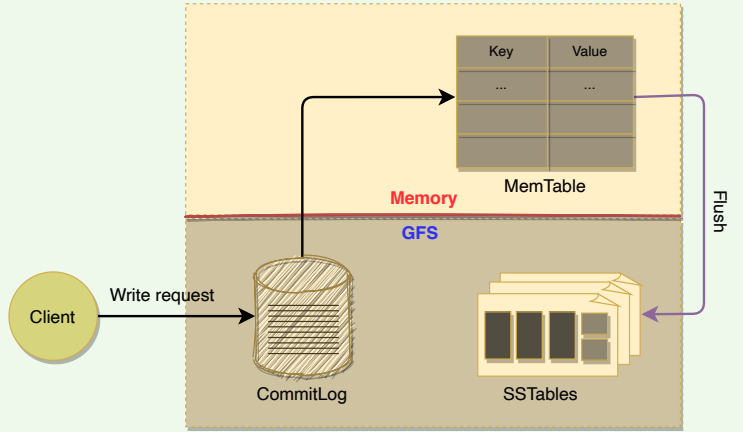

# Design BigTable

## Introduction

### Goal

Design a distributed and scalable system that can store a huge amount of
structured data. The data will be indexed by a row key where each row can
have an unbounded number of columns.

### What is BigTable

BigTable is a **distributed** and **massively scalable** wide-column store. It is
designed to store huge sets of structured data. As its name suggests, BigTable
provides storage for very big tables (often in the terabyte range).

In terms of the CAP theorem, BigTable is a CP system, i.e., **it has strictly consistent reads and writes**. BigTable can be used as an input source or output destination for [MapReduce](https://hadoop.apache.org/docs/r1.2.1/mapred_tutorial.html) jobs.

### Background

BigTable was developed at Google and has been in use since 2005 in dozens
of Google services. Because of the large scale of its services, Google could not
use commercial databases. Also, the cost of using an external solution would
have been too high. That is why Google chose to build an in-house solution.
BigTable is a highly available and high-performing database that powers
multiple applications across Google — where each application has different
needs in terms of the size of data to be stored and latency with which results
are expected

Though BigTable is not open-source itself, its paper was crucial in inspiring
powerful open-source databases like [Cassandra](https://cassandra.apache.org/) (which borrows BigTable’s data model),
[HBase](https://hbase.apache.org/) (a distributed non-relational database) and [Hypertable](https://hypertable.org/).

### BigTable use cases

Google built BigTable to store large amounts of data and perform thousands
of queries per second on that data. Examples of BigTable data are billions of
URLs with many versions per page, petabytes of Google Earth data, and
billions of users’ search data.

BigTable is suitable to store large datasets that are greater than one TB
where each row is less than 10MB. Since BigTable does not provide ACID
(atomicity, consistency, isolation, durability) properties or transaction
support, Online Transaction Processing ([OLTP](https://en.wikipedia.org/wiki/Online_transaction_processing)) applications 
with transaction processes should not use BigTable. For BigTable, data
should be structured in the form of key-value pairs or rows-columns. Nonstructured data like images or movies should not be stored in BigTable.

Here are the examples of data that Google stores in BigTable:
- URL and its related data, e.g., PageRank, page contents, crawl metadata (e.g., when a page was crawled, what was the response code, etc.), links, anchors (links pointing to a page). There are billions of URLs with many
versions of a page.
- Per-user data, e.g., preference settings, recent queries/search results. Google has hundreds of millions of users.

**BigTable can be used to store the following types of data:**
1. Time series data: As the data is naturally ordered
2. Internet of Things (IoT) data: Constant streams of writes
3. Financial Data: Often represented as time-series data

## Data Model

In simple terms, BigTable can be characterized as a sparse, distributed,
persistent, multidimensional, sorted map. Let’s dig deeper to understand
each of these characteristics of BigTable.

Traditional DBs have a two-dimensional layout of the data, where each cell
value is identified by the **‘Row ID’** and **‘Column Name’**:


*Two-dimensional layout of a traditional database*

BigTable has a **four-dimensional data model**. The four dimensions are:
1. **Row Key**: Uniquely identifies a row
2. **Column Family**: Represents a group of columns
3. **Column Name**: Uniquely identifies a column
4. **Timestamp**: Each column cell can have different versions of a value, each identified by a timestamp


*BigTable's four-dimensional data model*

The data is indexed (or sorted) by row key, column key, and a timestamp.
Therefore, to access a cell’s contents, we need values for all of them. If no
timestamp is specified, BigTable retrieves the most recent version.

```
( row_key : string, column_name : string, timestamp : int64 ) → cell contents (string)
```

### Rows

Each row in the table has an associated row key that is an arbitrary string of up to 64 kilobytes in size (although most keys are significantly smaller):
- Each row is uniquely identified by the ‘row key.’
- Each ‘row key’ is internally represented as a string.
- Every read or write of data under a single row is atomic. This also means that atomicity across rows is not guaranteed, e.g., when updating two rows, one might succeed, and the other might fail.
- Each table’s data is only indexed by row key, column key, and timestamp. There are no secondary indices.

A **column** is a key-value pair where the key is represented as ‘column key’
and the value as ‘column value.’

### Column families 

Column keys are grouped into sets called column families. All data stored in
a column family is usually of the same type. The number of distinct column
families in a table should be small (in the hundreds at maximum), and families should rarely change during operation. Access control as well as
both disk and memory accounting are performed at the column-family level.

The following figure shows a single row from a table. The row key is 294 ,
and there are two column families: *personal_info* and *work_info* , with
three columns under the *personal_info* column family.


- Column family format: *family:optional qualifier*
- All rows have the same set of column families.
- BigTable can retrieve data from the same column family efficiently.
- Short Column family names are better as names are included in the data transfer.

### Columns

- Columns are units within a column family.
- A BigTable may have an unbounded number of columns.
- New columns can be added on the fly
- Short column names are better as names are passed in each data transfer, e.g., *ColumnFamily:ColumnName* => *Work:Dept*
- As mentioned above, BigTable is quite suitable for sparse data. This is because empty columns are not stored.

### Timestamps

Each column cell can contain multiple versions of the content. For example,
as we saw in the earlier example, we may have several timestamped
versions of an employee’s email. A 64-bit timestamp identifies each version
that either represents real time or a custom value assigned by the client.
While reading, if no timestamp is specified, BigTable returns the most recent
version. If the client specifies a timestamp, the latest version that is earlier
than the specified timestamp is returned.

BigTable supports two per-column-family settings to garbage-collect cell
versions automatically. The client can specify that only the last ‘n’ versions of
a cell be kept, or that only new-enough versions be kept (e.g., only keep
values that were written in the previous seven days).

## System APIs

BigTable provides APIs for two types of operations:
- Metadata operations
- Data operations

### Metadata operations

BigTable provides APIs for creating and deleting tables and column families.
It also provides functions for changing cluster, table, and column family
metadata, such as access control rights.

### Data operations

Clients can insert, modify, or delete values in BigTable. Clients can also
lookup values from individual rows or iterate over a subset of the data in a
table.
- BigTable supports single-row transactions, which can be used to perform atomic read-modify-write sequences on data stored under a single row key.
- Bigtable does not support transactions across row keys, but provides a client interface for batch writing across row keys.
- BigTable allows cells to be used as integer counters. 
- A set of wrappers allow a BigTable to be used both as an input source and as an output target for [MapReduce](https://hadoop.apache.org/docs/r1.2.1/mapred_tutorial.html) jobs.
- Clients can also write scripts in Sawzall (a language developed at Google) to instruct server-side data processing (transform, filter, aggregate) prior to the network fetch.


Here are APIs for write operations:
- Set() : write cells in a row
- DeleteCells() : delete cells in a row
- DeleteRow() : delete all cells in a row

A read or scan operation can read arbitrary cells in a BigTable:
- Each row read operation is atomic.
- Can ask for data from just one row, all rows, etc.
- Can restrict returned rows to a particular range.
- Can ask for all columns, just certain columns families, or specific columns.

## Partitioning and High-level Architecture

### Table partitioning

A single instance of a BigTable implementation is known as a cluster. Each cluster can store a number of tables where each table is split into multiple
**Tablets**, each around 100–200 MB in size. 


- A Tablet holds a contiguous range of rows.
- The table is broken into Tablets at row boundaries.
- Initially, each table consists of only one Tablet. As the table grows, multiple Tablets are created. By default, a table is split at around 100 to 200 MB.
- Tablets are the unit of distribution and load balancing (more about this later).
- Since the table is sorted by row, reads of short ranges of rows are always efficient, that is to say, communicating with a small number of Tablets.
- This also means that selecting a row key with a high degree of locality is very important.
- Each Tablet is assigned to a Tablet server (discussed later), which
manages all read/write requests of that Tablet.

### High-level architecture

The architecture of a BigTable cluster consists of three major components:
1. **Client Library**: A library component that is linked into every client. The client talks to BigTable through this library.
2. **One master server**: Responsible for performing metadata operations and assigning Tablets to Tablet servers and managing them.
3. **Many Tablet servers**: Each Tablet server serves read and write of the data to the Tablets it is assigned.

BigTable is built on top of several other pieces from Google infrastructure:

1. **GFS**: BigTable uses the Google File System to store its data and log files.
2. **SSTable**: Google’s SSTable (Sorted String Table) file format is used to store BigTable data. SSTable provides a persistent, ordered, and
immutable map from keys to values. SSTable is designed in such a way that any data access requires, at most, a single
disk access.
3. **Chubby**: BigTable uses a highly available and persistent distributed lock service called Chubby to handle synchronization issues and store configuration information.
4. **Cluster Scheduling System**: Google has a cluster management system
that schedules, monitors, and manages the Bigtable’s cluster.

   
*High-level architecture of BigTable*

## SSTable

### How are Tablets stored in GFS?

BigTable uses Google File System (GFS), a persistent distributed file storage
system to store data as files. The file format used by BigTable to store its files
is called SSTable: 
- SSTables are persisted, ordered maps of keys to values, where both keys and values are arbitrary byte strings.
- Each Tablet is stored in GFS as a sequence of files called SSTables.
- An SSTable consists of a sequence of data blocks (typically 64KB in size).
   
*SSTable contains multiple blocks*

- A block index is used to locate blocks; the index is loaded into memory when the SSTable is opened.


- A lookup can be performed with a single disk seek. We first find the appropriate block by performing a binary search in the in-memory index, and then reading the appropriate block from the disk.
- To read data from an SSTable, it can either be copied from disk to memory as a whole or just the index. The former approach avoids subsequent disk seeks for lookups, while the latter requires a single disk seek for each lookup.
- SSTables provide two operations:
    - Get the value associated with a given key
    - Iterate over a set of values in a given key range
- Each SSTable is immutable (read-only) once written to GFS. If new data is added, a new SSTable is created. Once an old SSTable is no longer needed, it is set out for garbage collection. SSTable immutability is at the core of BigTable’s data checkpointing and recovery routines. SSTable’s immutability provides following advantages: 
    - No synchronization is needed during read operations.
    - This also makes it easier to split Tablets.
    - Garbage collector handles the permanent removal of deleted or stale data.

### Table vs. Tablet vs. SSTable

Here is how we can define the relationship between Table, Tablet and SStable:
- Multiple Tablets make up a table.
- SSTables can be shared by multiple Tablets.
- Tablets do not overlap, SSTables can overlap.

   
*Tablet vs SSTable*

- To improve write performance, BigTable uses an in-memory, mutable sorted buffer called **MemTable** to store recent updates. As more writes
are performed, MemTable size increases, and when it reaches a threshold, the MemTable is frozen, a new MemTable is created, and the frozen MemTable is converted to an SSTable and written to GFS.
- Each data update is also written to a commit-log which is also stored in
GFS. This log contains redo records used for recovery if a Tablet server
fails before committing a MemTable to SSTable.
- While reading, the data can be in MemTables or SSTables. Since both
these tables are sorted, it is easy to find the most recent data.


*Read and write workow*

## GFS and Chubby

### GFS

GFS is a scalable distributed file system developed by Google for its large data-intensive applications such as BigTable.

   
*High-level architecture of GFS*

- GFS files are broken into fixed-size blocks, called Chunks.
- Chunks are stored on data servers called ChunkServers.
- GFS master manages the metadata.
- SSTables are divided into fixed-size, blocks and these blocks are stored on ChunkServers.
- Each chunk in GFS is replicated across multiple ChunkServers for reliability.
- Clients interact with the GFS master for metadata, but all data transfers happen directly between the client and ChunkServers.


### Chubby

Chubby is a highly available and persistent distributed locking service that allows a multi-thousand node Bigtable cluster to stay coordinated.

   
*High-level architecture of Chubby*

- Chubby usually runs with five active replicas, one of which is elected as the master to serve requests. To remain alive, a majority of Chubby replicas must be running.
- BigTable depends on Chubby so much that if Chubby is unavailable for an extended period of time, BigTable will also become unavailable.
- Chubby uses the Paxos algorithm to keep its replicas consistent in the face of failure.
- Chubby provides a namespace consisting of files and directories. Each file or directory can be used as a lock.
- Read and write access to a Chubby file is atomic.
- Each Chubby client maintains a session with a Chubby service. A client’s session expires if it is unable to renew its session lease within the lease expiration time. When a client’s session expires, it loses any locks and open handles. Chubby clients can also register callbacks on Chubby files and directories for notification of changes or session expiration.
- In BigTable, Chubby is used to:
    - Ensure there is only one active master. The master maintains a session lease with Chubby and periodically renews it to retain the status of the master.
    - Store the bootstrap location of BigTable data (discussed later)
    - Discover new Tablet servers as well as the failure of existing ones
    - Store BigTable schema information (the column family information for each table)
    - Store Access Control Lists (ACLs)

## Bigtable Components

As described previously, a BigTable cluster consists of three major components:
1. A library component that is linked into every client
2. One master server
3. Many Tablet servers

   
*BigTable architecture*

### BigTable master server

There is only one master server in a BigTable cluster, and it is responsible for:
- Assigning Tablets to Tablet servers and ensuring effective load balancing
- Monitoring the status of Tablet servers and managing the joining or failure of Tablet server
- Garbage collection of the underlying files stored in GFS
- Handling metadata operations such as table and column family creations

Bigtable master is not involved in the core task of mapping tablets onto the
underlying files in GFS (Tablet servers handle this). This means that Bigtable
clients do not have to communicate with the master at all. This design
decision significantly reduces the load on the master and the possibility of
the master becoming a bottleneck.

### Tablet servers

- Each Tablet server is assigned ownership of a number of Tablets (typically 10–1,000 Tablets per server) by the master.
- Each Tablet server serves read and write requests of the data of the Tablets it is assigned. The client communicates directly with the Tablet servers for reads/writes.
- Tablet servers can be added or removed dynamically from a cluster to accommodate changes in the workloads.
- Tablet creation, deletion, or merging is initiated by the master server, while Tablet partition is handled by Tablet servers who notify the master.

## Working with Tablets

### Locating Tablets

Since Tablets move around from server to server (due to load balancing,
Tablet server failures, etc.), given a row, how do we find the correct Tablet
server? To answer this, we need to find the Tablet whose row range covers
the target row. BigTable maintains a 3-level hierarchy, analogous to that of a
B+ tree, to store Tablet location information.

BigTable creates a special table, called **Metadata** table, to store Tablet
locations. This Metadata table contains one row per Tablet that tells us which
Tablet server is serving this Tablet. Each row in the METADATA table stores a
Tablet’s location under a row key that is an encoding of the Tablet’s table
identifier and its end row.

```
METADATA:   Key: table id + end row
           Data: tablet server location
```

BigTable stores the information about the Metadata table in two parts:
1. **Meta-1 Tablet** has one row for each data Tablet (or non-meta Tablet). Since Meta-1 Tablet can be big, it is split into multiple metadata Tablets
and distributed to multiple Tablet servers. 
2. **Meta-0 Tablet** has one row for each Meta-1 Tablet. Meta-0 table never gets split. BigTable stores the location of the Meta-0 Tablet in a Chubby file.

   
*Metadata tablets*

A BigTable client seeking the location of a Tablet starts the search by looking
up a particular file in Chubby that is known to hold the location of the Meta0 Tablet. This Meta-0 Tablet contains information about other metadata
Tablets, which in turn contain the location of the actual data Tablets. With
this scheme, the depth of the tree is limited to three. For efficiency, the client
library caches Tablet locations and also prefetch metadata associated with
other Tablets whenever it reads the METADATA table.


### Assigning Tablets

A Tablet is assigned to only one Tablet server at any time. The master keeps
track of the set of live Tablet servers and the mapping of Tablets to Tablet
servers. The master also keeps track of any unassigned Tablets and assigns
them to Tablet servers with sufficient room.

When a Tablet server starts, it creates and acquires an exclusive lock on a
uniquely named file in Chubby’s “servers” directory. This mechanism is used
to tell the master that the Tablet server is alive. When the master is restarted
by the Cluster Management System, the following things happen:
1. The master grabs a unique master lock in Chubby to prevent multiple
master instantiations.
2. The master scans the Chubby’s “servers” directory to find the live Tablet
servers.
3. The master communicates with every live Tablet server to discover
what Tablets are assigned to each server.
4. The master scans the METADATA table to learn the full set of Tablets.
Whenever this scan encounters a Tablet that is not already assigned, the
master adds the Tablet to the set of unassigned Tablets. Similarly, the
master builds a set of unassigned Tablet servers, which are eligible for
Tablet assignment. The master uses this information to assign the
unassigned Tablets to appropriate Tablet servers.

### Monitoring Tablet servers

As stated above, BigTable maintains a ‘Servers’ directory in Chubby, which
contains one file for each live Tablet server. Whenever a new Tablet server
comes online, it creates a new file in this directory to signal its availability
and obtains an exclusive lock on this file. As long as a Tablet server retains
the lock on its Chubby file, it is considered alive.

BigTable’s master keeps monitoring the ‘Servers’ directory, and whenever it
sees a new file in this directory, it knows that a new Tablet server has
become available and is ready to be assigned Tablets. In addition to that, the
master regularly checks the status of the lock. If the lock is lost, the master
assumes that there is a problem either with the Tablet server or the Chubby.
In such a case, the master tries to acquire the lock, and if it succeeds, it
concludes that Chubby is working fine, and the Tablet server is having
problems. The master, in this case, deletes the file and reassigns the tablets
of the failing Tablet server. The deletion of the file works as a signal for the
failing Tablet server to terminate itself and stop serving the Tablets.

Whenever a Table server loses its lock on the file it has created in the
“servers” directory, it stops serving its Tablets. It tries to acquire the lock
again, and if it succeeds, it considers it a temporary network problem and
starts serving the Tablets again. If the file gets deleted, then the Tablet server
terminates itself to start afresh.

### Load-balancing Tablet servers

As described above, the master is responsible for assigning Tablets to Tablet
servers. The master keeps track of all available Tablet servers and maintains
the list of Tablets that the cluster is supposed to serve. In addition to that, the
master periodically asks Tablet servers about their current load. All this
information gives the master a global view of the cluster and helps assign
and load-balance Tablets.

## The Life of Read & Write Operations

### Write request

Upon receiving a write request, a Tablet server performs the following set of steps:
1. Checks that the request is well-formed.
2. Checks that the sender is authorized to perform the mutation. This
authorization is performed based on the Access Control Lists (ACLs) that
are stored in a chubby file.
3. If the above two conditions are met, the mutation is written to the
commit-log in GFS that stores redo records.
4. Once the mutation is committed to the commit-log, its contents are
stored in memory in a sorted buffer called MemTable.
5. After inserting the data into the MemTable, acknowledgment is sent to
the client that the data has been successfully written.
6. Periodically, MemTables are flushed to SSTables, and SSTables are
merged during compaction (discussed later).


*The anatomy of a write request*

### Read request

Upon receiving a read request, a Tablet server performs the following set of
steps:
1. Checks that the request is well-formed and the sender is authorized
2. Returns the rows if they are available in the Cache (discussed later)
3. Reads MemTable first to find the required rows
4. Reads SSTable indexes that are loaded in memory to find SSTables that
will have the required data, then reads the rows from those SSTables
5. Merge rows read from MemTable and SSTables to find the required
version of the data. Since the SSTables and the MemTable are sorted, the
merged view can be formed efficiently.


## Fault Tolerance 

### Fault tolerance in Chubby and GFS

BigTable uses two independent systems Chubby and GFS. Both of these systems adopt a replication strategy for fault tolerance 
and higher availability. For example, a Chubby cell usually consists of five servers, where one server becomes the master and the remaining four work
as replicas. In case the master fails, one of the replicas is elected to become the leader; thus, minimizing Chubby’s downtime. Similarly, GFS stores
multiple copies of data on different ChunkServers.

### Fault tolerance for Tablet server

BigTable’s master is responsible for monitoring the Tablet servers. The
master does this by periodically checking the status of the Chubby lock
against each Tablet server. When the master finds out that a Tablet server
has gone dead, it reassigns the tablets of the failing Tablet server.

### Fault tolerance for the Master

The master acquires a lock in a Chubby file and maintains a lease. If, at any
time, the master’s lease expires, it kills itself. When Google’s Cluster
Management System finds out that there is no active master, it starts one up.
The new master has to acquire the lock on the Chubby file before acting as
the master.

## Compaction 

Mutilations in BigTable take up extra space till compaction happens.
BigTable manages compaction behind the scenes. Here is the list of
compactions:


*Major, minor, and merging compaction in BigTable*

1. **Minor Compaction**: As write operations are performed, the MemTable grows in size. When the MemTable reaches a certain threshold, it is frozen, and a new MemTable is created. The frozen MemTable is converted to an SSTable and written to GFS. This process is called minor compaction. Each minor compaction creates a new SSTable and has the following two benefits:
    - It reduces the memory usage of the Tablet server, as it flushes the MemTable to GFS. Once a MemTable is written to GFS, corresponding entries in the commit-log are also removed.
    - It reduces the amount of data that has to be read from the commit log during recovery if this server dies.
2. **Merging Compaction** — Minor compaction keeps increasing the count of SSTables. This means that read operations might need to merge
updates from an arbitrary number of SSTables. To reduce the number of
SSTables, a merging compaction is performed which reads the contents
of a few SSTables and the MemTable and writes out a new SSTable. The
input SSTables and MemTable can be discarded as soon as the
compaction has finished.
3. **Major Compaction** — In Major compaction, all the SSTables are written
into a single SSTable. SSTables created as a result of major compaction
do not contain any deletion information or deleted data, whereas
SSTables created from non-major compactions may contain deleted
entries. Major compaction allows BigTable to reclaim resources used by
deleted data and ensures that deleted data disappears from the system
quickly, which is important for services storing sensitive data.

## BigTable Refinements

### Locality groups 

Clients can club together multiple column families into a locality group.
BigTable generates separate SSTables for each locality group. This has two
benefits:
- Grouping columns that are frequently accessed together in a locality
group enhances the read performance.
- Clients can explicitly declare any locality group to be in memory for
faster access. This way, smaller locality groups that are frequently
accessed can be kept in memory.
- Scans over one locality group are O(bytes_in_locality_group) and not
O(bytes_in_table).


*Grouping together columns to form locality groups*

### Compression

Clients can choose to compress the SSTable for a locality group to save space.
BigTable allows its clients to choose compression techniques based on their
application requirements. The compression ratio gets even better when
multiple versions of the same data are stored. Compression is applied to each
SSTable block separately.

### Caching

To improve read performance, Tablet servers employ two levels of caching:
- **Scan Cache** — It caches (key, value) pairs returned by the SSTable and is
useful for applications that read the same data multiple times.
- **Block Cache** — It caches SSTable blocks read from GFS and is useful for
the applications that tend to read the data which is close to the data they
recently read (e.g., sequential or random reads of different columns in
the same locality group within a frequently accessed row)

### Bloom filters

Any read operation has to read from all SSTables that make up a Tablet. If
these SSTables are not in memory, the read operation may end up doing
many disk accesses. To reduce the number of disk accesses BigTable uses
Bloom Filters.

Bloom Filters are created for SSTables (particularly for the locality groups).
They help to reduce the number of disk accesses by predicting if an SSTable
may contain data corresponding to a particular (row, column) pair. Bloom
filters take a small amount of memory but can improve the read
performance drastically

### Unified commit Log 

Instead of maintaining separate commit log files for each Tablet, BigTable
maintains one log file for a Tablet server. This gives better write
performance. Since each write has to go to the commit log, writing to a large
number of log files would be slow as it could cause a large number of disk
seeks.

One disadvantage of having a single log file is that it complicates the Tablet
recovery process. When a Tablet server dies, the Tablets that it served will be
moved to other Tablet servers. To recover the state for a Tablet, the new
Tablet server needs to reapply the mutations for that Tablet from the commit
log written by the original Tablet server. However, the mutations for these Tablets were co-mingled in the same physical log file. One approach would
be for each new Tablet server to read this full commit log file and apply just
the entries needed for the Tablets it needs to recover. However, under such a
scheme, if 100 machines were each assigned a single Tablet from a failed
Tablet server, then the log file would be read 100 times. BigTable avoids
duplicating log reads by first sorting the commit log entries in order of the
keys `<table, row name, log sequence number>`. In the sorted output, all
mutations for a particular Tablet are contiguous and can therefore be read
efficiently

To further improve the performance, each Tablet server maintains two log
writing threads — each writing to its own and separate log file. Only one of
the threads is active at a time. If one of the threads is performing poorly (say,
due to network congestion), the writing switches to the other thread. Log
entries have sequence numbers to allow the recovery process.

### Speeding up Tablet recovery 

As we saw above, one of the complicated and time-consuming tasks while
loading Tablets is to ensure that the Tablet server loads all entries from the
commit log. When the master moves a Tablet from one Tablet server to
another, the source Tablet server performs compactions to ensure that the
destination Tablet server does not have to read the commit log. This is done
in three steps:

- In the first step, the source server performs a minor compaction. This
compaction reduces the amount of data in the commit log.
- After this, the source Tablet server stops serving the Tablet.
- Finally, the source server performs another (usually very fast) minor
compaction to apply any new log entries that have arrived while the
first minor compaction was being performed. After this second minor compaction is complete, the Tablet can be loaded on another Tablet
server without requiring any recovery of log entries.

## BigTable Characteristics

### BigTable performance

Here are a few reasons behind BigTable’s performance and popularity:
- **Distributed multi-level map**: BigTable can run on a large number of
machines.
- **Scalable** means that BigTable can be easily scaled horizontally by
adding more nodes to the cluster without any performance impact. No
manual intervention or rebalancing is required. BigTable achieves
linear scalability and proven fault tolerance on commodity hardware.
- **Fault-tolerant and reliable**: Since data is replicated to multiple nodes,
fault tolerance is pretty high.
- **Durable**: BigTable stores data permanently.
- **Centralized**: BigTable adopts a single-master approach to maintain data
consistency and a centralized view of the state of the system.
- **Separation between control and data**: BigTable maintains a strict
separation between control and data flow. Clients talk to the Master for all metadata operations, whereas all data access happens directly
between the Clients and the Tablet servers.

### Dynamo vs. BigTable

. | Dynamo | BigTable 
-- | --- | ----
Architecture | **Decentralized** <br /> Every node has same set of responsibilities | **Centralized** <br /> Master handles metadata, tablet servers handle read/write
Data Model | Key-value | Multidimensional sorted map.
Security | X | Access rights at column family level
Partitioning | **Consistent Hashing**  <br />  Each node is assigned to a random position on the ring | **Tablets**  <br /> Each table is broken into a contiguous range of rows called tablets.
Replication | **Sloppy Quorum**  <br />  Each data item is replicated to 'N' number of nodes. | **GFS Chunk replication** <br />  Data is stored in GFS. Files in GFS are broken into chunks, and these chunks are replicated to different servers.
CAP | AP | CP
Operations | By key | By key range
Storage | Plug-in | SSTables in GFS
Memberships and failure detection | Gossip based protocol  | Handshakes initiated by the master

## Summary 

- BigTable is Google's **distributed storage system** designed to manage large amounts of structured data with high availability, low latency, scalability, and  fault-tolerance goals.
- BigTable is a **sparse**, **distributed**, persistent, **multidimensional sorted map**.
- The map is indexed by a unique key made up of a row key, a column key, and a timestamp (a 64-bit integer, "real time" in millisecond).
- Each row key is an arbitrary string of up to 64 kilobytes in size, although most keys are significantly smaller.
- Unlike a traditional relational database table, BigTable is a **wide-column datastore** with an unbounded number of columns.
- Columns are grouped into **column families**. Each column family stores similar types of data under a 'family:qualifier' column key.
- The row key and the column (family:qualifier) key uniquely identify a data cell. Within each cell, the data contents are further indexed by timestamps providing multiple versions of the data in time.
- Every read or write of data under a single row is atomic. Atomicity across rows is not guaranteed.
- BigTable provides APIs for metadata operations like creating and deleting tables and column families. BigTable clients can use data operation APIs for writing or deleting values, lookup values from individual rows, or iterate over a subset of the data in a table.
- A table is split into smaller ranges of rows called **Tablets**. A Tablet holds a contiguous range of rows.
- Tablets are the unit of distribution and load balancing.
- BigTable architecture consists of **one master server** and **multiple Tablet servers.**
- Master is responsible for assigning Tablets to Tablet servers, as well as monitoring and balancing Tablet servers' load.
- Each Tablet server serves read and write requests of the data to the Tablets it is assigned.
- BigTable clients communicate directly with the Tablet servers to read/write data.
- Each Tablet server stores the data in immutable STable files which are stored in **Google File System (GFS).**
- New committed updates are first stored in a memory-based **MemTable**.
- BigTable performs all read operations against a combined view of SSTables and MemTable.
- Periodically, the MemTable is flushed into an SSTable, allowing for efficient memory utilization.
- To enhance read performance, BigTable makes use of caching and **Bloom filters.**
- BigTable relies heavily on distributed locking service **Chubby** for master server selection and monitoring.
