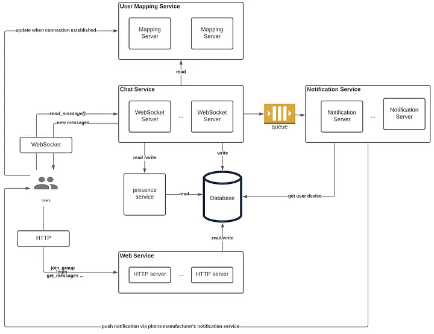
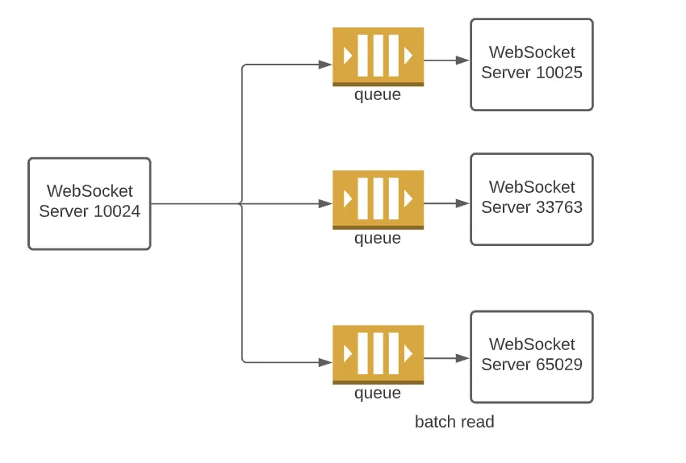

# Design a Chat App (2)

## Introduction

Designing chat applications like Slack or Messenger has always been among the top questions asked by system design interviewers. Personally, I’ve run into this problem a few times by now. As new grads/junior SDEa, we are good at implementation, yet designing whole systems is a challenge of its own kind. In this article, I want to share with you my design of Slack, which is based on real-life interview feedbacks I received as well as discussions with senior engineers.

### Requirements

First thing first, we must figure out the exact requirements of the target system. For Slack (or other apps you use), the following features can be expected:

- Direct messaging: two users can chat with each other
- Group chat: users can participate in group conversations
- Join/leave groups, (add/delete friends not important for Slack)
- Typing indicator: when typing, the recipient gets notified
- User status: whether you are online or offline
- When the user is offline, try send notifications to the user’s mobile device if a new message arrives.

Besides the above features, the system should obviously be scalable and highly available.

### Traffic Estimation

Some interviewers I talked to didn’t like upfront back-of-the-envelope estimation because the statistics are arbitrarily picked and the exact number doesn’t mean much. To some extent, they are right. However, we do need some rough numbers to help us make critical decisions:

- We expect millions of daily active users(DAU) from all over the world.
- On average each message is around a few hundred characters. Each person sends out a few hundred messages per day.
- Some groups have a handful of people, some others have hundreds of members

Based on the numbers above, we can make the following conclusions:
- it is safe to say that we need a globally distributed system (to serve users in different regions). Users -will be connected to different servers.
- The backend database should be horizontally scalable, as tons of messages (~100 GB) are saved each day.
- The system is write-heavy, as messages are written into DB but rarely read (most of them are delivered via the notification service and saved locally on the client. We shall see why later )

## High-level Design

### Database Design

When it comes to database design, it is always a good idea to consider the access pattern of your application.

#### Read Operations
- Given user A and user B, retrieve messages after a certain timestamp
- Given group G, retrieve all messages after a certain timestamp
- Given group G, find all member ID
- Given user A, find all groups he/she joined

#### Write Operations
- Save a message between user A and user B
- Save a new message by user A in group G
- Add/delete user A to/from group G.

In our case, it is obvious that the database is used primarily as a key-value store. No complex relational ops such as join are needed. In addition to the access pattern, keep in mind that the database must be horizontally scalable and tuned for writes.

In our case, we could use NoSQL databases such as Cassandra or sharded SQL such as Postgres (SQL is also very scalable if you don’t care about relations or foreign key constraints). In practice, many companies (e.g. Discord) use Cassandra because it scales up easily and is more suitable for write-heavy work ([Cassandra uses LSTM rather than B+ Tree used by SQL](https://tikv.github.io/deep-dive-tikv/key-value-engine/B-Tree-vs-Log-Structured-Merge-Tree.html)). 

### Schema

In Cassandra, records are sharded by the partition keys. On each node, records with the same partition key are sorted by the sort key. The chat tables are designed to best fit our access pattern.

**Private chat table**

**groupId** | **bucket** | **messageId** | **timestamp** | **message** 
----------| ----------| -----------| ----------| -----------
HACKER     | 3        | 8432       | 12312412424 | "Hello"

- Partition key = **userId1** + **userId2** 
- Sort key = **messageId**

**Group chat table**

**groupId** | **bucket** | **messageId** | **timestamp** | **message** | **userId**
----------| ----------| -----------| ----------| ----------- | -----
HACKER     | 3        | 8432       | 12312412424 | "Hello" | Jack

- Partition key = **groupId** + **bucket** 
- Sort key = **messageId**

A key observation here is that the message ID is used to determine the ordering. The message Id is not globally unique, as its scope is determined by the partition key. The system will never retrieve an item by its message ID alone.

However, auto-increment key generation is not well supported by distributed databases. We could use a dedicated key generation service such as [Twitter’s Snowflake ID](https://blog.twitter.com/engineering/en_us/a/2010/announcing-snowflake) or simply use a precise timestamp as message ID (yes, [clock skew can happen](https://cse.buffalo.edu/~stevko/courses/cse486/spring14/lectures/06-time.pdf), but the message volume in a group/between two users may be small enough to ignore this with careful time synchronization)

### API Design

In a system design interview, it is always a good idea to lay down the API of the system upfront. It helps you formalize the features to implement and showcase your rigorous thinking.

The requirements of our system can be broken down into the following RPC calls:

```
send_message(user_id, receiver_id, channel_type, message)

get_messages(user_id, user_id2, channel_type, earliest_message_id)

join_group(user_id, group_id)

leave_group(user_id, group_id)

get_all_group(user_id)
// ignore RPC for login/logout, ignore authentication token 
```

- The *channel_type* field is used to distinguish private chats from group chats.
- The *receiver_id* /*user_id2* can be a user ID or a group ID.
- The *earliest_message_id* is the latest message locally available on the client. It is used as the sort key to range query the chat tables.

### Architecture

Finally, time for architecture design! By now we’ve laid down a solid foundation for the application — the database schema, the RPC calls. With all these in mind, we can proceed to write down the list of components in the system.




- **Chat Service**: each online user maintains a WebSocket connection with a WebSocket server in the Chat Service. Outgoing and incoming chat messages are exchanged here.
- **Web Service**: It handles all RPC calls except *send_message()*. Users talk to this service for authentication, join/leave groups, etc. No WebSocket is needed here since all calls are client-initiated and HTTP-based.
- **Notification Service**: When the user is offline, messages are pushed to external phone manufacturers’ notification servers (e.g. Apple’s )
- **Presence Service**: When a user is typing or changes status, the Presence Service is responsible for figuring out who gets the push update.
- **User Mapping Service**: Our chat service is globally distributed. We need to keep track of the server ID of the user’s session host.

### Dataflow

**Normal Message Delivery**

When the user sends out a message, it is delivered to a WebSocket server in the same region. The WebSocket server will write the message to the database and acknowledge the client. If the recipient is another user, her WebSocket service ID is obtained by calling the User Mapping Service. Once the message is forwarded to the appropriate server, the recipient will get the push message via WebSocket.


**Failed Message Delivery**

If for some reason the WebSocket is cut off and the user is unreachable, all messages will be redirected to the notification service for a best-effort delivery (no guarantee of delivery, since the user might not have an internet connection).


**History Catch-up**

Even with the duo message delivery system, it is possible that a message is never received by the client. Therefore, it is critical that all clients request the Gateway Service for the authoritative chat history upon reconnection/with fixed intervals.


**GroupChat**

When a user participates in a group chat, his message is broadcast to all group members. Given a group ID, the WebSocket server queries the database forward the messages to other servers.


**Presence Detection**

When a user is active in the app, applications like Slack will inform other users of your status. We can handle this signal as a special form of group chat. Instead of querying the database, the WebSocket server contacts the Presence Service who returns a list of contacts for broadcast. Since it is prohibitively expensive to inform everyone who has ever chatted with the user, the Presence Service runs some kind of algorithm (maybe based on chat frequency, latest exchange, …) to keep the list short and precise.


For less-frequent contacts, the status of a user can be obtained by polling the presence service instead of waiting for the push message.

**Typing Indication**

Logically there’s no difference between a typing indication message and a normal message. We can propagate the typing indication messages in the same way as private chat messages.

## Details

By now, we have established a clear architecture and concrete data flow that covers all functional requirements. However, there are so many things over which an interviewer can grill you. In this section, I want to talk about some interesting tradeoffs that interviewers might ask you.

### Communication Between Web Socket Servers

The first issue is how web socket servers communicate with each other (step 5 in figure 6). The easiest way is to use a separate, synchronous HTTP call for each message. However, two issues arise:
1. No message ordering: If two messages are sent in sequence, it is possible that the first one arrives super late. It will seem to the user that an unread message pops out above the latest message you just read, which is very confusing.
2. Large number of request per second: If each message is sent with a separate HTTP call, then the ingress traffic could overwhelm web socket Servers.

One possible solution is using queues as middleware. Each server has a dedicated incoming queue, which serves as a buffer and imposes ordering on messages.



Although it looks like that queue is a better solution, I would argue that it’s a devil of its own:

- For large-scale applications such as Slack, there are tens of thousands of web socket servers. Maintains and scales the middleware is expensive and a challenge itself.
- If the consumer (web socket server) is down, we don’t want the messages to accumulate in the queue since the users will reconnect to a different server and initiate history catch-up. Servers come and go all the time, it is laborous to create/purge queues with them.
- If the consumer rejoins, what should we do with the stale messages in the queue? What messages to discard and what to process?

Here I propose a third approach that is based on synchronous HTTP calls:

To solve the ordering issue, we can annotate every message with a prevMsgID field. The recipient checks his local log and initiates history catch-ups when an inconsistency is found.


To reduce the number of messages exchanged between servers, we can implement some buffering algorithm on WebSocket servers — send accumulated messages, say, ~50 MS with randomized offsets (preventing everyone from sending messages at the same time).

### Handling Group Chat

Right now the current design broadcasts all group messages regardless of group size. This approach does not work well if the group is very large. Theoretically, there are two ways to handle group chats — pushing and pulling:
- pushing: The message is broadcast to other web socket servers who then push it to the client
- pulling: the client sends a request to HTTP servers for the latest messages.

The problem with pushing is that it converts one external request (one message) into many internal messages. This is called Write Amplification. If the group is large and active, pushing group messages will take up a tremendous amount of bandwidth.

The problem with pulling is that one message is read over and over again by different clients (Read Amplification). Going along with this approach will surely overwhelm the database.


My idea is that we can build a hybrid system with the above logic. For smaller groups or inactive groups, it is okay to do pushing since write amplification won’t stress out the servers. For very active and large groups, clients must query the HTTP server regularly for messages.

### Web Socket Server and Database

When a message is received by a web socket server, it is persisted into the database. The simplest approach would be calling the database directly. With this implementation, the database is bombarded with ~100K RPS traffic, which demands tons of infrastructure.

An alternative is using queues for batch insertion. When the queue service receives a write, the web socket server, in turn, acknowledges the client. At the other end of the queue, a dedicated batch writer can group hundreds of messages into a single request, thus reducing the RPS significantly.


However, using queues such as Kafka does introduce delays between server ACK and the actual write. If a client queries the HTTP server immediately after receiving ACK from the web socket server, it is possible the message is not written yet. With middleware, it is hard to offer read-after-write consistency that might be important for certain applications.

## Summary

In this article, we came up with a high-level architecture for Slack, defined system APIs as well as database schema. In addition, we explored many important tradeoffs when the system is examined more closely. In a system design interview, there’s no such thing as a perfect answer. All solutions have flaws, our job is to evaluate each of them and pick the simplest one that meets all the requirements.

## Refs

[Ace the System Interview— Design a Chat Application](https://towardsdatascience.com/ace-the-system-interview-design-a-chat-application-3f34fd5b85d0)

