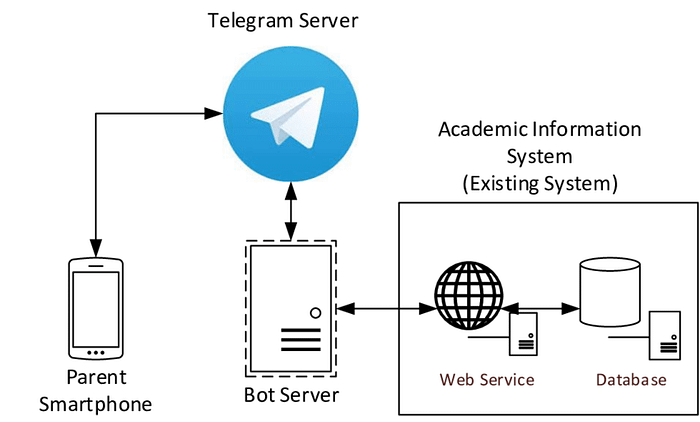
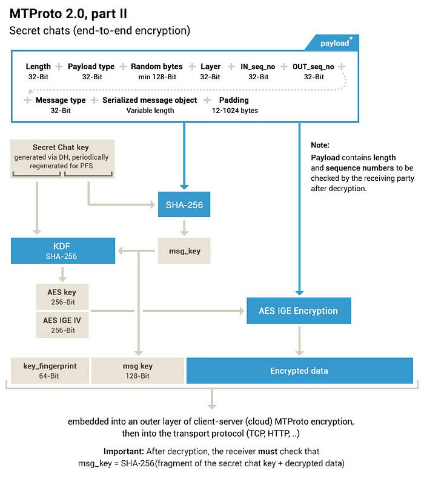

# Telegram System 

Telegram is one of the popular instant messaging applications that provides reliable communication services to millions of users worldwide. It was launched in 2013. It is a cloud-based messaging platform that offers end-to-end encryption for user communication. Telegram’s system architecture is designed to provide high performance, scalability, and reliability. It is a distributed system that consists of multiple components and services, including servers, data centers, and clients. The architecture is based on a client-server model, where clients communicate with servers to send and receive messages and other types of data.

## Key Differences Between the System Architectures of WhatsApp and Telegram

Feature | WhatsApp | Telegram
-------- | ---------| ------
Architecture | Centralized Arch | Decentralized Arch
Encryption Protocols | Signal Private Messenger Protocol | MTProto Protocol
Open API Availability | ❌ | ✅
Cloud Storage | user’s device & company’s servers | ✅
Active users | 2 billion  | 500 million

**Centralized vs. Decentralized Architecture** — WhatsApp is a centralized messaging application. Telegram is a decentralized architecture. WhatsApp stores all user data on the company’s servers to provide a seamless and consistent user experience. WhatsApp has complete control over user data. Telegram distributes user data across a network of servers located in different data centers around the world which provides increased security and privacy but leads to slower performance and inconsistency across different devices.

**Encryption Protocols** — WhatsApp uses the Signal Private Messenger Protocol for end-to-end encryption of user communication. It can provide strong security and privacy features, including message encryption, integrity, and authenticity. Also, it provides forward secrecy. Even if an attacker were to obtain the encryption key for a specific message, they would not be able to use that key to decrypt any previous or future messages sent between the same parties. Telegram uses its own MTProto Protocol for end-to-end encryption of user communication. It provides strong security and privacy features, including message encryption, integrity, and authenticity. It also provides the ability to send large files and the option to set messages to self-destruct after a certain period of time. It has been audited by third-party security experts and has been criticized for its lack of transparency.

**Open API Availability** — WhatsApp does not provide an open API and restricts the use of its platform to its client applications. Telegram provides an open API that allows developers to build custom applications and integrations with the Telegram platform such as building bots, games, and other interactive services.

**Cloud Storage** — WhatsApp does not provide cloud storage and stores user data only on the user’s device and the company’s servers. If the device is lost or damaged, the user may lose their data permanently, unless they have made a manual backup of their data. Telegram provides cloud storage for user data, including messages, photos, videos, and other files. It allows users to access their data from multiple devices with an internet connection and provides a backup in case the user’s device is lost or damaged. It allows users to selectively delete messages and data from the cloud, giving users greater control over their data privacy.

**User Base** — WhatsApp has over 2 billion active users worldwide. This large user base provides greater network effects for users. Telegram has over 500 million active users. This smaller user base provides greater privacy and security for its users.

### Functional Requirements

#### Must-have
- Allow users to register and authenticate themselves using their mobile phone numbers or other verification methods
- Allow users to send text, photos, and videos
- Only the sender and the recipient of a message can access the content
- Allow users to access their account from different devices without the need for manual login every time
- Offer passcode lock to restrict access to the app
- Allows users to create and participate in group chats with up to 200,000 members
- Support third-party bots and integrations
- Provide two-factor authentication
- Allow users to forward messages from one chat to another or to multiple chats
- Provides a search bar that allows users to search for specific messages or chats
- Allow users to delete messages for both themselves and the recipient
- Allow users to send and receive money through integrated payment services, such as Stripe and PayPal
- Users can use Telegram on their desktop and web browsers
- Allow users to send other types of media up to a maximum file size of 2GB
- Allow users to share files of different formats and sizes
- Support for self-destructing messages after a certain period of time
- Support secret chats
- Edit sent messages
- Allow users to create and join channels
- Share their contact information with their contacts, including their phone number, username, and profile picture
- Block users, and contacts and report spam
- Provide the option to backup chats to the cloud and restore

#### Nice-to-have
- Support a wide range of file formats for photos, videos, and other media types
- Photos: JPEG, PNG, BMP, TIFF, WEBP, HEIF
- Videos: MP4, MOV, AVI, WMV
- Audio: MP3, AAC, OGG, FLAC
- **Documents**: PDF, DOCX, PPTX, XLSX
- **Archives**: ZIP, RAR, TAR
- Allow users to make voice and video calls with other Telegram users
- Allow users to create custom themes and app design.
- Allow users to mute notifications for specific chats or groups to avoid being disturbed by frequent messages
- Share live location updates with contacts
- Screen sharing during video calls
- Support for automatic message translation between different languages
- Create and manage events or reminders within the app
- Offer location sharing
- Allow users to archive chats
- Supports sending voice messages and stickers
- Support for multiple languages
- Telegram Passport is used to provide secure identity verification
- Support for integration such as In-App games and quizzes
- Supports polls and quizzes in groups and channels
- Pin important chats to the top of their chat list for quick access
- Shows the status of messages, such as if they have been delivered or read by the recipient
- Allow users to change their profile picture and status
- Show users their chat and call history
- Clear their chat history
- Show users which of their contacts are using Telegram
- Schedule messages to be sent at a later time or date
- Send and receive voice and video messages in secret chats
- Allow users to send and receive contacts or vCards
- Allow users to send and receive encrypted files and messages via a peer-to-peer (P2P) connection
- Set custom notification sounds for specific chats or groups to distinguish them from notifications
- Use Telegram on smartwatches through supported apps such as WatchChat
- Use Telegram on feature phones through supported apps such as Telegram Lite
- Make audio and video calls with non-Telegram users, such as phone numbers or other messaging apps

### Non-Functional Requirements
- Reliable
- Low latency
- High throughput
- Security
- Scalability
- Availability
- Compatibility
- Usability

## The High-level System Architecture Diagram

### Front-end
- iOS: Objective-C and partly Swift
- Android: Java
- Windows Phone: C#
- TDesktop: C++
- Telegram Web: JavaScript and Node.js
- Mac App: Objective-C

### Back-end
Not publicly disclosed, but they likely involve a combination of programming languages and tools for handling messaging, storage, security, and other services.

## System Architecture Components

### Profile Database

Store and retrieve user profile information, such as username, display name, bio, profile picture, and contact information
Allow users to update their profile information
Support for searching and filtering user profiles

### Profile Service

Manage user profiles and handle user authentication and authorization
Provide APIs for creating, updating, and deleting user profiles
Integrate with the Profile Database to store and retrieve user profile information

### Chat Server

Handle incoming and outgoing messages for individual chats and group chats
Provide APIs for sending and receiving messages
Support real-time message delivery and synchronization across multiple devices
### Mapping Database

Store mapping between user IDs and device IDs
Enable users to receive messages on multiple devices
Allow users to link multiple phone numbers to their account

### Group Service

Manage group chats and provide APIs for creating, updating, and deleting group chats
Allow group admins to manage members and permissions within a group
Support for group chat features such as mentions, polls, and pinned messages

### Last Seen Service

Keep track of the last time a user was active on the app
Display the last-seen status of users to their contacts
Allow users to control who can see their last-seen status

### Message Storage Server & Store Temp Message DB

Store and manage messages sent and received by users
Provide APIs for retrieving message history and searching for specific messages
Support for message archiving and deletion
Store temporary messages that are awaiting delivery or have not yet been received by the recipient

### Message Type Message

Support for multiple types of messages, such as text, images, videos, audio, documents, and stickers
Enable users to send and receive messages in different formats and sizes
Provide APIs for processing and displaying different message types

### User Analytics Service

Collect and analyze user data to provide insights into user behavior and usage patterns
Track metrics such as user engagement, retention, and growth
Provide dashboards and reports to help developers and stakeholders understand user activity and trends

### Notification Service

Send push notifications to users for new messages, calls, or other events
Allow users to customize their notification settings, including muting or disabling notifications for specific chats or groups
Integrate with the chat server to deliver notifications in real-time

### Bot Service

Enable developers to create and deploy bots that can interact with users and automate tasks within the app
Provide APIs for creating, updating, and deleting bots
Support for bot features such as natural language processing, AI, and machine learning

### Payment Service

Integrate with payment providers to enable users to send and receive payments through the app
Support for different payment methods and currencies
Provide APIs for processing payments and managing payment history

### Security Service

Provide security features such as two-factor authentication, passcode lock, and end-to-end encryption
Manage user data privacy and compliance with data protection regulations
Detect and prevent fraudulent activity, spam, and abuse within the app
Monitor for security vulnerabilities and implement measures to protect against them

### Localization Service

Support for multiple languages and localization of the app interface
Allow users to switch between different languages and localize content based on user preferences and location
Provide tools for developers to create and manage translations and language resources

### Media Compression and Optimization Service

Optimize media files for faster upload and download speeds and reduced storage space
Compress and resize images and videos to reduce file size without compromising quality
Provide APIs for processing media files on the server side before they are sent or received by users.

### Voice Over IP (VoIP) Service

Allows users to make voice calls over the internet with end-to-end encryption for security.
Supports real-time voice and video calls and group voice chats.

### Secret Chat Service

Offers end-to-end encrypted messaging that is not stored on Telegram’s servers.
Messages are only visible to the sender and recipient and are automatically deleted from both devices once they have been read.
Supports self-destructing messages and device-specific message deletion.

