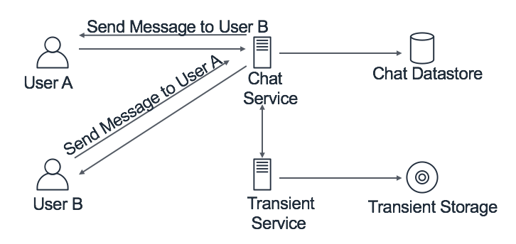
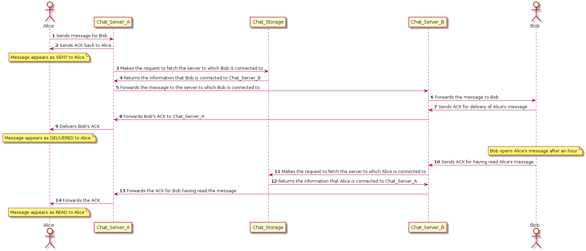
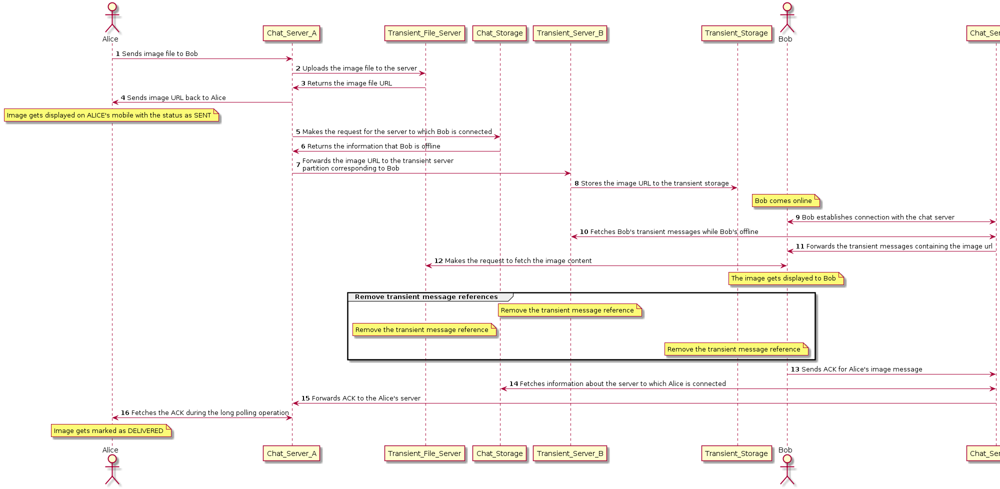
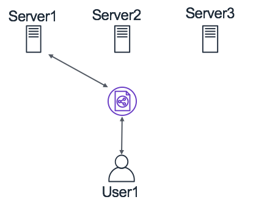
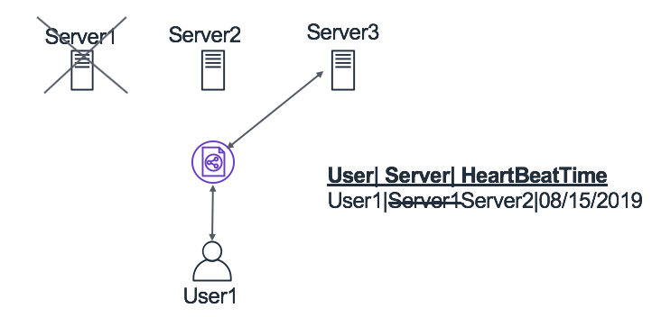
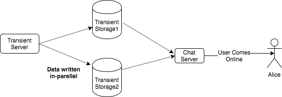
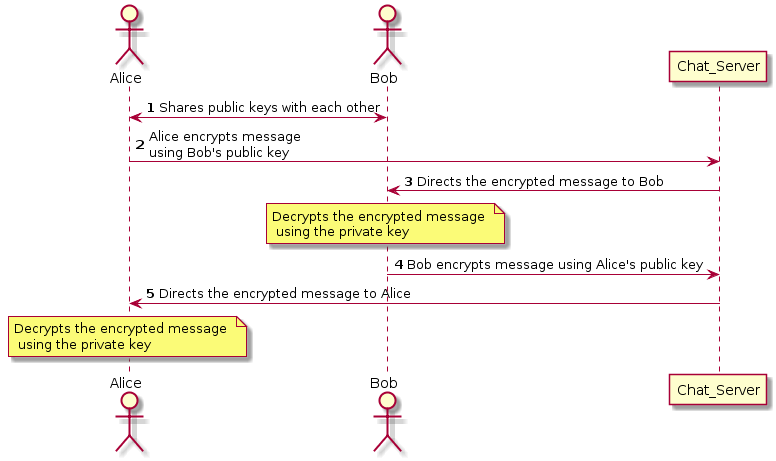

# Whatsapp System

## Introduction

Note:This is one way of designing an instant messenger system such as WhatsApp. However, we don’t guarantee that WhatsApp is designed in this way. This is our prototype on
designing a similar system

### Problem Statement

In this chapter. we will design an instant messenger platform such as WhatsApp or Signal which users can utilize to send messages to each other. An essential aspect of the
application is that the chat messages won’t be permanently stored in the application.

::: tip FUN FACT: 
Some of the chat messengers such as FB Messenger stores the chat messages unless the users explicitly delete it. However, instant messengers such as WhatsApp don’t save the messages permanently on their server.
:::

### Gathering requirements

The instant messenger application should meet the following requirements.
- It should be able to support one-on-one conversations between users.
- It should be able to show Sent/Delivered/Read confirmation to other users.
- It should be able to provide information about the last time a user was active.
- It should allow users to share images.
- It should be able to send push notifications to other users

### 8.1.3 Capacity Planning

We need to build a highly scalable platform which can support traffic at the scale of
WhatsApp. Additionally, while doing capacity planning, we need to ensure that we think
through the worst-case scenarios of peak traffic. Some of the numbers which we can use
for capacity estimations of an application (like WhatsApp) are listed below.
- Number of users on the application every month: 1 Billion
- Number of active users per second at peak traffic: 650, 000
- Number of messages per second at peak traffic: 40 Million

The entire application will comprise of several microservices each performing a specific task. The number of servers required in the data plane (Webmaster include the link
to the distributed systems chapter) (let’s call it to chat microservice) handling the traffic of
chat messages can be estimated using the following equation.

= *(chat messages per second Latency)/ concurrent connections per server*

Let’s assume that the number of concurrent connections per server is 100K, and the
latency of sending a message is 20 milliseconds. In such a scenario, the estimated number
of servers required in the chat servers’ fleet (using the equation mentioned above) will be 8
(i.e., 40 Million*20 ms/100K). In standard practice, it I s recommended to add a few more
servers to account for handling failures of these servers. In a subsequent section, we will
see the impact which these chat servers will have on the overall infrastructure cost.

::: tip FUN FACT
In this talk, Rick Reed(software engineer @ WhatsApp) talks about optimizing their Erlang-based server applications and tuning the FreeBSD kernel to support
millions of concurrent connections per server. This helped them to a great extent in keeping
their server footprint as small as possible.
:::

## Detailed Design

The required features of this instant messenger application can be modeled using two
micro-services: Chat service and Transient service. The Chat Service will be the one
serving the traffic of online chat messages sent by active users. The service will check if
the user to whom the message is sent is online or not. If the user is online, then the message will be forwarded to that user instantly. Otherwise, the message will be handled by the Transient Service. This service will be responsible for maintaining all the messages (text
or image) sent to offline users. The data will be stored in the Transient Storage temporarily
until the offline user comes back online. We will provide more details about the individual
components in one of the later sections.

   
*Figure 8.1: High level Design - WhatsApp*

::: tip FUN FACT
WhatsApp actually uses a much similar approach as discussed by the same WhatsApp engineer (Rick Reed) in a different talk.
:::

### API Design
We can expose a REST endpoint to interact with the Chat Service. The definition of the
API endpoint to send messages is mentioned below.

```
sendMessage(String fromUser, String toUser, ClientMetaData clientMetaData, String message)
```

**Request**: 
- *fromUser*:The userId who is sending the request 
- *toUser*: The userId to whom the request is being sent
- *clientMetaData*: The metadata to store client’s information such as device details, locations etc. 
- *message*: The message being sent as part of the communication.

## Data Model

We will store details such as the server to which the user is connected and the last time
user was active. We can use a document-based database such as MongoDB to store user
information such as the last activity time of the user (aka heartbeat time). The data-model
will look similar to the table below.

userID (HK) | HeartBeatTime | connected server
----- | ---- | -----
User A | T1 | Server A
User B | T2 | Server B

## Component Design

In this section, we will talk about two different scenarios for sending messages in a oneto-one communication. After that, we will discuss the other features which we need to
support, such as push notifications and user activity status. In the end, we will look into
the different mechanisms for doing optimizations and handling failure scenarios.

### One-to-One communication

Here, we will talk about the two different scenarios associated with sending messages to
another user. The first scenario involves sending a text message to an online user. In
the second scenario, we have described the sequence of operations involved in sending an
image to an offline user.

#### Scenario-1: Sending text to an online user

The details about each of the steps in the sequence diagram for sending a text message to an online user is mentioned below.


   
*Figure 8.2: One-to-One communication between online users*

1. Alice sends a message to Bob which gets directed to the chat server with which Alice is connected.
2. Alice gets an acknowledgement from the chat server it’s connected (i.e. ChatServerA) and the message is mstorage to fetching information about the chat server to which Bob is connected.
3. ChatStorage returns the information that Bob is connected to ChatServerB. ChatServerA forwards the message to ChatServerB. 
4. The message gets delivered to Bob using a push mechanism (Webmaster include link).
5. Bob sends ACK back to ChatServerB. The ACK is forwarded to ChatServerA to which Alice is connected.
6. The ACK gets delivered to Alice and is marked as DELIVERED

#### Scenario 2: Sending image to an offline user

The details about each of the steps in the sequence diagram for sending an image to an offline user is mentioned below.

   
*Figure 8.3: Sequence diagram: Sending image to an offline user*

1. Alice sends an image to Bob which gets forwarded to ChatServerA,theserverwithwhichAliceisconnec
2. File Server returns the image url of the uploaded file to ChatServerA.T heimageurlisreturnedtoAlicewhichis
3. ChatServerA makes request for the server to which Bob is connected. ChatStorage returns information that Bob is
4. ChatServerA forwards the message containing the image−url to the transient server The transient sever stores turlin transient storage.
5. Bob comes online and performs heart-beat (Webmaster Include Link) with ChatServerB.ChatServerB f etche
6. ChatServerB f orwardsthetransientmessagestoBob.Bob f etchestheimage f romthe fileserver.Atthispoint,th
7. Bob’s device sends ACK for Alice’s image to ChatServerB Fetches information about the server to which Alice
8. Forwards the ACK to ChatServerA The ACK gets delivered to Alice marking the message as DELIVERED.

**Transient Data storage**

We can implement a queue-based mechanism to store and retrieve the transient messages using a FIFO based policy. We can use existing cloud-based technologies for this purpose, such as Amazon SQS or Windows Azure Queue Service. We
can use these queues to store transient messages sent to offline users. All the references to
these transient messages are removed from the system once the messages are delivered to
the offline user.

### Push Notifications

There are two approaches to deliver messages to users by using push technology : client
pull or server push. If we go down the route of client pull, we can either decide between
long vs. short polling. On the other hand, there are two ways to implement the server
push approach: WebSocket and Server-Sent Events(SSE). Websockets has been the defacto communication protocol for chat applications. We have provided more details about
it in the section below.

Using the polling technique, the client asks the server for new data regularly. The tradeoff decision to choose the polling technique can be taken using the data-points mentioned
below.

**Short Polling e.g., AJAX-based timer**
- ✅ Pros: more straightforward and not very server consuming if the time between requests is long
- ❌ Cons: not ideal for scenarios when we need to be notified of server events with minimal delay

**Long Polling e.g., Comet Based on XHR**
- ✅ Pros: notifications of server events happen with no delay
- ❌ Cons: more complex and consume more server resources

The approach to push server messages to clients is mainly of two types. The first one is
WebSocket which is a communication protocol. It provides duplex communication channels over a single TCP connection. It’s ideal for scenarios such as chat applications due to
its two-directional communication. The other one is called Server-sent events (SSE) which
allows a server to send “new data” to the client asynchronously once the initial client-server
connection has been established. SSEs are more suitable in a publisher-subscriber model
such as real-time streaming stock prices; twitter feeds updates and browser notifications.

### User Activity Status

The last time when a user was active is a standard functionality which can be found on
instant messengers. We have shown the data-model to store the related information in
Table 1 above.

   
*Figure 8.4: Heartbeat between client and server*


In Fig 8.4, we have shown the mechanism using which a connection is maintained
between client and server using WebSockets. Once an initial connection is established
between client and server, the communication switches to a bi-directional binary protocol.
The connection is kept alive between client and server using heartbeats. We store the last time a heartbeat was received from a user in a database. The data-storage can then be
queried to fetch the last time a user was active.

## Optimization
We can use the parameters listed below to suggest optimizations in the system. We have
provided details about the approach which should be followed for suggesting optimizations
in a system in this article.
- **Latency**: We can use distributed cache (Include Link to distributed caching) such
as Redis to cache the information of user activity status and their recent chats inmemory. This may help in reducing the overall latency of the application and provides a better customer experience. Even some of the database solutions do provide in-memory caching solutions such as Amazon DynamoDB Accelerator.
- **Infrastructure cost**: It’s apparent from the system that significant contribution to the
infrastructure cost will be from chat servers. The cost incurred from the chat servers
can mount quickly if its server foot-print isn’t kept in check. One way of doing that
is to increase the number of connections per host. It will significantly reduce the
number of servers required for maintaining the service. We can accomplish this task
by tuning the server configurations and choosing suitable technologies. For instance,
engineers at WhatsApp were able to achieve millions of connections per host by
optimizing their Erlang-based server applications and tuning the FreeBSD kernel
- **Availability** : We can maintain multiple copies of the transient messages so that
even if the messages in one of the copies is lost then it can still be retrieved from
the other copy. This would imply maintaining replicas of those transient messages.
The client would be responsible for fetching the messages from two queues and will
merge them. We will discuss more in the next section.

### Addressing Bottlenecks
 The major bottlenecks in the system which are more vulnerable to failures are the chat
servers and the transient storage solutions. We have recommended some approaches to
handle such failures in the section below.

- **Chat server failure**: The chat servers in the system will be holding connections with
the users. There are two ways of handling the failure of chat servers. One approach
can be to transfer those TCP connections to another server; however, implementation
of such fail-overs isn’t trivial. The second, which is comparatively more straightforward is to have the user clients initiate the connection automatically in case of
connection loss. The information of the server to which the user is connected needs
to be updated in the database is agnostic of the approach we take. For instance, in
Fig 5.6, we have shown an illustration of the handling this failure scenario. We can
see that User1 is connected to Server1, and when this server goes down, then the
connection is re-established with another server (i.e. Server2), and this information
is updated in the database.

   
*Figure 8.5: Handling chat server failure*

- **Transient storage failure**: The transient storage is another component which is
prone to failures and can cause loss of messages in-transit to offline users. We can
make replicas of the transient storage of each user to prevent the loss of messages
which were sent to them when they were offline. When a user comes back online then both the original and the replica instances of the user’s transient storage are
queried and merged. In Fig 8.6, we have illustrated a mechanism to handle transient
storage failure which gets initiated when user comes back online

   
*Figure 8.6: Handling transient storage failures*

### Monitoring

We want to ensure that our service can meet the user demands with high availability and
low latency. We can define service level agreements (SLAs) for these metrics and create
moderate and severe monitors which can trigger an alarm when these SLAs are violated.
For this application, we can define the following SLAs for the sendMessage API.
1. Availability SLA: p99.999
2. Latency SLA: p99.999 of 5 milliseconds

The availability SLA implies that that the monitor will trigger an alarm if more than 1
out of 1000 requests fail. Likewise, the latency SLA means that an alert will be triggered
if the server takes > 5ms to respond for more than 1 out of 100 requests it receives.

Additionally, we can put failure alarms in different error scenarios. One such scenario can occur when the chat server isn’t able to fetch transient messages for a user from
all the replicas of transient storage. This maps to Step10 illustrated in Fig 3 above where

*ChatServerB requests the transient server to fetch the messages sent to Bob when Bob was off line.*
Let′s assume th8.

### Extended Requirements

We can extend the system to support group chats using which we can get messages delivered to multiple users. We can create a data-model to store the group data-entity, which will
be identified by GroupChatID and will be used to maintain a list of people who are part of
that group. The system described above is extensible to support the scenarios for sending
message to online and offline users. We can build a component which will be responsible
for ensuring that the messages get delivered to all the users in the group depending upon
their activity status.

Another aspect that can be covered as an extension to this problem is that of security,
specifically end-to-end encryption, where only the communicating users can read the messages. Each user has a public key that is shared with all the other users with whom the user
is communicating. For instance, two users Alice and Bob, are communicating with each
other. Alice has Bob’s public key and vice versa; however, their private key isn’t shared.
When Alice sends a message to Bob, the message is encrypted using Bob’s public key
and sent over the network. The server directs the encrypted message to Bob, who uses the
private key to decrypt the message. In this way, the server only has access to the encrypted
message, and only Alice and Bob can read the actual messages they exchanged.

   
*Figure 8.7: End-to-End encryption while sending messages*