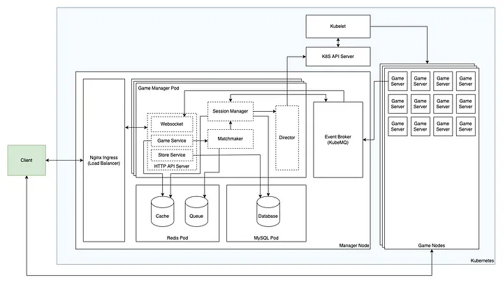
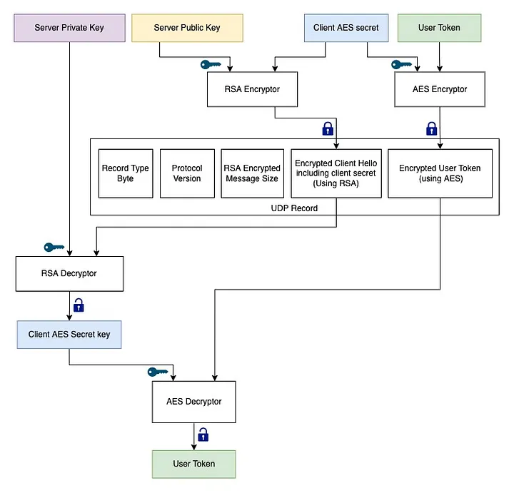
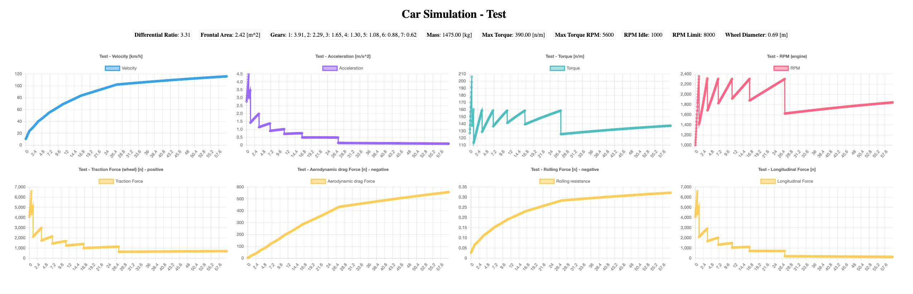

# Design Online Multiplayer Game

Here I want to share the story of making the Garage, a simple multiplayer car drag racing game, a simple but engineered software, and show you how engineering plays a huge role, even for simple software.

## Garage

The garage is a code name for this project. In the game, players compete with their cars in a drag race.

So in the basics of making games, the story is simple, two or more players control their cars on a road to arrive at the finish line faster than others.
They can customize and tune their cars by items to be unique.

We are going to design and implement a distributed system and engage engineering and backend. Other stuff (like BM, UI/UX, and design) remains unclear.

## Requirements

In the previous part, I talked about the basics of the Garage, and now we are going to inspect the engineering and architecture in this part.

### So, what do we need?
In the big picture, we need a server and a client, but in the details, we need a lot of things:

#### Game Client
The game client renders the graphics and communicates with the server. I choose Unity3D to develop the game client.

#### Game Server
The game server manages connections, data calculations, and simulations. It must be authoritative, why? because you must always consider the players as cheaters. In single-player games, cheating is not important, every cheat that a player applies to the game is not harmful to anyone, but in multiplayer games, the cheats change the result, making the cheater achieve a prize that does not deserve.

#### Authentication service
This service handles user registration, authentication, and authorization.

#### Matchmaking service
The matchmaking service matches players based on skills or car class.

#### Game server manager service
This service manages games. When the matchmaking service matches the players, the game manager creates a new instance of the game server and returns its IP and port for the game client to connect.

#### Inventory service
This service stores and manages items, user items, and car customizations.

#### Gateway
The gateway exposes the services APIs to the end-user

#### Admin panel
An admin panel is needed to manage and monitor users and items.

#### Merging Services
Developing, managing, and maintaining all of these services is hard work to do, therefore, I merged the Game Manager service with the gateway, matchmaking, inventory, and admin services and used Firebase as the authentication service.

#### Event Broker
An event broker is needed to transfer the events between services.

#### Deployment
Finally, the delivery part is also important and we should consider it too. we need to deploy all these applications into the servers and maintain them.

#### Pipeline
Let’s start with a scenario, the player opens the game client and clicks on the “Start Matchmaking” button in the main menu. Next, the matchmaking service adds the player to the queue. After a while, another player repeats this request, and the matchmaking service matches these two players. Then the game manager runs a new instance of the game server and returns the IP and Port of it, so the clients can connect to the game server directly and start playing.

By now we have three main applications, the game client to render the graphics and communicate with the server, an authoritative game server to calculate the client inputs and run the mathematics simulations, and finally, a game manager application to manage game sessions, and handle matchmaking, and so on.

## Architecture

This is the main part of engineering, we’re going to create a schematic model of our mental model for the whole system. to start we talk about the chosen stack to know the limitations and costs.

### Deployment and orchestration
We have a single deployable artifact to run game servers by containerizing the applications. But deploying, maintaining, and scaling these artifacts and services is hard work to do. The Kubernetes helps handle deployments, orchestrate running containers, and manage nodes.

### Load Balancer
The game manager is scalable horizontally, which means that the k8s run multiple instances of it concurrently. Therefore, we need a load balancer to distribute the requests to the game manager pods.

The Nginx ingress is used as a load balancer to handle incoming requests and proxy them to the services.

### Game Client
I chose Unity3D for the game client. The Unity Game Engine uses C# as the programming script.

### Game Server
The game server is an authoritative server, which means that each client input is processed and validated on the server-side, then the game client checks the server validated data with its predictions.

In addition, each game is run as a separate process (dedicated server) to prevent impacting other game instances by resource usage or corruption, for example, if a game is crushed, other games remain safe to continue running.

The game server is a stateful server because it uses memory to store game states like players' coordinations and inputs, so it’s not replaceable or scalable horizontally.

Our game is a fast-paced multiplayer game and should use UDP protocol to stream the game states and receive the players' inputs in the fastest way. Also, we need a TCP tunnel to transfer the game events which must be received with acknowledgment and in order.

The game world simulations and calculations are not complicated, so I chose golang to develop the game server.

### Game Manager Service
I merged some services with the game manager for the greater good (make deployment and maintenance easy), thus it must handle a lot of work. I chose golang to develop the game manager service. The game manager app is a stateless service and could be scaled horizontally.

#### APIs
- An HTTP server APIs to handle the client requests in the game menu and store.
- A WebSocket handler to keep a long-living connection with the client in the main menu to send events.

#### Matchmaking
The matchmaking service is responsible for putting the players in a queue and categorizing them depending on latency and rank. The Redis fits with these conditions. It supports the atomic lock concept which can be used for race condition challenges in multiple game manager instances.

#### Database
A database is needed to store some data like cars, items, users items, game logs, and so on. to achieve this, I used MySQL to store relational data (users’ customed car parts), for the game data MongoDB fits here, but for simplicity, I moved forward with the MySQL.

#### Kubernetes API
The game manager uses K8S API to create a new pod and run the game server container as a dedicated server.

#### Game Session Management
The session manager creates, caches, manages, and destroys the game sessions.

### Event Broker
The services talk to each other using the event broker, like when two players are matched or the game server got ready. I’ve looked for an opportunity to test the KubeMQ and this situation seemed good for me to use it. I used the KubeMQ community version for this. Also, Kafka was a good option, but on this scale, I prefer not to move forward with it for this project because of RAM consumption and node resource limits to decrease the server costs.

Finally, here is the diagram:

## Game Server

Before following up on the pipeline, we start with the game server architecture first.

### Networking

There are two channels to communicate with the game server, the reliable channel to publish the game events (which need to be delivered to the game client with a guarantee and in order), and a fast channel to stream the game world states (which are called snapshots).

#### TCP Socket

For the main events of the games, we use the TCP protocol to guarantee that all events are delivered without corruption and in order. The WebSocket is useful here, it upgrades an HTTP request as a long-living connection and uses it to read and write bytes.

#### UDP Socket
All snapshots and users’ inputs must be delivered as fast as possible without any acknowledgment or latency overheads. The UDP is not aware of any connection and is stateless, but we need a virtual connection here to register and authenticate the user and send messages to it, to achieve this, I developed an open-sourced package to manage the UDP clients. It initiates a virtual connection between the server and the client. We’ll check this out in detail after other challenges.

#### Security
There is a common challenge for both TCP and UDP channels, security. All packets are transferred over the internet and they can be monitored by the man-in-the-middle. Thus, every data must be encrypted to be safe.

Note that the game client connects to the game server directly via IP. Kubernetes runs the dedicated game server as a pod that uses node network namespace to access the internet. Eventually, we have the node public IP and the dedicated game server listening ports. We don’t want any overhead latency. for TLS we need a domain for each node and we can’t use the domain because of DNS resolving overhead (assigning a domain name to scalable nodes and issuing a TLS certificate for each of them increases the complexity). TLS is used for the TCP channel and DTLS must be used for the UDP.

An open-sourced [udpsocket](https://github.com/theredrad/udpsocket) UDP socket package to manage the clients & create a virtual connection:

**Features**:
- Handle handshake
- Authentication
- Manage clients & connections
- Encryption
- Implementable with any other encryption methods, transporting data structure protocols, and authentication policies

In a nutshell, this package helps to register and authenticate the clients and establish a virtual stateful secure connection with them. You can implement your arbitrary encryption methods, using any transporting data structure protocol (the protobuf is supported by default), or your authentication policies.

*I tried to implement a mimic of DTLS in the udpsocket package for the UDP channel.*

### Encryption

Each game server has a unique random RSA private key. The client downloads the game public key using the game manager HTTP server over TLS, so the public key is downloaded secure and the client (player) must have access to the game to download it, however, it’s the public key and doesn’t matter. The game client uses this public key to encrypt its AES encryption key for the game server.

   
*UDP Handshake — Client Hello message encryption*

The encryption is applied to the WebSocket connection as well. The client encrypts its AES encryption key with the server RSA public key, in the following, it encrypts the user’s JWT token with the AES encryption key and passes them in the HTTP request cookies. The server decrypts the AES key with its private key, then decrypts the JWT token with the AES key, and finally authorizes and registers the client.

   
*Websocket Handshake key exchange*

### Authentication
I used Firebase for user authentication. After logging in to the game, it issues a token for each session, then the token is used to authorize user requests.

### Encoding
To transport the data between the client and the server, we need to encode data before encryption. I used two different formats for UDP and TCP channels. as I mentioned before, the udpsocket package (which is used for the UDP channel) supports a custom implementation of the encoder, therefore I used the MessagePack as an encoder for the UDP and JSON for the TCP channel.

### Event Broker
The game server publishes internal events to communicate with the game manager via the broker. Some events like GameServerReady with selected port numbers.

### Pipeline
Let’s put these parts together and review the whole pipeline:
The game server tries to find a free port on the node to expose the TCP and UDP sockets. when the ports are bound, the game server publishes a readiness event with listening ports to the broker and waiting for the clients to connect.

The game manager which has been subscribed to the game events topic on the broker, receives the game server readiness event and caches the exposed ports, then it publishes an event to the game client with the game server public IP and ports.

On another side, the game client tries to download the game server RSA public key over TLS from the game manager. Here, the game client encrypts its secret AES key using the server public key and tries to establish two connections over UDP (using udpsocket protocols) and TCP (using WebSocket). In the following, the game server authorizes the requests and registers the client. After the client registration on the UDP connection, a temporary session ID is generated for further requests.

Now the client and the server connections have been established and they are ready to exchange messages, In the next part we’ll review the game logic & mechanics.

### Logic
The game server simulates a drag car race. The gameplay is simple, players can control the number of gears and they should change it at right time.

Each car has a different config and was categorized in a class. The car config includes engine power, gears ratio, differentials ratio, mass …

The car engine produces power (torque) and the gearbox multiplies it and the resultant force is conveyed to the wheels, some opposite forces like aerodynamic force reduce it and the result makes the car move forward.

### Simulator
I developed a simulator to balance cars configurations. It helps to categorize the cars in classes easier.

### Game Loop
The game logic is run in an interval of time, it is called the game loop and the interval depends on the gameplay, for example for a fast-paced game, we need to run the game in 50 frames per second which means a 20ms interval.

The loop iterates a code to load the client input and simulate the car acceleration to calculate the velocity and the position for each frame, sequentially, the game server broadcasts the world state (snapshot) to the game clients.

On another hand, the game clients run the same loop (shared code with exact implementations in different languages) in the same intervals to sync with the server calculations. (*there are a lot of challenges here, we’ll talk about this in the game client logic post*)

### Player Inputs
The game client, streams player inputs with the frame number to the game server at a high rate. the `udpsocket` package receives the inputs, decrypts them, authorizes the user session id, and then proxies the inputs to the game inputs golang channel. The game server caches the inputs to use in the game loop for that frame number.

### Player Actions
There is some other type of player inputs that we call player action. These kinds of messages must be delivered correctly and in order, so we use the WebSocket channel to transport them. When users connect to the game server, they must wait until all other players connect too. After that they must change their status to Ready by pushing a button. The player ready message is an example of player action.

### Game Events
There are two kinds of events to publish:

#### Public events
All clients should receive this type of event, like `GameStarted`, `StartCutscene`, `CountDown`. The game server uses the WebSocket channel to broadcast public events.

#### Internal Events
The game server uses the broker to publish internal events to inform the game manager of its state, like `GameServerIsReady` or `GameFinished`. The game manager receives events and logs them into the database.

### Pipeline
The game server waits for the players to connect after startup. When all players send the `Ready` action, the game changes the state to Running and publishes the `Cutscene` event, then it sleeps for the cutscene duration, afterward it publishes the `Countdown` events, and in the following, it starts the game loop and listens for the inputs in another goroutine.

The game clients start to stream the inputs with the frame number to the server and the game input listener caches them.
The game loop loads the player inputs from the cache and calculates the cars’ positions for each frame, then it broadcasts the snapshots to the clients.

Finally, when all cars cross the finish line, the game publishes `GameFinished` events with the leaderboard to the clients. Then it publishes the finish event into the broker and calls the finish function to shut down the game server. Here the pod is destroyed… to the darkness.

The game manager receives the `GameFinished` event and makes sure that the pod had been deleted. After that, it updates the game state in the database, then deletes all temporary game caches.

## Game Client

I started my career by working as a freelancer windows application developer (C# and C++) about 12 years ago, after a while I start working for a game company that was working on an FPS PC game. I got familiar with Unity there, we worked on lots of mini-games. after some years, I focused on software engineering and web services. I’m not so experienced in Unity but I started to make the game client with it.

I did lots of research and development about online multiplayer games and networking fundamentals and the result is a mix of tricks and methods to face this big problem, latency!

### Game client loop

The game client has a loop the same as the server loop with the same algorithm and codes. I developed the server by golang and Unity uses C#. oh man, two kinds of implementation with different languages! I know that unity also supports the server-side (without GUI) but I wanted to experience the golang as a game server and the server performance was a priority, besides, the game server doesn’t need most of the Unity features.

### Clock
Our main problem here is the latency, because of the physic limits, the player inputs must travel to the server and the distance and network quality play a major role here. This is `RTT` definition from Wikipedia:

::: quote
In telecommunications, round-trip delay (RTD) or round-trip time (RTT) is the amount of time it takes for a signal to be sent plus the amount of time it takes for acknowledgement of that signal having been received.
:::

You may know the `RTT` as ping. here half of this value matters, the amount of time it takes for a packet to be delivered to the server.

The client and the server loops must run synchronized but we can’t sync them in the same frame number. For example, consider a connection with RTT of 120ms, it means that if the player pushes the `W` button on the keyboard, it took 60ms for packets to be delivered to the server which is equal to 3 frames! Thus, the player inputs in frame #1 are delivered to the server when it’s calculating frame #4 and the inputs are not valid at that time. To deal with this challenge, the client frame must be further than the server frame and it’s proportional to half of the `RTT` divide to the loop interval time.

On another side, the other players’ states are delivered to the client with more delay. They are suffering from different latencies. We’ll review this problem further.

Briefly, the client is always in the future and the other clients are in the past.

#### Change the client clock

Timothy Ford mentioned an interesting trick in the [Overwatch game architecture presentation in GDC](https://www.youtube.com/watch?v=W3aieHjyNvw&ab_channel=GDC) about changing the client clock depending on the network situation. While the server lost a player input in the buffer, it sends a signal to the client about that, then the client starts to run the loop a little faster to compensate the losses and increase the buffer size, and when everything was OK (by the server signal again), it increases the clock time to get back normal. To implement this, I change the client loop `Timer` interval value when the signal is received.

#### Prediction
Because of the authoritative server, the player inputs must be sent to the server to process and validate, but thanks to the latency, the game client couldn’t wait for the server response, because the result is delayed and laggy.

To fix this problem, the client doesn’t wait for the server response to render. It predicts the game state and renders it with the player inputs immediately. In parallel, it sends the inputs to the server and validates the server authorized state with the predicted state.

#### Reconciliation
There may be some packet loss or out-of-order delivery because of the UDP, so miss prediction could have occurred. If the server snapshot has conflicts with the predicted state, we need to recalculate all frames from the last valid frame to the current frame and move the players to recalculated states.

#### Put all parts together

The clients calculate RTT via sending a Ping request to the server and waiting for the response and measuring the time it took. To achieve this, I used a stopwatch. The `system.datetime.now` is not reliable and libraries are not accurate to report the exact time because of dependence on the underlying OS. The c# date library has an error of around 0.5 to 15ms and it’s not working here.

Half of RTT divided into the clock frequency (50hz = 20ms) is equal to the number of frames that the client needs to be ahead of the server frame number. for example, for latency around 60ms, the client needs to run the loop 3 frames ahead of the server.

The prediction algorithm starts to predict the player state with the inputs and sends the inputs to the server in parallel.

As I said before, the other players have different latencies and their states are correspond to the past of the current player. To face this issue, we use the last received snapshot states in a loop (considering the constant acceleration) to calculate all frames from the snapshot frame to the current client frame and predict the other player’s states in the future (which is present here).

All calculated states are cached with the frame number and are pushed to the render queue. The render function lerps two last frames to change player states.

## Refs 

https://theredrad.medium.com/designing-a-distributed-system-for-an-online-multiplayer-game-deployment-part-7-a41ab4a85fb4
