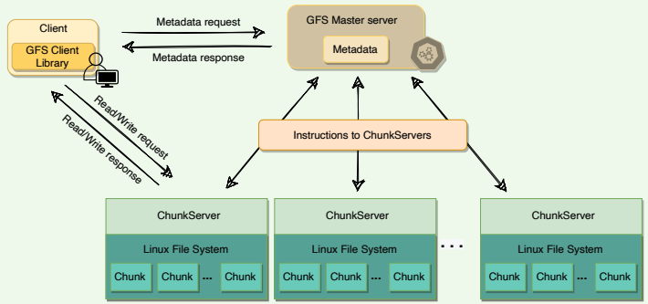
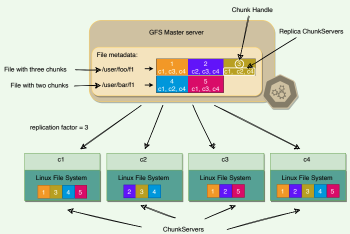
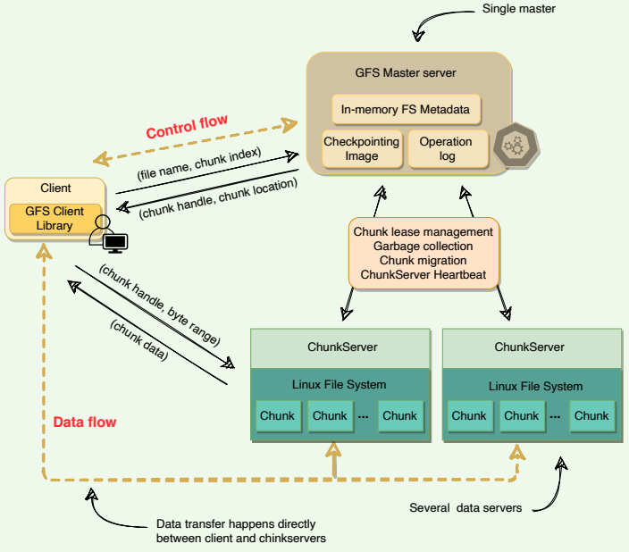
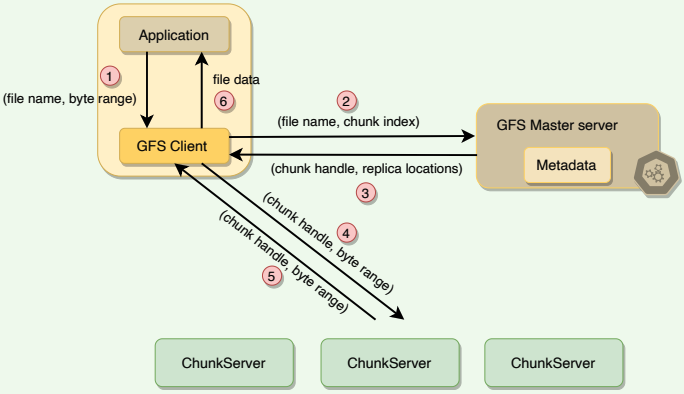
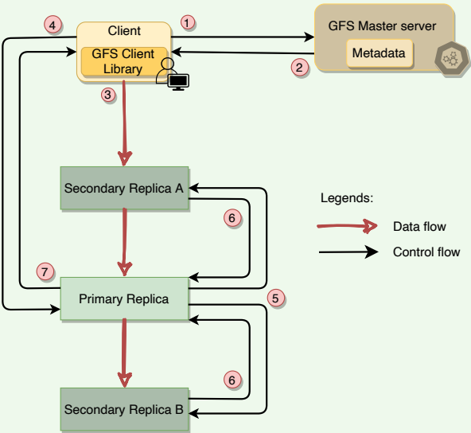

# Design Google File Storage

## Overview

### Goal

Design a distributed file system to store huge files (terabyte and larger). The
system should be scalable, reliable, and highly available.

### What is Google File System (GFS)?

GFS is a scalable distributed file system developed by Google for its large
data-intensive applications.

### Background

GFS was built for handling batch processing on large data sets and is
designed for system-to-system interaction, not user-to-system interaction.

Google built GFS keeping the following goals in mind:

- **Scalable**: GFS should run reliably on a very large system built from
commodity hardware.
- **Fault-tolerant**: The design must be sufficiently tolerant of hardware
and software failures to enable application-level services to continue
their operation in the face of any likely combination of failure
conditions.
- **Large files**: Files stored in GFS will be huge. Multi-GB files are common.
Large sequential and small random reads: The workloads primarily
consist of two kinds of reads: large, streaming reads and small, random
reads.
- **Sequential writes**: The workloads also have many large, sequential
writes that append data to files. Typical operation sizes are similar to
those for reads. Once written, files are seldom modified again.
- **Not optimized for small data:** Small, random reads and writes do
occur and are supported, but the system is not optimized for such cases.
- **Concurrent access**: The level of concurrent access will also be high,
with large numbers of concurrent appends being particularly prevalent,
often accompanied by concurrent reads.
- **High throughput**: GFS should be optimized for high and sustained
throughput in reading the data, and this is prioritized over latency. This
is not to say that latency is unimportant; rather, GFS needs to be
optimized for high-performance reading and appending large volumes
of data for the correct operation of the system.

### GFS use cases

 -GFS is a distributed file system built for large, distributed data-intensive
applications like **Gmail** or **YouTube**.
- Originally, it was built to store data generated by Google’s large
**crawling and indexing system**
- Google’s **BigTable** uses the distributed Google File System to store log
and data files.

### APIs

GFS does not provide standard POSIX-like APIs; instead, user-level APIs are
provided. In GFS, files are organized hierarchically in directories and
identified by their pathnames. GFS supports the usual file system operations:

- *create* – To create a new instance of a file.
- *delete* – To delete an instance of a file.
- *open* – To open a named file and return a handle.
- *close* – To close a given file specified by a handle.
- *read* – To read data from a specified file and offset.
- *write* – To write data to a specified file and offset.

In addition, GFS supports two special operations:

- **Snapshot**: A snapshot is an efficient way of creating a copy of the
current instance of a file or directory tree.
- **Append**: An append operation allows multiple clients to append data to
the same file concurrently while guaranteeing atomicity. It is useful for
implementing multi-way merge results and producer-consumer queues
that many clients can simultaneously append to without additional
locking.

## High-level Architecture

A GFS cluster consists of a single master and multiple ChunkServers and is
accessed by multiple clients.

### Chunks

As files stored in GFS tend to be very large, GFS breaks files into multiple
fixed-size chunks where each chunk is 64 megabytes in size.

### Chunk handle

Each chunk is identified by an immutable and globally unique 64-bit ID
number called chunk handle. This allows for 264 unique chunks. If each
chunk is 64 MB, total storage space would be more than 109 exa-bytes.

As files are split into chunks, therefore, the job of GFS is to provide a
mapping from files to chunks, and then to support standard operations on
files, mapping down to operations on individual chunks.

### Cluster

GFS is organized into a simple network of computers called a cluster. All GFS
clusters contain three kinds of entities:
1. A single master server
2. Multiple ChunkServers
3. Many clients

The master stores all metadata about the system, while the ChunkServers
store the real file data.

   
*GFS high-level architecture*

### ChunkServer

ChunkServers store chunks on local disks as regular Linux files and read or
write chunk data specified by a chunk handle and byte-range.

For reliability, each chunk is replicated to multiple ChunkServers. By default,
GFS stores three replicas, though different replication factors can be
specified on a per-file basis.

   
*Chunk replication*

### Master

Master server is the coordinator of a GFS cluster and is responsible for
keeping track of filesystem metadata:

1. The metadata stored at the master includes:
    - Name and directory of each file
    - Mapping of each file to its chunks
    - Current locations of chunks
    - Access control information
2. The master also controls system-wide activities such as chunk lease
management (locks on chunks with expiration), garbage collection of
orphaned chunks, and chunk migration between ChunkServers. Master
assigns chunk handle to chunks at time of chunk creation.
3. The master periodically communicates with each ChunkServer in
HeartBeat messages to give it instructions and collect its state.
4. For performance and fast random access, all metadata is stored in the
master’s main memory. This includes the entire filesystem namespace
as well as all the name-to-chunk mappings.
5. For fault tolerance and to handle a master crash, all metadata changes
are written to the disk onto an operation log. This operation log is also
replicated onto remote machines. The operation log is similar to a
journal. Every operation to the file system is logged into this file.
6. The master is a single point of failure, hence, it replicates its data onto
several remote machines so that the master can be readily restored on
failure.
7. The benefit of having a single, centralized master is that it has a global
view of the file system, and hence, it can make optimum management
decisions, for example, related to chunk placement.

### Client

Client is an entity that makes a read or write request to GSF. GFS client
library is linked into each application that uses GFS. This library
communicates with the master for all metadata-related operations like
creating or deleting files, looking up files, etc. To read or write data, the
client interacts directly with the ChunkServers that hold the data

Neither the client nor the ChunkServer caches file data. Client caches offer
little benefit because most applications stream through huge files or have
working sets too large to be cached. ChunkServers rely on the buffer cache
in Linux to maintain frequently accessed data in memory.

## Single Master and Large Chunk Size

### Single Master

Having a single master vastly simplifies GFS design and enables the master
to make sophisticated chunk placement and replication decisions using
global knowledge. However, GFS minimizes the master’s involvement in
reads and writes, so that it does not become a bottleneck. Clients never read
or write file data through the master. Instead, a client asks the master which
ChunkServers it should contact. The client caches this information for a
limited time and interacts with the ChunkServers directly for many
subsequent operations.

   
*GFS's high-level architecture*

### Chunk size

Chunk size is one of the key design parameters. GFS has chosen 64 MB,
which is much larger than typical filesystem block sizes (which are often
around 4KB). Here are the advantages of using a large chunk size:

1. Since GFS was designed to handle huge files, small chunk sizes would
not make a lot of sense, as each file would then have a map of a huge
number of chunks.
2. As the master holds the metadata and manages file distribution, it is
involved whenever chunks are read, modified, or deleted. A small
chunk size would significantly increase the amount of data a master
would need to manage, and also, increase the amount of data that
would need to be communicated to a client, resulting in extra network
traffic.
3. A large chunk size reduces the size of the metadata stored on the
master, which enables the master to keep all the metadata in memory,
thus significantly decreasing the latency for control operations.
4. By using a large chunk size, GFS reduces the need for frequent
communication with the master to get chunk location information. It
becomes feasible for a client to cache all information related to chunk
locations of a large file. Client metadata caches have timeouts to reduce
the risk of caching stale data.
5. A large chunk size also makes it possible to keep a TCP connection open
to a ChunkServer for an extended time, amortizing the time of setting
up a TCP connection.
6. A large chunk size simplifies ChunkServer management, i.e., to check
which ChunkServers are near capacity or which are overloaded.
7. Large chunk size provides highly efficient sequential reads and appends
of large amounts of data.

### Lazy space allocation 

Each chunk replica is stored as a plain Linux file on a ChunkServer. GFS does
not allocate the whole 64MB of disk space when creating a chunk. Instead, as
the client appends data, the ChunkServer, lazily extends the chunk. This lazy
space allocation avoids wasting space due to internal fragmentation. Internal
fragmentation refers to having unused portions of the 64 MB chunk. For
example, if we allocate a 64 MB chunk and only fill up 20MB, the remaining
space is unused

One disadvantage of having a large chunk size is the handling of small files.
Since a small file will have one or a few chunks, the ChunkServers storing
those chunks can become hotspots if a lot of clients access the same file. To
handle this scenario, GFS stores such files with a higher replication factor
and also adds a random delay in the start times of the applications accessing
these files.

## Metadata

The master stores three types of metadata:
1. The file and chunk namespaces (i.e., directory hierarchy).
2. The mapping from files to chunks.
3. The locations of each chunk’s replicas.

There are three aspects of how master manages the metadata:
1. Master keeps all this metadata in memory.
2. The first two types (i.e., namespaces and file-to-chunk mapping) are also
persisted on the master’s local disk.
3. The third (i.e., chunk replicas’ locations) is not persisted.

### Storing metadata in memory

Since metadata is stored in memory, the master operates very quickly.
Additionally, it is easy and efficient for the master to periodically scan
through its entire state in the background. This periodic scanning is used to
implement three functions:
1. Chunk garbage collection
2. Re-replication in the case of ChunkServer failures
3. Chunk migration to balance load and disk-space usage across ChunkServers

As discussed above, one potential concern for this memory-only approach is
that the number of chunks, and hence the capacity of the whole system, is
limited by how much memory the master has. This is not a serious problem
in practice. The master maintains less than 64 bytes of metadata for each 64
MB chunk. Most chunks are full because most files contain many chunks,
only the last of which may be partially filled. Similarly, the file namespace
data typically requires less than 64 bytes per file because the master stores
file names compactly using **prefix compression.**

If the need for supporting an even larger file system arises, the cost of adding
extra memory to the master is a small price to pay for the simplicity,
reliability, performance, and flexibility gained by storing the metadata in
memory.

### Chunk location

The master does not keep a persistent record of which ChunkServers have a
replica of a given chunk; instead, the master asks each chunk server about
its chunks at master startup, and whenever a ChunkServer joins the cluster.
The master can keep itself up-to-date after that because it controls all chunk
placements and monitors ChunkServer status with regular HeartBeat
messages.

By having the ChunkServer as the ultimate source of truth of each chunk’s
location, GFS eliminates the problem of keeping the master and
ChunkServers in sync. It is not beneficial to maintain a consistent view of
chunk locations on the master, because errors on a ChunkServer may cause
chunks to vanish spontaneously (e.g., a disk may go bad and be disabled, or
ChunkServer is renamed or failed, etc.) In a cluster with hundreds of servers,
these events happen all too often.

### Operation log

The master maintains an operation log that contains the namespace and fileto-chunk mappings and stores it on the local disk. Specifically, this log stores
a historical record of all the metadata changes. Operation log is very
important to GFS. It contains the persistent record of metadata and serves as
a logical timeline that defines the order of concurrent operations.

For fault tolerance and reliability, this operation log is replicated on multiple
remote machines, and changes to the metadata are not made visible to
clients until they have been persisted on all replicas. The master batches
several log records together before flushing, thereby reducing the impact of
flushing and replicating on overall system throughput.

Upon restart, the master can restore its file-system state by replaying the
operation log. This log must be kept small to minimize the startup time, and
that is achieved by periodically checkpointing it.

### Checkpointing

Master’s state is periodically serialized to disk and then replicated, so that on
recovery, a master may load the checkpoint into memory, replay any
subsequent operations from the operation log, and be available again very
quickly. To further speed up the recovery and improve availability, GFS
stores the checkpoint in a compact B-tree like format that can be directly
mapped into memory and used for namespace lookup without extra parsing.

The checkpoint process can take time, therefore, to avoid delaying incoming
mutations, the master switches to a new log file and creates the new
checkpoint in a separate thread. The new checkpoint includes all mutations
before the switch.

## Master Operations

The master executes all namespace operations. Furthermore, it manages
chunk replicas throughout the system. It is responsible for:
- Making replica placement decisions
- Creating new chunks and hence replicas
- Making sure that chunks are fully replicated according to the replication factor
- Balancing the load across all the ChunkServers 
- Reclaim unused storage

### Namespace management and locking

The master acquires locks over a namespace region to ensure proper
serialization and to allow multiple operations at the master. GFS does not
have an i-node like tree structure for directories and files. Instead, it has a
hash-map that maps a filename to its metadata, and reader-writer locks are
applied on each node of the hash table for synchronization.

- Each absolute file name or absolute directory name has an associated
- read-write lock.
- Each master operation acquires a set of locks before it runs.
- To make operation on `/dir1/dir2/leaf` , it first needs the following locks:
    - Reader lock on `/dir1`
    - Reader lock on `/dir1/dir2`
    - Reader or Writer lock on `/dir21/dir2/leaf`
- Following this scheme, concurrent writes on the same leaf are prevented right away. However, at the same time, concurrent modifications in the same directory are allowed.
- File creation does not require write-lock on the parent directory; a readlock on its name is sufficient to protect the parent directory from deletion, rename, or snapshot.
- Write-lock on a file name stops attempts to create multiple files with the same name.
- Locks are acquired in a consistent order to prevent **deadlock**:
    - First ordered by level in the namespace tree
    - Lexicographically ordered within the same level

### Replica placement

To ensure maximum data availability and integrity, the master distributes
replicas on different racks, so that clients can still read or write in case of a
rack failure. As the in and out bandwidth of a rack may be less than the sum
of the bandwidths of individual machines, placing the data in various racks
can help clients exploit reads from multiple racks. For ‘write’ operations,
multiple racks are actually disadvantageous as data has to travel longer
distances. It is an intentional tradeoff that GFS made.

#### Replica creation and re-replication

The goals of a master are to place replicas on servers with less-than-average
disk utilization, spread replicas across racks, and reduce the number of
‘recent’ creations on each ChunkServer (even though writes are cheap, they
are followed by heavy write traffic) which might create additional load.

Chunks need to be re-replicated as soon as the number of available replicas
falls (due to data corruption on a server or a replica being unavailable)
below the user-specified replication factor. Instead of re-replicating all of
such chunks at once, the master prioritizes re-replication to prevent these
cloning operations from becoming bottlenecks. Restrictions are placed on the
bandwidth of each server for re-replication so that client requests are not
compromised.

**How are chunks prioritized for re-replication?**

- A chunk is prioritized based on how far it is from its replication goal.
For example, a chunk that has lost two replicas will be given priority on
a chuck that has lost only one replica.
- GFS prioritizes chunks of live files as opposed to chunks that belong to
recently deleted files. Deleted files are not removed
immediately; instead, they are renamed temporarily and garbage collected after a few days. Replicas of deleted files can exist for a few
days as well.

#### Replica rebalancing

Master rebalances replicas regularly to achieve load balancing and better
disk space usage. It may move replicas from one ChunkServer to another to
bring disk usage in a server closer to the average. Any new ChunkServer
added to the cluster is filled up gradually by the master rather than flooding
it with a heavy traffic of write operations.

### Stale replica detection 

Chunk replicas may become stale if a ChunkServer fails and misses
mutations to the chunk while it is down. For each chunk, the master
maintains a chunk Version Number to distinguish between up-to-date and
stale replicas. The master increments the chunk version every time it grants
a lease (more on this later) and informs all up-to-date replicas. The master
and these replicas all record the new version number in their persistent
state. If the ChunkServer hosting a chunk replica is down during a mutation,
the chunk replica will become stale and will have an older version number.
The master will detect this when the ChunkServer restarts and reports its set
of chunks and their associated version numbers. Master removes stale
replicas during regular garbage collection.

Stale replicas are not given to clients when they ask the master for a chunk
location, and they are not involved in mutations either. However, because a
client caches a chunk’s location, it may read from a stale replica before the
data is resynced. The impact of this is low due to the fact that most
operations to a chunk are append-only. This means that a stale replica
usually returns a premature end of a chunk rather than outdated data for a
value.

## Anatomy of a Read Operation

A typical read interaction with a GFS cluster by a client application goes like
this:
1. First, the client translates the file name and byte offset specified by the
application into a chunk index within the file. Given the fixed chunk
size, this can be computed easily.
2. The client then sends the master an RPC request containing the file
name and chunk index.
3. The master replies with the chunk handle and the location of replicas
holding the chunk. The client caches this metadata using the file name
and chunk-index as the key. This information is subsequently used to
access the data.
4. The  client then sends a request to one of the replicas (the closest one). The request specifies the chunk handle and a byte range within that chunk.
    - Further reads of the same chunk require no more client-master interaction until the cached information expires or the file is reopened.
    - In fact, the client typically asks for multiple chunks in the same request, and the master can also include the information for chunks immediately following those requested.
5. The replica ChunkServer replies with the requested data.
6. As evident from the above workflow, the master is involved at the start
and is then completely out of the loop, implementing a separation of
control and data flows – a separation that is crucial for maintaining high
performance of file accesses.

   
*The anatomy of a read operation*

## Anatomy of a Write Operation

### What is a chunk lease?

To safeguard against concurrent writes at two different replicas of a chunk,
GFS makes use of chunk lease. When a mutation (i.e., a write, append or
delete operation) is requested for a chunk, the master finds the
ChunkServers which hold that chunk and grants a chunk lease (for 60
seconds) to one of them. The server with the lease is called the primary and
is responsible for providing a serial order for all the currently pending
concurrent mutations to that chunk. There is only one lease per chunk at any
time, so that if two write requests go to the master, both see the same lease
denoting the same primary.

Thus, a global ordering is provided by the ordering of the chunk leases
combined with the order determined by that primary. The primary can
request lease extensions if needed. When the master grants the lease, it
increments the chunk version number and informs all replicas containing
that chunk of the new version number.

### Data writing

The actual writing of data is split into two phases:
- **Sending**: First, the client is given a list of replicas that identifies the
primary ChunkServer and secondaries. The client sends the data to the
closest replica. Then replicas send the data in chain to all other replicas
to maximize bandwidth and throughput. Eventually, all the replicas get
the data, which is not yet written to a file but sits in a cache.
- **Writing**: When the client gets an acknowledgment from all replicas that
the data has been received, it then sends a write request to the primary,
identifying the data that was sent in the previous phase. The primary is
responsible for the serialization of writes. It assigns consecutive serial
numbers to all write requests that it has received, applies the writes to
the file in serial-number order, and forwards the write requests in that
order to the secondaries. Once the primary gets acknowledgments from
all the secondaries, the primary responds back to the client, and the
write operation is complete. Any errors at any stage in this process are
met with retries and eventual failure. On failure, an error is returned to
the client.

Following is the stepwise breakdown of the data transfer:
1. Client asks master which chunk server holds the current lease of chunk
and locations of other replicas.
2. Master replies with the identity of primary and locations of the
secondary replicas.
3. Client pushes data to the closest replica. Then replicas send the data in
chain to all other replicas.
4. Once all replicas have acknowledged receiving the data, the client sends
the write request to the primary. The primary assigns consecutive serial
numbers to all the mutations it receives, providing serialization. It
applies mutations in serial number order.
5. Primary forwards the write request to all secondary replicas. They
apply mutations in the same serial number order.
6. Secondary replicas reply to primary indicating they have completed
operation.
7. Primary replies to the client with success or error message

   
*The anatomy of a write operation*

The key point to note is that the data flow is different from the control flow.
The data flows from the client to a ChunkServer and then from that
ChunkServer to another ChunkServer, until all ChunkServers that store
replicas for that chunk have received the data. The control (the write
request) flow goes from the client to the primary ChunkServer for that
chunk. The primary then forwards the request to all the secondaries. This
ensures that the primary controls the order of writes even if it receives
multiple concurrent write requests. All replicas will have data written in the
same sequence. Chunk version numbers are used to detect if any replica has
stale data which has not been updated because that ChunkServer was down
during some update.

## Anatomy of an Append Operation

Record append operation is optimized in a unique way that distinguishes
GFS from other distributed file systems. In a normal write, the client
specifies the offset at which data is to be written. Concurrent writes to the
same region can experience race conditions, and the region may end up
containing data fragments from multiple clients. In a record append,
however, the client specifies only the data. GFS appends it to the file at least
once atomically (i.e., as one continuous sequence of bytes) at an offset of
GFS’s choosing and returns that offset to the client. This process is similar to
the append operation on a file opened with [O_APPEND](https://man7.org/linux/man-pages/man2/open.2.html) mode on a POSIXcompliant file system but without the race conditions when multiple writers
do so concurrently.

Record Append is a kind of mutation that changes the contents of the
metadata of a chunk. When an application tries to append data on a chunk
by sending a request to the client, the client pushes the data to all replicas of
the last chunk of the file just like the write operation. When the client
forwards the request to the master, the primary checks whether appending
the record to the existing chunk will increase the chunk’s size more than its
limit (maximum size of a chunk is 64MB). If this happens, it pads the chunk
to the maximum limit, commands the secondary to do the same, and
requests the clients to try to append to the next chunk. If the record fits
within the maximum size, the primary appends the data to its replica, tells
the secondary to write the data at the exact offset where it has, and finally
replies success to the client

If an append operation fails at any replica, the client retries the operation.
Due to this reason, replicas of the same chunk may contain different data,
possibly including duplicates of the same record in whole or in part. GFS
does not guarantee that all replicas are byte-wise identical; instead, it only
ensures that the data is written at-least-once as an atomic unit.

## GFS Consistency Model and Snapshotting

### GFS consistency model 

To keep things simple and efficient, GFS has a relaxed consistency model.

Metadata operations (e.g., file creation) are atomic. They are handled
exclusively by the master. Namespace locking guarantees atomicity and
correctness, whereas the master’s operation log defines a global total order
of these operations.

In data mutations, there is an important distinction between `write` and
`append` operations. `Write` operations specify an offset at which mutations
should occur, whereas `appends` are always applied at the end of the file. This
means that for the `write` operation, the offset in the chunk is
predetermined, whereas for `append` , the system decides. Concurrent `writes`
to the same location are not serializable and may result in corrupted regions
of the file. With `append` operations, GFS guarantees the `append` will happen
at-least-once and atomically (that is, as a contiguous sequence of bytes). The
system does not guarantee that all copies of the chunk will be identical (some
may have duplicate data).

### Snapshotting

A snapshot is a copy of some subtree of the global namespace as it exists at a
given point in time. GFS clients use snapshotting to efficiently branch two
versions of the same data. Snapshots in GFS are initially **zero-copy**. This
means that data copies are made only when clients make a request to modify
the chunks. This scheme is known as **copy-on-write**.

When the master receives a snapshot request, it first revokes any
outstanding leases on the chunks in the files to snapshot. It waits for leases
to be revoked or expired and logs the snapshot operation to the operation
log. The snapshot is then made by duplicating the metadata for the source
directory tree. Newly created snapshot files still point to the original chunks.

When a client makes a request to write to one of these chunks, the master
detects that it is a copy-on-write chunk by examining its reference count
(which will be more than one). At this point, the master asks each
ChunkServer holding the replica to make a copy of the chunk and store it
locally. These local copies are made to avoid copying the chunk over the
network. Once the copy is complete, the master issues a lease for the new
copy, and the write proceeds.

## Fault Tolerance, High Availability, and Data Integrity

### Fault tolerance

To make the system fault-tolerant and available, GFS makes use of two
simple strategies:
1. **Fast recovery** in case of component failures.
2. **Replication** for high availability.

Let’s first see how GFS recovers from master or replica failure:
- **On master failure**: The Master being a single point of failure, can make the entire system unavailable in a short time. To handle this, all operations applied on master are saved in an **operation log**. This log is checkpointed and replicated on multiple remote machines, so that on recovery, a master may load the checkpoint into memory, replay any subsequent operations from the operation log, and be available again in a short amount of time. GFS relies on an external monitoring infrastructure to detect the master failure and switch the traffic to the backup master server.
    - **Shadow masters** are replicas of master and provide read-only
access to the file system even when the primary is down. All
shadow masters keep themselves updated by applying the same
sequence of updates exactly as the primary master does by reading
its operation log. Shadow masters may lag the primary slightly, but
they enhance read availability for files that are not being actively
changed or applications that do not mind getting slightly stale
metadata. Since file contents are read from the ChunkServers,
applications do not observe stale file contents.
- **On primary replica failure**: If an active primary replica fails (or there
is a network partition), the master detects this failure (as there will be
no heartbeat), and waits for the current lease to expire (in case the
primary replica is still serving traffic from clients directly), and then
assigns the lease to a new node. When the old primary replica recovers,
the master will detect it as ‘stale’ by checking the version number of the
chunks. The master node will pick new nodes to replace the stale node
and garbage-collect it before it can join the group again.
- **On secondary replica failure**: If there is a replica failure, all client
operations will start failing on it. When this happens, the client retries a
few times; if all of the retries fail, it reports failure to the master. This
can leave the secondary replica inconsistent because it misses some
mutations. As described above, stale nodes will be replaced by new
nodes picked by the master, and eventually garbage-collected.

::: tip
Stale replicas might be exposed to clients. It depends on the
application programmer to deal with these stale reads. GFS does not
guarantee strong consistency on chunk reads.
:::

### High availability through Chunk replication

As discussed earlier, each chunk is replicated on multiple ChunkServers on
different racks. Users can specify different replication levels for different
parts of the file namespace. The default is three. The master clones the
existing replicas to keep each chunk fully replicated as ChunkServers go
offline or when the master detects corrupted replicas through checksum
verification.

A chunk is lost irreversibly only if all its replicas are lost before GFS can
react. Even in this case, the data becomes unavailable, not corrupted, which
means applications receive clear errors rather than corrupt data.

### Data integrity through checksum

Checksumming is used by each ChunkServer to detect the corruption of
stored data. The chunk is broken down into 64 KB blocks. Each has a
corresponding 32-bit checksum. Like other metadata, checksums are kept in
memory and stored persistently with logging, separate from user data.

1. **For reads**, the ChunkServer verifies the checksum of data blocks that
overlap the read range before returning any data to the requester,
whether a client or another ChunkServer. Therefore, ChunkServers will
not propagate corruptions to other machines. If a block does not match
the recorded checksum, the ChunkServer returns an error to the
requestor and reports the mismatch to the master. In response, the
requestor will read from other replicas, and the master will clone the
chunk from another replica. After a valid new replica is in place, the master instructs the ChunkServer that reported the mismatch to delete
its replica.
2. **For writes**, ChunkServer verifies the checksum of first and last data
blocks that overlap the write range before performing the write. Then, it
computes and records the new checksums. For a corrupted block, the
ChunkServer returns an error to the requestor and reports the
mismatch to the master.
3. **For appends**, checksum computation is optimized as there is no
checksum verification on the last block; instead, just incrementally
update the checksum for the last partial block and compute new
checksums for any brand-new blocks filed by the append. This way, if
the last partial block is already corrupted (and GFS fails to detect it
now), the new checksum value will not match the stored data, and the
corruption will be detected as usual when the block is next read.

During idle periods, ChunkServers can scan and verify the contents of
inactive chunks (prevents an inactive but corrupted chunk replica from
fooling the master into thinking that it has enough valid replicas of a chunk).

Checksumming has little effect on read performance for the following
reasons:
- Since most of the reads span at least a few blocks, GFS needs to read and
checksum only a relatively small amount of extra data for verification.
GFS client code further reduces this overhead by trying to align reads at
checksum block boundaries.
- Checksum lookups and comparisons on the ChunkServer are done
without any I/O.
- Checksum calculation can often be overlapped with I/Os.

## Garbage Collection

### Garbage collection through lazy deletion 

When a file is deleted, GFS does not immediately reclaim the physical space
used by that file. Instead, it **follows a lazy garbage collection strategy.**
When the client issues a delete file operation, GFS does two things:

1. The master logs the deletion operation just like other changes.
2. The deleted file is renamed to a hidden name that also includes a
deletion timestamp.

The file can still be read under the new, special name and can also be
undeleted by renaming it back to normal. To reclaim the physical storage,
the master, while performing regular scans of the file system, removes any
such hidden files if they have existed for more than three days (this interval
is configurable) and also deletes its in-memory metadata. This lazy deletion
scheme provides a window of opportunity to a user who deleted a file by
mistake to recover the file.

The master, while performing regular scans of chunk namespace, deletes the
metadata of all chunks that are not part of any file. Also, during the
exchange of regular HeartBeat messages with the master, each ChunkServer
reports a subset of the chunks it has, and the master replies with a list of
chunks from that subset that are no longer present in the master’s database;
such chunks are then deleted from the ChunkServer.

### Advantages of lazy deletion

Here are the advantages of lazy deletion.
- Simple and reliable. If the chunk deletion message is lost, the master
does not have to retry. The ChunkServer can perform the garbage
collection with the subsequent heartbeat messages.
- GFS merges storage reclamation into regular background activities of
the master, such as the regular scans of the filesystem or the exchange
of HeartBeat messages. Thus, it is done in batches, and the cost is
amortized.
- Garbage collection takes place when the master is relatively free.
- Lazy deletion provides safety against accidental, irreversible deletions.

### Disadvantages of lazy deletion

As we know, after deletion, storage space does not become available
immediately. Applications that frequently create and delete files may not be
able to reuse the storage right away. To overcome this, GFS provides
following options:
- If a client deletes a deleted file again, GFS expedites the storage
reclamation.
- Users can specify directories that are to be stored without replication
- Users can also specify directories where deletion takes place
immediately.

## Criticism on GFS

### Problems associated with single master

As GFS has grown in usage, Google has started to see the following problems
with the centralized master scheme:
- Despite the separation of control flow (i.e., metadata operations) and
data flow, the master is emerging as a bottleneck in the design. As the
number of clients grows, a single master could not serve them because
it does not have enough CPU power.
- Despite the reduced amount of metadata (because of the large chunk
size), the amount of metadata stored by the master is increasing to a
level where it is getting difficult to keep all the metadata in the main
memory.

### Problems associated with large chunk size 

Large chunk size (64MB) in GFS has its disadvantages while reading. Since a
small file will have one or a few chunks, the ChunkServers storing those
chunks can become hotspots if a lot of clients are accessing the same file. As
a workaround for this problem, GFS stores extra copies of small files for
distributing the load to multiple ChunkServers. Furthermore, GFS adds a
random delay in the start times of the applications accessing such files

## Summary

- GFS is a scalable distributed file storage system for large data-intensive applications.
- GFS uses commodity hardware to reduce infrastructure costs.
- GFS was designed with the understanding that system/hardware failures can and do occur.
- Reading workload consists of large streaming reads and small random reads. Writing workloads consists of many large, sequential writes that append data to files.
- GFS provides APIs for usual file operations like create, delete, open, close, read, and write. Additionally, GFS supports snapshot and record append operations. Snapshot creates a copy of the file or directory tree. Record append allows multiple clients to append data to the same file concurrently while guaranteeing atomicity.
- A GFS cluster consists of a **single master** and **multiple ChunkServers** and is accessed by multiple clients.
- **Chunk**: Files are broken into fixed-size chunks where each chunk is 64 megabytes in size. Each chunk is identified by an immutable and globally unique **64-bit chunk handle** assigned by the master at the time of chunk creation.
- ChunkServers store chunks on the local disk as Linux files.
- For reliability, each chunk is replicated on multiple ChunkServers.
- Master server is the coordinator of a GFS cluster and is responsible for keeping track of all the filesystem metadata. This includes namespace, authorization, mapping of files to chunks, and the current location of chunks.
- Master keeps all metadata in memory for faster operations. For fault tolerance and to handle a master crash, all metadata changes are written to the disk onto an **operation log.** This operation log is also replicated onto remote machines.
- The master does not keep a persistent record of which ChunkServers have a replica of a given chunk. Instead, the master asks each
ChunkServer about what chunks it holds at master startup or whenever a ChunkServer joins the cluster.
- **Checkpointing**: The master's state is periodically serialized to disk and then replicated so that on recovery, a master may load the checkpoint into memory, replay any subsequent operations from the operation log, and be available again very quickly.
- **HeartBeat**: The master communicates with each ChunkServer through
Heartbeat messages to pass instructions to it and collects its state.
- **Client**: GFS client code which is linked into each application, implements filesystem APIs, and communicates with the cluster. Clients interact with the master for metadata, but all data transfers happen directly between the client and ChunkServers.
- **Data Integrity**: Each ChunkServer uses checksumming to detect the corruption of stored data.
- **Garbage Collection**: After a file is deleted, GFS does not immediately reclaim the available physical storage. It does so only lazily during regular garbage collection at both the file and chunk levels.
- **Consistency**: Master guarantees data consistency by ensuring the order of mutations on all replicas and using chunk version numbers. If a replica has an incorrect version, it is garbage collected.
- GFS guarantees **at-least-once** writes for writers. This means that records could be written more than once as well (although rarely). It is the responsibility of the readers to deal with these duplicate chunks.
This is achieved by having checksums and serial numbers in the chunks, which help readers to filter and discard duplicate data.
- **Cache**: Neither the client nor the ChunkServer caches file data. Client caches offer little benefit because most applications stream through huge files or have working sets too large to be cached. However, clients do cache metadata.

### System design patterns

Here is a summary of system design patterns used in GFS.
- **Write-Ahead Log**: For fault-tolerance and in the event of a master crash, all metadata changes are written to the disk onto an operation log which is a write-ahead log.
- **HeartBeat**: The GFS master periodically communicates with each
ChunkServer in HeartBeat messages to give it instructions and collect its state.
- **Checksum**: Each ChunkServer uses checksumming to detect the corruption of stored data.

