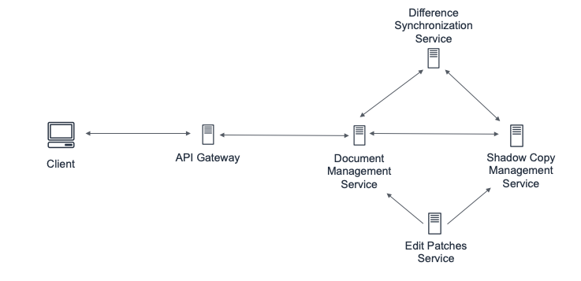
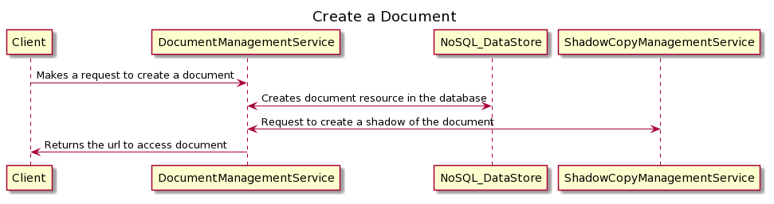
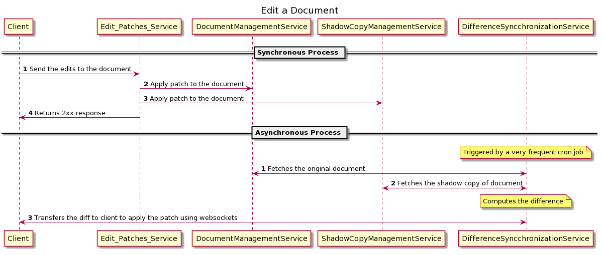
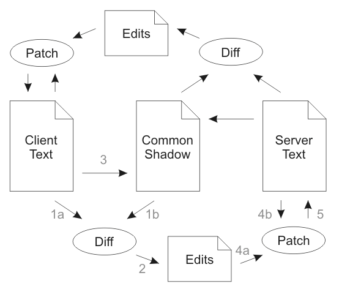

# Design Google Docs

## Introduction

### Gathering Requirements

**In scope** The application should be able to support the following requirements. The user
should be able to do following tasks
- create a document
- share a document
- edit a document

**Out of scope**
- User authentication for accessing the document
- User should be able to chat on the document
- User should be able to provide edit and view permissions to different users
- User should be able to comment on the document

## Detailed Design
### System Architecture

   
*Figure 10.1: System architecture for Google docs*

## System Components

### Creating a document

   

### API Design: Document Management service

```
POST /collaborativeEditing/documents
```

**Request body**: 
- *Format*: Either html or markdown 
- *Content*: The html or markdown content of the new document 
- *title*: The title of the new document
- *type*: Either document, spreadsheet or slides

**Sample Response:** *documentId*: The url and the identifier to access the document

### Editing a document

  


###  Differential Synchronization

 

The above diagram shows the simplest form of Differential Synchronization. The following walk-through starts with Client Text, Common Shadow and Server Text all being
equal. Client Text and Server Text may be edited at any time. The goal is to keep these two
texts as close as possible with each other at all times.
1. Client Text is diffed against the Common Shadow.
2. This returns a list of edits which have been performed on Client Text.
3. Client Text is copied over to Common Shadow. This copy must be identical to the value of Client Text in step 1, so in a multi-threaded environment a snapshot of the text should have been taken.
4. The edits are applied to Server Text on a best-effort basis.
5. Server Text is updated with the result of the patch. Steps 4 and 5 must be atomic, but
they do not have to be blocking; they may be repeated until Server Text stays still
long enough.

The process now repeats symmetrically in the other direction. This time the Common
Shadow is the same as Client Text was in the previous half of the synchronization, so the
resulting diff will return modifications made to Server Text, not the result of the patch in
step 5. The enabling feature is that the patch algorithm is fuzzy, meaning patches may be
applied even if the document has changed. Thus, if the client has typed a few keystrokes in
the time that the synchronization took to complete, the patches from the server are likely to
have enough recognizable context that they may still be applied successfully. However, if
some or all of the patches fail in step 4, they will automatically show up negatively in the
following diff and will be patched out of the Client Text. Here’s an example of actual data
flow.

1. Client Text, Common Shadow and Server Text start out with the same string: "Macs
had the original point and click UI."
2. Client Text is edited (by the user) to say: "Macintoshes had the original point and
click interface." (edits underlined)
3. The Diff in step 1 returns the following two edits:
```git
@@ -1,11 +1,18 @@
Mac
+intoshe
s had th
@@ -35,7 +42,14 @@
ick
-UI
+interface
```
4. Common Shadow is updated to also say: "Macintoshes had the original point and
click interface."
5. Meanwhile Server Text has been edited (by another user) to say: "Smith Wesson
had the original point and click UI." (edits underlined)
6. In step 4 both edits are patched onto Server Text. The first edit fails since the context
has changed too much to insert "intoshe" anywhere meaningful. The second edit
succeeds perfectly since the context matches.
7. results in a Server Text which says: "Smith Wesson had the original point and click
interface."
8. Now the reverse process starts. First the Diff compares Server Text with Common
Shadow and returns the following edit:
```git
@@ -1,15 +1,18 @@
-Macintoshes
+Smith & Wesson
had
```
9. Finally, this patch is applied to Client Text, thus backing out the failed "Macs" ->
"Macintoshes" edit and replacing it with "Smith Wesson". The "UI" -> "interface"
edit is left untouched. Any changes which have been made to Client Text in the
meantime will be patched around and incorporated into the next synchronization
cycle.

### API Design: Edit Patch Service

```
POST /collaborativeEditing/documents/<document_id>/section/<section_id>
```

**Request Body**: 
- *format*: Either HTML or markdown 
- *diff_content*: the difference between client text and shadow 
- *type*: Either document, spreadsheet or slides

**Sample response:** responsecode: 2xx, 5xx, 4xx

### API Design: document management service

```
POST /collaborativeEditing/documents/<document_id>/section/<section_id>
```

**Request Body:** 
- *format*: Either HTML or markdown 
- *diff_content*: the difference between client text and shadow 
- *type*: Either document, spreadsheet or slides 
- *location*: Where we insert the new content. Defaults to : `APPEND`.

```
0: APPEND - Append to the end of the document.
1: PREPEND - Prepend to the beginning of the document.
2: AFTER_SECTION - Insert after the section specified by section_id.
3: BEFORE_SECTION - Insert before the section specified by section_id.
4: REPLACE_SECTION - Delete the section specified by section_id and insert the new content at that location.
5: DELETE_SECTION - Delete the section specified by section_id (no content required).
```

**Sample response:** responsecode: 2xx, 5xx, 4xx

## Data Mode

We will use a key-value data store to store the document information.

```
{
    documentId(HK): String
    authorId: String,
    title: String,
    type: Enum(Document, Slide, Spreadsheet),
    content: Map<String, SectionContent>
}
```
For example, an entry in this map will be `<UUID_1, {content: String, type: Enum (Document, Slide, Spreadsheet)}`