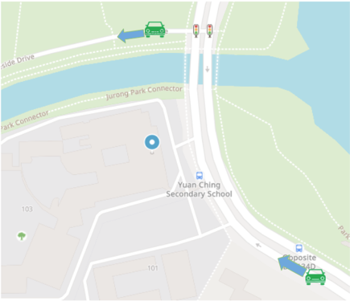
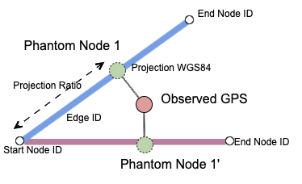
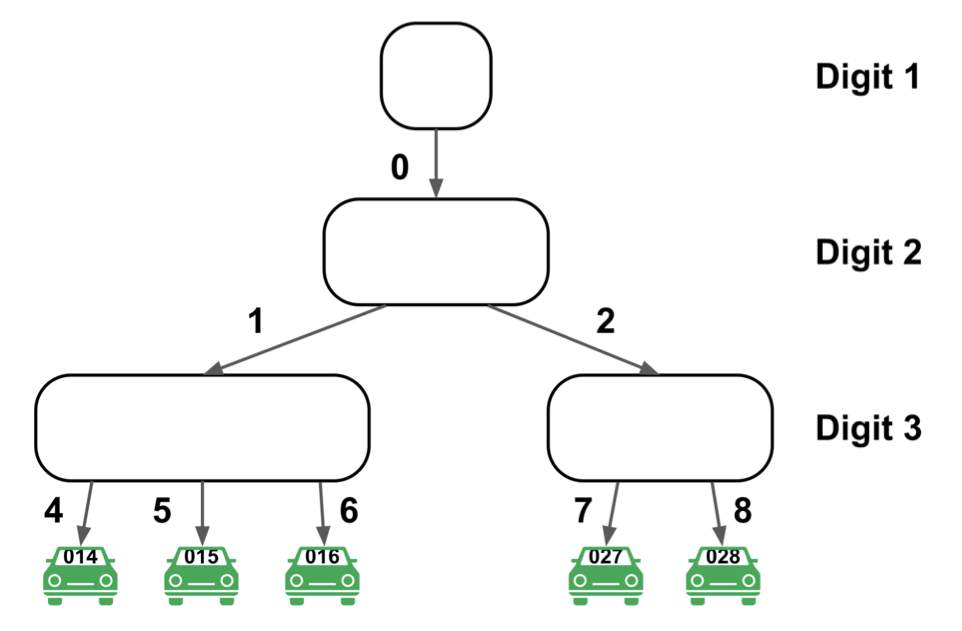
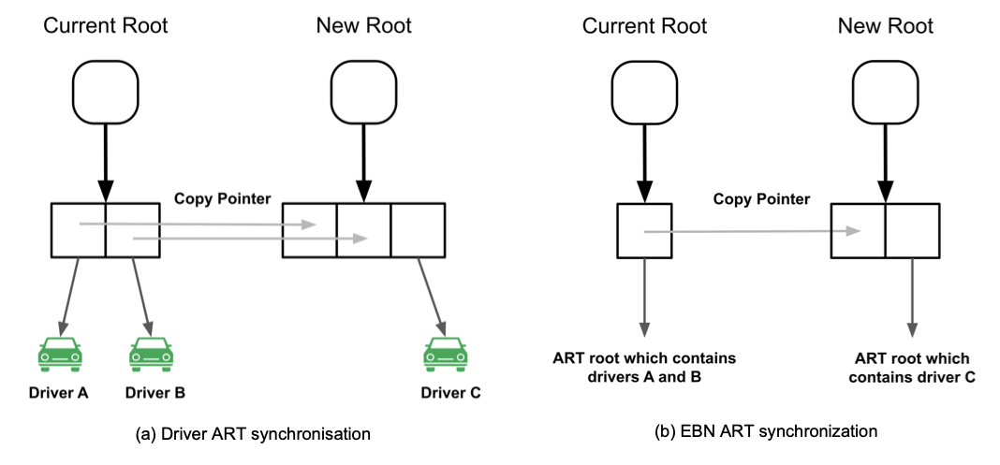
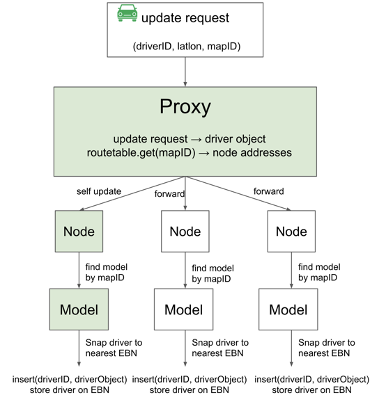
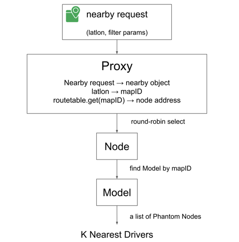
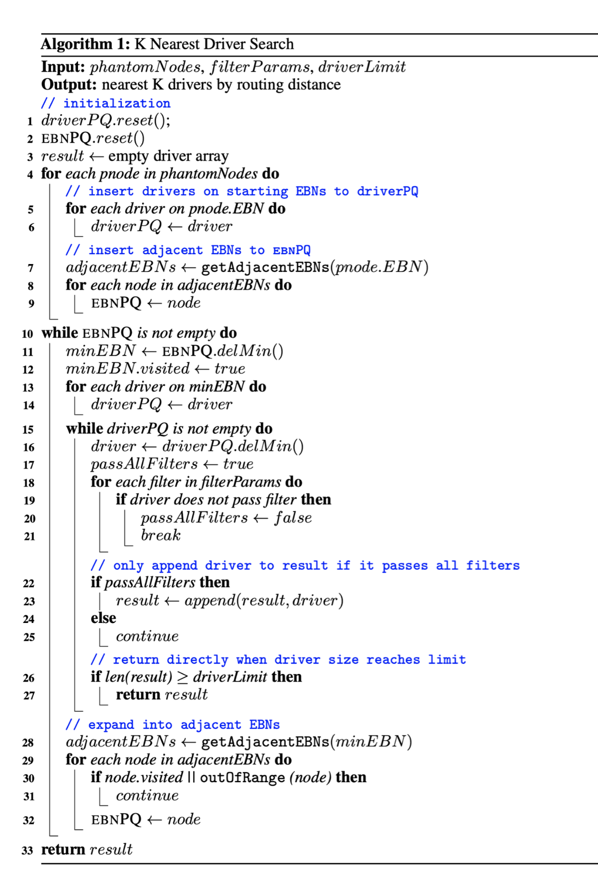

# Pharos - Searching Nearby Drivers on Road Network at Scale

Have you ever wondered what happens when you click on the book button when arranging a ride home? Actually, many things happen behind this simple action and it would take days and nights to talk about all of them. Perhaps, we should rephrase this question to be more precise.  So, let’s try again - have you ever thought about how Grab stores and uses driver locations to allocate a driver to you? If so, you will surely find this blog post interesting as we cover how it all works in the backend.

## What Problems are We Going to Solve?

One of the fundamental problems of the ride-hailing and delivery industry is to locate the nearest moving drivers in real-time. There are two challenges from serving this request in real time.

### Fast-moving Vehicles

Vehicles are constantly moving and sometimes the drivers go at the speed of over 20 meters per second. As shown in Figure 1a and Figure 1b, the two nearest drivers to the pick-up point (blue dot) change as time passes. To provide a high-quality allocation service, it is important to constantly track the objects and update object locations at high frequency (e.g. per second).

*Figure 1: Fast-moving drivers*

### Routing Distance Calculation

To satisfy business requirements, K nearest objects need to be calculated based on the routing distance instead of straight-line distance. Due to the complexity of the road network, the driver with the shortest straight-line distance may not be the optimal driver as it could reach the pick-up point with a longer routing distance due to detour.

   
*Figure 2: Straight line vs routing*

As shown in Figure 2, the driver at the top is deemed as the nearest one to pick-up point by straight line distance. However, the driver at the bottom should be the true nearest driver by routing distance. Moreover, routing distance helps to infer the estimated time of arrival (ETA), which is an important factor for allocation, as shorter ETA reduces passenger waiting time thus reducing order cancellation rate and improving order completion rate.

Searching for the K nearest drivers with respect to a given POI is a well studied topic for all ride-hailing companies, which can be treated as a K Nearest Neighbour (KNN) problem. Our predecessor, Sextant, searches nearby drivers with the [haversine](https://en.wikipedia.org/wiki/Haversine_formula) distance from driver locations to the pick-up point. By partitioning the region into grids and storing them in a distributed manner, Sextant can handle large volumes of requests with low latency. However, nearest drivers found by the haversine distance may incur long driving distance and ETA as illustrated in Figure 2. For more information about Sextant, kindly refer to the paper, Sextant: Grab’s Scalable In-Memory Spatial Data Store for Real-Time K-Nearest Neighbour Search.

To better address the challenges mentioned above, we present the next-generation solution, Pharos.

## What is Pharos?

Pharos means lighthouse in Greek. At Grab, it is a scalable in-memory solution that supports large-volume, real-time K nearest search by driving distance or ETA with high object update frequency.

In Pharos, we use [OpenStreetMap](https://en.wikipedia.org/wiki/OpenStreetMap) (OSM) graphs to represent road networks. To support hyper-localised business requirements, the graph is partitioned by cities and verticals (e.g. the road network for a four-wheel vehicle is definitely different compared to a motorbike or a pedestrian). We denote this partition key as map ID.

Pharos loads the graph partitions at service start and stores drivers’ spatial data in memory in a distributed manner to alleviate the scalability issue when the graph or the number of drivers grows. These data are distributed into multiple instances (i.e. machines) with replicas for high stability. Pharos exploits [Adaptive Radix Trees](https://15721.courses.cs.cmu.edu/spring2016/papers/leis-icde2013.pdf) (ART) to store objects’ locations along with their metadata.

To answer the KNN query by routing distance or ETA, Pharos uses [Incremental Network Expansion](http://www.vldb.org/pvldb/vol9/p492-abeywickrama.pdf) (INE) starting from the road segment of the query point. During the expansion, drivers stored along the road segments are incrementally retrieved as candidates and put into the results. As the expansion actually generates an isochrone map, it can be terminated by reaching a predefined radius of distance or ETA, or even simply a maximum number of candidates.

Now that you have an  overview of Pharos, we would like to go into the design details of it, starting with its architecture.

### Pharos Architecture

As a microservice, Pharos receives requests from the upstream, performs corresponding actions and then returns the result back. As shown in Figure 4, the Pharos architecture can be broken down into three layers: *Proxy*, *Node*, and *Model*.

- **Proxy layer**. This layer helps to pass down the request to the right node, especially when the Node is on another machine.
- **Node layer**. This layer stores the index of map IDs to models and distributes the request to the right model for execution.
- **Model layer**. This layer is, where the business logic is implemented, executes the operations and returns the result.

As a distributed in-memory driver storage, Pharos is designed to handle load balancing, fault tolerance, and fast recovery.

Taking Figure 4 as an example, Pharos consists of three instances. Each individual instance is able to handle any request from the upstream. Whenever there is a request coming from the upstream, it is distributed into one of the three instances, which achieves the purpose of load balancing.

*Figure 4: Pharos architecture*

In Pharos, each model has two replicas and they are stored on different instances and different availability zones. If one instance is down, the other two instances are still up for service. The fault tolerance module in Pharos automatically detects the reduction of replicas and creates new instances to load graphs and build the models of missing replicas. This proves the reliability of Pharos even under extreme situations.

With the architecture of Pharos in mind, let’s take a look at how it stores driver information.

### Driver Storage

Pharos acts as a driver storage, and rather than being an external storage, it adopts in-memory storage which is faster and more adequate to handle frequent driver position updates and retrieve driver locations for nearby driver queries. Without loss of generality, drivers are assumed to be located on the vertices, i.e. [Edge Based Nodes](https://github.com/Project-OSRM/osrm-backend/wiki/Graph-representation) (EBN) of an edge-based graph.

Model is in charge of the driver storage in Pharos. Driver objects are passed down from upper layers to the model layer for storage. Each driver object contains several fields such as driver ID and metadata, containing the driver’s business related information e.g. driver status and particular allocation preferences.

There is also a *Latitude and Longitude (LatLon)* pair contained in the object, which indicates the driver’s current location. Very often, this LatLon pair sent from the driver is off the road (not on any existing road). The computation of routing distance between the query point and drivers is based on the road network. Thus, we need to infer which road segment (EBN) the driver is most probably on.

To convert a LatLon pair to an exact location on a road is called **Snapping**. Model begins with finding EBNs which are close to the driver’s location. After that, as illustrated in Figure 5, the driver’s location is projected to those EBNs, by drawing perpendicular lines from the location to the EBNs. The projected point is denoted as a **phantom node**. As the name suggests, these nodes do not exist in the graph. They are merely memory representations of the snapped driver.

Each phantom node contains information about its projected location such as the ID of EBN it is projected to, projected LatLon and projection ratio, etc. Snapping returns a list of phantom nodes ordered by the haversine distance from the driver’s LatLon to the phantom node in ascending order. The nearest phantom node is bound with the original driver object to provide information about the driver’s snapped location.

   
*Figure 5: Snapping and phantom nodes*

To efficiently index drivers from the graph, Pharos uses ART for driver storage. Two ARTs are maintained by each model: Driver ART and EBN ART.

**Driver ART** is used to store the index of driver IDs to corresponding driver objects, while **EBN ART** is used to store the index of EBN IDs to the root of an ART, which stores the drivers on that EBN.

Bi-directional indexing between EBNs and drivers are built because an efficient retrieval from driver to EBN is needed as driver locations are constantly updated. In practice, as index keys, driver IDs, and EBN IDs are both numerical. ART has a better throughput for dense keys (e.g. numerical keys) in contrast to sparse keys such as alphabetical keys, and when compared to other in-memory look-up tables (e.g. hash table). It also incurs less memory than other tree-based methods.

Figure 6 gives an example of driver ART assuming that the driver ID only has three digits.

   
*Figure 6: Driver ART*

After snapping, this new driver object is wrapped into an update task for execution. During execution, the model firstly checks if this driver already exists using its driver ID. If it does not exist, the model directly adds it to driver ART and EBN ART. If the driver already exists, the new driver object replaces the old driver object on driver ART. For EBN ART, the old driver object on the previous EBN needs to be deleted first before adding the new driver object to the current EBN.

Every insertion or deletion modifies both ARTs, which might cause changes to roots. The model only stores the roots of ARTs, and in order to prevent race conditions, a lock is used to prevent other read or write operations to access the ARTs while changing the ART roots.

Whenever a driver nearby request comes in, it needs to get a snapshot of driver storage, i.e. the roots of two ARTs. A simple example (Figure 7a and 7b) is used to explain how synchronisation is achieved during concurrent driver update and nearby requests.

   
*Figure 7: How ARTs change roots for synchronization*

Currently, there are two drivers A and B stored and these two drivers reside on the same EBN. When there is a nearby request, the current roots of the two ARTs are returned. When processing this nearby request, there could be driver updates coming and modifying the ARTs, e.g. a new root is resulted due to update of driver C. This driver update has no impact on ongoing driver nearby requests as they are using different roots. Subsequent nearby requests will use the new ART roots to find the nearby drivers. Once the current roots are not used by any nearby request, these roots and their child nodes are ready to be garbage collected.

Pharos does not delete drivers actively. A deletion of expired drivers is carried out every midnight by populating two new ARTs with the same driver update requests for a duration of driver’s *Time To Live* (TTL), and then doing a switch of the roots at the end. Drivers with expired TTLs are not referenced and they are ready to be garbage collected. In this way, expired drivers are removed from the driver storage.

### Driver Update and Nearby

Pharos mainly has two external endpoints: Driver Update and Driver Nearby. The following describes how the business logic is implemented in these two operations.

#### Driver Update

   
*Figure 8: Driver update flow*

Figure 8 demonstrates the life cycle of a driver update request from upstream. Driver update requests from upstream are distributed to each proxy by a load balancer. The chosen proxy firstly constructs a driver object from the request body.

RouteTable, a structure in proxy, stores the index between map IDs and replica addresses. Proxy then uses map ID in the request as the key to check its RouteTable and gets the IP addresses of all the instances containing the model of that map ID.

Then, proxy forwards the update to other replicas that reside in other instances. Those instances, upon receiving the message, know that the update is forwarded from another proxy. Hence they directly pass down the driver object to the node.

After receiving the driver object, Node sends it to the right model by checking the index between map ID and model. The remaining part of the update flow is the same as described in Driver Storage. Sometimes the driver updates to replicas are not successful, e.g. request lost or model does not exist, Pharos will not react to such kinds of scenarios.

It can be observed that data storage in Pharos does not guarantee strong consistency. In practice, Pharos favors high throughput over strong consistency of KNN query results as the update frequency is high and slight inconsistency does not affect allocation performance significantly.

#### Driver Nearby

   
*Figure 9: Driver nearby flow*

Similar to driver update, after a driver nearby request comes from the upstream, it is distributed to one of the machines by the load balancer. In a nearby request, a set of filter parameters is used to match with driver metadata in order to support KNN queries with various business requirements. Note that driver metadata also carries an update timestamp. During the nearby search, drivers with an expired timestamp are filtered.

As illustrated in Figure 9, upon receiving the nearby request, a nearby object is built and passed to the proxy layer. The proxy first checks RouteTable by map ID to see if this request can be served on the current instance. If so, the nearby object is passed to the Node layer. Otherwise, this nearby request needs to be forwarded to the instances that contain this map ID.

In this situation, a round-robin fashion is applied to select the right instance for load balancing. After receiving the request, the proxy of the chosen instance directly passes the nearby object to the node. Once the node layer receives the nearby object, it looks for the right model using the map ID as key. Eventually, the nearby object goes to the model layer where K-nearest-driver computation takes place. Model snaps the location of the request to some phantom nodes as described previously - these nodes are used as start nodes for expansion later.

#### K Nearest Driver Search

Starting from the phantom nodes found in the Driver Nearby flow, the K nearest driver search begins. Two priority queues are used during the search: `EBNPQ` is used to keep track of the nearby EBNs, while `driverPQ` keeps track of drivers found during expansion by their driving distance to the query point.

At first, a snapshot of the current driver storage is taken (using roots of current ARTs) and it shows the driver locations on the road network at the time when the nearby request comes in. From each start node, the parent EBN is found and drivers on these EBNs are appended to `driverPQ`. After that, KNN search expands to adjacent EBNs and appends these EBNs to `EBNPQ`. After iterating all start nodes, there will be some initial drivers in `driverPQ` and adjacent EBNs waiting to be expanded in `EBNPQ`.

Each time the nearest EBN is removed from `EBNPQ`, drivers located on this EBN are appended to `driverPQ`. After that, the closest driver is removed from `driverPQ`. If the driver satisfies all filtering requirements, it is appended to the array of qualified drivers. This step repeats until `driverPQ` becomes empty. During this process, if the size of qualified drivers reaches the maximum driver limit, the KNN search stops right away and qualified drivers are returned.

After `driverPQ` becomes empty, adjacent EBNs of the current one are to be expanded and those within the predefined range, e.g. three kilometres, are appended to `EBNPQ`. Then the nearest EBN is removed from `EBNPQ` and drivers on that EBN are appended to `driverPQ` again. The whole process continues until `EBNPQ` becomes empty. The driver array is returned as the result of the nearby query.

Figure 10 shows the pseudo code of this KNN algorithm.

   
*Figure 10: KNN search algorithm*

## What’s Next?

Currently, Pharos is running on the production environment, where it handles requests with **P99 latency time of 10ms for driver update** and **50ms for driver nearby**, respectively. Even though the performance of Pharos is quite satisfying, we still see some potential areas of improvements:

- Pharos uses ART for driver storage. Even though ART proves its ability to handle large volumes of driver update and driver nearby requests, the write operations (driver update) are not carried out in parallel. Hence, we plan to explore other data structures that can achieve high concurrency of read and write, eg. concurrent hash table.
- Pharos uses OSM [Multi-level Dijkstra](https://i11www.iti.kit.edu/_media/teaching/theses/ba-hamme-13.pdf) (MLD) graphs to find K nearest drivers. As the predefined range of nearby driver search is often a few kilometres, Pharos does not make use of MLD partitions or support long distance query. Thus, we are interested in exploiting MLD graph partitions to enable Pharos to support long distance query.
- In Pharos, maps are partitioned by cities and we assume that drivers of a city operate within that city. When finding the nearby drivers, Pharos only allocates drivers of that city to the passenger. Hence, in the future, we want to enable Pharos to support cross city allocation.
We hope this blog helps you to have a closer look at how we store driver locations and how we use these locations to find nearby drivers around you.

