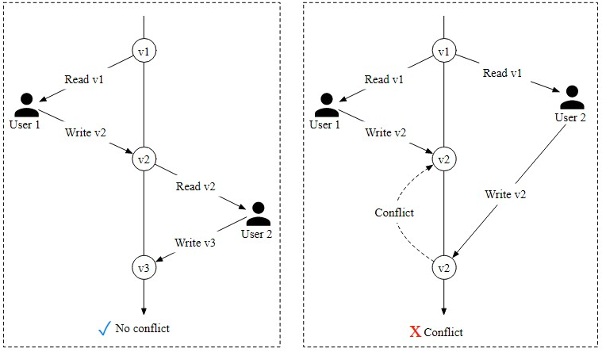

# Hotel Reservation Sytem

In this chapter, we design a hotel reservation system for a hotel chain such as Marriott International. The design and techniques used in this chapter are also applicable to other popular booking-related interview topics:

- Design Airbnb
- Design a flight reservation system
- Design a movie ticket booking system

## Step 1 - Understand the Problem and Establish Design Scope

The hotel reservation system is complicated and its components vary based on business use cases. Before diving into the design, you should ask the **Interviewer** clarification questions to narrow down the scope.

**Candidate**: What is the scale of the system?
**Interviewer**: Let's assume we are building a website for a hotel chain that has 5,000 hotels and 1 million rooms in total.

**Candidate**: Do customers pay when they make reservations or when they arrive at the hotel?
**Interviewer**: For simplicity, they pay in full when they make reservations.

**Candidate**: Do customers book hotel rooms through the hotel's website only? Do we need to support other
reservation options such as phone calls?
**Interviewer**: Let's assume people could book a hotel room through the hotel website or app.

**Candidate**: Can customers cancel their reservations?
**Interviewer**: Yes.

**Candidate**: Are there any other things we need to consider?
**Interviewer**: Yes, we allow 10% overbooking. In case you do not know, overbooking means the hotel will sell more
rooms than they actually have. Hotels do this in anticipation that some customers will cancel their reservations.

**Candidate**: Since we have limited time, I assume the hotel room search is not within the scope. We focus on the following features.
- Show the hotel-related page.
- Show the hotel room-related detail page.
- Reserve a room.
- Admin panel to add/remove/update hotel or room info.
- Support the overbooking feature.

**Interviewer**: Sounds good.
**Interviewer**: One more thing, hotel prices change dynamically. The price of a hotel room depends on how full the
hotel is expected to be on a given day. For this interview, we can assume the price could be different each day.
**Candidate**: I'll keep this in mind.

Next, you might want to talk about the most important non-functional requirements.

### Non-functional requirements
- Support high concurrency. During peak season or big events, some popular hotels may have a lot of customers trying to book the same room.
- Moderate latency. It's ideal to have a fast response time when a user makes the reservation, but it's acceptable if the system takes a few seconds to process a reservation request.

### Back-of-the-envelope estimation
- 5000 hotels and 1 million rooms in total.
- Assume 70% of the rooms are occupied and the average stay duration is 3 days.
- Estimated daily reservations: (1 million * 0.7) / 3 = 233,333 (rounding up to ~240,000)
- Reservations per second = 240,000 / 10°5 seconds in a day = ~3. As we can see, the average reservation transaction per second (TPS) is not high.

Next, let's do a rough calculation of the QPS of all pages in the system. There are three steps in a typical customer
flow:
1. View hotel/room detail page. Users browse this page (query),
2. View the booking page. Users can confirm the booking details, such as dates, number of guests, payment information before booking (query)
3. Reserve a room. Users click on the "book” button to book the room and the room is reserved (transaction)

Let's assume around 10% of users reach the next step and 90% of users drop off the flow before reaching the final step. We can also assume that no prefetching feature (prefetching the content before the user reaches the next step) is implemented. Figure 1 shows a rough estimation of what the QPS looks like for different steps. We know the final reservation TPS is 3 5o we can work backwards along the funnel. The QPS of the order confirmation page is 30 and the QPS for the detail page is 300.

   
*Figure 1 QPS distribution*

## Step 2 - Propose High-Level Design and Get Buy-In

In this section, we'll discuss:
- API design
- Data models
- High-level design

### API design

We explore the API design for the hotel reservation system. The most important APIs are listed below using the RESTful conventions.

Note that this chapter focuses on the design of a hotel reservation system. For a complete hotel website, the design
needs to provide intuitive features for customers to search for rooms based on a large array of criteria. The APs for
these search features, while important, are not technically challenging. They are out of scope for this chapter.

#### Hotel-related APIs

API  | Detail 
------| -------
`GET /v1/hotels/ID` | Get detailed information about a hotel
`POST /v1/hotels` | Add a new hotel. This API is only available to hotel staff
`PUT /v1/hotels/ID` | Update hotel information. This API is only available to hotel staff 
`DELETE /v1/hotels/ID`  | Delete a hotel. This API is only available to hotel staff
*Table 1 Hotel-related APIs*


#### Room-related APIs
API  | Detail
------| -------
`GET /v1/hotels/ID/rooms/ID` | Get detailed information about a room.
`POST /v1/hotels/ID/rooms` | Add a room. This API is only available to hotel staff.
`PUT /vi/hotels/ID/rooms/ID`  | Update room information. This API is only available to hotel staff.
`DELETE /v1/hotels/ID/rooms/ID`  | Delete a room. This APl is only available to hotel staff.
*Table 2 Room-related APIs*

#### Reservation related APIs
API |  Detail
------| -------
`GET /v1/reservations`  | Get the reservation history of the logged-in user.
`GET /v1/reservations/ID `| Get detailed information about a reservation.
`POST /v1/reservations` | Make a new reservation.
`DELETE /v1/reservations/ID` |  Cancel a reservation.
*Table 3 Reservation-related APIs*

Making a new reservation is a very important feature. The request parameters of making a new reservation (`POST /v1/reservations`) could look like this.

```json
{
    "startDate":"2021-04-28",
    "endDate":"2021-04-36",
    "hotelID":"245",
    "roomID":"U12354673389",
    "reservationID":"13422445"
}
```

Please note *reservationiD* is used as the idempotency key to prevent double booking. Double booking means
multiple reservations are made for the same room on the same day. The details are explained in “Concurrency
issue” in the ‘Deep Dive’ section.

### Data model

Before we decide which database to use, let's take a close look at the data access patterns. For the hotel reservation system, we need to support the following queries:

Query 1: View detailed information about a hotel.   
Query 2: Find available types of rooms given a date range.   
Query 3: Record a reservation.   
Query 4: Look up a reservation or past history of reservations.   

From the back-of-the-envelope estimation, we know the scale of the system is not large but we need to prepare for
traffic surges during big events. With these requirements in mind, we choose a relational database because:

* A relational database works well with read-heavy and write less frequently workflows. This is because the
number of users who visit the hotel website/apps is a few orders of magnitude higher than those who actually
make reservations. NoSQL databases are generally optimized for writes and the relational database works well
enough for read-heavy workflow.

* A relational database provides ACID (atomicity, consistency, isolation, durability) guarantees. ACID properties
are important for a reservation system. Without those properties, it's not easy to prevent problems such as
negative balance, double charge, double reservations, etc. ACID properties make application code a lot simpler
and make the whole system easier to reason about. A relational database usually provides these guarantees.

* A relational database can easily model the data. The structure of the business data is very clear and the
relationship between different entities (hotel, room, room_type, etc) is stable. This kind of data model is easily
modeled by a relational database.

   
*Figure 2 Database schema*

Most attributes are self-explanatory and we will only explain the status field in the reservation table. The status field
can be in one of these states: pending, paid, refunded, canceled, rejected. The state machine is shown in Figure 3.

   
*Figure 3 Reservation status*

This schema design has a major issue. This data model works for companies like Airbnb as *room_id* (might be called *listing_id*) is given when users make reservations. However, this isn't the case for hotels. A user actually reserves a type of room in a given hotel instead of a specific room. For instance, a room type can be a standard room, king-size room, queen-size room with two queen beds, etc. Room numbers are given when the guest checks in and not at the time of the reservation. We need to update our data model to reflect this new requirement. See “Improved
data model” in the ‘Deep Dive’ section for more details.

### High-level design
We use the microservice architecture for this hotel reservation system. Over the past few years, microservice architecture has gained great popularity. Companies that use microservice include Amazon, Netflix, Uber, Airbnb, Twitter, etc. If you want to leam more about the benefits of a microservice architecture, you can check out some good resources [1] [2].

Our design is modeled with the microservice architecture and the high-level design diagram is shown in Figure 4.

    
*Figure 4 High-level design*

We will briefly go over each component of the system from top to bottom.
- **User**: a user books hotel room on their mobile phone or computer.
- **Admin (hotel staff)**: authorized hotel staff perform administrative operations such as refunding a customer, canceling a reservation, updating room information, etc.
- **CDN (content delivery network)**: for better load time, CDN is used to cache all static assets, including JavaScript bundles, images, videos, HTML, etc.
- **Public APl Gateway**: this is a fully managed service that supports rate limiting, authentication, etc. The API gateway s configured to direct requests to specific services based on the endpoints. For example, requests to Ioad the hotel homepage are directed to the hotel service and requests to book a hotel room are routed to the reservation service.
- **Intemal APIs**: those APIs are only available to authorized hotel staff. They are accessible through intemal software or websites. They are usually further protected by a VPN (virtual private network).
- **Hotel Service**: this provides detailed information on hotels and rooms. Hotel and room data are generally static, 50 can be easily cached.
- **Rate Service**: this provides room rates for different future dates. An interesting fact about the hotel industry is that the price of a room depends on how full the hotel is expected to be on a given day.
- **Reservation Service**: receives reservation requests and reserves the hotel rooms. This service also tracks room inventory as rooms are reserved or reservations are canceled.
- **Payment Service**: executes payment from a customer and updates the reservation status to “paid” once a payment transaction succeeds, or “rejected” if the transaction fails.
- **Hotel Management Service**: only available to authorized hotel staff. Hotel staff are eligible to use the following features: view the record of an upcoming reservation, reserve a room for a customer, cancel a reservation, etc.

For clarity, Figure 4 omits many arrows of interactions between microservices. For example, as shown in Figure 5, 
there should be an arrow between Reservation service and Rate service. Reservation service queries Rate service for
room rates. This is used to compute the total room charge for a reservation. Another example is that there should
be many arrows connecting the Hotel Management Service with most of the other services. When an admin makes
changes via Hotel Management Service, the requests are forwarded to the actual service owning the data, to handle
the changes.

    
*Figure 5 Connections between services*

For production systems, inter-service communication often employs a modern and high-performance remote procedure call (RPC) framework like gPRC. There are many benefits to using such frameworks. To learn more about gPRC in particular, check out [3].

## Step 3 - Design Deep Dive

Now we've talked about the high-level design, let's go deeper into the following.
- Improved data model
- Concurrency issues
- Scaling the system
- Resolving data inconsistency in the microservice architecture

### Improved data model

As mentioned in the high-level design, when we reserve a hotel room, we actually reserve a type of room, as opposed to a specific room. What do we need to change about the API and schema to accommodate this?

For the reservation API, roomID is replaced by roomTypelD in the request parameter. The APl to make a reservation
looks like this:

```
POST /v1/reservations
```

**Request parameters:**
```json
{
    "startDate":"2021-64-28",
    "endDate":"2621-04-30",
    "hotelID":"245",
    "roomTypelD": "12354673380" ,
    "roomCount": "3",
    "reservationID":"13422445"
}
```

The updated schema is shown in Figure 6.

   
*Figure 6 Updated schema*

We'll briefly go over some of the most important tables.

**room**: contains information about a room.   
**room_type_rate**: stores price data for a specific room type, for future dates.   
**reservation**: records guest reservation data.   
**room_type_inventory**: stores inventory data about hotel rooms. This table is very important for the reservation system, so let's take a close look at each column.   

- hotel_id: ID of the hotel
- room_type_id: ID of a room type.
- date: asingle date.
- total_inventory: the total number of rooms minus those that are temporarily taken off the inventory. Some rooms might be taken off the market for maintenance.
- total_reserved: the total number of rooms booked for the *specified_hotel_id*, *room_type_id*, and *date*.

There are other ways to design the *room_type_inventory* table, but having one row per date makes managing reservations within a date range and queries easy. As shown in Figure 6, (*hotel_id*, *room_type_id*, *date*) is the composite primary key. The rows of the table are pre-populated by querying the inventory data across all future dates within 2 years. We have a scheduled daily job that pre-populates inventory data when the dates advance further.

Now that we've finalized the schema design, let's do some estimation about the storage volume. As mentioned in the back-of-the-envelope estimation, we have 5,000 hotels. Assume each hotel has 20 types of rooms. That's (5000 hotels * 20 types of rooms* 2 years * 365 days) = 73 million rows. 73 million is not a lot of data and a single database is enough to store the data. However, a single server means a single point of failure. To achieve high availability, we could set up database replications across multiple regions or availability zones,

Table 4 shows the sample data of the *“room_type_inventory”* table.

hotel_id | room_type_id | date | total_inventory | total_reserved
---------|--------------| ----| ----------------| ---------------
211      | 1001         | 2021-06-01   | 100     | 80
211      | 1001         | 2021-06-02   | 100     | 82
211      | 1001         | 2021-06-03   | 100     | 86
211      | 1001         | ...          |  ...    |  
211      | 1001         | 2023-05-31   | 100     | 0
211      | 1002         | 2021-06-01   | 200     | 16
2210     | 101          | 2021-06-01   | 30      | 23
2210     | 101          | 2021-06-02   | 30      | 25
*Table 4 Sample data of the “room _type_inventory” table*

The *room_type_inventory* table is utilized to check if a customer can reserve a specific type of room or not. The input
and output for a reservation might look like this:
- Input: startDate (2021-07-01), endDate (2021-07-03), roomTypeld, hotelld, numberOfRoomsToReserve
- Output: True if the specified type of room has inventory and users can book it. Otherwise, it returns false.

From the SQL perspective, it contains the following two steps:

1. Select rows within a date range
```sql
SELECT date, total_inventory, total_reserved
FROM room_type_inventory
WHERE room_type_id = ${roomTypeId} AND hotel_id = ${hotelld}
AND date between ${startDate} and ${endDate}
```
This query returns data like this:

date | total_inventory | total_reserved
----|--------------| ----
2021-07-01 | 100   |  14
2021-07-02 | 100   |  96
2021-07-03 | 100   |  95
*Table 5 Hotel inventory*

2. For each entry, the application checks the condition below:
```js
if (total reserved + ${numberOfRoomsToReserve}) <= total inventory
```

If the condition retumns true for il entries, it means there are enough rooms for each date within the date range.

One of the requirements is to support 10% overbooking. With the new schema, it is easy to implement:
```js
if (total reserved + ${numberOfRoomsToReserve}) <= 110% * total_inventory
```

At this point, the interviewer might ask a follow-up question: “if the reservation data is too large for a single
database, what would you do?" There are a few strategies:

- Store only current and future reservation data. Reservation history is not frequently accessed. So they can be archived and some can even be moved to cold storage.
- Database sharding. The most frequent queries include making a reservation or looking up a reservation by name. In both queries, we need to choose the hotel first, meaning hoteLid is a good sharding key. The data can be sharded by `hash(hotel_id) % number_of_servers`

Concu rrency issues

Another important problem to look at is double booking. We need to solve two problems: 
1. the same user clicks on the “book” button multiple times. 
2. multiple users try to book the same room at the same time,

Let's take a look at the first scenario. As shown in Figure 7, two reservations are made.


*Figure 7 Two reservations are made*

There are two common approaches to solve this problem:
- Client-side implementation. A client can gray out, hide or disable the "submit” button once a request is sent. This should prevent the double-clicking issue most of the time. However, this approach is not very reliable. For example, users can disable JavaScript, thereby bypassing the client check
- Idempotent APIs. Add an idempotency key in the reservation API request. An APl call is idempotent if it produces the same result no matter how many times it is called. Figure 8 shows how to use the idempotency key (*reservation_id*) to avoid the double-reservation issue. The detailed steps are explained below.


*Figure 8 Unique constraint*

1. Generate a reservation order. After a customer enters detailed information about the reservation (room type, check-in date, check-out date, etc) and clicks the “continue” button, a reservation order is generated by the reservation service.
2. The system generates a reservation order for the customer to review. The unique reservation_id is generated by a globally unique ID generator and returned as part of the API response. The UI of this step might look like this:


*Figure 9 Confirmation page*

3a. Submit reservation 1. The *reservation_id* i included as part of the request. It is the primary key of the reservation  table (Figure 6). Please note that the idempotency key doesn't have to be the *reservation_id*. We choose *reservation_id* because it already exists and works wel for our design.

3b. If a user clicks the "Complete my booking” button a second time, reservation 2 is submitted. Because *reservation_id* is the primary key of the reservation table, we can rely on the unique constraint of the key to ensure no double reservation happens.

Figure 10 explains why double reservation can be avoided.


*Figure 10 Unique constraint violation*

Scenario 2: what happens if multiple users book the same type of room at the same time when there is only one room left? Let's consider the scenario as shown in Figure 11


*Figure 11 Race condition*

1. Let's assume the database isolation level is not serializable [S]. User T and User 2 try to book the same type of room at the same time, but there is only 1 room left. Let's call User 1's execution ‘transaction 1’ and User 2's execution ‘transaction 2." At this time, there are 100 rooms in the hotel and 99 of them are reserved.
2. Transaction 2 checks if there are enough rooms left by checking `if (total reserved + rooms_to_book) <= totaLinventory`. Since there is 1 room left, it retuns true.
3. Transaction 1 checks if there are enough rooms by checking `if (totalreserved + rooms_to_book) <= totaL_inventory`. Since there is 1 room left, it also retuns true.
4. Transaction 1 reserves the room and updates the inventory: *reserved_room* becomes 100.
5. Then transaction 2 reserves the room. The **isolation** property in ACID means database transactions must complete their tasks independently from other transactions. So data changes made by transaction 1 are not visible to transaction 2 until transaction 1 is completed (committed). So transaction 2 still sees *total_reserved* as 99 and reserves the room by updating the inventory: *reserved_room* becomes 100. This results in the system allowing both users to book a room, even though there is only 1 room left.
6. Transaction 1 successfully commits the change.
7. Transaction 2 successfully commits the change.

The solution to this problem generally requires some form of locking mechanism. We explore the following techniques:
- Pessimistic locking
- Optimistic locking
- Database constraints

Before jumping into a fix, let's take a look at the SQL pseudo-code utilized to reserve a room. The SQL has two parts:
- Check room inventory
- Reserve a room


```js
/* step 1: check room inventory */

SELECT date, total_inventory, total_reserved
FROM roon_type_inventory
WHERE room_type_id = ${roomTypeId} AND hotel id = ${hotelId}
AND date between ${startDate} and ${endDate}

/*  For every entry returned from step 1 */
if((total_reserved + ${number0OfRoomsToReserve}) > 110% * total_inventory) {
    Rollback
}

/* step 2: reserve rooms */

UPDATE room_type_inventory
SET total_reserved = total_reserved + ${number0fRoomsToReserve}
WHERE room_type_id = ${roomTypeId}
AND date between ${startDate} and ${endDate}

Comnit
```

#### Option 1: Pessimistic locking

Pessimistic locking, also called pessimistic concurrency control, prevents simultaneous updates by placing a lock
on a record as soon as one user starts to update it. Other users who attempt to update the record have to wait until
the first user has released the lock (committed the changes).

For MySQL, the "SELECT ... FOR UPDATE" statement works by locking the rows returned by a selection query. Let's
assume a transaction is started by “transaction 1°. Other transactions have to wait for transaction 1 to finish before
beginning another transaction. A detailed explanation is shown in Figure 12.

   
*Figure 12 Pessimistic locking*

In Figure 12, the "SELECT ... FOR UPDATE" statement of transaction 2 waits for transaction 1 to finish because transaction 1 locks the rows. After transaction 1 finishes, total_reserved becomes 100, which means there is no room for user 2 to book.

**Pros:**   
- Prevents applications from updating data that is being — or has been — changed.
- It is easy to implement and it avoids conflict by serializing updates. Pessimistic locking is useful when data contention is heavy.

**Cons:**
- Deadlocks may occur when multiple resources are locked. Writing deadlock-free application code could be challenging.
- This approach is not scalable. If a transaction is locked for too long, other transactions cannot access the resource. This has a significant impact on database performance, especially when transactions are long-lived or involve a lot of entities.

Due to these limitations, we do not recommend pessimistic locking for the reservation system.

#### Option 2: Optimistic locking

Optimistic locking, also referred to as optimistic concurrency control, allows multiple concurrent users to attempt to update the same resource.

There are two common ways to implement optimistic locking: version number and timestamp. Version number is generally considered to be a better option because the server clock can be inaccurate over time. We explain how optimistic locking works with version number.

Figure 13 shows a successful case and a failure case.

   
*Figure 13 Optimistic locking*

1. A new column called "version” is added to the database table.
2. Before a user modifies a database row, the application reads the version number of the row.
3. When the user updates the row, the application increases the version number by 1 and writes it back to the database.
4. A database validation check is put in place; the next version number should exceed the current version number by 1. The transaction aborts if the validation fails and the user tries again from step 2.

Optimistic locking is usually faster than pessimistic locking because we do not lock the database. However, the
performance of optimistic locking drops dramatically when concurrency is high

To understand why, consider the case when many clients try to reserve a hotel room at the same time. Because
there is no limit on how many clients can read the available room count, all of them read back the same available
room count and the current version number. When different clients make reservations and write back the results to
the database, only one of them will succeed, and the rest of the clients receive a version check failure message.
These clients have to retry. In the subsequent round of retries, there is only one successful client again, and the rest
have to retry. Although the end result is correct, repeated retries cause a very unpleasant user experience.

**Pros:**
- It prevents applications from editing stale data.
- We don't need to lock the database resource. There’s actually no locking from the database point of view. It's entirely up to the application to handle the logic with the version number.
- Optimistic locking is generally used when the data contention is low. When conflicts are rare, transactions can complete without the expense of managing locks.

**Cons:**
- Performance is poor when data contention is heavy.

Optimistic locking is a good option for a hotel reservation system since the QPS for reservations is usually not high.

#### Option 3: Database constraints

This approach is very similar to optimistic locking. Let's explore how it works. In the *room_type_inventory* table, add the following constraint:

```js
CONSTRAINT `check_room_count` CHECK((`total_inventory - total_reserved` >= 0))
```

Using the same example as shown in Figure 14, when user 2 tries to reserve a room, total reserved becomes 101,
which violates the `total_inventory (100) - total_reserved (101) >= 0` constraint. The transaction is then rolled back.

   
*Figure 14 Database constraint*

**Pros**   
- Easy to implement.
- It works well when data contention is minimal.

**Cons**
- Similar to optimistic locking, when data contention is heavy, it can result in a high volume of failures. Users could see there are rooms available, but when they try to book one, they get the "o rooms available” response. This experience can be frustrating to users
- The database constraints cannot be version-controlled easily like the application code.
- Not all databases support constraints. It might cause problems when we migrate from one database solution to another.

Since this approach is easy to implement and the data contention for a hotel reservation is usually not high (low QPS), it s another good option for the hotel reservation system.

### Scalability

Usually, the load of the hotel reservation system is not high. However, the interviewer might have a follow-up
question: “what if the hotel reservation system is used not just for a hotel chain, but for a popular travel site such as
booking.com or expedia.com?” In this case, the QPS could be 1,000 times higher.

When the system load s high, we need to understand what might become the bottleneck. All our services are
stateless, so they can be easily expanded by adding more servers. However, the database contains all the states and
cannot be scaled up by simply adding more databases. Let's explore how to scale the database.

#### Database sharding

One way to scale the database is to apply database sharding. The idea s to split the data into multiple databases so
that each of them only contains a portion of data.

When we shard a database, we need to consider how to distribute the data. As we can see from the data model section, most queries need to filter by *hotel_id*. So a natural conclusion is we shard data by hotelid. In Figure 15, the load is spread among 16 shards. Assume the QPS is 30,000. After database sharding, each shard handles `30,000/ 16 = 1875 QPS`, which is within a single MySQL server's load capacity.

   
*Figure 15 Database sharding*

#### Caching

The hotel inventory data has an interesting characteristic; only current and future hotel inventory data are
meaningful because customers can only book rooms in the near future.

So for the storage choice, ideally we want to have a time-to-live (TTL) mechanism to expire old data automatically.
Historical data can be queried on a different database. Redis is a good choice because TTL and Least Recently Used
(LRU) cache eviction policy help us make optimal use of memory.

If the loading speed and database scalability become issues (for instance, we are designing at booking.com or
expedia.com’s scale), we can add a cache layer on top of the database and move the check room inventory and
reserve room logic to the cache layer, as shown in Figure 16. In this design, only a small percentage of the requests
hit the inventory database as most ineligible requests are blocked by the inventory cache. One thing worth
mentioning s that even when there is enough inventory shown in Redis, we still need to recheck the inventory at
the database side as a precaution. The database is the source of truth for the inventory data.

   
*Figure 16 Caching*

Let's first go over each component in this system.

**Reservation service**: supports the following inventory management APIs:
- Query the number of available rooms for a given hotel ID, room type, and date range,
- Reserve a room by executing *totalreserved + 1*.
- Update inventory when a user cancels a reservation.

**Inventory cache**: all inventory management query operations are moved to the inventory cache (Redis) and we need to pre-populate inventory data to the cache. The cache is a key-value store with the following structure:
```
key: hotelID_roomTypeID_{date}
value: the number of available rooms for the given hotel ID, room type ID and date.
```

For a hotel reservation system, the volume of read operations (check room inventory) is an order of magnitude
higher than write operations. Most of the read operations are answered by the cache.

**Inventory DB**: stores inventory data as the source of truth.

**New challenges posed by the cache**

Adding a cache layer significantly increases the system scalability and throughput, but it also introduces a new challenge: how to maintain data consistency between the database and the cache.

When a user books a room, two operations are executed in the happy path:
1. Query room inventory to find out if there are enough rooms left. The query runs on the Inventory cache.
2. Update inventory data. The inventory DB is updated first. The change is then propagated to the cache asynchronously. This asynchronous cache update could be invoked by the application code, which updates the inventory cache after data is saved to the database. It could also be propagated using change data capture (CDC). CDC is a mechanism that reads data changes from the database and applies the changes to another data system. One common solution is Debezium [9]. It uses a source connector to read changes from a database and applies them to cache solutions such as Redis [10].

Because the inventory data is updated on the database first, there is a possibility that the cache does not reflect the latest inventory data. For example, the cache may report there is still an empty room when the database says there is no room left, or vice versa.

If you think carefully, you find that the inconsistency between inventory cache and database actually does not
matter, as long as the database does the final inventory validation check.

Let's take a look at an example. Let's say the cache states there is still an empty room, but the database says there is not. In this case, when the user queries the room inventory, they find there is still room available, so they try to reserve it. When the request reaches the inventory database, the database does the validation and finds that there is no room left. In this case, the client receives an error, indicating someone else just booked the last room before them. When a user refreshes the website, they probably see there is no room left because the database has
synchronized inventory data to the cache, before they click the refresh button.

**Pros**   
- Reduced database load. Since read queries are answered by the cache layer, database load is significantly reduced
- High performance. Read queries are very fast because results are fetched from memory. 

**Cons**   
- Maintaining data consistency between the database and cache is hard. We need to think carefully about how this inconsistency affects user experience.

### Data consistency among services

In a traditional monolithic architecture [11], a shared relational database is used to ensure data consistency. In our microservice design, we chose a hybrid approach by having Reservation Service handle both reservation and inventory AP, so that the inventory and reservation database tables are stored in the same relational database. As explained in the “Concurrency lssues” section, this arrangement allows us to leverage the ACID properties of the relational database to elegantly handle many concurrency issues that arise during the reservation flow.

However, if your interviewer is a microservice purist, they might challenge this hybrid approach. In their mind, for a
microservice architecture, each microservice has its own databases, as shown on the right in Figure 17.

   
*Figure 17 Monolithic vs microservice*

This pure design introduces many data consistency issues. Since this is the first time we cover microservices, let's
explain how and why it happens. To make it easier to understand, only two services are used in this discussion. In
the real world, there could be hundreds of microservices within a company. In a monolithic architecture, as shown
in Figure 18, different operations can be wrapped within a single transaction to ensure ACID properties.

   
*Figure 18 Monolithic architecture*

However, in a microservice architecture, each service has its own database. One logically atomic operation can span multiple services. This means we cannot use a single transaction to ensure data consistency. As shown in Figure 19, if the update operation fails in the reservation database, we need to roll back the reserved room count in the inventory database. Generally, there is only one happy path, but many failure cases that could cause data inconsistency.

   
*Figure 19 Microservice architecture*

To address the data inconsistency, here is a high-level summary of industry-proven techniques. If you want to read the details, please refer to the reference materials.

- Two-phase commit (2PC) [12]. 2PC is a database protocol used to guarantee atomic transaction commit across multiple nodes, i.e, either all nodes succeeded or all nodes failed. Because 2PC is a blocking protocol, a single node failure blocks the progress until the node has recovered. It's not performant.
- Saga. A saga is a sequence of local transactions. Each transaction updates and publishes a message to trigger the next transaction step. If a step fails, the saga executes compensating transactions to undo the changes that were made by preceding transactions [13]. 2PC works as a single commit to perform ACID transactions while Saga consists of multiple steps and relies on eventual consistency.

It is worth noting that addressing data inconsistency between microservices requires some complicated mechanisms that greatly increase the complexity of the overall design. It is up to you as an architect to decide if the added complexity is worth it. For this problem, we decided that it was not worth it and so went with the more pragmatic approach of storing reservation and inventory data under the same relational database.

## Step 4 - Wrap Up

In this chapter, we presented a design for a hotel reservation system. We started by gathering requirements and calculating a back-of-the-envelope estimation to understand the scale. In the high-level design, we presented the API design, the first draft of the data model, and the system architecture diagram. In the deep dive, we explored alternative database schema designs as we realized reservations should be made at the room type-level, as opposed to specific rooms. We discussed race conditions in depth and proposed a few potential solutions:
- pessimistic locking
- optimistic locking
- database constraints

We then discussed different approaches to scale the system, including database sharding and using Redis cache.

Lastly, we tackled data consistency issues in microservice architecture and briefly went through a few solutions.