# Design Instagram (2nd)

## Introduction

I believe Instagram is the app on which most people share their daily stories and record their living memory because it is a free photo & video-sharing and social networking service.

### Functional Requirements

- Users upload the photos or videos
- Users can view the photos and videos
- Users can search based on photo titles
- Users can follow/unfollow other users
- Users can search users IDs via the search bar
- Create a Newsfeed for each user he or she follows
- Can archive your photos album
- Can share your stories through chat
- Can block/restrict other users
- Can like and comment other users post
- Users can create a post

### Non-Functional Requirements

- Highly scalable
- Highly consistency
- High availability
- High reliability
- User data should be durable (Any uploaded photos should never be lost)
- The maximum latency for generating the News Feed is 150 ms.

### Back of the envelope estimation

Now, we do some mathematics for **Data Size calculation**

- Assume the registered users = 500 million
- 30% of active user = 150 million
- the number of registered celebrities = 10 K
- The number of reading requests = 100* the number of uploads (writing) requests
- At the peak time, set the average traffic = X, we want to handle 6X

#### Active Users:

- Post 3 times a week, each post has 1 MB image + text
- Each post receives at least 10 likes and 2–3 comments
- Follow 100 users, followed by 50 users
- Load a news feed refresh 2 times a day

#### Celebrities

- Post 2 times a week, each post has a >500K image + text
- Each post receives >50 K likes + >1K comments
- Followed by 5 million users
- Load the newsfeed 2 times a day

#### Query per second (QPS)

**1. Post**
- Create_post_avg = `(150 Million + 10 K)*2 / (7*24*60*60)) = 496/s`
- Create_post_peak = `496 / s*6 = 3k/s`

**2. Like**
- like_post_avg = `(150 million *10+10K*50K)*(2/(7*24*60*60)) = 6.6 k/s`
- like_post_peak = 6.6 k/s*6 = 40 k/s

**3. Comment**
- comment_post_avg = `(150 million82 +10K*1K) = 1k/s`
- Comment_post_peak = 1k/s *6 = 6k/s

**4. Follow Feed**
- get_follow_feed_avg = `(150 million +10K)*(2/(24*60*60))= 3.5k/s`
- get_follow_feed_peak = `3.5k/s * 6 =21.8 k/s`

**5. Data Size**
- user_id in `64base([‘a-z’,‘A-Z’,‘0–9’,‘-’,‘_’])`, we need 5 bits ~ 1Byte
- 500 Million + 10K *5 bits ~1 Byte = 1G user

#### Capacity Estimation

- The daily active users to upload= 1 million
- Daily uploaded photos = 5 million
- Uploaded photos per seconds in a day = 57 photos
- The average photos size = 150 KB
- The storage usage in a day = `5 million * 150KB = 716GB`
- The service keep those data for 10 years, the storage needed, `716 GB *365 * 10 years = 2553 TB ≈ 2.6 PB`
- The daily active users to view = 10 million
- The hourly news feed produce is 10 million, which is 2800 RPS (requests per second)
- If we have 1 search a day then, that’s 10 million searches a day, which is 115 RPS.

## System Component Design

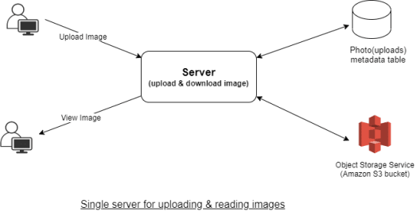

- Upload photo and videos = write
- View photos and videos = read
- Read/write ratio = 20:80
- The web server can support 1000 active connections simultaneously
- 200 connections will be occupied for writing, and writing (uploading) is going to keep the connection open for a long time


So, the better method is to have 2 DB for writing and reading respectively. Also, separating photos’ read and write requests will allow us to scale and optimize each process independently. The following diagram can work for the read-write process.


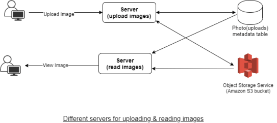

### News Feed Generation services

- Update the users for the latest post from the users he or she is following
- So, every user's newsfeed is unique. The combination is very complex
- To generate a new feed, the system must fetch the metadata (likes, comments, time, location and etc) of those photos and pass it to the ranking algorithm to determine which photos should be arranged in the newsfeed based on metadata.
- From the backend, it will require querying lots of tables simultaneously and then ranking them using predefined parameters, hence this approach will result in higher latency. It will take a lot of time to generate a newsfeed.
- So, the pre-generating news feed is adopted. We create a server dedicated to generating the newsfeed unique to each user and storing it in a separate newsfeed table. With this approach, when the user clicks the update, the newsfeed from the DB will be displayed to the user.

### Serving the News Feed

- **Push** — when a new photo/video is uploaded by a user then, will update all of his/her followers. Long-pooling is used. If a user follows a lot of people or celebrities, the server has to keep push updates to the user quite frequently.
- **Pull** — Users will refresh their newsfeed (make a pull request to the server). The new post will not be visible until users don’t refresh.
- **Hybrid Approach** — Apply the pull-based approach for all the users with lots of followers or celebrities. Apply push-based approach for the normal users.

### Load Balancing

- diving the traffic among the group of servers thus resulting in improved response and availability of a website or application
- Use **Least Bandwidth Method**
- The algorithm will choose the server which serves the least amount of traffic, measured in megabits per second (Mbps)
- Place between the client and the server or the server and the database

## Data Architecture

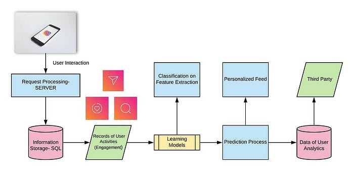

### Database Design

**Data related to user**
- **User ID (primary key)**: unique user Id to make users globally distinguishable
- **Name**: the name of the user
- **Email**: the email id of the user
- **Password**: Password of the user to facilitate the login feature
- **Create Date**: The date on which the user was registered

**Data related to photos (AWS S3)**
- **photo id** (primary Key): a unique 10B photo id to identify each photo
- **UserId**: The id of a user who uploaded the photo
- **Path**: the path/URL of object storage where the photos are stored
- **Latitude & Longitude**: we will store this information to find the location of the photo.
- **Date & time**: the date & timestamp at which the photo was uploaded

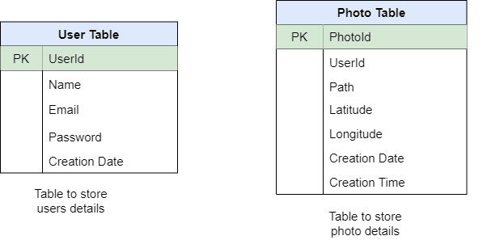

**Data related to users following & followers**
- **Following**: UserId of all the users followed by the user
- **Followers**: UserId of all the people following the user

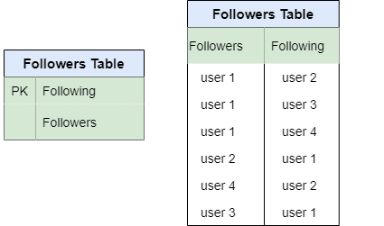

So, we need 2 different choices of databases:
1. relational databases (MySQL)
2. NoSQL Databases (Cassandra)

### Data Model

#### User Table

user_id | follow_list | follower_list | last_login | nickname, region, ... 
--------| ------------| -------------| -----------| ------------
PK     | a list of user_ids | a list of user_ids |  timestamp, to see if user is active enough for us to cache feed | other data


#### Post Table

photo_id | user_id | timestamp | text | num_likes | num_comments 
--------| ---------| ------| --------| ---------| ---------
PK      |    2nd key | 2nd key | optional | avoid `select count(*)` |avoid `select count(*)`

- Partition key: **photo_id**
- Secondary key: **user_id** & **timestamp** 


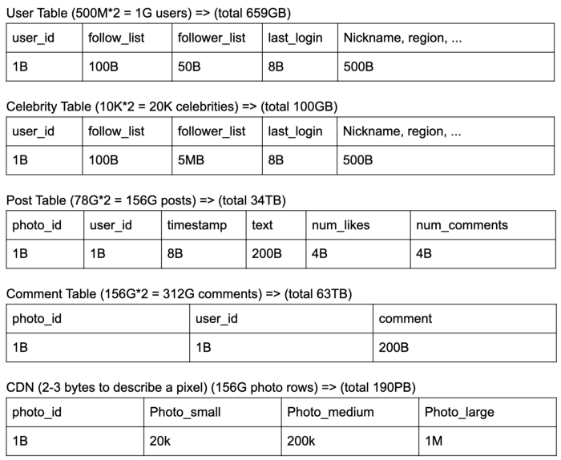

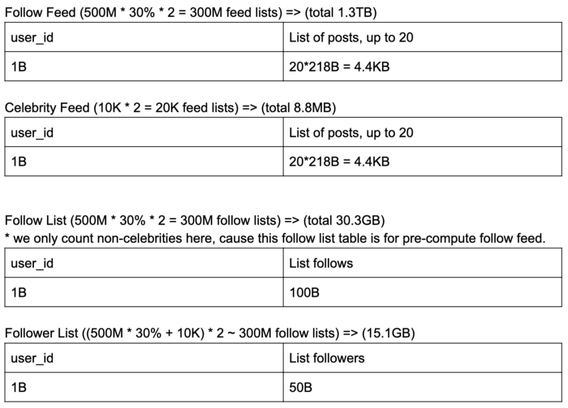

- typical queries : to get all users that user X follow — send feed for user X
- get all users that follows user X — push user X’s post to follower’s feed
- get all user that are active (cache follower feed for active users)

## Interface/API

```
create_post(user_id, image, text, timestamp) -> success/failure

comment_post(user_id, post_id, comment, timestamp) -> success/failure

like_post(user_id, post_id, timestamp) -> success/failure

get_follow_feed(user_id, timestamp) -> list of newest posts from user follow list, ordered by time, limit 20

get_profile_feed(user_id, user2_id, timestamp) -> list of newest posts from user2, ordered by time, limit 20
```

## System Architecture

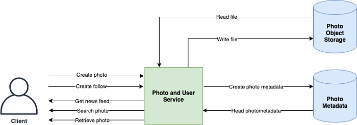

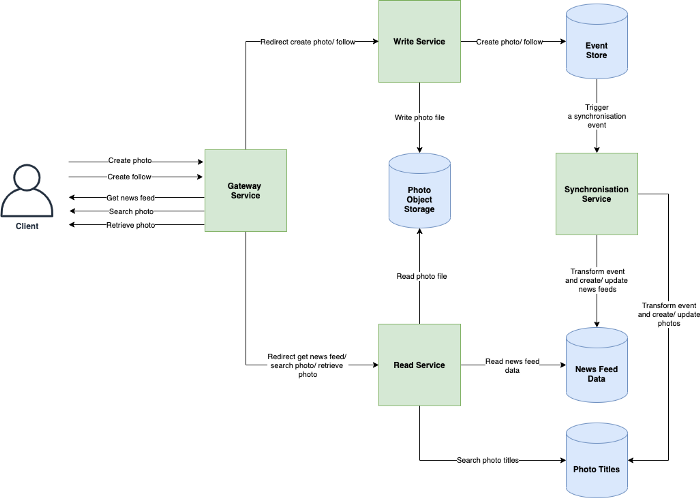

### Overview

#### Post

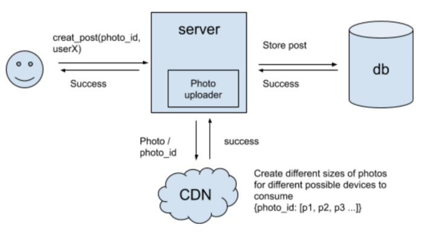

#### Feed

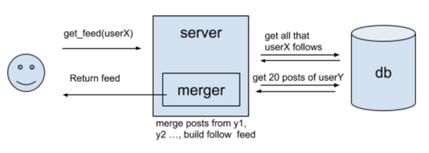

### Detail

#### Post

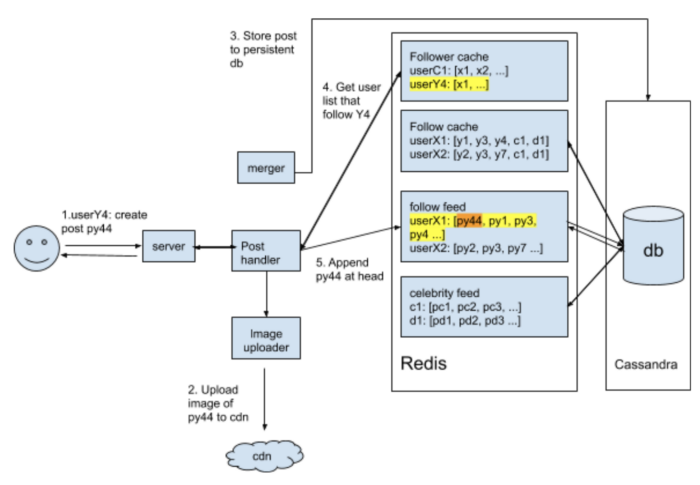

#### Feed

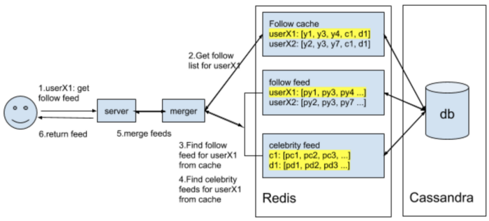

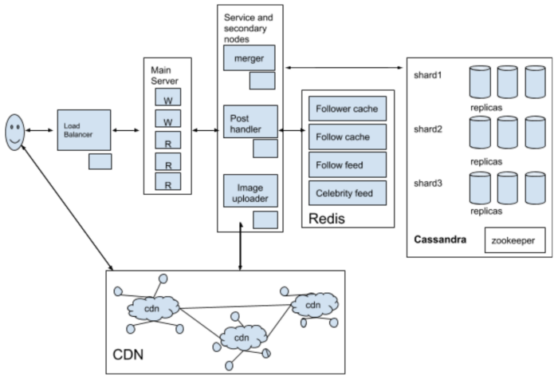

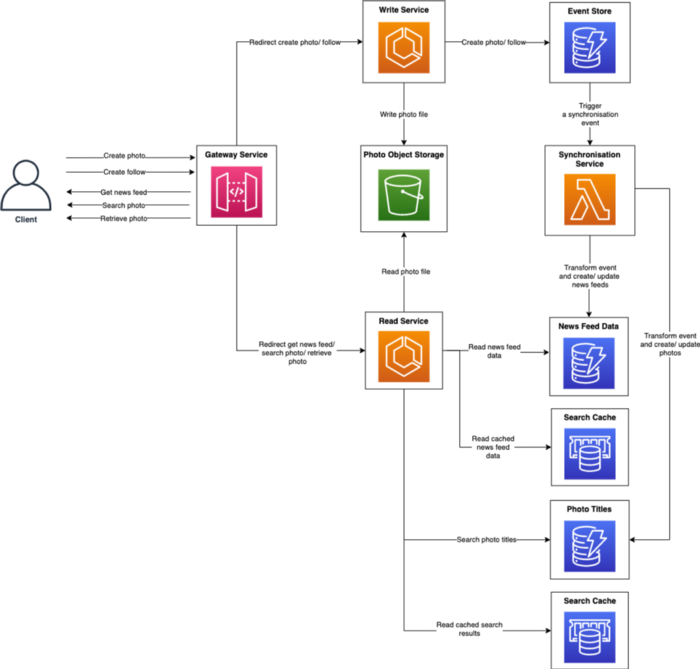