# Design Kafka

## Overview

### Goal

Design a distributed messaging system that can reliably transfer a high
throughput of messages between different entities.

### Background

One of the common challenges among distributed systems is handling a
continuous influx of data from multiple sources. Imagine a log aggregation
service that is receiving hundreds of log entries per second from different
sources. The function of this log aggregation service is to store these logs on
disk at a shared server and also build an index so that the logs can be
searched later. A few challenges of this service are:

1. How will the log aggregation service handle a spike of messages? If the
service can handle (or buffer) 500 messages per second, what will
happen if it starts receiving a higher number of messages per second? If
we decide to have multiple instances of the log aggregation service, how
do we divide the work among these instances?
2. How can we receive messages from different types of sources? The
sources producing (or consuming) these logs need to decide upon a
common protocol and data format to send log messages to the log
aggregation service. This leads us to a strongly coupled architecture
between the producer and consumer of the log messages.
3. What will happen to the log messages if the log aggregation service is
down or unresponsive for some time?

To efficiently manage such scenarios, distributed systems depend upon a
messaging system.

### What is a messaging system?

A **messaging system** is responsible for transferring data among services,
applications, processes, or servers. Such a system helps **decouple** different
parts of a distributed system by providing an **asynchronous** way of
transferring messaging between the sender and the receiver. Hence, all
senders (or producers) and receivers (or consumers) focus on the
data/message without worrying about the mechanism used to share the data.

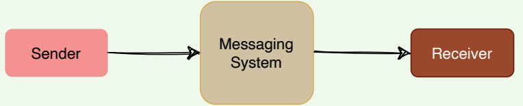   
*Messaging system*

There are two common ways to handle messages: *Queuing* and **Publish-Subscribe**.

### Queue

In the queuing model, messages are stored sequentially in a queue.
Producers push messages to the rear of the queue, and consumers extract
the messages from the front of the queue

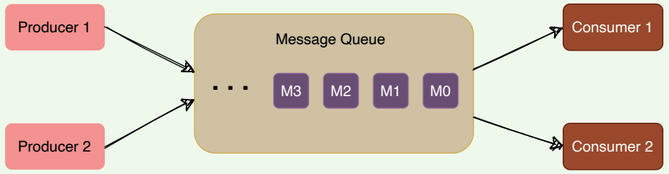   

A particular message can be consumed by a maximum of one consumer only.
Once a consumer grabs a message, it is removed from the queue such that
the next consumer will get the next message. This is a great model for
distributing message-processing among multiple consumers. But this also
limits the system as multiple consumers cannot read the same message from the queue.

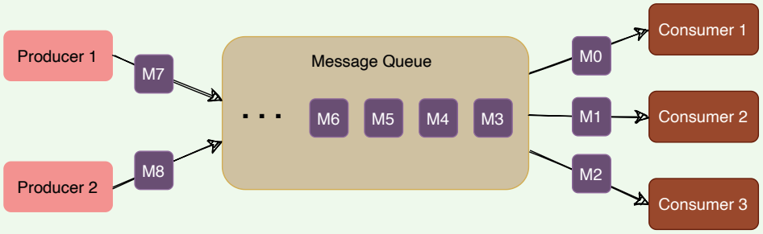   
*Message consumption in a message queue*

### Publish-subscribe messaging system

In the pub-sub (short for publish-subscribe) model, messages are divided
into topics. A publisher (or a producer) sends a message to a topic that gets
stored in the messaging system under that topic. Subscribers (or the
consumer) subscribe to a topic to receive every message published to that
topic. Unlike the Queuing model, the pub-sub model allows multiple
consumers to get the same message; if two consumers subscribe to the same
topic, they will receive all messages published to that topic.

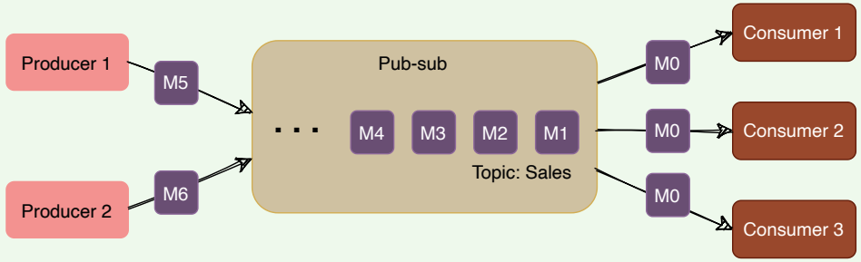   
*Pub-sub messaging system*

The messaging system that stores and maintains the messages is commonly
known as the message **broker**. It provides a loose coupling between
publishers and subscribers, or producers and consumers of data.

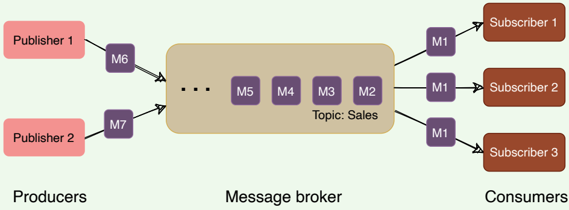   
*Message broker*

The message broker stores published messages in a queue, and subscribers
read them from the queue. Hence, subscribers and publishers do not have to
be synchronized. This **loose coupling** enables subscribers and publishers to
read and write messages at different rates.

The messaging system’s ability to store messages provides **fault-tolerance**,
so messages do not get lost between the time they are produced and the time
they are consumed.

To summarize, a message system is deployed in an application stack for the
following reasons:
1. **Messaging buffering**. To provide a buffering mechanism in front of
processing (i.e., to deal with temporary incoming message spikes that
are greater than what the processing app can deal with). This enables
the system to safely deal with spikes in workloads by temporarily
storing data until it is ready for processing.
2. **Guarantee of message delivery**. Allows producers to publish messages
with assurance that the message will eventually be delivered if the
consuming application is unable to receive the message when it is
published.
3. **Providing abstraction**. A messaging system provides an architectural
separation between the consumers of messages and the applications
producing the messages.
4. **Enabling scale**. Provides a flexible and highly configurable architecture
that enables many producers to deliver messages to multiple
consumers.

## Kafka: Introduction

Apache Kafka is an open-source **publish-subscribe**-based messaging system (*Kafka can work as a message queue too*). It is **distributed**,
**durable**, **fault-tolerant**, and **highly scalable** by design. Fundamentally, it is
a system that takes streams of messages from applications known as
producers, stores them reliably on a central cluster (containing a set of
brokers), and allows those messages to be received by applications (known
as consumers) that process the messages.

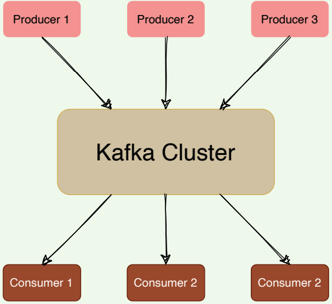   
*A high-level view of Kafka*

### Background

Kafka was created at LinkedIn around 2010 to track various events, such as
page views, messages from the messaging system, and logs from various
services. Later, it was made open-source and developed into a
comprehensive system which is used for:
1. Reliably storing a huge amount of data.
2. Enabling high throughput of message transfer between different entities.
3. Streaming real-time data.

At a high level, we can call Kafka a distributed **Commit Log**. A Commit Log
(*also known as a Write-Ahead log or a Transactions log*) is an **append-only**
data structure that can persistently store a sequence of records. Records are always appended to the end of the log, and once added, records cannot be
deleted or modified. Reading from a commit log always happens from left to
right (or old to new).

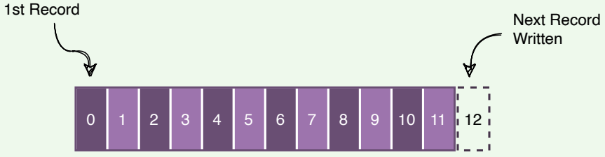   
*Kafka as a write-ahead log*

Kafka stores all of its messages on disk. Since all reads and writes happen in
sequence, Kafka takes advantage of sequential disk reads

### Kafka use cases

Kafka can be used for collecting big data and real-time analysis. Here are
some of its top use cases:

1. **Metrics**: Kafka can be used to collect and aggregate monitoring data.
Distributed services can push different operational metrics to Kafka
servers. These metrics can then be pulled from Kafka to produce
aggregated statistics.
2. **Log Aggregation**: Kafka can be used to collect logs from multiple
sources and make them available in a standard format to multiple
consumers.
3. **Stream processing**: Kafka is quite useful for use cases where the
collected data undergoes processing at multiple stages. For example, the raw data consumed from a topic is transformed, enriched, or aggregated
and pushed to a new topic for further consumption. This way of data
processing is known as stream processing.
4. **Commit Log**: Kafka can be used as an external commit log for any
distributed system. Distributed services can log their transactions to
Kafka to keep track of what is happening. This transaction data can be
used for replication between nodes and also becomes very useful for
disaster recovery, for example, to help failed nodes to recover their
states.
5. **Website activity tracking**: One of Kafka’s original use cases was to
build a user activity tracking pipeline. User activities like page clicks,
searches, etc., are published to Kafka into separate topics. These topics
are available for subscription for a range of use cases, including realtime processing, real-time monitoring, or loading into [Hadoop](https://hadoop.apache.org/) or data warehousing systems for offline
processing and reporting.
6. **Product suggestions**: Imagine an online shopping site like [amazon.com](http://amazon.com/), which offers a feature of ‘similar products’ to
suggest lookalike products that a customer could be interested in
buying. To make this work, we can track every consumer action, like
search queries, product clicks, time spent on any product, etc., and
record these activities in Kafka. Then, a consumer application can read
these messages to find correlated products that can be shown to the
customer in real-time. Alternatively, since all data is persistent in Kafka,
a batch job can run overnight on the ‘similar product’ information
gathered by the system, generating an email for the customer with
product suggestions.

## High-level Architecture

### Kafka common terms

#### Brokers

A Kafka server is also called a broker. Brokers are responsible for reliably
storing data provided by the producers and making it available to the
consumers.

#### Records

A record is a message or an event that gets stored in Kafka. Essentially, it is
the data that travels from producer to consumer through Kafka. A record
contains a key, a value, a timestamp, and optional metadata headers.

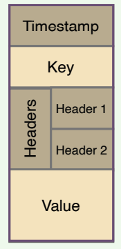   
*Kafka message*

#### Topics

Kafka divides its messages into categories called Topics. In simple terms, a
topic is like a table in a database, and the messages are the rows in that table.
- Each message that Kafka receives from a producer is associated with a
topic.
- Consumers can subscribe to a topic to get notified when new messages
are added to that topic.
- A topic can have multiple subscribers that read messages from it.
- In a Kafka cluster, a topic is identified by its name and must be unique.

Messages in a topic can be read as often as needed — unlike traditional
messaging systems, messages are not deleted after consumption. Instead,
Kafka retains messages for a configurable amount of time or until a storage
size is exceeded. Kafka’s performance is effectively constant with respect to
data size, so storing data for a long time is perfectly fine.

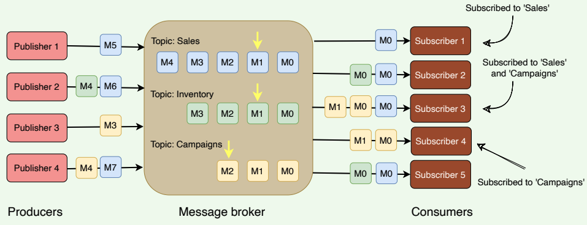   
*Kafka topics*

#### Producers

Producers are applications that publish (or write) records to Kafka.

#### Consumers

Consumers are the applications that subscribe to (read and process) data
from Kafka topics. Consumers subscribe to one or more topics and consume
published messages by pulling data from the brokers.

In Kafka, producers and consumers are fully decoupled and agnostic of each
other, which is a key design element to achieve the high scalability that
Kafka is known for. For example, producers never need to wait for
consumers.

#### High-level architecture

At a high level, applications (producers) send messages to a Kafka broker,
and these messages are read by other applications called consumers.
Messages get stored in a topic, and consumers subscribe to the topic to
receive new messages.

#### Kafka cluster

Kafka is run as a cluster of one or more servers, where each server is
responsible for running one Kafka broker.

#### ZooKeeper

ZooKeeper is a distributed key-value store and is used for coordination and
storing configurations. It is highly optimized for reads. Kafka uses ZooKeeper
to coordinate between Kafka brokers; ZooKeeper maintains metadata
information about the Kafka cluster. We will be looking into this in detail
later.

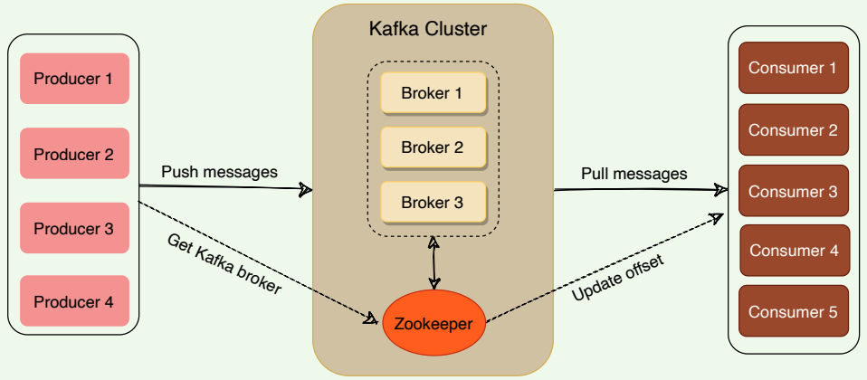   
*High level architecture of Kafka*

## Kafka: Deep Dive

Kafka is simply a **collection of topics**. As topics can get quite big, they are
**split into partitions** of a smaller size for better performance and scalability.

### Topic partitions

Kafka topics are partitioned, meaning a topic is spread over a number of
‘fragments’. Each partition can be placed on a separate Kafka broker. When
a new message is published on a topic, it gets appended to one of the topic’s
partitions. The producer controls which partition it publishes messages to
based on the data. For example, a producer can decide that all messages
related to a particular ‘city’ go to the same partition.

Essentially, a partition is an ordered sequence of messages. Producers
continually append new messages to partitions. Kafka guarantees that all
messages inside a partition are stored in the sequence they came in.

**Ordering of messages is maintained at the partition level, not across the topic.**

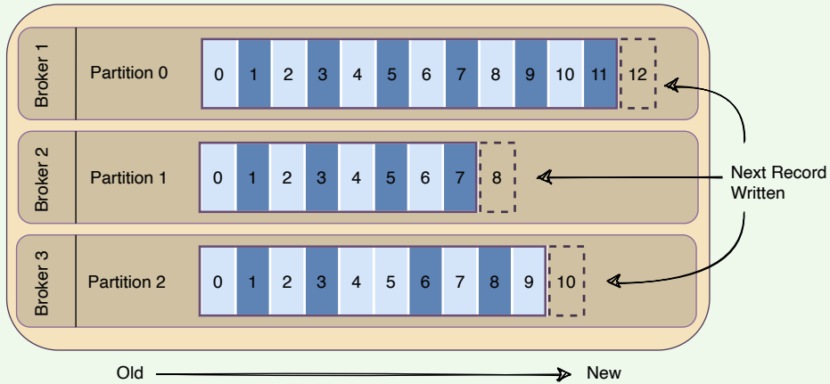   
*A topic having three partitions residing on three brokers*

- A unique sequence ID called an **offset** gets assigned to every message
that enters a partition. These numerical offsets are used to identify
every message’s sequential position within a topic’s partition.
- Offset sequences are unique only to each partition. This means, to locate
a specific message, we need to know the Topic, Partition, and Offset
number.
- Producers can choose to publish a message to any partition. If ordering
within a partition is not needed, a **_round-robin_** partition strategy can be
used, so records get distributed evenly across partitions.
- Placing each partition on separate Kafka brokers enables multiple
consumers to read from a topic in parallel. That means, different
consumers can concurrently read different partitions present on
separate brokers.
- Placing each partition of a topic on a separate broker also enables a
topic to hold more data than the capacity of one server.
- Messages once written to partitions are **immutable** and cannot be
updated.
- A producer can add a **‘key’** to any message it publishes. Kafka
guarantees that messages with the same key are written to the same
partition.
- Each broker manages a set of partitions belonging to different topics

Kafka follows the principle of a **dumb broker** and **smart consumer**. This
means that Kafka does not keep track of what records are read by the
consumer. Instead, consumers, themselves, poll Kafka for new messages and
say what records they want to read. This allows them to
increment/decrement the offset they are at as they wish, thus being able to
replay and reprocess messages. Consumers can read messages starting from
a specific offset and are allowed to read from any offset they choose. This
also enables consumers to join the cluster at any point in time.

Every topic can be replicated to multiple Kafka brokers to make the data
fault-tolerant and highly available. Each topic partition has one leader
broker and multiple replica (follower) brokers.

### Leader

A leader is the node responsible for all reads and writes for the given
partition. Every partition has one Kafka broker acting as a leader.

### Follower

To handle single point of failure, Kafka can replicate partitions and
distribute them across multiple broker servers called followers. Each
follower’s responsibility is to replicate the leader’s data to serve as a ‘backup’
partition. This also means that any follower can take over the leadership if
the leader goes down.

In the following diagram, we have two partitions and four brokers. `Broker 1` is the leader of `Partition 1` and follower of `Partition 2` . Consumers
work together in groups to process messages efficiently. More details on
consumer groups later.

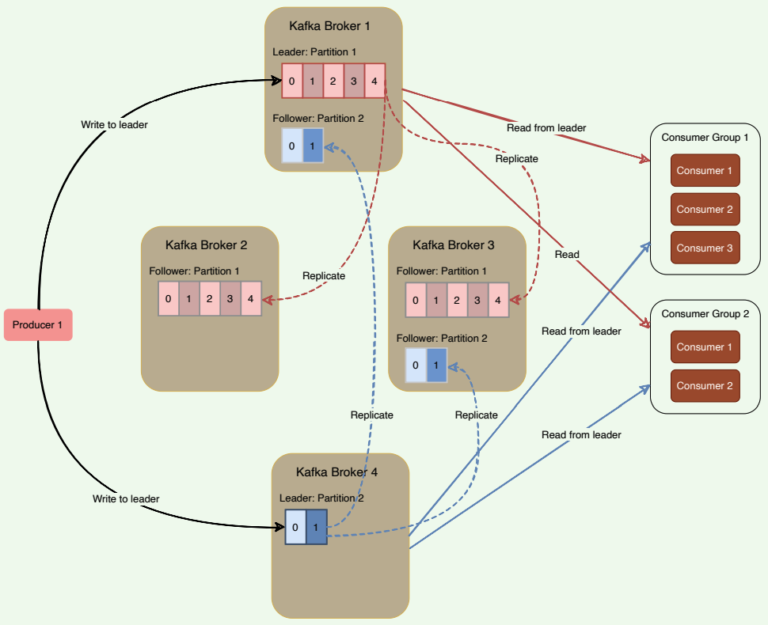   
*Leader and followers of partitions*

Kafka stores the location of the leader of each partition in ZooKeeper. As all
writes/reads happen at/from the leader, producers and consumers directly
talk to ZooKeeper to find a partition leader.

### In-sync replicas

An in-sync replica (ISR) is a broker that has the latest data for a given
partition. A leader is always an in-sync replica. A follower is an in-sync
replica only if it has fully caught up to the partition it is following. In other
words, ISRs cannot be behind on the latest records for a given partition.
**Only ISRs are eligible to become partition leaders**. Kafka can choose the
minimum number of ISRs required before the data becomes available for
consumers to read.

### High-water mark

To ensure data consistency, the leader broker never returns (or exposes)
messages which have not been replicated to a minimum set of ISRs. For this,
brokers keep track of the high-water mark, which is the highest offset that all
ISRs of a particular partition share. The leader exposes data only up to the
high-water mark offset and propagates the high-water mark offset to all
followers. Let’s understand this with an example.

In the figure below, the leader does not return messages greater than offset
‘4’, as it is the highest offset message that has been replicated to all follower
brokers.

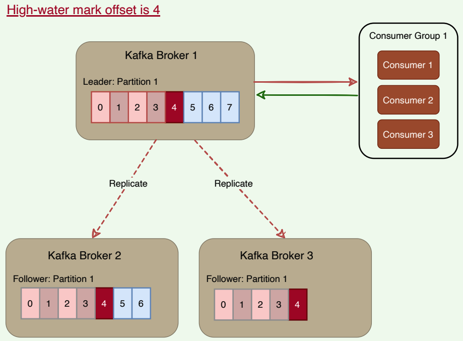   
*High-water mark offset*

If a consumer reads the record with offset ‘7’ from the leader (Broker 1), and
later, if the current leader fails, and one of the followers becomes the leader
before the record is replicated to the followers, the consumer will not be able
to find that message on the new leader. The client, in this case, will
experience a **non-repeatable read**. Because of this possibility, Kafka brokers
only return records up to the high-water mark.

## Consumer Groups

A consumer group is basically a set of one or more consumers working
together in parallel to consume messages from topic partitions. Messages are
equally divided among all the consumers of a group, with no two consumers
receiving the same message.

### Distributing partitions to consumers within a consumer group

Kafka ensures that **only a single consumer reads messages from any partition within a consumer group**. In other words, topic partitions are a
unit of parallelism – only one consumer can work on a partition in a
consumer group at a time. If a consumer stops, Kafka spreads partitions
across the remaining consumers in the same consumer group. Similarly,
every time a consumer is added to or removed from a group, the
consumption is rebalanced within the group.

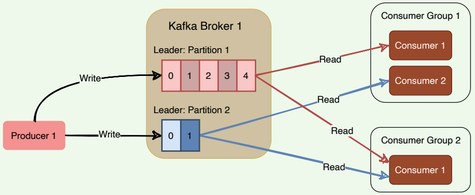   
*How Kafka distributes partitions to consumers within a consumer group*

Consumers pull messages from topic partitions. Different consumers can be
responsible for different partitions. Kafka can support a large number of
consumers and retain large amounts of data with very little overhead. By
using consumer groups, consumers can be parallelized so that multiple
consumers can read from multiple partitions on a topic, allowing a very high
message processing throughput. The number of partitions impacts
consumers’ maximum parallelism, as there cannot be more consumers than
partitions.

Kafka stores the current offset per consumer group per topic per partition,
as it would for a single consumer. This means that unique messages are only
sent to a single consumer in a consumer group, and the load is balanced
across consumers as equally as possible.

When the number of consumers exceeds the number of partitions in a topic,
all new consumers wait in idle mode until an existing consumer
unsubscribes from that partition. Similarly, as new consumers join a
consumer group, Kafka initiates a rebalancing if there are more consumers
than partitions. Kafka uses any unused consumers as failovers.

Here is a summary of how Kafka manages the distribution of partitions to
consumers within a consumer group:
- **Number of consumers in a group = number of partitions**: each
consumer consumes one partition.
- **Number of consumers in a group > number of partitions**: some
consumers will be idle.
- **Number of consumers in a group < number of partitions**: some
consumers will consume more partitions than others.

## Kafka Workow

Kafka provides both pub-sub and queue-based messaging systems in a fast,
reliable, persisted, fault-tolerance, and zero downtime manner. In both
cases, producers simply send the message to a topic, and consumers can
choose any one type of messaging system depending on their need. Let us
follow the steps in the next section, to understand how the consumer can
choose the messaging system of their choice.

### Kafka workflow as pub-sub messaging

Following is the stepwise workflow of the Pub-Sub Messaging:

- Producers publish messages on a topic.
- Kafka broker stores messages in the partitions configured for that
particular topic. If the producer did not specify the partition in which
the message should be stored, the broker ensures that the messages are
equally shared between partitions. If the producer sends two messages
and there are two partitions, Kafka will store one message in the first
partition and the second message in the second partition.
- Consumer subscribes to a specific topic.
- Once the consumer subscribes to a topic, Kafka will provide the current
offset of the topic to the consumer and also saves that offset in the
ZooKeeper.
- Consumer will request Kafka at regular intervals for new messages.
- Once Kafka receives the messages from producers, it forwards these
messages to the consumer.
- Consumer will receive the message and process it.
- Once the messages are processed, the consumer will send an
acknowledgment to the Kafka broker.
- Upon receiving the acknowledgment, Kafka increments the offset and
updates it in the ZooKeeper. Since offsets are maintained in the
- ZooKeeper, the consumer can read the next message correctly, even
during broker outages.
- The above flow will repeat until the consumer stops sending the
request.
- Consumers can rewind/skip to the desired offset of a topic at any time
and read all the subsequent messages.

### Kafka workflow for consumer group

Instead of a single consumer, a group of consumers from one consumer
group subscribes to a topic, and the messages are shared among them. Let us
check the workflow of this system:

- Producers publish messages on a topic.
- Kafka stores all messages in the partitions configured for that particular topic, similar to the earlier scenario.
- A single consumer subscribes to a specific topic, assume `Topic-01` with Group ID as `Group-1`
- Kafka interacts with the consumer in the same way as pub-sub
messaging until a new consumer subscribes to the same topic, `Topic-01` , with the same Group ID as `Group-1`
- Once the new consumer arrives, Kafka switches its operation to share
mode, such that each message is passed to only one of the subscribers of
the consumer group `Group-1` . This message transfer is similar to queuebased messaging, as only one consumer of the group consumes a
message. Contrary to queue-based messaging, messages are not
removed after consumption.
- This message transfer can go on until the number of consumers reaches
the number of partitions configured for that particular topic.
- Once the number of consumers exceeds the number of partitions, the
new consumer will not receive any message until an existing consumer
unsubscribes. This scenario arises because each consumer in Kafka will
be assigned a minimum of one partition. Once all the partitions are
assigned to the existing consumers, the new consumers will have to
wait.

## Role of ZooKeeper

A critical dependency of Apache Kafka is Apache ZooKeeper, which is a
distributed configuration and synchronization service. ZooKeeper serves as
the coordination interface between the Kafka brokers, producers, and
consumers. Kafka stores basic metadata in ZooKeeper, such as information
about brokers, topics, partitions, partition leader/followers, consumer
offsets, etc.

   

### ZooKeeper as the central coordinator

As we know, Kafka brokers are stateless; they rely on ZooKeeper to maintain
and coordinate brokers, such as notifying consumers and producers of the
arrival of a new broker or failure of an existing broker, as well as routing all
requests to partition leaders.

ZooKeeper is used for storing all sorts of metadata about the Kafka cluster:
- It maintains the last offset position of each consumer group per
partition, so that consumers can quickly recover from the last position
in case of a failure (although modern clients store offsets in a separate
Kafka topic).
- It tracks the topics, number of partitions assigned to those topics, and
leaders’/followers’ location in each partition.
- It also manages the access control lists (ACLs) to different topics in the
cluster. ACLs are used to enforce access or authorization.

#### How do producers or consumers find out who the leader of a partition is?

In the older versions of Kafka, all clients (i.e., producers and consumers)
used to directly talk to ZooKeeper to find the partition leader. Kafka has
moved away from this coupling, and in Kafka’s latest releases, clients fetch
metadata information from Kafka brokers directly; brokers talk to
ZooKeeper to get the latest metadata. In the diagram below, the producer
goes through the following steps before publishing a message:

1. The producer connects to any broker and asks for the leader of
‘`Partition 1`’.
2. The broker responds with the identification of the leader broker
responsible for ‘`Partition 1`’.
3. The producer connects to the leader broker to publish the message.

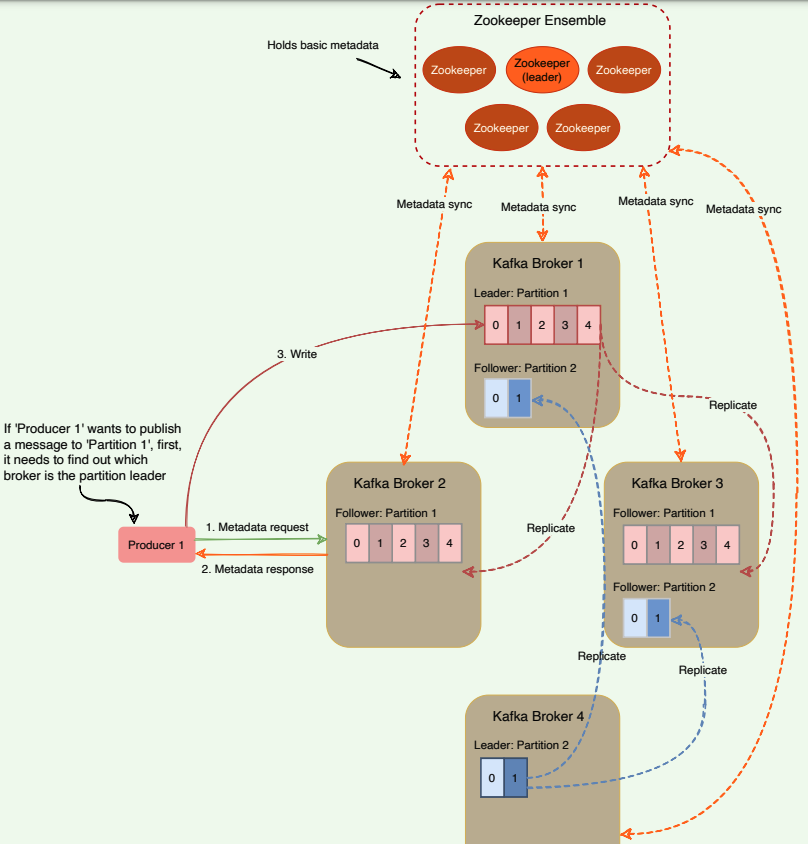   
*Role of ZooKeeper in Kafka*

All the critical information is stored in the ZooKeeper and ZooKeeper
replicates this data across its cluster, therefore, failure of Kafka broker (or
ZooKeeper itself) does not affect the state of the Kafka cluster. Upon
ZooKeeper failure, Kafka will always be able to restore the state once the ZooKeeper restarts after failure. Zookeeper is also responsible for
coordinating the partition leader election between the Kafka brokers in case
of leader failure.

## Controller Broker

Within the Kafka cluster, one broker is elected as the Controller. This
Controller broker is responsible for admin operations, such as
creating/deleting a topic, adding partitions, assigning leaders to partitions,
monitoring broker failures, etc. Furthermore, the Controller periodically
checks the health of other brokers in the system. In case it does not receive a
response from a particular broker, it performs a failover to another broker.
It also communicates the result of the partition leader election to other
brokers in the system.

### Split brain

When a controller broker dies, Kafka elects a new controller. One of the
problems is that we cannot truly know if the leader has stopped for good and
has experienced an intermittent failure like a **_stop-the-world GC pause_** or a temporary network disruption. Nevertheless, the cluster has to move on and
pick a new controller. If the original Controller had an intermittent failure,
the cluster would end up having a so-called **zombie controller**. A zombie
controller can be defined as a controller node that had been previously
deemed dead by the cluster and has come back online. Another broker has
taken its place, but the zombie controller might not know that yet. This
common scenario in distributed systems with two or more active controllers
(or central servers) is called split-brain.

We will have two controllers under split-brain, which will be giving out
potentially conflicting commands in parallel. If something like this happens
in a cluster, it can result in major inconsistencies. How do we handle this
situation?

### Generation clock 

Split-brain is commonly solved with a **generation clock**, which is simply a
monotonically increasing number to indicate a server’s generation. In Kafka,
the generation clock is implemented through an epoch number. If the old
leader had an epoch number of ‘1’, the new one would have ‘2’. This epoch is
included in every request that is sent from the Controller to other brokers.
This way, brokers can now easily differentiate the real Controller by simply
trusting the Controller with the highest number. The Controller with the
highest number is undoubtedly the latest one, since the epoch number is
always increasing. This epoch number is stored in ZooKeeper.

## Kafka Delivery Semantics

### Producer delivery semantics 

As we know, a producer writes only to the leader broker, and the followers
asynchronously replicate the data. How can a producer know that the data is
successfully stored at the leader or that the followers are keeping up with the
leader? Kafka offers three options to denote the number of brokers that must
receive the record before the producer considers the write as successful:

- **Async**: Producer sends a message to Kafka and does not wait for
acknowledgment from the server. This means that the write is
considered successful the moment the request is sent out. This **fire-and-forget** approach gives the best performance as we can write data to
Kafka at network speed, but no guarantee can be made that the server
has received the record in this case.
- **Committed to Leader**: Producer waits for an acknowledgment from the
leader. This ensures that the data is committed at the leader; it will be
slower than the ‘Async’ option, as the data has to be written on disk on
the leader. Under this scenario, the leader will respond without waiting
for acknowledgments from the followers. In this case, the record will be lost if the leader crashes immediately after acknowledging the producer
but before the followers have replicated it.
- **Committed to Leader and Quorum**: Producer waits for an
acknowledgment from the leader and the quorum. This means the
leader will wait for the full set of in-sync replicas to acknowledge the
record. This will be the slowest write but guarantees that the record will
not be lost as long as at least one in-sync replica remains alive. This is
the strongest available guarantee.

As we can see, the above options enable us to configure our preferred tradeoff between durability and performance.
- If we would like to be sure that our records are safely stored in Kafka,
we have to go with the last option – Committed to Leader and Quorum.
- If we value latency and throughput more than durability, we can choose
one of the first two options. These options will have a greater chance of
losing messages but will have better speed and throughput.

### Consumer delivery semantics

A consumer can read only those messages that have been written to a set of
in-sync replicas. There are three ways of providing consistency to the
consumer:

- **At-most-once** (Messages may be lost but are never redelivered): In this
option, a message is delivered a maximum of one time only. Under this
option, the consumer upon receiving a message, commit (or increment)
the offset to the broker. Now, if the consumer crashes before fully
consuming the message, that message will be lost, as when the
consumer restarts, it will receive the next message from the last
committed offset.
- **At-least-once** (Messages are never lost but maybe redelivered): Under
this option, a message might be delivered more than once, but no
message should be lost. This scenario occurs when the consumer
receives a message from Kafka, and it does not immediately commit the
offset. Instead, it waits till it completes the processing. So, if the
consumer crashes after processing the message but before committing
the offset, it has to reread the message upon restart. Since, in this case,
the consumer never committed the offset to the broker, the broker will
redeliver the same message. Thus, duplicate message delivery could
happen in such a scenario.
- **Exactly-once** (each message is delivered once and only once): It is very
hard to achieve this unless the consumer is working with a
transactional system. Under this option, the consumer puts the message
processing and the offset increment in one transaction. This will ensure
that the offset increment will happen only if the whole transaction is
complete. If the consumer crashes while processing, the transaction will
be rolled back, and the offset will not be incremented. When the
consumer restarts, it can reread the message as it failed to process it last
time. This option leads to no data duplication and no data loss but can
lead to decreased throughput.

## Kafka Characteristics

### Storing messages to disks

Kafka writes its messages to the local disk and does not keep anything in
RAM. Disks storage is important for durability so that the messages will not
disappear if the system dies and restarts. Disks are generally considered to
be slow. However, there is a huge difference in disk performance between
random block access and sequential access. Random block access is slower
because of numerous disk seeks, whereas the sequential nature of writing or
reading, enables disk operations to be thousands of times faster than
random access. Because all writes and reads happen sequentially, Kafka has
a very high throughput.

Writing or reading sequentially from disks are heavily optimized by the OS,
via **read-ahead** (prefetch large block multiples) and **write-behind** (group
small logical writes into big physical writes) techniques.

Also, modern operating systems cache the disk in free RAM. This is called
[Pagecache](https://en.wikipedia.org/wiki/Page_cache). Since Kafka stores
messages in a standardized binary format unmodified throughout the whole
flow (producer → broker → consumer), it can make use of the [zero-copy](https://en.wikipedia.org/wiki/Zero-copy) optimization. That is when the
operating system copies data from the Pagecache directly to a socket,
effectively bypassing the Kafka broker application entirely.

Kafka has a protocol that groups messages together. This allows network
requests to group messages together and reduces network overhead. The
server, in turn, persists chunks of messages in one go, and consumers fetch
large linear chunks at once.

All of these optimizations allow Kafka to deliver messages at near networkspeed.

### Record retention in Kafka

By default, Kafka retains records until it runs out of disk space. We can set
time-based limits (configurable retention period), size-based limits
(configurable based on size), or compaction (keeps the latest version of
record using the key). For example, we can set a retention policy of three
days, or two weeks, or a month, etc. The records in the topic are available for
consumption until discarded by time, size, or compaction.

### Client quota

It is possible for Kafka producers and consumers to produce/consume very
high volumes of data or generate requests at a very high rate and thus
monopolize broker resources, cause network saturation, and, in general,
deny service to other clients and the brokers themselves. Having quotas 
protects against these issues. Quotas become even more important in large
multi-tenant clusters where a small set of badly behaved clients can degrade
the user experience for the well-behaved ones.

In Kafka, quotas are byte-rate thresholds defined per `client-ID` . A `client-ID` logically identifies an application making a request. A single `client-ID`
can span multiple producer and consumer instances. The quota is applied
for all instances as a single entity. For example, if a `client-ID` has a
producer quota of 10 MB/s, that quota is shared across all instances with that
same ID.

The broker does not return an error when a client exceeds its quota but
instead attempts to slow the client down. When the broker calculates that a
client has exceeded its quota, it slows the client down by holding the client’s
response for enough time to keep the client under the quota. This approach
keeps the quota violation transparent to clients. This also prevents clients
from having to implement special back-off and retry behavior.

### Kafka performance 

Here are a few reasons behind Kafka’s performance and popularity:

**Scalability**: Two important features of Kafka contribute to its scalability.
- A Kafka cluster can easily expand or shrink (brokers can be added or
removed) while in operation and without an outage.
- A Kafka topic can be expanded to contain more partitions. Because a
partition cannot expand across multiple brokers, its capacity is bounded
by broker disk space. Being able to increase the number of partitions
and the number of brokers means there is no limit to how much data a
single topic can store.

**Fault-tolerance and reliability**: Kafka is designed in such a way that a
broker failure is detectable by ZooKeeper and other brokers in the cluster.
Because each topic can be replicated on multiple brokers, the cluster can
recover from broker failures and continue to work without any disruption of
service.

**Throughput**: By using consumer groups, consumers can be parallelized, so
that multiple consumers can read from multiple partitions on a topic,
allowing a very high message processing throughput.

**Low Latency**: 99.99% of the time, data is read from disk cache and RAM;
very rarely, it hits the disk.

## Summary

1. Kafka provides low-latency, high-throughput, fault-tolerant **publish and subscribe pipelines** and can process huge continuous streams of events.
2. Kafka can function both as a **message queue** and a **publisher-subscriber** system.
3. At a high level, Kafka works as a **distributed commit log**.
4. Kafka server is also called a **broker**. A Kafka cluster can have one or more brokers.
5. A Kafka **topic** is a logical aggregation of messages.
6. Kafka solves the scaling problem of a messaging system by splitting a topic into multiple **partitions**.
7. Every topic partition is replicated for fault tolerance and redundancy.
8. A partition has one leader replica and zero or more follower replicas.
9. Partition leader is responsible for all reads and writes. Each follower's responsibility is to replicate the leader's data to serve as a 'backup' partition.
10. Message ordering is preserved only on a per-partition basis (not across partitions of a topic).
11. Every partition replica needs to fit on a broker, and a partition cannot be divided over multiple brokers.
12. Every broker can have one or more leaders, covering different partitions and topics.
13. Kafka supports a single queue model with multiple readers by enabling consumer groups.
14. Kafka supports a publish-subscribe model by allowing consumers to subscribe to topics for which they want to receive messages.
15. ZooKeeper functions as a centralized configuration management service.

### System design patterns

#### High-water mark

To deal with non-repeatable reads and ensure data consistency, brokers keep track of the high-water mark, which is the largest offset that all ISRs of a particular partition share. Consumers can see messages only until the high
watermark.

#### Leader and follower

Each Kafka partition has a designated leader responsible for all reads and writes for that partition. Each follower's responsibility is to replicate the leader's data to serve as a backup' partition.

#### Split-brain

To handle split-brain (where we have multiple active controller brokers), Kafka uses 'epoch number,' which is simply a monotonically increasing number to indicate a server's generation. This means if the old Controller had an epoch number of '1', the new one would have 2°. This epoch is included in every request that is sent from the Controller to other brokers.

This way, brokers can easily differentiate the real Controller by simply trusting the Controller with the highest number. This epoch number is stored in ZooKeeper.

#### Segmented log

Kafka uses log segmentation to implement storage for its partitions. As Kafka regularly needs to find messages on disk for purging, a single long file could be a performance bottleneck and error-prone. For easier management and better performance, the partition is split into segments.

