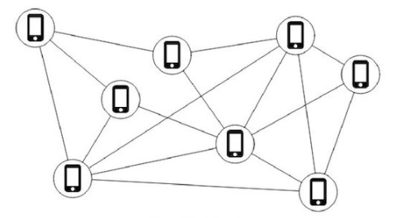
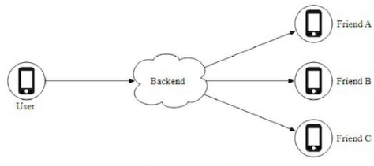
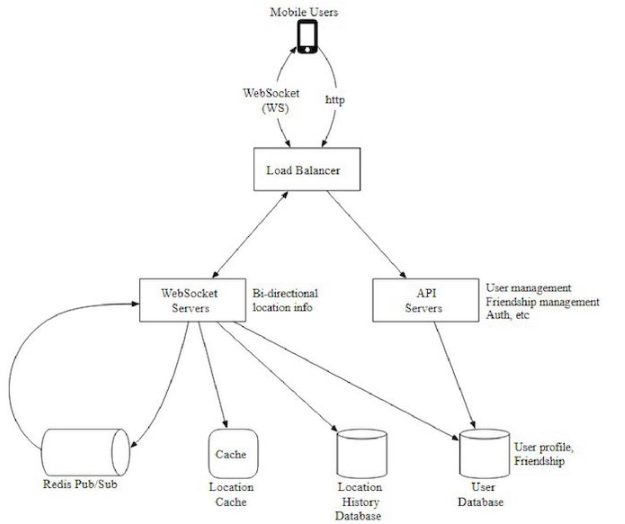
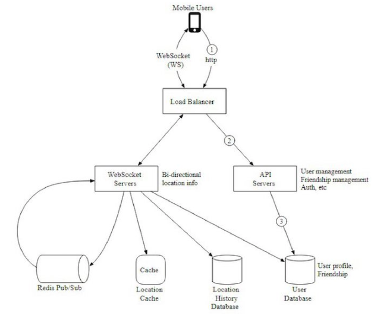
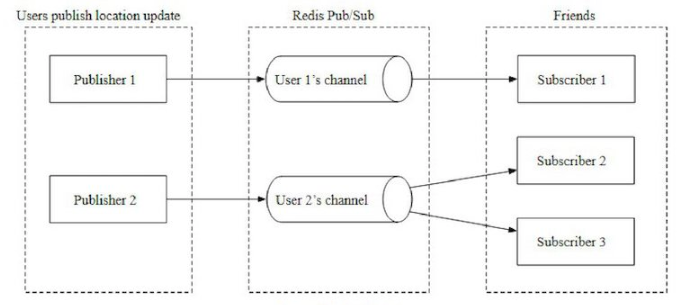
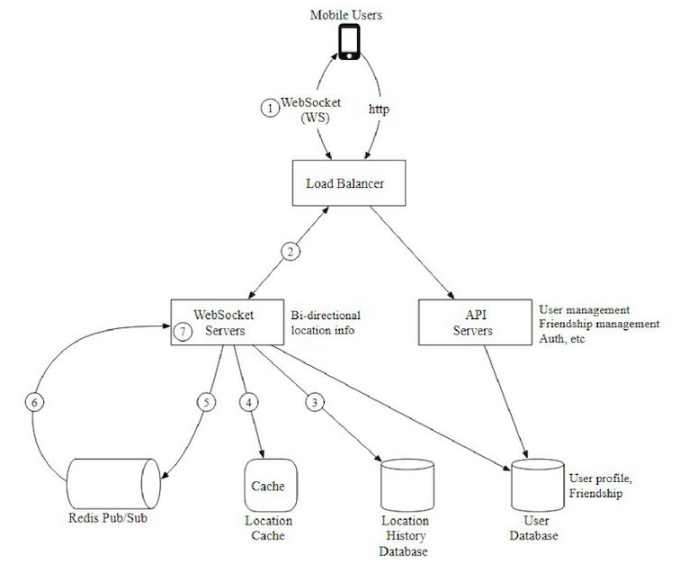
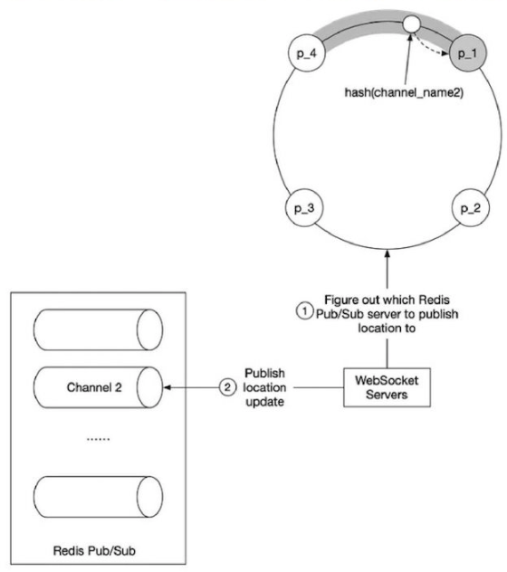
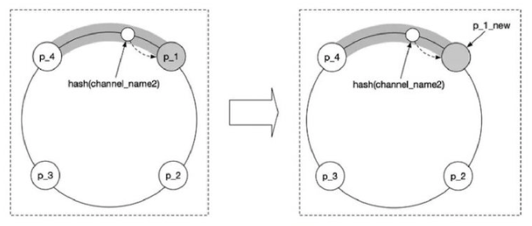
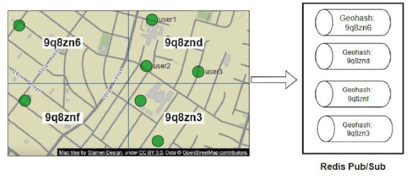
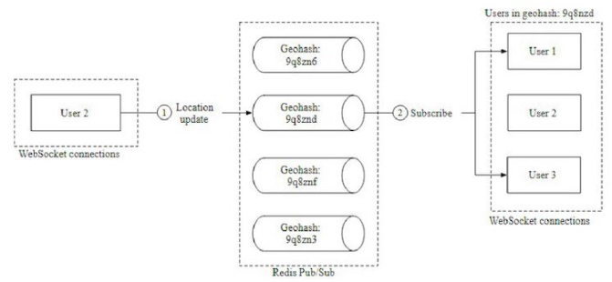

# Nearby Friends

In this chapter, we design a scalable backend system for a new mobile app feature called “Nearby Friends". For an opt-in user who grants permission to access their location, the mobile client presents list of friends who are geographically nearby. If you are looking for 2 real-world example, please refer to this article [1] about similar
feature in the Facebook app.

If you read the Proximity Service chapter, you may wonder why we need a separate chapter for designing “nearby friends” since it looks similar to proximity services. If you think carefully though, you will find major differences. In proximity services, the addresses for businesses are static as their locations do not change, while in “nearby friends", data is more dynamic because user locations change frequently.

## Step 1 - Understand the problem and establish design scope

Any backend system at the Facebook scale is complicated. Before starting with the design, we need to ask clarification questions to narrow down the scope.

**Candidate**: How geographically close is considered to be “nearby™?   
**Interviewer**: 5 miles. This number should be configurable.

**Candidate**: Can | assume the distance is calculated as the straight-line distance between two users? In real life, there could be, for example, a river in between the users, resulting in a longer travel distance.   
**Interviewer**: Yes, that's a reasonable assumption.

**Candidate**: How many users does the app have? Can | assume 1 billion users and 10% of them use the nearby friends feature?   
**Interviewer**: Yes, that's a reasonable assumption.

**Candidate**: Do we need to store location history?   
**Interviewer**: Yes, location history can be valuable for different purposes such as machine learning.

‘**Candidate**: Could we assume if a friend is inactive for more than 10 minutes, that friend will disappear from the nearby friend list? Or should we display the last known location?   
**Interviewer**: We can assume inactive friends will no longer be shown.

**Candidate**: Do we need to worry about privacy and data laws such as GDPR or CCPA?   
**Interviewer**: Good question. For simplicity, don't worry about it for now.

### Functional requirements
- Users should be able to see nearby friends on their mobile apps. Each entry in the nearby friend list has a distance and a timestamp indicating when the distance was last updated.
- Nearby friend lists should be updated every few seconds.

### Non-functional requirements
- Low latency. It's important to receive location updates from friends without too much delay.
- Reliability. The system needs to be reliable overall, but occasional data point loss is acceptable.
- Eventual consistency. The location data store doesn't need strong consistency. A few seconds delay in receiving location data in different replicas is acceptable.

### Back of the envelope estimation

Let's do a back-of-the-envelope estimation to determine the potential scale and challenges our solution will need 10 address. Some constraints and assumptions are listed below:

- Nearby friends are defined as friends whose locations are within a 5-mile radius.
- The location refresh interval is 30 seconds. The reason for this is that human walking speed is slow (average 3-4 miles per hour). The distance traveled in 30 seconds does not make a significant difference on the “nearby friends” feature.
- On average, 100 milion users use the “nearby friends" feature every day.
- Assume the number of concurrent users is 10% of DAU, 5o the number of concurrent users is 10 million
- On average, a user has 400 friends. Assume all of them use the “nearby friends" feature.
- The app displays 20 nearby friends per page and may load more nearby friends upon request.

**Calculate QPS**
- 100 million DAU
- Concurrent users: 10% * 100 million = 10 million
- Users report their locations every 30 seconds
- Location update QPS = 10 million / 30 = ~334,000

## Step 2 - Propose High-Level Design and Get Buy-In

In this section, we will discuss the following:
- High-level design
- APl design
- Data model

In other chapters, we usually discuss API design and data model before the high-level design. However, for this problem, the communication protocol between client and server might not be a straightforward HTTP protocol, as we need to push location data to allfriends. Without understanding the high-level design, its difficult to know what the APls look like. Therefore, we discuss the high-level design first.

### High-level design

At a high level, this problem calls for a design with efficient message passing. Conceptually, a user would ke to receive location updates from every active friend nearby. It could in theory be done purely peer-to-peer, that is, a user could maintain a persistent connection to every other active friend in the vicinity 



This solution is not practical for a mobile device with sometimes flaky connections and a tight power consumption budget, but the idea sheds some light on the general design direction.

A more practical design would have a shared backend and look like this:




What are the responsibilities of the backend in Figure above?
- Receive location updates from all active users.
- For each location update, find all the active friends who should receive it and forward it to those users’ devices.
- If the distance between two users is over a certain threshold, do not forward it to the recipient's device.

This sounds pretty simple. What is the issue? Well, to do this at scale is not easy. We have 10 million active users.

With each user updating the location information every 30 seconds, there are 334K updates per second. If on average each user has 400 friends, and we further assume that roughly 10% of those friends are online and nearby, every second the backend forwards 334K * 400 * 10% = 14 million location updates per second. That is a ot of updates to forward.

#### Proposed design

We will first come up with a high-level design for the backend at a lower scale. Later in the deep dive section, we
will optimize the design for scale.
Figure 4 shows the basic design that should satisfy the functional requirements. Let's go over each component in
the design.



#### Load balancer

The load balancer sits in front of the RESTful AP servers and the stateful, bi-directional WebSocket servers. It
distributes traffic across those servers to spread out load evenly.

### RESTful API servers

This is a cluster of stateless HTTP servers that handles the typical request/response traffic. The API request flow is highlighted in Figure below. This API layer handles auxiliary tasks like adding/removing friends, updating user profiles, etc. These are very common and we will not go into more detail.



#### Websocket servers

This is a cluster of stateful servers that handles the near real-time update of friends locations. Each client maintains one persistent WebSocket connection to one of these servers. When there is location update from a friend who is within the search radius, the update is sent on this connection to the client.

Another major responsibility of the WebSocket servers is to handle client initialization for the “nearby friends™ feature. It seeds the mobile client with the locations of all nearby online friends. We will discuss how this is done in more detail later.

Note "WebSocket connection” and "WebSocket connection handler” are interchangeable in this chapter.

#### Redis location cache

Redis is used 10 store the most recent location data for each active user. There is a Time o Live (TTL) set on each entry in the cache. When the TTL expires, the user is no longer active and the location data is expunged from the cache. Every update refreshes the TTL. Other KV stores that support TTL could also be used.

#### User database

The user database stores user data and user friendship data. Either a relational database or a NoSQL database can be used for this.

#### Location history database

This database stores users’ historical location data. It is not directly related to the “nearby friends” feature.

#### Redis pub/sub server

Redis pub/sub is a very lightweight message bus. Channels in Redis pub/sub are very cheap to create. A modern Redis server with GBS of memory could hold millions of channels (also called topics). Figure below shows how Redis Pub/Sub works.



In this design, location updates received via the WebSocket server are published to the user’'s own channel in the Redis pub/sub server. A dedicated WebSocket connection handler for each active friend subscribes to the channel. 

When there is a location update, the WebSocket handler function gets invoked, and for each active friend, the function recomputes the distance. If the new distance is within the search radius, the new location and timestamp are sent via the WebSocket connection to the friend's client. Other message buses with lightweight channels could also be used.

Now that we understand what each component does, let's examine what happens when a user’s location changes from the system’s perspective.

### Periodic location update

The mobile dlient sends periodic location updates over the persistent WebSocket connection. The flow is shown in Figure below.



1. The mobile client sends a location update to the load balancer.
2. The load balancer forwards the location update to the persistent connection on the WebSocket server for that client.
3. The WebSocket server saves the location data to the location history database.
4. The WebSocket server updates the new location in the location cache. The update refreshes the TTL. The ‘WebSocket server also saves the new location in a variable in the user's WebSocket connection handler for subsequent distance calculations.
5. The WebSocket server publishes the new location to the user's channel in the Redis pub/sub server. Steps 3 to 5 can be executed in parallel.
6. When Redis pub/sub receives a location update on a channel, it broadcasts the update on all the subscribers (WebSocket connection handlers). In this case, the subscribers are all the online friends of the user sending the update. For each subscriber (.., for each of the user's friends), its WebSocket connection handler would receive the user location update.
7. On receiving the message, the WebSocket server, on which the connection handler lives, computes the distance between the user sending the new location (the location data is in the message) and the subscriber (the location data is stored in a variable with the WebSocket connection handler for the subscriber).
8. This step is not drawn on the diagram. If the distance does not exceed the search radius, the new location and the last updated timestamp are sent to the subscriber’s client. Otherwise, the update is dropped.

Since understanding this flow is extremely important, let's examine it again with a concrete example, as shown in
Figure 8. Before we start, let's make a few assumptions.
- User 1's friends: user 2, user 3, and user 4.
- User 5's friends: user 4 and user 6.


1. When user 1's location changes, their location update is sent to the WebSocket server which holds user 1's connection.
2. The location is published to user 1's channel in Redis puby/sub server.
3. Redis pub/sub server broadcasts the location update to all subscribers. In this case, subscribers are WebSocket connection handlers (user 1's friends).
4. If the distance between the user sending the location (user 1) and the subscriber (user 2) doesn't exceed the search radius, the new location is sent to the client (user 2).

This computation is repeated for every subscriber to the channel. Since there are 400 friends on average, and we assume that 10% of those friends are online and nearby, there are about 40 location updates to forward for each user’s location update.

### API design

Now that we have created a high-level design, let’s list APIs needed.

**WebSocket**: Users send and receive location updates through the WebSocket protocol. At the minimum, we need the following APIs.

**1. Periodic location update**   
Request: Client sends latitude, longitude, and timestamp.
Response: Nothing.

**2. Client receives location updates**
Data sent: Friend location data and timestamp.

**3. WebSocket initialization**   
Request: Client sends latitude, longitude, and timestamp.
Response: Client receives friends’ location data.

**4. Subscribe to a new friend**   
Request: WebSocket server sends friend ID.
Response: Friend’s latest latitude, longitude, and timestamp.

**5. Unsubscribe a friend**   
Request: WebSocket server sends friend ID.
Response: Nothing.

**HTTP requests:** the API servers handle tasks like adding/removing friends, updating user profiles, etc. These are very common and we will not go into detail here.

### Data model
Another important element to discuss is the data model. We already talked about the User DB in the high-level design, so let's focus on the location cache and location history database. 

#### Location cache
The location cache stores the latest locations of all active users who have had the nearby friends feature turned on. We use Redis for this cache. The key/value of the cache is shown in Table 1.

key | value
-----| -----
user_id | `{ gatitude, longitude, timestamp }`

#### Why don't we use a database to store location data?

The “nearby friends" feature only cares about the **current** location of a user. Therefore, we only need to store one location per user. Redis is an excellent choice because it provides super-fast read and write operations. It supports TTL, which we use to auto-purge users from the cache who are no longer active. The current locations do not need 10 be durably stored. If the Redis instance goes down, we could replace it with an empty new instance and let the cache be filled as new location updates stream in. The active users could miss location updates from friends for an update cycle or two while the new cache warms. It is an acceptable tradeoff. In the deep dive section, we will discuss ways to lessen the impact on users when the cache gets replaced.

#### Location history database

The location history database stores users' historical location data and the schema looks like this:

`| user_id | latitude | longitude | timestamp |`

We need a database that handles the heavy-write workload well and can be horizontally scaled. Cassandra is a good candidate. We could also use a relational database. However, with a relational database, the historical data would not fit in a single instance so we need to shard that data. The most basic approach is to shard by user ID. This sharding scheme ensures that load is evenly distributed among all the shards, and operationally, it i easy to maintain.

## Step 3 - Design Deep Dive

The high-level design we created in the previous section works in most cases, but it will likely break at our scale. In this section, we work together to uncover the bottienecks as we increase the scale, and along the way work on solutions to eliminate those bottienecks.

### How well does each component scale?

#### API servers

The methods to scale the RESTful API tiers are well understood. These are stateless servers, and there are many ways to auto-scale the clusters based on CPU usage, load, or I/O. We will not go into detail here.

#### WebSocket servers

For the WebSocket cluster, it is not difficult to auto-scale based on usage. However, the WebSocket servers are stateful, so care must be taken when removing existing nodes. Before a node can be removed, all existing connections should be allowed to drain. To achieve that, we can mark a node as “draining” at the load balancer so that no new WebSocket connections will be routed to the draining server. Once all the existing connections are closed (or after a reasonably long wait), the server is then removed.

Releasing a new version of the application software on a WebSocket server requires the same level of care.

It is worth noting that effective auto-scaling of stateful servers is the job of a good load balancer. Most cloud load balancers handle this job very well.

##### Client Initialization

The mobile client on startup establishes a persistent WebSocket connection with one of the WebSocket server instances. Each connection is long-running. Most modern languages are capable of maintaining many long-running connections with a reasonably small memory footprint.

When a WebSocket connection is initialized, the client sends the initial location of the user, and the server performs the following tasks in the WebSocket connection handler.

1. It updates the user’s location in the location cache.
2. It saves the location in a variable of the connection handler for subsequent calculations.
3. It loads all the user’s friends from the user database.
4. It makes a batched request to the location cache to fetch the locations for all the friends. Note that because we set 2 TTL on each entry in the location cache to match our inactivity timeout period, if a friend is inactive then their location will not be in the location cache.
5. For each location returned by the cache, the server computes the distance between the user and the friend at that location. If the distance is within the search radius, the friend’s profile, location, and last updated timestamp are returned over the WebSocket connection to the client.
6. For each friend, the server subscribes to the friend's channel in the Redis pub/sub server. We will explain our use of Redis pub/sub shortly. Since creating a new channel is cheap, the user subscribes to all active and inactive friends. The inactive friends will take up a small amount of memory on the Redis pub/sub server, but they will not consume any CPU or I/O (since they do not publish updates) until they come online.
7. It sends the user's current location to the user's channel in the Redis pub/sub server.

#### User database

The user database holds two distinct sets of data; user profiles (user ID, usemame, profile URL, etc) and friendships. These datasets at our design scale willlikely not fit in a single relational database instance. The good news is that the data is horizontally scalable by sharding based on user ID. Relational database sharding is a very common technique.

As a side note, at the scale we are designing for, the user and friendship datasets will likely be managed by a dedicated team and be available via an internal AP, In this scenario, the WebSocket servers will use the internal API instead of querying the database directly to fetch user and friendship-related data. Whether accessing via AP or direct database queries, it does not make much difference in terms of functionality or performance.

#### Location cache

We choose Redis to cache the most recent locations of al the active users. As mentioned earlier, we also set a TTL on each key. The TTL is renewed upon every location update. This puts 2 cap on the maximum amount of memory ‘used. With 10 million active users at peak, and with each location taking no more than 100 bytes, a single modern Redis server with many GBs of memory should be able to easily hold the location information for all users.

However, with 10 million active users roughly updating every 30 seconds, the Redis server will have to handle 334K updates per second. That is likely a little to0 high, even for a modem high-end server. Luckily, this cache data is easy to shard. The location data for each user is independent, and we can evenly spread the load among several Redis servers by sharding the location data based on user ID.

To improve availability, we could replicate the location data on each shard to a standby node. If the primary node ‘goes down, the standby could be quickly promoted to minimize downtime.

#### Redis pub/sub server

The puby/sub server is used as a routing layer to direct messages (location updates) from one user to all the online friends. As mentioned earlier, we choose Redis pub/sub because it s very lightweight to create new channels. A new channel is created when someone subscribes to it. If a message is published to a channel that has no subscribers, the message is dropped, placing very little load on the server. When a channel is created, Redis uses a small amount of memory to maintain a hash table and a linked lst  1o track the subscribers. If there is no update on a channel when a user is offline, no CPU cycles are used after a channel is created. We take advantage of this in our design in the following ways:

1. We assign 2 unique channel to every user who uses the “nearby friends” feature. A user would, upon app initialization, subscribe to each friends channel, whether the friend is online or not. This simplifies the design since the backend does not need to handle subscribing to a friend's channel when the friend becomes active, ‘or handling unsubscribing when the friend becomes inactive.
2. The tradeoff is that the design would use more memory. As we will see later, memory use is unlikely to be the
bottleneck. Trading higher memory use for a simpler architecture is worth it in this case.

**How many Redis pub/sub servers do we need?**   
Let's do some math on memory and CPU usage.

**Memory usage**

Assuming a channel is allocated for each user who uses the nearby friends feature, we need 100 million channels (1 billion * 10%). Assuming that on average a user has 100 active friends using this feature (this includes friends who are nearby, or not), and it takes about 20 bytes of pointers in the intemal hash table and linked list to track each subscriber, it will need about 200 GB (100 million * 20 bytes * 100 friends / 10~9 = 200 GB) to hold all the channes.

For a modern server with 100 GB of memory, we will need about 2 Redis pub/sub servers to hold all the channels. 

**CPU usage**

As previously calculated, the pub/sub server pushes about 14 million updates per second to subscribers. Even though it is not easy 1o estimate with any accuracy how many messages a modern Redis server could push a second without actual benchmarking, it is safe to assume that a single Redis server will not be able to handie that 1oad. Let's pick a conservative number and assume that a modem server with a gigabit network could handle about 100,000 subscriber pushes per second. Given how small our location update messages are, this number is likely to be conservative. Using this conservative estimate, we will need to distribute the load among 14 million / 100000 = 140 Redis servers. Again, this number is likely 100 conservative, and the actual number of servers could be much lower.

From the math, we conclude that:
- The bottieneck of Redis pub/sub server is the CPU usage, not the memory usage.
- To support our scale, we need a distributed Redis pub/sub cluster.

**Distributed Redis pub/sub server cluster**

How do we distribute the channels to hundreds of Redis servers? The good news is that the channels are independent of each other. This makes it relatively easy to spread the channels among multiple pub/sub servers by sharding, based on the publisher's user ID. Practically speaking though, with 100s of pub/sub servers, we should go into a bit more detail on how this s done so that operationally it is somewhat manageable, as servers inevitably go down from time to time.

Here, we introduce a service discovery component to our design. There are many service discovery packages available, with etcd and Zookeeper  among the most popular ones. Our need for the service discovery component is very basic. We need these two features:
1. The ability to keep a list of servers in the service discovery component, and a simple Ul or API to update it Fundamentally, service discovery is a small key-value store for holding configuration data. Using Figure below as an
example, the key and value for the hash ring could look like this:
```
Key: /config/pub_sub.ring
Value: ['p_1",p.2", 'p_3", "p_4']
```
2. The ability for clients (in this case, the WebSocket servers) to subscribe to any updates to the “Value™ (Redis pub/sub servers). Under the “Key" mentioned in point 1, we store a hash ring of all the active Redis pub/sub servers in the service discovery component. The hash ring is used by the publishers and subscribers of the Redis pub/sub servers to
determine the pub/sub server to talk to for each channel. For example, channel 2 lives in Redis pub/sub server 1 in
Figure below.


Figure 9

Figure below shows what happens when a WebSocket server publishes a location update to a user’s channel.   


1. The WebSocket server consults the hash ring to determine the Redis pub/sub server to write to. The source of truth is stored in service discovery, but for efficiency, a copy of the hash ring could be cached on each ‘WebSocket server. The WebSocket server subscribes to any updates on the hash ring to keep its local in-memory copy up to date.

2. WebSocket server publishes the location update to the user's channel on that Redis pub/sub server.

Subscribing to a channel for location updates uses the same mechanism.

**Scaling considerations for Redis pub/sub servers**

How should we scale the Redis publ/sub server cluster? Should we scale it up and down daily, based on traffic
pattems? This is a very common practice for stateless servers because it is low risk and saves costs. To answer these
questions, let's examine some of the properties of the Redis pub/sub server cluster.

1. The messages sent on a pubj/sub channel are not persisted in memory or on disk. They are sent to all subscribers of the channel and removed immediately after. If there are no subscribers, the messages are just dropped. In this sense, the data going through the pub/sub channel is stateless.

2. However, there are indeed states stored in the pub/sub servers for the channels. Specifically, the subscriber list for each channel is a key piece of the states tracked by the pub/sub servers. f a channel is moved, which could happen when the channel's pub/sub server is replaced, or if a new server is added or an old server removed on the hash ring, then every subscriber to the moved channel must know about it, 5o they could unsubscribe from the channel on the old server and resubscribe to the replacement channel on the new server. In this sense, a pub/sub server is stateful, and coordination with all subscribers to the server must be orchestrated to minimize service interruptions.

For these reasons, we should treat the Redis pub/sub cluster more like a stateful cluster, similar to how we would handle a storage cluster. With stateful clusters, scaling up or down has some operational overhead and risks, so it should be done with careful planning. The cluster is normally over-provisioned to make sure it can handie daily peak traffic with some comfortable headroom to avoid unnecessary resizing of the cluster.

When we inevitably have to scale, be mindful of these potential issues:

- When we resize a cluster, many channels will be moved to different servers on the hash ring. When the service discovery component notifies all the WebSocket servers of the hash ring update, there will be a ton of resubscription requests.
- During these mass resubscription events, some location updates might be missed by the clients. Although occasional misses are acceptable for our design, we should minimize the occurrences.
- Because of the potential interruptions, resizing should be done when usage is at its lowest in the day.

How is resizing actually done? It is quite simple. Follow these steps:
- Determine the new ring size, and if scaling up, provision enough new servers.
- Update the keys of the hash ring with the new content.
- Monitor your dashboard. There should be some spike in CPU usage in the WebSocket cluster.
Using the hash ring from Figure 9 above, if we were to add 2 new nodes, say, p_S, and p_6, the hash ring would be
updated like this:

```
Old: ["p_1","p_2", "p_3", "p_4"]
New: ["p_1","p_2", "p_3", "p_4", "p_5", "p_6"]
```

**Operational considerations for Redis pub/sub servers**

The operational sk of replacing an existing Redis pub/sub server is much, much lower. It does not cause a large number of channels to be moved. Only the channels on the server being replaced will need to be handled. This is good because servers inevitably go down and need to be replaced reqularly.

When a pub/sub server goes down, the monitoring software should alert the on-call operator. Precisely how the monitoring software monitors the health of a pub/sub server is beyond the scope of this chapter, so it is not covered. The on-call operator updates the hash ring key in service discovery to replace the dead node with a fresh standby node. The WebSocket servers are notified about the update and each one then notifies its connection handlers to re-subscribe to the channels on the new pub/sub server. Each WebSocket handler keeps a list of all channes it has subscribed to, and upon receiving the notification from the server, it checks each channel against the hash ring to determine if a channel needs to be re-subscribed on a new server.

Using the hash ring from Figure 9 above, if **p_1** went down, and we replace it with **p1_new**, the hash ring would be
updated like so:

```
Old: ["p_1","p_2", "p_3", "p_4"]
New: ["p_1_new","p_2", "p_3", "p_4"]
```


### Adding/removing friends

What should the dlient do when the user adds or removes a friend? When a new friend is added, the client's WebSocket connection handler on the server needs to be notified, so it can subscribe to the new friend’s pub/sub channel.

Since the “nearby friends" feature is within the ecosystem of a larger app, we can assume that the “nearby friends™ feature could register a callback on the mobile client whenever a new friend is added. The callback, upon invocation, sends a message to the WebSocket server to subscribe to the new friend's pub/sub channel. The WebSocket server also returns a message containing the new friend's latest location and timestamp, if they are active.

Likewise, the client could register a callback in the application whenever a friend is removed. The callback would send a message to the WebSocket server to unsubscribe from the friend’s pub/sub channel.

This subscribe/unsubscribe callback could also be used whenever a friend has opted in or out of the location update.

### Users with many friends

It is worth discussing whether a user with many friends could cause performance hotspots in our design. We assume here that there is a hard cap on the number of friends. (Facebook has a cap of 5,000 friends, for example). Friendships are bi-directional. We are not talking about a follower model in which a celebrity could have millions of followers.

In 2 scenario with thousands of friends, the pub/sub subscribers will be scattered among the many WebSocket servers in the dluster. The update load would be spread among them and it's unlikely to cause any hotspots.

The user would place a bit more load on the pub/sub server where their channel lives. Since there are over 100 pub/sub servers, these “whale™ users would be spread out among the pub/sub servers and the incremental load should not overwhelm any single one.

### Nearby random person

You might call this section an extra credit, as it's not in the initial functional requirements. What if the interviewer wants to update the design to show random people who opted-in to location-sharing?

One way to do this while leveraging our design is to add a pool of pub/sub channels by geohash. (See the Proximity Service chapter for details on geohash). As shown in Figure 12, an area is divided into four geohash grids and a channel is created for each grid.



Anyone within the grid subscribes to the same channel. Let's take grid 9g8znd for example as shown in Figure below.



1. Here, when user 2 updates their location, the WebSocket connection handler computes the user's geohash ID 2nd sends the location to the channel for that geohash.
2. Anyone nearby who subscribes to the channel (exclude the sender) wil receive a location update message. 

To handle people who are close to the border of a geohash grid, every dient could subscribe to the geohash the user is in and the eight surounding geohash grids. An example with allnine geohash grids highlighted is shown in Figure below.


#### Alternative to Redis pub/sub

Is there any good alternative to using Redis pub/sub as the routing layer? The answer is a resounding yes. Erlang is a great solution for this particular problem. We would argue that Erlang is a better solution than the Redis pub/sub proposed above. However, Erlang is quite a niche, and hiring good Erlang programmers is hard. But if your team has Erlang expertise, this is a great option.

So, why Erlang? Erlang is a general programming language and runtime environment built for highly distributed and concurrent applications. When we say Erlang here, we specifically talk about the Erlang ecosystem itself. This includes the language component (Erlang or Elixir) and the runtime environment and libraries (the Erlang virtual machine called BEAM and the Erlang runtime libraries called OTP).

The power of Erlang lies in its lightweight processes. An Erlang process is an entity running on the BEAM VM. It is several orders of magnitude cheaper to create than a Linux process. A minimal Erlang process takes about 300 bytes, and we can have millions of these processes on a single modern server. If there is no work to do in an Erlang process, it just sits there without using any CPU cycles at all. In other words, it is extremely cheap to model each of the 10 million active users in our design as an individual Erlang process.

Erlang is also very easy to distribute among many Erlang servers. The operational overhead is very low, and there are great tools to support debugging live production issues, safely. The deployment tools are also very strong.

How would we use Erlang in our design? We would implement the WebSocket service in Erlang, and also replace the entire cluster of Redis pub/sub with a distributed Erlang application. In this application, each user is modeled as an Erlang process. The user process would receive updates from the WebSocket server when a user’s location is updated by the client. The user process also subscribes to updates from the Erlang processes of the user's friends. Subscription is native in Erlang/OTP and it's easy to build. This forms a mesh of connections that would efficiently
route location updates from one user to many friends.

## Step 4 - Wrap Up

In this chapter, we presented a design that supports a nearby friends feature. Conceptually, we want to design a
system that can efficiently pass location updates from one user to their friends.
Some of the core components include:

- WebSocket: real-time communication between diients and the server.
- Redis: fast read and write of location data.
- Redis pub/sub: routing layer to direct location updates from one user to all the online friends.

We first came up with a high-level design at a lower scale and then discussed challenges that arise as the scale increases. We explored how to scale the following:
- Restful API servers
- WebSocket servers
- Data layer
- Redis pub/sub servers
- Altemative to Redis pub/sub

Finally, we discussed potential bottienecks when a user has many friends and we proposed a design for the “nearby random person” feature.

## Summary 

