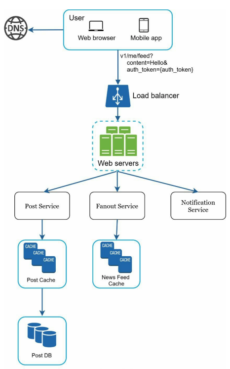
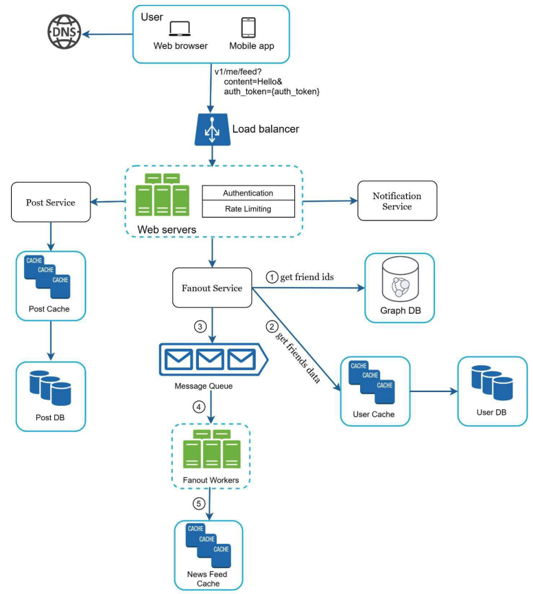
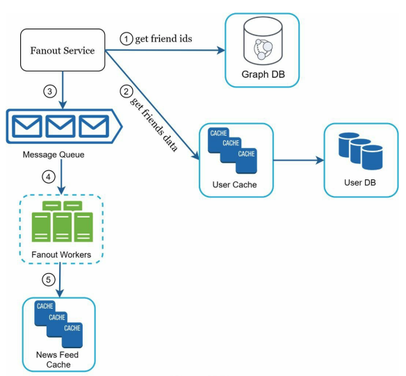
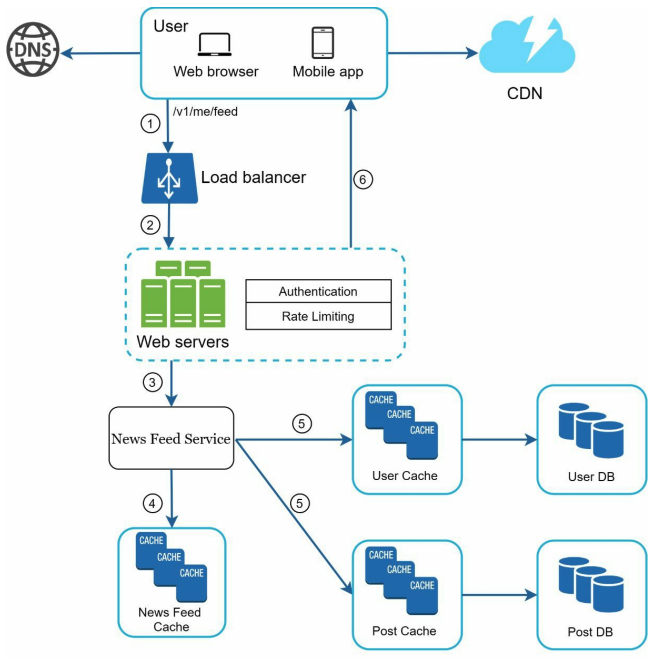
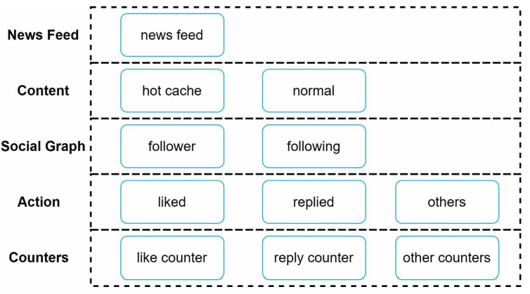

# Design new feed system

What is news feed? According to the Facebook help page, “News feed is the constantly updating list of stories in the middle of your home page. News Feed includes status updates, photos, videos, links, app activity, and likes from people, pages, and groups that you follow on Facebook”. This is a popular interview question. Similar questions commonly asked are: design Facebook news feed,
Instagram feed, Twitter timeline, etc.

## Step 1 - Understand the problem and establish design scope

The first set of clarification questions are to understand what the interviewer has in mind when she asks you to design a news feed system. At the very least, you should figure out what features to support. Here is an example of candidate-interviewer interaction:

**Candidate**: Is this a mobile app? Or a web app? Or both?   
**Interviewer**: Both

**Candidate**: What are the important features?   
**Interview**: A user can publish a post and see her friends’ posts on the news feed page.

**Candidate**: Is the news feed sorted by reverse chronological order or any particular order such as topic scores? For instance, posts from your close friends have higher scores.   
**Interviewer**: To keep things simple, let us assume the feed is sorted by reverse chronological order.

**Candidate**: How many friends can a user have?   
**Interviewer**: 5000

**Candidate**: What is the traffic volume?   
**Interviewer**: 10 million DAU

**Candidate**: Can feed contain images, videos, or just text?   
**Interviewer**: It can contain media files, including both images and videos. Now you have gathered the requirements, we focus on designing the system.

## Step 2 - Propose high-level design and get buy-in

The design is divided into two flows: feed publishing and news feed building.
- Feed publishing: when a user publishes a post, corresponding data is written into cache and database. A post is populated to her friends’ news feed.
- Newsfeed building: for simplicity, let us assume the news feed is built by aggregating friends’ posts in reverse chronological order.

### Newsfeed APIs

The news feed APIs are the primary ways for clients to communicate with servers. Those APIs are HTTP based that allow clients to perform actions, which include posting a status, retrieving news feed, adding friends, etc. We discuss two most important APIs: feed publishing API and news feed retrieval API.

#### Feed publishing API

To publish a post, a HTTP POST request will be sent to the server. The API is shown below:

*POST /v1/me/feed*

Params:
- content: content is the text of the post.
- auth_token: it is used to authenticate API requests.

#### Newsfeed retrieval API

The API to retrieve news feed is shown below:

*GET /v1/me/feed*

Params:
- auth_token: it is used to authenticate API requests.

### Feed publishing

High-level design of the feed publishing flow.

- User: a user can view news feeds on a browser or mobile app. A user makes a post with content “Hello” through API:
`/v1/me/feed?content=Hello&auth_token={auth_token}`
- Load balancer: distribute traffic to web servers.
- Web servers: web servers redirect traffic to different internal services.
- Post service: persist post in the database and cache.
- Fanout service: push new content to friends’ news feed. Newsfeed data is stored in the cache for fast retrieval.
- Notification service: inform friends that new content is available and send out push
notifications.

### Newsfeed building

The high-level design

- User: a user sends a request to retrieve her news feed. The request looks like this: `/v1/me/feed`.
- Load balancer: load balancer redirects traffic to web servers.
- Web servers: web servers route requests to newsfeed service.
- Newsfeed service: news feed service fetches news feed from the cache.
- Newsfeed cache: store news feed IDs needed to render the news feed.

## Step 3 - Design deep dive

The high-level design briefly covered two flows: feed publishing and news feed building. Here, we discuss those topics in more depth.

### Feed publishing deep dive

outlines the detailed design for feed publishing. We have discussed most of components in high-level design, and we will focus on two components: web servers and fanout service

#### Web servers

Besides communicating with clients, web servers enforce authentication and rate-limiting.

Only users signed in with valid *auth_token* are allowed to make posts. The system limits the number of posts a user can make within a certain period, vital to prevent spam and abusive content.

#### Fanout service

Fanout is the process of delivering a post to all friends. Two types of fanout models are: fanout on write (also called push model) and fanout on read (also called pull model). Both models have pros and cons. We explain their workflows and explore the best approach to support our system.

**Fanout on write**

With this approach, news feed is pre-computed during write time. A new post is delivered to friends’ cache immediately after it is published.

- ✅ Pros:
    - The news feed is generated in real-time and can be pushed to friends immediately.
    - Fetching news feed is fast because the news feed is pre-computed during write time.
- ❌ Cons:
    - If a user has many friends, fetching the friend list and generating news feeds for all of them are slow and time consuming. It is called hotkey problem.
    - For inactive users or those rarely log in, pre-computing news feeds waste computing resources.

**Fanout on read**

The news feed is generated during read time. This is an on-demand model. Recent posts are pulled when a user loads her home page.

- ✅ Pros:
    - For inactive users or those who rarely log in, fanout on read works better because it will not waste computing resources on them.
    - Data is not pushed to friends so there is no hotkey problem.
- ❌ Cons:
    - Fetching the news feed is slow as the news feed is not pre-computed.

We adopt a hybrid approach to get benefits of both approaches and avoid pitfalls in them. Since fetching the news feed fast is crucial, we use a push model for the majority of users. 

For celebrities or users who have many friends/followers, we let followers pull news content on-demand to avoid system overload. Consistent hashing is a useful technique to mitigate the hotkey problem as it helps to distribute requests/data more evenly. 

Let us take a close look at the fanout service as shown below

The fanout service works as follows:
1. Fetch friend IDs from the graph database. Graph databases are suited for managing friend relationship and friend recommendations. Interested readers wishing to learn more about this concept should refer to the reference material [2].
2. Get friends info from the user cache. The system then filters out friends based on user settings. For example, if you mute someone, her posts will not show up on your news feed even though you are still friends. Another reason why posts may not show is that a user could selectively share information with specific friends or hide it from other people.
3. Send friends list and new post ID to the message queue.
4. Fanout workers fetch data from the message queue and store news feed data in the news feed cache. You can think of the news feed cache as a `<post_id, user_id>` mapping table. Whenever a new post is made, it will be appended to the news feed table. The memory consumption can become very large if we store the entire user and post objects in the cache. Thus, only IDs are stored. To keep the memory size small, we set a configurable limit. The chance of a user scrolling through thousands of posts in news feed is slim. Most users are only interested in the latest content, so the cache missrate is low.
5. Store `<post_id, user_id >` in news feed cache. Figure below shows an example of what the news feed looks like in cache.

post_id | user_id
--------|--------
post_id | user_id
post_id | user_id
post_id | user_id
post_id | user_id
post_id | user_id
post_id | user_id

### Newsfeed retrieval deep dive

illustrates the detailed design for news feed retrieval

Media content (images, videos, etc.) are stored in CDN for fast retrieval. Let us look at how a client retrieves news feed.

1. A user sends a request to retrieve her news feed. The request looks like this: `/v1/me/feed`
2. The load balancer redistributes requests to web servers.
3. Web servers call the news feed service to fetch news feeds.
4. News feed service gets a list post IDs from the news feed cache.
5. A user’s news feed is more than just a list of feed IDs. It contains username, profile picture, post content, post image, etc. Thus, the news feed service fetches the complete user and post objects from caches (user cache and post cache) to construct the fully hydrated news feed.
6. The fully hydrated news feed is returned in JSON format back to the client for rendering

### Cache architecture

Cache is extremely important for a news feed system. We divide the cache tier into 5 layers

- News Feed: It stores IDs of news feeds.
- Content: It stores every post data. Popular content is stored in hot cache.
- Social Graph: It stores user relationship data.
- Action: It stores info about whether a user liked a post, replied a post, or took other actions on a post.
- Counters: It stores counters for like, reply, follower, following, etc.

## Step 4 - Wrap up

In this chapter, we designed a news feed system. Our design contains two flows: **feed publishing** and news **feed retrieval**

Like any system design interview questions, there is no perfect way to design a system. Every company has its unique constraints, and you must design a system to fit those constraints.

Understanding the tradeoffs of your design and technology choices are important. If there are a few minutes left, you can talk about scalability issues. To avoid duplicated discussion, only high-level talking points are listed below.

Scaling the database:
- Vertical scaling vs Horizontal scaling
- SQL vs NoSQL
- Master-slave replication
- Read replicas
- Consistency models
- Database sharding

Other talking points:
- Keep web tier stateless
- Cache data as much as you can
- Support multiple data centers
- Lose couple components with message queues
- Monitor key metrics. For instance, QPS during peak hours and latency while users refreshing their news feed are interesting to monitor.