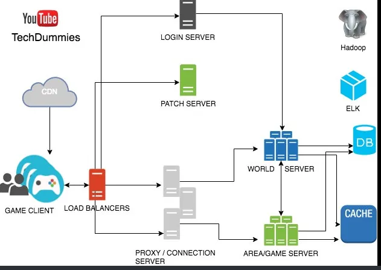

# Designing Online Game

It is crutial to recognize that multiplayer online game need synchronization of their states across various players with the following constraints.

1. Latency should be minimal.
2. Minimal bandthwidth taken for synchronization
3. Less jitter and choppyness in state update

First lests model our game as bunch of objects (character, scenes elements etc) and each of this object have certian location , orientitaiton and other attribute. All we have to do is to synchronize these object across all the players. Synchronization can be though of a certain server. We can imagine this as a MVC kind of architechure in front end as well as backend. Model is the object states in a game for a player X, Controller running in the Server (validating the state changes) and sending update request to all the other players to update their model (and in turn views of all other players). Most single user Game can be also modelled in MVC kind of pattern.

**What should you do to minimize latency:**
Based on the speed of light and current technology:
- it takes atleast 40ms to reach from east to west coast.
- 75 ms to reach from US to Europe
- 150 ms from US to Asia

Hence keeping your user near to the Gaming server is the key for reducing the latency!

**Why Do you need a gaming server, can you synchronize the states P2P within the players?** This is one of the option but it is less secure. Server can act as a AS (authoritative server) to validate the inputs of the user. Remember User can hack the system and some trusted authority must validate the moves. Servers does that

**What can you do to reduce the bandthwidth?**

Can we just transmit the actions of each users say in a bitvector of 64 possible actions.? This is a good idea to do as it need very small amout of data. We have to timestamp the data to that we know the sequence in which we have to apply this. So the datastructure is `<command_bit_vector,timestamp, useid>` **This is called deterministic lockstep**.

The problem is that system state can diverge if some of the **action_bitvectors are not applied (in order)**. In this case the system states for all the players can diverge.


**State Synchronization**

```
Object_state: <position,orientation,linear velocity, angular velocity>
```

Synchronize the state of objects. you can recreate the scene just by knowing the state information for the **all the objects** This takes lot of data to synchronized. (Maybe in MB’s). You can do smart encoding to compress.

You can synchronize the state of objects 30 times a second or so.You can still have jitter for inbetween time. You need a prediction module for interpolation

**Do I have to use TCP?**

TCP will block the access to packets with id N+1 if the id Nth packet is missing. Retransmission can cause lot of latency for the packet N, untill than the whole game will stall. One solution is to have a playout buffer in which we buffer K packets from the stream and then only apply them smoothly. This is same idea as buffring the movie. (This does introduce some latency due to buffering)

We can also use UDP with redundant information or a relaible UDP (RUDP) for smoother information.

**Rules of game:**

you have to do lot of if,else for each state of object. This can make the code messy.

**Use state machine rather than if else of code to handle the combination of various state, action pairs in different objects.**

So think object in every object as a state. And for each state you can define the possibley of options and actions. Use State design Pattern for this

## Backend Design



Notice we need CDN to distribute the resources (game patches and game installers). CDN is not streaming games like movies because game is a dynamic system

**Patch server** make sure all the player are running the same version of the game.

**Login Server** is doing auth of the user login and password

**Loadbalancer + proxy server (API gateway)**

You Need API gateway to terminate the TCP/UDP connection.

**WordServers** is the main server which keeps the complete index mapping of `<user_id,game_session_id> → Area Game server`

**Area Game server** is serving a region (think geographic region) of a big game area. This help is scalablity as not all players are in same area of the game. So we shard based on geo-location.

Do we have to do static assignment of the region → AreaGame Server or we need dynamic?

Static can waste resouce as it might be that few users are in one area and other area have lot of of users. Maybe do dynamic region assignment (which will be more complex)

Also Area game servers need to pass information of the various player states to the adjecent region Area Game servers.

## Refs

https://gafferongames.com/

<iframe width="560" height="315" src="https://www.youtube.com/embed/EU81tjgoKoI" title="YouTube video player" frameborder="0" allow="accelerometer; autoplay; clipboard-write; encrypted-media; gyroscope; picture-in-picture; web-share" allowfullscreen></iframe>


<iframe width="560" height="315" src="https://www.youtube.com/embed/K3Z1PY2vr3Q" title="YouTube video player" frameborder="0" allow="accelerometer; autoplay; clipboard-write; encrypted-media; gyroscope; picture-in-picture; web-share" allowfullscreen></iframe>