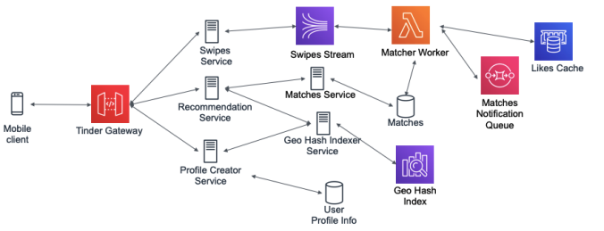
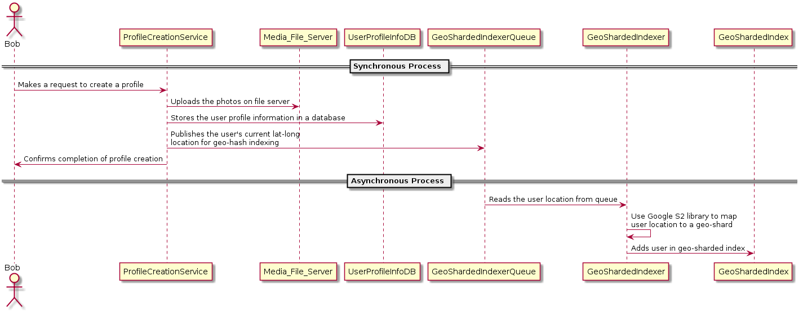
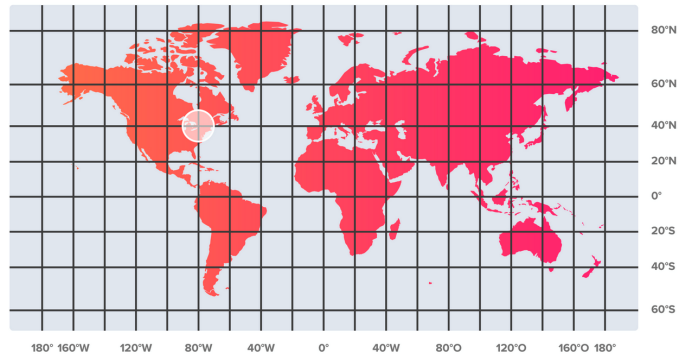
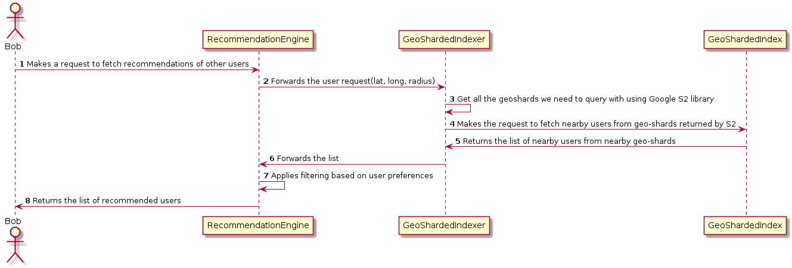
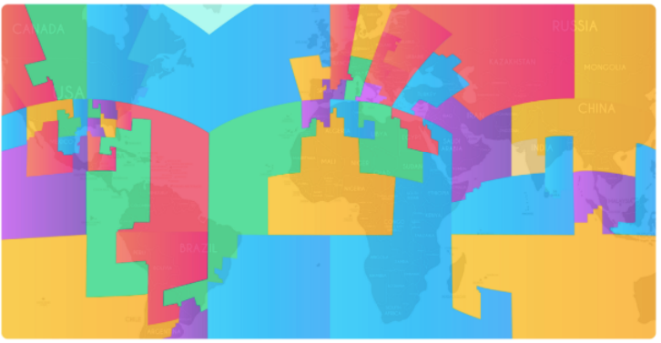
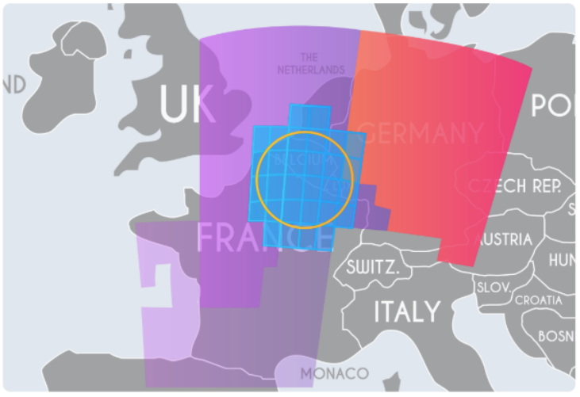
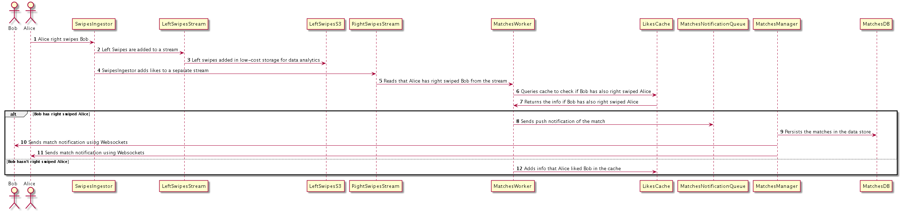
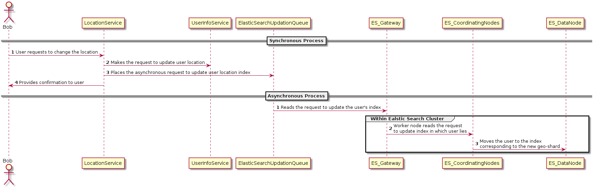
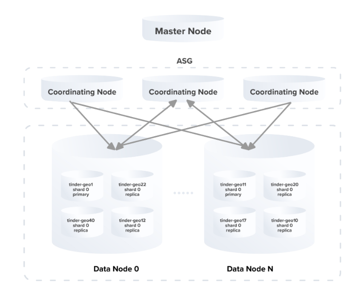

# Design Tinder

## Introduction

Note: This is a prototype on designing a location-based social search application that allows
users to use a swiping motion to like or dislike other users similar to Tinder. This has been
created by design based on ourresearch going through Tinder engineering blog. These
articles are quite informative and detailed. The detailed reference list of the tech talks and
blogs has been provided in reference section.

### Problem Statement

Design a location-based social search application similar to Tinder which if often used as
a dating service. It allows users to use a swiping motion to like (swipe right) or dislike
(swipe left) other users, and allows users to chat if both parties like each other (a "match").

### Gathering Requirements

**In Scope** The application should be able to support the following requirements.
- User should be able to create their Tinder profile by adding their bio and uploading photos.
- User should be able to view recommendations of other users in geographically nearby regions.
- Users should be able to like (swipe right) or dislike (swipe left) other recommended users.
- Users should get notifications when matched with other users.
- Users should be able to move to a different location and still get recommendations of nearby users.

**Out of Scope** Sending and receiving messages from other users. We have covered it in our article on designing WhatsApp (link here)

   
*Figure 9.1: High level Design - Tinder*

There will be a fleet of micro-services behind the Gateway which will be serving the
user requests. The Profile Creator Service will be invoked when the user profile gets created. This service will store the user information in a database and add the user to the
corresponding geo-sharded index so that the user shows up in recommendations of nearby
users. This index gets queried by the Recommendation Service when it receives the request to generate recommendations for other users. Once the user starts swiping through
those recommendations, the Swipes Service receives those swipes and places them in a
data-streams (e.g. AWS Kinesis/ SQS). There are a fleet of workers which read data from
those streams for generating matches. The workers do this by querying the LikesCache
to determine if it’s a match, in which case the match notification is sent to both the users
using technologies such as WebSockets.

## Component Design

   
*Figure 9.2: Sequence Diagram for User Profile Creation*

The sequence diagram above shows the sequence of operations which gets executed
when a user creates profile on Tinder. Within the synchronous process, the user media (e.g.
photos) is uploaded on a file server and the user information including user’s location is
persisted in a key-value store like Amazon DynamoDB. Additionally, this user is added to
a queue for adding the user to a geo-sharded index.

The asynchronous process reads the user information from the queue and passes this
information to the GeoShardingIndexer. The indexer uses geo libraries like Google’s S2
library to map user’s location to a geo-shard and add the user to the index associated with
that shard. This helps the user to show up in recommendations of other nearby users. For
instance, in the image below we have shown how a user from North America gets mapped
to the corresponding index so that the user gets shown in recommendations of nearby users.

   
*Figure 9.3: User from North America will be mapped to the corresponding shard (image:
tinder engineering blog)*

### User Profile Information - Sample data Model

We have shown below a json blob for storing the user profile information. We can use a key-value store such as Amazon DynamoDB or Riak for maintaining this data.

```json
{
    "userId" /* (PK) */ : "AWDGT567RTH",
    "name" : "Julie",
    "age" : 25,
    "gender" : "F",
    "location": {
        "latitude" : 1111,
        "longitude" : 1111
    },
    "media": {
        "images": [
            "https://mybucket.s3.amazonaws.com/myfolder/img1.jpg",
            "https://mybucket.s3.amazonaws.com/myfolder/img2.jpg",
            "https://mybucket.s3.amazonaws.com/myfolder/img3.jpg"
        ]
    },
    "recommendationPreferences": {
        "ageRange": {
            "min": 21,
            "max": 31
        },
        "radius": 50
    }
}
```

### Fetch User recommendations

In the previous section, shows how users get added into the geo-sharded index. Let’s see
how the user gets shown in the recommendation of other users. When a user request arrives
at the Recommendation Engine it is forwarded to the request to the GeoShardedIndexer.
The indexer determines the geo-shards to be queried based on user location and radius using geo-libraries like Google’s S2. Followed by, the indexer queries all the geo-sharded indexes (more details in next section) are mapped to the shards returned by Google S2 to
fetch the list of all the users in those indexes and returns that list to the RecommendationEngine. The engine applies filtering on the list based on user preferences and returns the
final list of recommendations to the user

   
*Figure 9.4: Fetch User recommendations*


### Geo-Sharded Index
A naïve approach of maintaining this index would be to have an Elasticsearch cluster with
one index and the default number of shards. However, this approach won’t hold up to the
scaling expectations which an application like Tinder requires. We should leverage the
fact that Tinder’s recommendations are location-based. For instance, when we are serving
a user from India, we don’t need to include the users from USA. This fact can be used
by keeping an optimal index size for better performance. We can optimize the index size
by sharding the active user records based on their geo-locations so that the active user
count will remain balanced across shards. We can represent the balance of a geo-sharding
configuration with N shards by the standard deviation of active user counts across shards
as mentioned below.

Balance(Shard1, Shard2,. . . , ShardN) = standard-deviation(Active User Count of Shard1,
Shard2,. . . , ShardN)

The geo-sharding configuration with the minimal standard deviation would be best balanced. Geo-libraries like Google’s S2 Library can be used which are based on hierarchical decomposition of sphere into “cells” using Quad-Trees. A visualization of generated geosharded map for our user-case is shown below. The inference from the given graph is, that
geo-shards are physically closer and larger for areas having lower number of active users. For instance, in the image below shards are larger on water bodies like seas and oceans as they only have users from some islands, however, shards are smaller on land. In the image below, it can seen that North America has three shards, however, entire England and
Greenland along-with a large portion of Atlantic Ocean share a single shard due to lesser
density of active users.

The S2 library provides two major functions: 
1. given a location point (lat, long), return the S2 cell that contains it 
2. given a circle (lat, long, radius), return the S2 cells that cover the circle. Each S2 cell can be represented by a geo-shard which will be mapped to an index in our system. When a profile gets created, the user is added to the search index for that corresponding S2 cell. To fetch recommendations for a user, we query the indexes of the nearby S2 cells depending on the circle radius as shown in the image below.

   
*Figure 9.5: Geo-sharded map generated by Google S2, each shard us a S2 cell (image: Tinder engineering blog )*

   
*Figure 9.6: Fetching recommendations for a user from nearby shards(image: Tinder engineering blog)*

### Swipes and Matches

The above image shows the sequence of operations which gets executed when a user swipes
left/right. The swipes ingester processes the swipes and puts the left swipes into a stream

   
*Figure 9.7: Sequence of operations for user swipes and matching*

which persist those swipes to a low-cost data storage (e.g. Amazon S3). These left swipes
can be used for data analysis for some user cases.

On the other hand, the right swipes are put in a separate stream and is ultimately read
by matcher worker thread. The matcher worker threads reads the likes message from the
stream and checks if the corresponding entry exist in the LikesCache. For instance, in the
image above Alice likes Bob and the match worker checks if an entry exists for Bob liking
Alice in the cache. If both Alice and Bob likes each other then it’s called a match and a
match notification is sent both the users using server push mechanism like Websockets. If
Bob hasn’t liked Alice yet, an entry is made in the LikesCache for Alice liking Bob.

### Matches Data Model

We can use a key-value store (e.g. Amazon DynamoDB) to persist the information about
matches (users liking each other). The hash key used for this data store can be a composite
key of the unique identifiers of the users who liked each other. The value in the data-store
will contain metadata information related to the match.

<table>
<tr>
    <th>Key</th>
    <th>Value</th>
</tr>
<tr>
    <td>
    userId1_userId2
    <br/>
    (e.g AWDGT567RTH_ARTHT567WDG)
    </td>
    <td>
        <code>
        <pre>
{
    "matchTimestamp": T2,
    "likes": [
        {
            "likeId": "AWDGT567RTH",
            "userLikeId": "ARTHT567WDG",
            "timestamp": T1
        },
        {
            "likeId": "ARTHT567WDG",
            "userLikeId": "AWDGT567RTH",
            "timestamp": T2
        },
    ]
}
        </pre>
        </code>
    </td>
</tr>
</table>

   
*Figure 9.8: User switching locations*

### User Switching Locations

When a user changes locations it has to be ensured to provide recommendations to the user
from the new location and vice-versa. The user location gets updated to the new location so
that the updated location is used for fetching recommendations for the user. Additionally,
the index mapped is also updated to user’s new location with user’s information so the user
shows up in recommendations at the location. This process gets executed asynchronously.

The elastic search cluster (explained below) containing the geo-sharded indexes which
reads the message from a queue to update user’s index. The elastic search is co-ordinating
nodes moving the user’s information from the index mapped to user’s old location to the
index mapped to user’s new location. This ensures that the user shows up in recommendations of other users in the new location.

### Elastic Search Cluster

The cluster will comprise of multiple master nodes, each having two auto-scaling groups(ASG),
one containing only coordinating nodes (this is where all the requests are sent) and another
containing all the data nodes. Each data node will contain certain number of indexes (combination of primaries and replicas) of randomly distributed shards. For each user query,
the responsibility of the co-ordinating node is to query the data-nodes of the target shards
for handling the user query. The increase in reliability and robustness of the elastic search
cluster by sharding the user data using their geographical locations and creating replicas of
those shards.

## Optimization

   
*Figure 9.9: Geo-sharded cluster architecture*

One of the most important aspects of an application like Tinder is the recommendations
(of potential matches) it is provide to a user. In one the sections above, it shown how
to generate recommendations for a user by querying indexes corresponding to the nearby
geo-shards of a user. The system can be optimized by applying machine learning to rank the recommendations. The machine learning model will optimize on the user’s potential
to right swipe recommended potential matches. The features which may impact user’s
decision to swipe left or right are listed below: 
- **User demographics data**: Age, Gender, Race, Location, Profession and so forth
- **User’s Tinder history data**: Swipe Left, Swipe Rights, Historical geo-locations, Daily usage time
- **Extracted Information from User’s Bio**: Likes, Dislikes, Preferences
- **Extracted Information from user’s pictures**: Facial features, Hair color, Body type

A regression problem can be framed by using these features to find the probability that
the user will swipe right a recommendation. We can then leverage algorithms such as
Logistic Regression to compute those probabilities, which will be used for ranking the
recommendations. In addition to this, we can also optimize the mechanism to send match
notifications to user by prefetching the information that a user has been swiped right by a
recommended user. Pre-fetching this information, we can notify the user about a match (if
and when it occurs) right-away, hence preventing the network call. For instance, if Alice is
shown in Bob’s recommendation and Alice has already swiped Bob right then Bob gets an
instantaneous match notification (without any network hop) in case Bob swipes Alice right
too.

## Fitness check up

1. Why are we geo-sharded index for storing generating recommendations for user?
    - (a) Usage of geo-sharded index optimizes the query performance to fetch user recommendations
    - (b) It doesn’t provide a major advantage and we will be better off using a data store.
2. What is the main advantage of using a composite key of the userIds who liked each other in the MatchesDB?
    - (a) It helps prevent hot partition problems.
    - (b) It optimizes the query performance to fetch the matches of a given user.