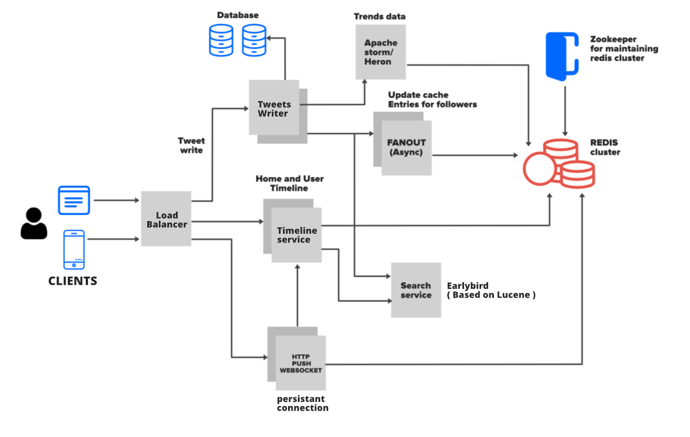
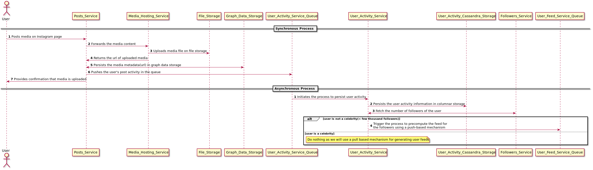
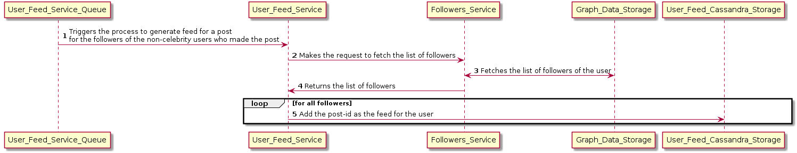
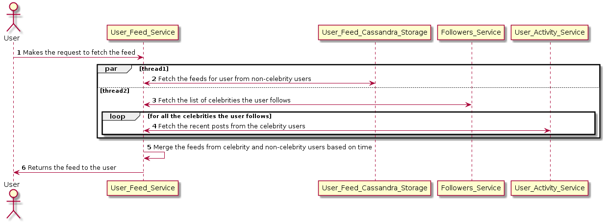
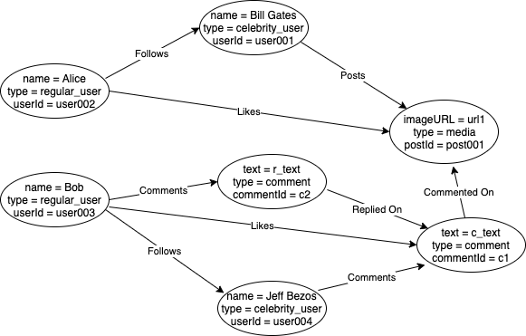
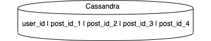
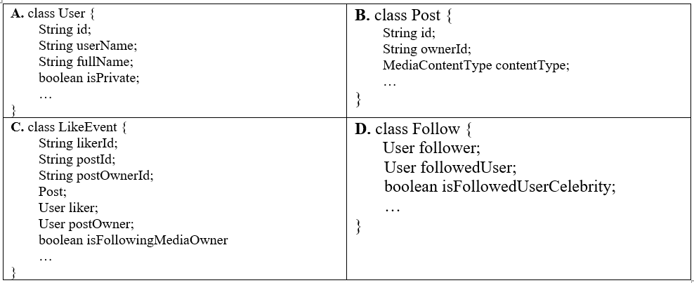
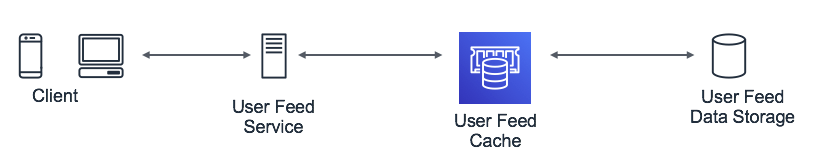
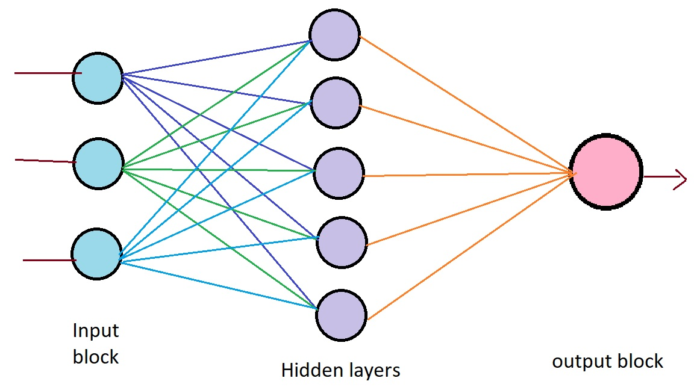

# Design Twitter

Note: : This is our prototype on designing a microblogging and social networking platform on which users interact with each other using messages known as “tweets”. Users can post, like, and retweet tweets for which notifications will be sent to the all the partaking users. We have created this design based on our research going through Twitter and Instagram Engineering tech-talks. These talks are quite informative and detailed, and for the same reason, we have taken inspiration from those talks.

## Introduction

## Problem Statement

In this chapter, we will design a microblogging platform similar to Twitter where users can post a tweet and it will be shared it with the user followers. Subsequently, the users will be able to view personalized feeds containing posts from all the other users that they follow.

### 7.1.2 Gathering Requirements 

**In Scope** The application
- Users should be able to post and view their tweets. • Users should be able to follow other users.
- Users can view feeds containing tweets from the users they follow. • Users should be able to like and comment on tweets.

**Out of Scope**
- Sending and receiving messages from other users. We have covered it in our article on designing WhatsApp.
- Providing personalized notifications to users.

##  Detailed Design 

### Architecture

An application like twitter requires a high-level design but before jumping into the details it can be modeled into block such as:
1. Data Modeling: In this block the database will be stored. The database such as username, id, content from the user, request etc. The detailed database used are given in the further system components. 
2. Server feeds: This will collect all the feeds from the people user follows and arrange them in chronological order.

Therefore, when the server receives a request for an action (tweet, like etc.) from a client it performs two parallel operations: 
1. it persists the action in the data store 
2.  publishes the action in a streaming data store for a pub-sub model. It is followed by the various services (e.g. User Feed Service, Media Counter Service) reading the actions from the streaming data store and performs their specific tasks. The streaming data store makes the system extensible to support other use-cases (e.g. media search index, locations search index, and so forth) in future.

### System Components

The system will comprise of several micro-services each performing a separate task. We will use a graph database such as Neo4j to store the information. The reason we have chosen a graph data-model is that our data will contain complex relationships between data entities such as users, tweets, and comments as nodes of the graph. We will then use edges of the graph to store relationships such as follows, likes, comments, and so forth. Additionally, we can use columnar databases like Cassandra to store information like user feeds, activities, and counters.


*Figure 7.1: High level System components*


##  Component Design 

### Tweeting a post


*Figure 7.2: Synchronous and Asynchronous process for posting on Twitter*

There are two major processes which are executed when a user posts a tweet. Firstly, the synchronous process which is responsible for uploading any media content on file storage, persisting the media metadata in graph data-storage, returning the confirmation message to the user and triggering the process to update the user activity. The second process occurs asynchronously by persisting user activity in a columnar data-storage(Cassandra) and trig- gering the process to pre-compute the feed of followers of non-celebrity users (having few thousand followers). We don’t pre-compute feeds for celebrity users (have 1M+ followers) as the process to fan-out the feeds to all the followers will be extremely compute and I/O intensive.

### API Design - Create a tweet

We have provided the API design of posting an image on Instagram below. We will send the file and data over in one request using the multipart/form-data content type. The MultiPart/Form-Data contains a series of parts. Each part is expected to contain a content- disposition header [RFC 2183] where the disposition type is "form-data”.

**URL**
```
POST /users/<user_id>/posts
```

**Sample Request Body**: 
```
Content-Type: multipart/form-data ; boundary=ExampleFormBoundary
--ExampleFormBoundary
Content-Disposition:
form-data; name="file"; filename="test.png"
Content-Type: image/png
{image file data bytes}
--ExampleFormBoundary--
```

**Sample response**
```
{
    "type": "ImageFile",
    "id": "667",
    "createdAt": "1466623229",
    "createdBy": "9",
    "name": "test.png",
    "updatedAt": "1466623230",
    "updatedBy": "9",
    "fullImageUrl":
    “https://mybucket.s3.amazonaws.com/myfolder/test.jpg",
    "size": {
            "type": "Size",
            "width": "316",
            "height": "316"
    }, 
}
```

### Precompute feeds

This process starts executing when non-celebrity users make a post on Instagram. It is triggered when a message is added in the User Feed Service Queue. Once the message is added in the queue, the User Feed Service makes a call to the Followers Service to fetch the list of followers of the user. After that, the post gets added to the feed of all the followers in the columnar data storage.


*Figure 7.3: Pre-compute feeds from non celebrity users*

### Fetching User Feed

When a user requests for feed then there will be two parallel threads involved in fetching the user feeds to optimize for latency. The first thread will fetch the feeds from non- celebrity users which the user follows. These feeds are populated by the fan-out mecha- nism described in the PreCompute Feeds section above. The second thread is responsible for fetching the feeds of celebrity users whom the user follow. After that, the User Feed Service will merge the feeds from celebrity and non-celebrity users and return the merged feeds to the user who requested the feed.


*Figure 7.4: Sequence of operations involved in fetching user feed*

### API Design - get feeds

**URL:**
```
GET /users/me/feeds
```

**Sample Response**
The response below can be mapped directly to the graph data model mentioned in the next section.

```
{
    “feeds”: [
        {
            “postId”: “post001”,
            “postOwnerId” : “user001”,
            “postOwnerName” : “Bill Gates”,
            “mediaURL” : “https://mybucket.s3.amazonaws.com/myfolder/test.jpg”,
            “numberOfLikes” : 400000
            “numberOfComments” : 19789
            “comments”: [{
                “commenterUserId” : “user004”,
                “commenterName” : “JeffBezos”
                “comment” : “Amazing!”
                “likes” : [
                    {
                        “likerId” : “user003”,
                        “likerUserName” : “Bob”
                    }
                ]
            }]
        }
    ]
}

```

## Data Models

### Graph Data Models

We can use a graph database such as Neo4j which stores data-entities such as user infor- mation, posts, comments, and so forth as nodes in the graph. The edges between the nodes are used to store the relationship between data entities such as followers, posts, comments, likes, and replies. All the nodes are added to an index called nodeIndex for faster lookups. We have chosen this NoSQL based solution over relational databases as it provides the scalability to have hierarchies which go beyond two levels and extensibility due to the schema-less behavior of NoSQL data storage.


*Figure 7.5: Graph representation of users, posts and comments*

#### Sample Queries supported by Graph Databases

**Fetch all the followers of Jeff Bezos**

```java
Node jeffBezos = nodeIndex.get(“userId”, “user004”);

List<Node> jeffBezosFollowers = new ArrayList();
for (Relationship relationship: jeffBezos.getRelationships(INGOING, FOLLOWS))
{
   jeffBezosFollowers.add(relationship.getStartNode());
}
```

**Fetch all the posts of Bill Gates**

```java
Node billGates = nodeIndex.get(“userId”, “user001”);

List<Node> billGatesPosts = new ArrayList();
for (Relationship relationship: billGates.getRelationships(OUTGOING, POSTS))
{
    billGatesPosts.add(relationship.getEndNode());
}
```

**Fetch all the posts of Bill Gates on which Jeff Bezos has commented**

```java
List<Node> commentsOnBillGatesPosts = new ArrayList<>();
for(Node billGatesPost : billGatesPosts) {
    for (Relationship relationship: billGates.getRelationships(INGOING, COMMENTED_ON)) {
        commentsOnBillGatesPosts.add(relationship.getStartNode());
    }
}

List<Node> jeffBezosComments = new ArrayList();
for (Relationship relationship: jeffBezos.getRelationships(OUTGOING, COMMENTS)) {
    jeffBezosComments.add(relationship.getEndNode());
}
List<Node> jeffBezosCommentsOnBillGatesPosts =
                                commentsOnBillGatesPosts.intersect(jeffBezosComments);
```

### Columnar Data Model

   
*Figure 7.6: Columnar Data Model for user feed and activities*

We will use columnar data storage such as Cassandra to store data entities like user feed and activities. Each row will contain feed/activity information of the user. We can also have a TTL based functionality to evict older posts. The data model will look something similar to:

`User_id -> List<post_id>`

::: tip FUN FACT
In this talk, Dikang Gu, a software engineer at Instagram core infra team has mentioned about how they use Cassandra to serve critical use cases, high scalability requirements, and some pain points.
:::

### Streaming Data Model

We can use cloud technologies such as Amazon Kinesis or Azure Stream Analytics for collecting, processing, and analyzing real-time, streaming data to get timely insights and react quickly to new information(e.g. a new like, comment, etc.). We have listed below the de-normalized form of some major streaming data entities and action.

   
*Figure 7.7: De normalised major data-entities and actions*

The data entities **A** and **B** above show the containers which contain denormalized in- formation about the Users and their Posts. Subsequently, the data entities **C** and **D** denote the different actions which users may take. The entity C denotes the event where a user likes a post and entity D denotes the action when a user follows another user. These actions are read by the related micro-services from the stream and processed accordingly. For in- stance, the LikeEvent can be read by the Media Counter Service and is used to update the media count in the data storage.

## Optimization

We will use a cache having an LRU based eviction policy for caching user feeds of active users. This will not only reduce the overall latency in displaying the user-feeds to users but will also prevent re-computation of user-feeds.

   
*Figure 7.8: LRU bases cache for storing user feeds of active users*

The scope of optimization lies in providing the best content in the user feeds. We can do this by ranking the new feeds (the ones generated after users last login) from those who the user follows. We can apply machine learning techniques to rank the user feeds by assigning scores to the individual feeds which would indicate the probability of click, like, comment and so forth. We can do this by representing each feed by a feature vector which contains information about the user, the feed and the interactions which the user has had with the people in the feed (e.g. whether the user had clicked/liked/commented on the previous feeds by the people in the story). It’s apparent that the most important features for feed ranking will be related to social network. Some of the keys of understanding the user network are listed below.
- Who is the user a close follower of? For example, one user is a close follower of Elon Musk while another user can be a close follower of Gordon Ramsay.
- Whose photos the user always like?
- Whose links are most interesting to the user?

We can use deep neural networks which would take the several features (> 100K dense features) which we require for training the model. Those features will be passed through the n-fold layers, and will be used for predicting the probability of the different events (likes, comments, shares, etc.).

   
*Figure 7.9: Block diagram of deep neural networks*

::: FUN FACT
In this talk, Lars Backstrom, VP of Engineering @ Facebook talks about the machine learning done to create personalized news feeds for users. He talks about the classical machine learning approach they used in the initial phases for personalizing News Feeds by using decision trees and logistic regression. He then goes to talk about the improvements they have observed in using neural networks.
:::