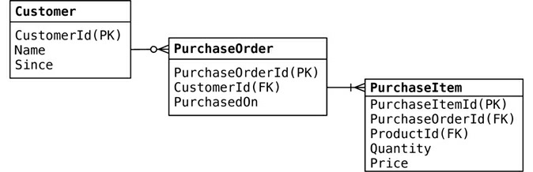
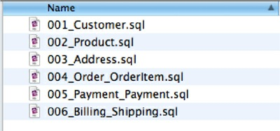
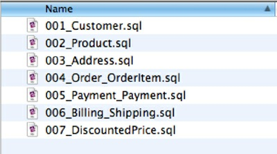
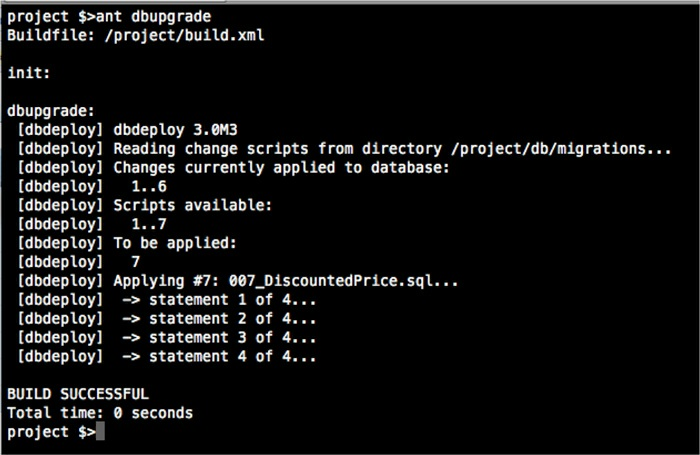
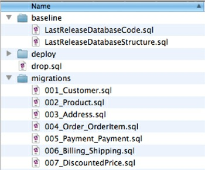
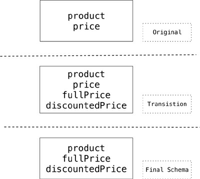

# Chapter 12. Schema Migrations

## 12.1. Schema Changes

The recent trend in discussing NoSQL databases is to highlight their _schemaless_ nature—it is a
popular feature that allows developers to concentrate on the domain design without worrying about
schema changes. It’s especially true with the rise of agile methods [Agile Methods] where responding
to changing requirements is important.

Discussions, iterations, and feedback loops involving domain experts and product owners are
important to derive the right understanding of the data; these discussions must not be hampered by a
database’s schema complexity. With NoSQL data stores, changes to the schema can be made with the
least amount of friction, improving developer productivity (“The Emergence of NoSQL,” p. 9 ). We
have seen that developing and maintaining an application in the brave new world of schemaless
databases requires careful attention to be given to schema migration.

## 12.2. Schema Changes in RDBMS

While developing with standard RDBMS technologies, we develop objects, their corresponding
tables, and their relationships. Consider a simple object model and data model that has Customer,
Order, and OrderItems. The ER model would look like Figure 12.1.



**Figure 12.1. Data model of an e-commerce system**

While this data model supports the current object model, life is good. The first time there is a
change in the object model, such as introducing preferredShippingType on the Customer object,
we have to change the object and change the database table, because without changing the table the
application will be out of sync with the database. When we get errors like ORA-00942: table or
view does not exist or ORA-00904: "PREFERRED_SHIPPING_TYPE": invalid identifier,
we know we have this problem.

Typically, a database schema migration has been a project in itself. For deployment of the schema
changes, database change scripts are developed, using diff techniques, for all the changes in the
development database. This approach of creating migration scripts during the deployment/release
time is error-prone and does not support agile development methods.

### **12.2.1. Migrations for Green Field Projects**

Scripting the database schema changes during development is better, since we can store these schema
changes along with the data migration scripts in the same script file. These script files should be


named with incrementing sequential numbers which reflect the database versions; for example, the
first change to the database could have script file named as 001_Description_Of_Change.sql.
Scripting changes this way allows for the database migrations to be run preserving the order of
changes. Shown in Figure 12.2 is a folder of all the changes done to a database so far.



**Figure 12.2. Sequence of migrations applied to a database**

Now, suppose we need to change the OrderItem table to store the DiscountedPrice and the
FullPrice of the item. This will need a change to the OrderItem table and will be change number
007 in our sequence of changes, as shown in Figure 12.3.



**Figure 12.3. New change 007_DiscountedPrice.sql applied to the database**

We applied a new change to the database. This change’s script has the code for adding a new
column, renaming the existing column, and migrating the data needed to make the new feature work.
Shown below is the script contained in the change 007_DiscountedPrice.sql:


```sql
ALTER TABLE orderitem ADD discountedprice NUMBER(18,2) NULL;
UPDATE orderitem SET discountedprice = price;
ALTER TABLE orderitem MODIFY discountedprice NOT NULL;
ALTER TABLE orderitem RENAME COLUMN price TO fullprice;
--//@UNDO
ALTER TABLE orderitem RENAME fullprice TO price;
ALTER TABLE orderitem DROP COLUMN discountedprice;
```

The change script shows the schema changes to the database as well as the data migrations needed
to be done. In the example shown, we are using DBDeploy [DBDeploy] as the framework to manage
the changes to the database. DBDeploy maintains a table in the database, named ChangeLog, where
all the changes made to the database are stored. In this table, Change_Number is what tells everyone
which changes have been applied to the database. This Change_Number, which is the database
version, is then used to find the corresponding numbered script in the folder and apply the changes


which have not been applied yet. When we write a script with the change number 007 and apply it to
the database using DBDeploy, DBDeploy will check the ChangeLog and pick up all the scripts from
the folder that have not yet been applied. Figure 12.4 is the screenshot of DBDeploy applying the
change to the database.



**Figure 12.4. DBDeploy upgrading the database with change number 007**

The best way to integrate with the rest of the developers is to use your project’s version control
repository to store all these change scripts, so that you can keep track of the version of the software
and the database in the same place, eliminating possible mismatches between the database and the
application. There are many other tools for such upgrades, including Liquibase [Liquibase], MyBatis
Migrator [MyBatis Migrator], DBMaintain [DBMaintain].

### **12.2.2. Migrations in Legacy Projects**

Not every project is a green field. How to implement migrations when an existing application is in
production? We found that taking an existing database and extracting its structure into scripts, along
with all the database code and any reference data, works as a baseline for the project. This baseline
should not contain transactional data. Once the baseline is ready, further changes can be done using
the migrations technique described above (Figure 12.5).



**Figure 12.5. Use of baseline scripts with a legacy database**

One of the main aspects of migrations should be maintaining backward compatibility of the
database schema. In many enterprises there are multiple applications using the database; when we
change the database for one application, this change should not break other applications. We can
achieve backward compatibility by maintaining a transition phase for the change, as described in
detail in _Refactoring Databases_ [Ambler and Sadalage].

During a **transition phase** , the old schema and the new schema are maintained in parallel and are
available for all the applications using the database. For this, we have to introduce scaffolding code,
such as triggers, views, and virtual columns ensuring other applications can access the database
schema and the data they require without any code changes.

```sql
ALTER TABLE customer 
ADD fullname VARCHAR2(60);
UPDATE customer SET fullname = fname;

CREATE OR REPLACE TRIGGER SyncCustomerFullName
BEFORE INSERT OR UPDATE
ON customer
REFERENCING OLD AS OLD NEW AS NEW
FOR EACH ROW
BEGIN
    IF :NEW.fname IS NULL 
        THEN :NEW.fname := :NEW.fullname;
    END IF;
    IF :NEW.fullname IS NULL 
        THEN :NEW.fullname := :NEW.fname
    END IF;
END;
/
--Drop Trigger and fname
--when all applications start using customer.fullname
```

In the example, we are trying to rename the customer.fname column to customer.fullname as
we want to avoid any ambiguity of fname meaning either fullname or firstname. A direct rename
of the fname column and changing the application code we are responsible for may just work, for our
application—but will not for the other applications in the enterprise that are accessing the same
database.


Using the transition phase technique, we introduce the new column fullname, copy the data over to
fullname, but leave the old column fname around. We also introduce a BEFORE UPDATE trigger to
synchronize data between the columns before they are committed to the database.

Now, when applications read data from the table, they will read either from fname or from
fullname but will always get the right data. We can drop the trigger and the fname column once all
the applications have moved on to using the new fullname column.

It’s very hard to do schema migrations on large datasets in RDBMS, especially if we have to keep
the database available to the applications, as large data movements and structural changes usually
create locks on the database tables.

## 12.3. Schema Changes in a NoSQL Data Store

An RDBMS database has to be changed before the application is changed. This is what the _schema-
free_ , or _schemaless_ , approach tries to avoid, aiming at flexibility of schema changes per entity.
Frequent changes to the schema are needed to react to frequent market changes and product
innovations.

When developing with NoSQL databases, in some cases the schema does not have to be thought
about beforehand. We still have to design and think about other aspects, such as the types of
relationships (with graph databases), or the names of the column families, rows, columns, order of
columns (with column databases), or how are the keys assigned and what is the structure of the data
inside the value object (with key-value stores). Even if we didn’t think about these up front, or if we
want to change our decisions, it is easy to do so.

The claim that NoSQL databases are entirely schemaless is misleading; while they store the data
without regard to the schema the data adheres to, that schema has to be defined by the application,
because the data stream has to be parsed by the application when reading the data from the database.
Also, the application has to create the data that would be saved in the database. If the application
cannot parse the data from the database, we have a schema mismatch even if, instead of the RDBMS
database throwing a error, this error is now encountered by the application. Thus, even in schemaless
databases, the schema of the data has to be taken into consideration when refactoring the application.

Schema changes especially matter when there is a deployed application and existing production
data. For the sake of simplicity, assume we are using a document data store like MongoDB
[MongoDB] and we have the same data model as before: customer, order, and orderItems.


```json
{
    "_id": "4BD8AE97C47016442AF4A580",
    "customerid": 99999,
    "name": "Foo Sushi Inc",
    "since": "12/12/2012",
    "order": {
        "orderid": "4821-UXWE-122012","orderdate": "12/12/2001",
        "orderItems": [
            {"product": "Fortune Cookies","price": 19.99}
        ]
    }
}
```

Application code to write this document structure to MongoDB:

```java
BasicDBObject orderItem = new BasicDBObject();
orderItem.put("product", productName);
orderItem.put("price", price);
orderItems.add(orderItem);
```

Code to read the document back from the database:

```java
BasicDBObject item = (BasicDBObject) orderItem;
String productName = item.getString("product");
Double price = item.getDouble("price");
```

Changing the objects to add preferredShippingType does not require any change in the database,
as the database does not care that different documents do not follow the same schema. This allows for
faster development and easy deployments. All that needs to be deployed is the application—no
changes on the database side are needed. The code has to make sure that documents that do not have
the preferredShippingType attribute can still be parsed—and that’s all.

Of course we are simplifying the schema change situation here. Let’s look at the schema change we
made before: introducing discountedPrice and renaming price to fullPrice. To make this change,
we rename the price attribute to fullPrice and add discountedPrice attribute. The changed
document is

```json
{
    "_id": "5BD8AE97C47016442AF4A580",
    "customerid": 66778,
    "name": "India House",
    "since": "12/12/2012",
    "order": {
        "orderid": "4821-UXWE-222012",
        "orderdate": "12/12/2001",
        "orderItems": [{"product": "Chair Covers",
            "fullPrice": 29.99,
            "discountedPrice":26.99}]
    }
}
```

Once we deploy this change, new customers and their orders can be saved and read back without
problems, but for existing orders the price of their product cannot be read, because now the code is
looking for fullPrice but the document has only price.

### **12.3.1. Incremental Migration**

Schema mismatch trips many new converts to the NoSQL world. When schema is changed on the
application, we have to make sure to convert all the existing data to the new schema (depending on
data size, this might be an expensive operation). Another option would be to make sure that data,
before the schema changed, can still be parsed by the new code, and when it’s saved, it is saved back
in the new schema. This technique, known as **incremental migration** , will migrate data over time;
some data may never get migrated, because it was never accessed. We are reading both price and
fullPrice from the document:

```java
BasicDBObject item = (BasicDBObject) orderItem;
String productName = item.getString("product");

Double fullPrice = item.getDouble("price");
if (fullPrice == null) {
    fullPrice = item.getDouble("fullPrice");
}
Double discountedPrice = item.getDouble("discountedPrice");
```

When writing the document back, the old attribute price is not saved:


```java
BasicDBObject orderItem = new BasicDBObject();
orderItem.put("product", productName);
orderItem.put("fullPrice", price);
orderItem.put("discountedPrice", discountedPrice);
orderItems.add(orderItem);
```

When using incremental migration, there could be many versions of the object on the application
side that can translate the old schema to the new schema; while saving the object back, it is saved
using the new object. This gradual migration of the data helps the application evolve faster.

The incremental migration technique will complicate the object design, especially as new changes
are being introduced yet old changes are not being taken out. This period between the change
deployment and the last object in the database migrating to the new schema is known as the transition
period (Figure 12.6). Keep it as short as possible and focus it to the minimum possible scope—this
will help you keep your objects clean.




**Figure 12.6. Transition period of schema changes**

The incremental migration technique can also be implemented with a schema_version field on the
data, used by the application to choose the correct code to parse the data into the objects. When
saving, the data is migrated to the latest version and the schema_version is updated to reflect that.

Having a proper translation layer between your domain and the database is important so that, as the
schema changes, managing multiple versions of the schema is restricted to the translation layer and
does not leak into the whole application.

Mobile apps create special requirements. Since we cannot enforce the latest upgrades of the
application, the application should be able to handle almost all versions of the schema.


### **12.3.2. Migrations in Graph Databases**

Graph databases have edges that have types and properties. If you change the type of these edges in
the codebase, you no longer can traverse the database, rendering it unusable. To get around this, you
can traverse all the edges and change the type of each edge. This operation can be expensive and
requires you to write code to migrate all the edges in the database.

If we need to maintain backward compatibility or do not want to change the whole graph in one go,
we can just create new edges between the nodes; later when we are comfortable about the change, the
old edges can be dropped. We can use traversals with multiple edge types to traverse the graph using
the new and old edge types. This technique may help a great deal with large databases, especially if
we want to maintain high availability.

If we have to change properties on all the nodes or edges, we have to fetch all the nodes and
change all the properties that need to be changed. An example would be adding NodeCreatedBy and
NodeCreatedOn to all existing nodes to track the changes being made to each node.

```java
for (Node node : database.getAllNodes()) {
    node.setProperty("NodeCreatedBy", getSystemUser());
    node.setProperty("NodeCreatedOn", getSystemTimeStamp());
}
```

We may have to change the data in the nodes. New data may be derived from the existing node
data, or it could be imported from some other source. The migration can be done by fetching all nodes
using an index provided by the source of data and writing relevant data to each node.

### **12.3.3. Changing Aggregate Structure**

Sometimes you need to change the schema design, for example by splitting large objects into smaller
ones that are stored independently. Suppose you have a customer aggregate that contains all the
customers orders, and you want to separate the customer and each of their orders into different
aggregate units.

You then have to ensure that the code can work with both versions of the aggregates. If it does not
find the old objects, it will look for the new aggregates.

Code that runs in the background can read one aggregate at a time, make the necessary change, and
save the data back into different aggregates. The advantage of operating on one aggregate at a time is
that this way, you’re not affecting data availability for the application.

## 12.4. Further Reading

For more on migrations with relational databases, see [Ambler and Sadalage]. Although much of this
content is specific to relational work, the general principles in migration will also apply to other
databases.

## 12.5. Key Points

- Databases with strong schemas, such as relational databases, can be migrated by saving each schema change, plus its data migration, in a version-controlled sequence.
- Schemaless databases still need careful migration due to the implicit schema in any code that accesses the data.
- Schemaless databases can use the same migration techniques as databases with strong schemas.
- Schemaless databases can also read data in a way that’s tolerant to changes in the data’s implicit schema and use incremental migration to update data.

