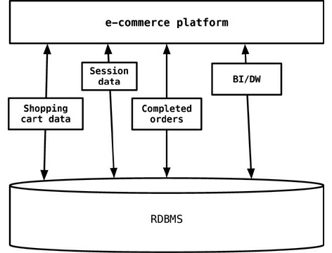
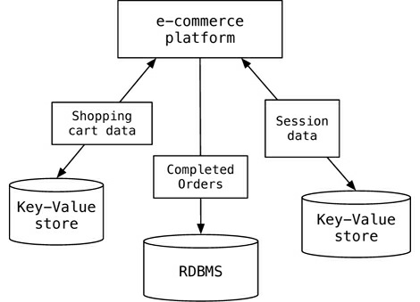
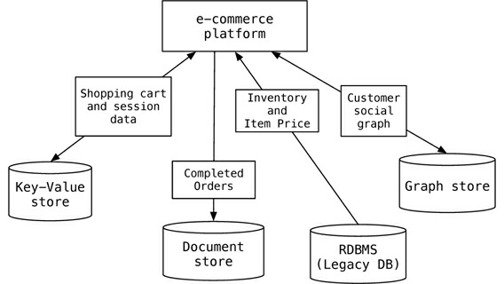
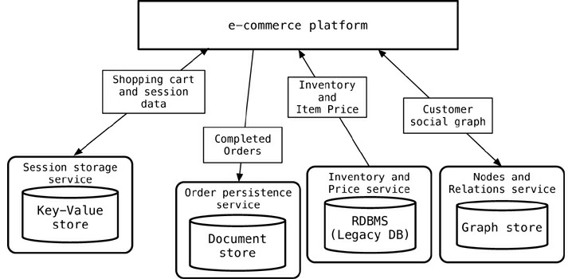
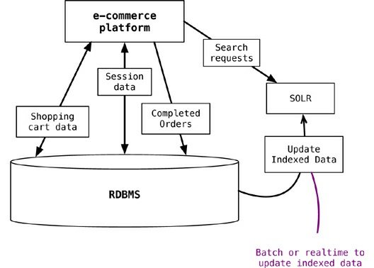

# Chapter 13. Polyglot Persistence

Different databases are designed to solve different problems. Using a single database engine for all of
the requirements usually leads to non- performant solutions; storing transactional data, caching
session information, traversing graph of customers and the products their friends bought are
essentially different problems. Even in the RDBMS space, the requirements of an OLAP and OLTP
system are very different—nonetheless, they are often forced into the same schema.

Let’s think of data relationships. RDBMS solutions are good at enforcing that relationships exist. If
we want to discover relationships, or have to find data from different tables that belong to the same
object, then the use of RDBMS starts being difficult.

Database engines are designed to perform certain operations on certain data structures and data
amounts very well—such as operating on sets of data or a store and retrieving keys and their values
really fast, or storing rich documents or complex graphs of information.

## 13.1. Disparate Data Storage Needs

Many enterprises tend to use the same database engine to store business transactions, session
management data, and for other storage needs such as reporting, BI, data warehousing, or logging
information (Figure 13.1).

**Figure 13.1. Use of RDBMS for every aspect of storage for the application**

The session, shopping cart, or order data do not need the same properties of availability,
consistency, or backup requirements. Does session management storage need the same rigorous
backup/recovery strategy as the e-commerce orders data? Does the session management storage need
more availability of an instance of database engine to write/read session data?

In 2006, Neal Ford coined the term **polyglot programming** , to express the idea that applications
should be written in a mix of languages to take advantage of the fact that different languages are
suitable for tackling different problems. Complex applications combine different types of problems,
so picking the right language for each job may be more productive than trying to fit all aspects into a single language.

Similarly, when working on an e-commerce business problem, using a data store for the shopping
cart which is highly available and can scale is important, but the same data store cannot help you find
products bought by the customers’ friends—which is a totally different question. We use the term
**polyglot persistence** to define this hybrid approach to persistence.

## 13.2. Polyglot Data Store Usage

Let’s take our e-commerce example and use the polyglot persistence approach to see how some of
these data stores can be applied (Figure 13.2). A key-value data store could be used to store the
shopping cart data before the order is confirmed by the customer and also store the session data so
that the RDBMS is not used for this transient data. Key-value stores make sense here since the
shopping cart is usually accessed by user ID and, once confirmed and paid by the customer, can be
saved in the RDBMS. Similarly, session data is keyed by the session ID.

**Figure 13.2. Use of key-value stores to offload session and shopping cart data storage**

If we need to recommend products to customers when they place products into their shopping carts
—for example, “your friends also bought these products” or “your friends bought these accessories
for this product”—then introducing a graph data store in the mix becomes relevant (Figure 13.3).

**Figure 13.3. Example implementation of polyglot persistence**

It is not necessary for the application to use a single data store for all of its needs, since different
databases are built for different purposes and not all problems can be elegantly solved by a singe
database.

Even using specialized relational databases for different purposes, such as data warehousing
appliances or analytics appliances within the same application, can be viewed as polyglot
persistence.

## 13.3. Service Usage over Direct Data Store Usage

As we move towards multiple data stores in the application, there may be other applications in the
enterprise that could benefit from the use of our data stores or the data stored in them. Using our
example, the graph data store can serve data to other applications that need to understand, for
example, which products are being bought by a certain segment of the customer base.

Instead of each application talking independently to the graph database, we can wrap the graph
database into a service so that all relationships between the nodes can be saved in one place and
queried by all the applications (Figure 13.4). The data ownership and the APIs provided by the
service are more useful than a single application talking to multiple databases.

**Figure 13.4. Example implementation of wrapping data stores into services**

The philosophy of service wrapping can be taken further: You could wrap all databases into
services, letting the application to only talk to a bunch of services (Figure 13.5). This allows for the
databases inside the services to evolve without you having to change the dependent applications.

**Figure 13.5. Using services instead of talking to databases**

Many NoSQL data store products, such as Riak [Riak] and Neo4J [Neo4J], actually provide out-
of-the-box REST API’s.

## 13.4. Expanding for Better Functionality

Often, we cannot really change the data storage for a specific usage to something different, because of
the existing legacy applications and their dependency on existing data storage. We can, however, add
functionality such as caching for better performance, or use indexing engines such as Solr [Solr] so
that search can be more efficient (Figure 13.6). When technologies like this are introduced, we have
to make sure data is synchronized between the data storage for the application and the cache or
indexing engine.

**Figure 13.6. Using supplemental storage to enhance legacy storage**

While doing this, we need to update the indexed data as the data in the application database
changes. The process of updating the data can be real-time or batch, as long as we ensure that the
application can deal with stale data in the index/search engine. The event sourcing (“Event Sourcing,”
p. 142 ) pattern can be used to update the index.

## 13.5. Choosing the Right Technology

There is a rich choice of data storage solutions. Initially, the pendulum had shifted from speciality
databases to a single RDBMS database which allows all types of data models to be stored, although
with some abstraction. The trend is now shifting back to using the data storage that supports the
implementation of solutions natively.

If we want to recommend products to customers based on what’s in their shopping carts and which
other products were bought by customers who bought those products, it can be implemented in any of
the data stores by persisting the data with the correct attributes to answer our questions. The trick is
to use the right technology, so that when the questions change, they can still be asked with the same
data store without losing existing data or changing it into new formats.

Let’s go back to our new feature need. We can use RDBMS to solve this using a hierarchal query
and modeling the tables accordingly. When we need to change the traversal, we will have to refactor
the database, migrate the data, and start persisting new data. Instead, if we had used a data store that
tracks relations between nodes, we could have just programmed the new relations and keep using the
same data store with minimal changes.

## 13.6. Enterprise Concerns with Polyglot Persistence

Introduction of NoSQL data storage technologies will force the enterprise DBAs to think about how
to use the new storage. The enterprise is used to having uniform RDBMS environments; whatever is
the database an enterprise starts using first, chances are that over the years all its applications will be
built around the same database. In this new world of polyglot persistence, the DBA groups will have

to become more poly-skilled—to learn how some of these NoSQL technologies work, how to monitor
these systems, back them up, and take data out of and put into these systems.

Once the enterprise decides to use any NoSQL technology, issues such as licensing, support, tools,
upgrades, drivers, auditing, and security come up. Many NoSQL technologies are open-source and
have an active community of supporters; also, there are companies that provide commercial support.
There is not a rich ecosystem of tools, but the tool vendors and the open-source community are
catching up, releasing tools such as MongoDB Monitoring Service [Monitoring], Datastax Ops Center
[OpsCenter], or Rekon browser for Riak [Rekon].

One other area that enterprises are concerned about is security of the data—the ability to create
users and assign privileges to see or not see data at the database level. Most of the NoSQL databases
do not have very robust security features, but that’s because they are designed to operate differently.
In traditional RDBMS, data was served by the database and we could get to the database using any
query tools. With the NoSQL databases, there are query tools as well but the idea is for the
application to own the data and serve it using services. With this approach, the responsibility for the
security lies with the application. Having said that, there are NoSQL technologies that introduce
security features.

Enterprises often have data warehouse systems, BI, and analytics systems that may need data from
the polyglot data sources. Enterprises will have to ensure that the ETL tools or any other mechanism
they are using to move data from source systems to the data warehouse can read data from the NoSQL
data store. The ETL tool vendors are coming out with have the ability to talk to NoSQL databases; for
example, Pentaho [Pentaho] can talk to MongoDB and Cassandra.

Every enterprise runs analytics of some sort. As the sheer volume of data that needs to be captured
increases, enterprises are struggling to scale their RDBMS systems to write all this data to the
databases. A huge number of writes and the need to scale for writes are a great use case for NoSQL
databases that allow you to write large volumes of data.

## 13.7. Deployment Complexity

Once we start down the path of using polyglot persistence in the application, **deployment complexity**
needs careful consideration. The application now needs all databases in production at the same time.
You will need to have these databases in your UAT, QA, and Dev environments. As most of the
NoSQL products are open-source, there are few license cost ramifications. They also support
automation of installation and configuration. For example, to install a database, all that needs to be
done is download and unzip the archive, which can be automated using curl and unzip commands.
These products also have sensible defaults and can be started with minimum configuration.

## 13.8. Key Points

- Polyglot persistence is about using different data storage technologies to handle varying data storage needs.
- Polyglot persistence can apply across an enterprise or within a single application.
- Encapsulating data access into services reduces the impact of data storage choices on other parts of a system.
- Adding more data storage technologies increases complexity in programming and operations, so the advantages of a good data storage fit need to be weighed against this complexity.

