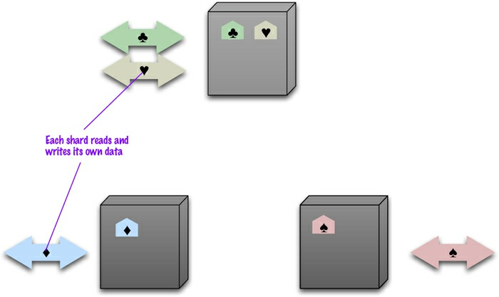
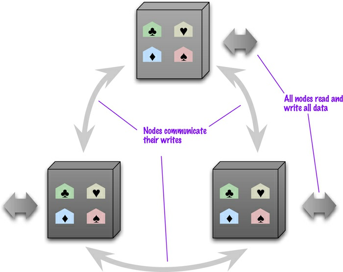
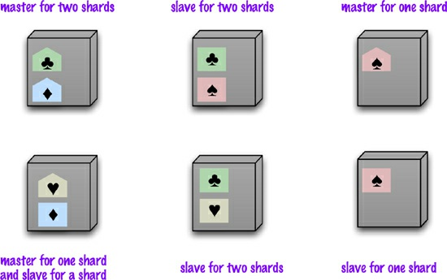
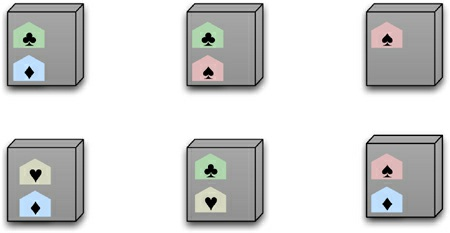

# Chapter 4. Distribution Models

The primary driver of interest in NoSQL has been its ability to run databases on a large cluster. As
data volumes increase, it becomes more difficult and expensive to scale up—buy a bigger server to
run the database on. A more appealing option is to scale out—run the database on a cluster of servers.
Aggregate orientation fits well with scaling out because the aggregate is a natural unit to use for
distribution.

Depending on your distribution model, you can get a data store that will give you the ability to
handle larger quantities of data, the ability to process a greater read or write traffic, or more
availability in the face of network slowdowns or breakages. These are often important benefits, but
they come at a cost. Running over a cluster introduces complexity—so it’s not something to do unless
the benefits are compelling.

Broadly, there are two paths to data distribution: replication and sharding. Replication takes the
same data and copies it over multiple nodes. Sharding puts different data on different nodes.
Replication and sharding are orthogonal techniques: You can use either or both of them. Replication
comes into two forms: master-slave and peer-to-peer. We will now discuss these techniques starting
at the simplest and working up to the more complex: first single-server, then master-slave replication,
then sharding, and finally peer-to-peer replication.

## 4.1. Single Server

The first and the simplest distribution option is the one we would most often recommend—no
distribution at all. Run the database on a single machine that handles all the reads and writes to the
data store. We prefer this option because it eliminates all the complexities that the other options
introduce; it’s easy for operations people to manage and easy for application developers to reason
about.

Although a lot of NoSQL databases are designed around the idea of running on a cluster, it can
make sense to use NoSQL with a single-server distribution model if the data model of the NoSQL
store is more suited to the application. Graph databases are the obvious category here—these work
best in a single-server configuration. If your data usage is mostly about processing aggregates, then a
single-server document or key-value store may well be worthwhile because it’s easier on application
developers.

For the rest of this chapter we’ll be wading through the advantages and complications of more
sophisticated distribution schemes. Don’t let the volume of words fool you into thinking that we
would prefer these options. If we can get away without distributing our data, we will always choose
a single-server approach.

## 4.2. Sharding

Often, a busy data store is busy because different people are accessing different parts of the dataset.
In these circumstances we can support horizontal scalability by putting different parts of the data onto
different servers—a technique that’s called **sharding** (see Figure 4.1).

**Figure 4.1. Sharding puts different data on separate nodes, each of which does its own reads and writes.**

In the ideal case, we have different users all talking to different server nodes. Each user only has to
talk to one server, so gets rapid responses from that server. The load is balanced out nicely between
servers—for example, if we have ten servers, each one only has to handle 10% of the load.

Of course the ideal case is a pretty rare beast. In order to get close to it we have to ensure that data
that’s accessed together is clumped together on the same node and that these clumps are arranged on
the nodes to provide the best data access.

The first part of this question is how to clump the data up so that one user mostly gets her data from
a single server. This is where aggregate orientation comes in really handy. The whole point of
aggregates is that we design them to combine data that’s commonly accessed together—so aggregates
leap out as an obvious unit of distribution.

When it comes to arranging the data on the nodes, there are several factors that can help improve
performance. If you know that most accesses of certain aggregates are based on a physical location,
you can place the data close to where it’s being accessed. If you have orders for someone who lives
in Boston, you can place that data in your eastern US data center.

Another factor is trying to keep the load even. This means that you should try to arrange aggregates
so they are evenly distributed across the nodes which all get equal amounts of the load. This may vary
over time, for example if some data tends to be accessed on certain days of the week—so there may
be domain-specific rules you’d like to use.

In some cases, it’s useful to put aggregates together if you think they may be read in sequence. The
Bigtable paper [Chang etc.] described keeping its rows in lexicographic order and sorting web
addresses based on reversed domain names (e.g., com.martinfowler). This way data for multiple
pages could be accessed together to improve processing efficiency.

Historically most people have done sharding as part of application logic. You might put all customers with surnames starting from A to D on one shard and E to G on another. This complicates the programming model, as application code needs to ensure that queries are distributed across the various shards. Furthermore, rebalancing the sharding means changing the application code and migrating the data. Many NoSQL databases offer **auto-sharding** , where the database takes on the responsibility of allocating data to shards and ensuring that data access goes to the right shard. This can make it much easier to use sharding in an application.

Sharding is particularly valuable for performance because it can improve both read and write
performance. Using replication, particularly with caching, can greatly improve read performance but
does little for applications that have a lot of writes. Sharding provides a way to horizontally scale
writes.

Sharding does little to improve resilience when used alone. Although the data is on different nodes,
a node failure makes that shard’s data unavailable just as surely as it does for a single-server
solution. The resilience benefit it does provide is that only the users of the data on that shard will
suffer; however, it’s not good to have a database with part of its data missing. With a single server
it’s easier to pay the effort and cost to keep that server up and running; clusters usually try to use less reliable machines, and you’re more likely to get a node failure. So in practice, sharding alone is
likely to decrease resilience.

Despite the fact that sharding is made much easier with aggregates, it’s still not a step to be taken
lightly. Some databases are intended from the beginning to use sharding, in which case it’s wise to
run them on a cluster from the very beginning of development, and certainly in production. Other
databases use sharding as a deliberate step up from a single-server configuration, in which case it’s
best to start single-server and only use sharding once your load projections clearly indicate that you
are running out of headroom.

In any case the step from a single node to sharding is going to be tricky. We have heard tales of
teams getting into trouble because they left sharding to very late, so when they turned it on in
production their database became essentially unavailable because the sharding support consumed all
the database resources for moving the data onto new shards. The lesson here is to use sharding well
before you need to—when you have enough headroom to carry out the sharding.

## 4.3. Master-Slave Replication

With master-slave distribution, you replicate data across multiple nodes. One node is designated as
the master, or primary. This master is the authoritative source for the data and is usually responsible
for processing any updates to that data. The other nodes are slaves, or secondaries. A replication
process synchronizes the slaves with the master (see Figure 4.2).

**Figure 4.2. Data is replicated from master to slaves. The master services all writes; reads may come from either master or slaves.**

Master-slave replication is most helpful for scaling when you have a read-intensive dataset. You
can scale horizontally to handle more read requests by adding more slave nodes and ensuring that all
read requests are routed to the slaves. You are still, however, limited by the ability of the master to
process updates and its ability to pass those updates on. Consequently it isn’t such a good scheme for
datasets with heavy write traffic, although offloading the read traffic will help a bit with handling the
write load.

A second advantage of master-slave replication is **read resilience** : Should the master fail, the
slaves can still handle read requests. Again, this is useful if most of your data access is reads. The
failure of the master does eliminate the ability to handle writes until either the master is restored or a
new master is appointed. However, having slaves as replicates of the master does speed up recovery
after a failure of the master since a slave can be appointed a new master very quickly.

The ability to appoint a slave to replace a failed master means that master-slave replication is
useful even if you don’t need to scale out. All read and write traffic can go to the master while the
slave acts as a hot backup. In this case it’s easiest to think of the system as a single-server store with
a hot backup. You get the convenience of the single-server configuration but with greater resilience—
which is particularly handy if you want to be able to handle server failures gracefully.

Masters can be appointed manually or automatically. Manual appointing typically means that when
you configure your cluster, you configure one node as the master. With automatic appointment, you

create a cluster of nodes and they elect one of themselves to be the master. Apart from simpler
configuration, automatic appointment means that the cluster can automatically appoint a new master
when a master fails, reducing downtime.

In order to get read resilience, you need to ensure that the read and write paths into your
application are different, so that you can handle a failure in the write path and still read. This includes
such things as putting the reads and writes through separate database connections—a facility that is
not often supported by database interaction libraries. As with any feature, you cannot be sure you
have read resilience without good tests that disable the writes and check that reads still occur.

Replication comes with some alluring benefits, but it also comes with an inevitable dark side—
inconsistency. You have the danger that different clients, reading different slaves, will see different
values because the changes haven’t all propagated to the slaves. In the worst case, that can mean that
a client cannot read a write it just made. Even if you use master-slave replication just for hot backup
this can be a concern, because if the master fails, any updates not passed on to the backup are lost.
We’ll talk about how to deal with these issues later (“Consistency,” p. 47 ).

## 4.4. Peer-to-Peer Replication

Master-slave replication helps with read scalability but doesn’t help with scalability of writes. It
provides resilience against failure of a slave, but not of a master. Essentially, the master is still a
bottleneck and a single point of failure. Peer-to-peer replication (see Figure 4.3) attacks these
problems by not having a master. All the replicas have equal weight, they can all accept writes, and
the loss of any of them doesn’t prevent access to the data store.

**Figure 4.3. Peer-to-peer replication has all nodes applying reads and writes to all the data.**

The prospect here looks mighty fine. With a peer-to-peer replication cluster, you can ride over
node failures without losing access to data. Furthermore, you can easily add nodes to improve your
performance. There’s much to like here—but there are complications.

The biggest complication is, again, consistency. When you can write to two different places, you
run the risk that two people will attempt to update the same record at the same time—a write-write
conflict. Inconsistencies on read lead to problems but at least they are relatively transient.
Inconsistent writes are forever.

We’ll talk more about how to deal with write inconsistencies later on, but for the moment we’ll
note a couple of broad options. At one end, we can ensure that whenever we write data, the replicas
coordinate to ensure we avoid a conflict. This can give us just as strong a guarantee as a master,
albeit at the cost of network traffic to coordinate the writes. We don’t need all the replicas to agree
on the write, just a majority, so we can still survive losing a minority of the replica nodes.

At the other extreme, we can decide to cope with an inconsistent write. There are contexts when
we can come up with policy to merge inconsistent writes. In this case we can get the full performance
benefit of writing to any replica.

**These points are at the ends of a spectrum where we trade off consistency for availability.**

## 4.5. Combining Sharding and Replication

Replication and sharding are strategies that can be combined. If we use both master-slave replication
and sharding (see Figure 4.4), this means that we have multiple masters, but each data item only has a
single master. Depending on your configuration, you may choose a node to be a master for some data
and slaves for others, or you may dedicate nodes for master or slave duties.

**Figure 4.4. Using master-slave replication together with sharding**

Using peer-to-peer replication and sharding is a common strategy for column-family databases. In a
scenario like this you might have tens or hundreds of nodes in a cluster with data sharded over them.
A good starting point for peer-to-peer replication is to have a replication factor of 3, so each shard is
present on three nodes. Should a node fail, then the shards on that node will be built on the other
nodes (see Figure 4.5).

**Figure 4.5. Using peer-to-peer replication together with sharding**

## 4.6. Key Points

- There are two styles of distributing data:
    - Sharding distributes different data across multiple servers, so each server acts as the single
       source for a subset of data.
    - Replication copies data across multiple servers, so each bit of data can be found in multiple
       places.

A system may use either or both techniques.

- Replication comes in two forms:
   - Master-slave replication makes one node the authoritative copy that handles writes while slaves synchronize with the master and may handle reads.
   - Peer-to-peer replication allows writes to any node; the nodes coordinate to synchronize their copies of the data.
Master-slave replication reduces the chance of update conflicts but peer-to-peer replication
avoids loading all writes onto a single point of failure.