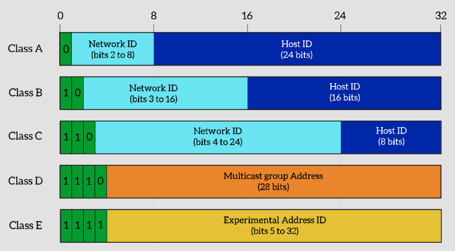
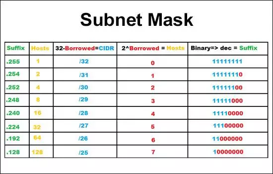

# Internet address

## Network addresses

**IP Address Format**
- each computer in TCP/IP network must be givent a UNIQUE identifier, or IP Address
- This address, operating at Layer 3, allows 1 computer to locate another computer on a network

::: tip Format
IP = **NETWORK ADDRESS** + **HOST ADDRESS** = 32 bits . E.g: `131.108.122.204`
:::

**Network layer communication path**
- Using the IP address of destination network, a router can deliver a packet to the correct network
- To router forwards packets, the packets must include an identifier for both the source & destination networks
- The network address helps the router identify a path within the network cloud
- The router uses the network address to identify the destination network of a packet within an internetwork 
- The router uses the IP address to locate the particular computer connected to that network

## IP Address classes 

**Class A**
- possible network address from `1.0.0.0` to `126.0.0.0`
- Have up to 16.777.214 possible IP addresses (224 - 2)

**Class B**
- possible network address from `128.0.0.0` to `191.255.0.0` (214)
- Have up to 65.534 possible IP addresses (216 - 2)

**Class C**
- possible network address from `192.0.0.0` to `223.255.255.0` 
- Have up to 254 possible IP addresses (28 - 2)

**Notes**
- `127.0.0.1` => loop back **localhost**
- Reserved IP address 
    - Network address - used to identify the network itself. An IP has `0s` in all host bits
    - Broadcast address - used for broadcasting packets to all devices on a network. An IP has `1s` in all host bits

## Public IP address
- the stability of the Internet
- Unique addresses are required for each device on a network. To make that an organization known as the Internet Network Information Center (InterNIC) handled this procedure. Now replate by the Intreernet Assigned Numbers Authority (IANA)
- must be obtained from an Internet Service Provider (ISP) or a registry at some expense

## Private IP address
- According to RFC-1918
- Class A: `10.0.0.0`
- Class B: `172.16.0.0` - `172.31.0.0`
- Class C: `192.168.0.0` - `192.168.255.0`

## IPv4 versus IPv6
4 octets vs 16 octets 

## Subnetting

### Why?
- reduce the size of a broadcast domain, optimized network perf
- improve network security
- simplified management
- facilitated spanning of large geographical distances

### How
::: tip Format
IP = **NETWORK ADDRESS** + **SUBNET ADDRESS** +  **HOST ADDRESS** 
:::

To create a subnet address, network admin **borrows** bits from **original host** portion & designates them as the **subnet field**.

### Subnet mask
A subnet mask is a 32-bit number created by setting host bits to all 0s and setting network bits to all 1s. In this way, the subnet mask separates the IP address into the network and host addresses.

Example 

IP               | Subnet mask           | CIDR |  Net ID | Subnet ID | Host ID 
--------------   | ----------------------| -----|  -------| ----------| -------
**12**.10.1.2    |  **255**.0.0.0        | /8   | 8      | 0         | 24 
**186.16**.48.1  |  **255.255**.0.0      | /16   | 16     | 0         | 16 
**192.48.96**.1  |  **255.255.255**.0    | /24   | 24     | 0         | 8 
12.10.1.2        |  **255.192**.0.0 (192 = **11**000000)      | /10   | 8      | 2         | 8    
186.16.48.1      |  **255.255.224**.0 (224 = **111**00000)    | /19   | 16     | 3         | 8    
192.48.96.1      |  **255.255.255.240** (240 = **1111**00000) | /28    | 24     | 4        | 8    

CIDR = Classless Inter-Domain Routing or supernetting

## Tools
- [Decimal to Binary converter](https://www.rapidtables.com/convert/number/decimal-to-binary.html)
- [Visual Subnet Calculator](https://www.davidc.net/sites/default/subnets/subnets.html)
- [CIDR](https://cidr.xyz/)
