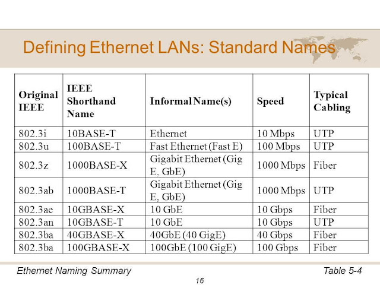
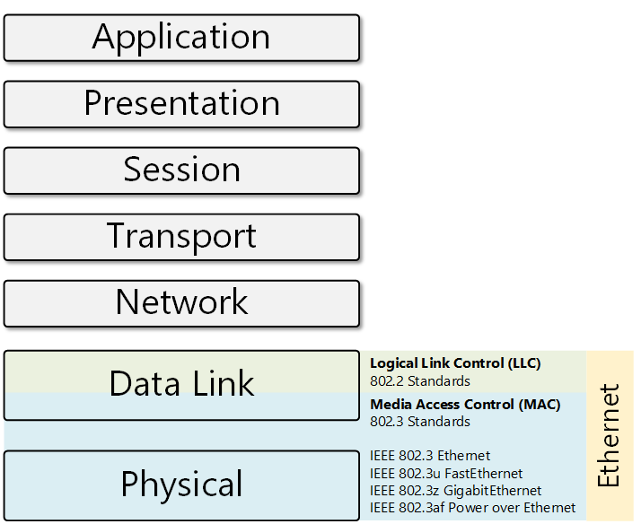

# Ethernet

Ethernet => Media Access Control (MAC)
- Sharing connection to multi devices
- 1 device transfer data / time

## Standard Names

## Ethernet & OSI Model

Layer Physical 1: 
- Physical signaling sublayer
- Physical Medium

## Ethernet Frame

[see more](https://www.gatevidyalay.com/ethernet-ethernet-frame-format/)

## Media Access Control
- Specified by the technology being used
- Determine who can trans
- 2 types
    - Deterministic: "Let's take turns" E.g: Token-ring, FDDI
    - Non-deterministic: "First come, first serve". Ethernet: CSNMA /CD
## Notes
Media Access Control (MAC)
Logial Link Control (LLC)