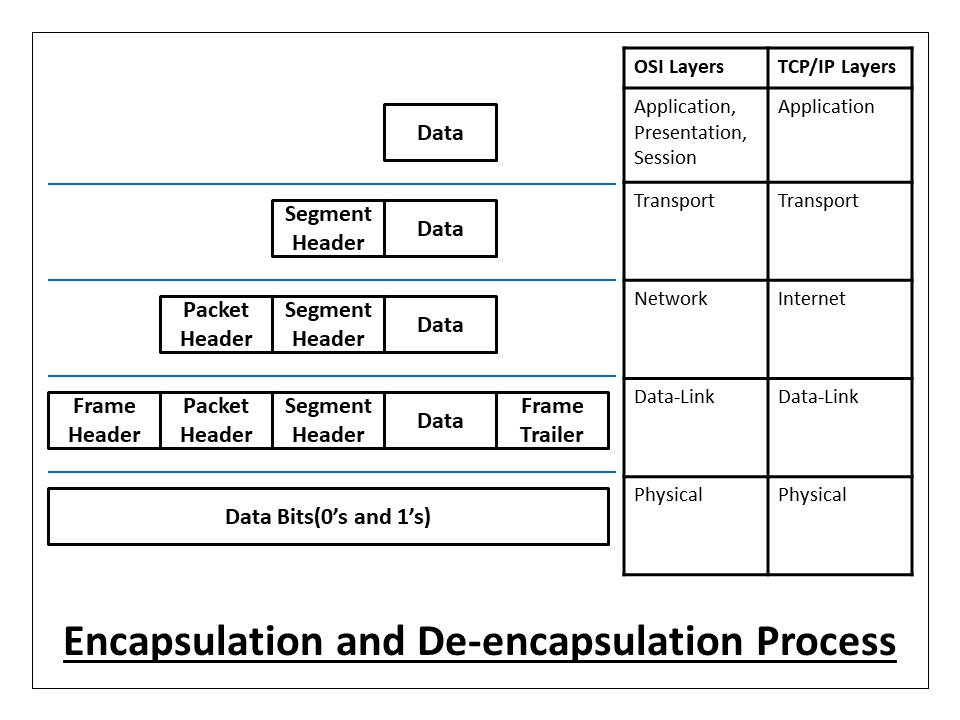

# Network 

## Components in Network

- End devices (hosts): phone, tv, printer, ...
- Media: line, cables, ...
- Protocol

## Data Network 

### Categories by Geo

- LAN: Local Area Network
- WAN: Wide Area Network
- MAN: Metropolitan Area Network 
- GAN: Global Area Network (continents connection)
- SAN: Storage Area Network (peformance + Availability + Scalability)
- VPN: Virtual Private Network

Param | LAN | WAN
------| ----| -----
Speed | high, upto 1-10 Gbps | much lower, generally 100 mbps
Congestion | Less congested | More congested
Components | using the layer 1/2 devices like hubs, swiches, brigdes & layer 3 devices like Core/Layer 3 switch | using the layers 3 devices Routers & Multi-layer Switches 
Ownership & management | owned, operated, managed & monitored by a customer | by multiple Service providers 
Security  | More secured  | Less secured
Technologies | Ethernet & Token Rings | MPLS, ATM, Frame replay & ISDN, ...
Cost         | Less expensive  | More expensive
Physical layer connectivity | Generally Copper & Fiber medium. Multimode Fider is preferred. | Fiber medium. Single mode Fiber is preferred

### Categories by switching

### VPN (Virtual Private Network)

**Connect objects**
- Headquarter
- Branch
- Home user
- Mobile user (laptop, mobile)

https://www.slideshare.net/OECLIBOdishaElectron/virtual-private-networks-vpn-ppt

**Types** :
- Network to network (Site to Site)
    - Intranet: network same company
    - Extranet: network between multi companies
- User to Network (Remote-Access VPN) (POP)

## Media

**LAN Media**
- đồng trục
- xoắn đôi
- cáp quang
- vô tuyến

**WAN Media**
- modem (dial-up)
- public data network service (VPN, Frame-relay)
- đường thuê bao dùng riêng (Leasedline based on bandwidth)

## Models

Communication Process

Source Address  ----- Protocol on Media ----- Destination Address

- **Addresses**: who are the source & destination of a communication process 
- **Media**: where is the communication take place
- **Protocols**: set of rules how to make communication on a network

### OSI vs TCP/IP

1. Physical: Binary transmission 
    - wires, connectos, voltages, data rates
2. Data Link: Access to media 
    - provides reliable transfer of data across media
    - physical addressing, logical network topology, error notification, flow control
3. Network: address & best path
    - provides connectivity & path selection between 2 end systems
    - domain of routing
4. Transport: e2e connections
    - concerned with transportation issues between hosts
    - data transport reliability
    - establish, maintain, terminate virtual circuits
    - fault detection & recovery infor flow control
5. Session: Dialog control - interhost communication
    - establish, maintain, terminate sessions between applications
    - half duplex / full duplex
6. Presentation: Data representation
    - ensure data is readable by receiving system
    - format of data
    - data structure
    - negotiates data transfer syntax for app layer
7. Application: network processes to apps

### Encapsulation Process

https://afteracademy.com/blog/what-is-data-encapsulation-and-de-encapsulation-in-networking/

### TCP vs UDP

- Checksum
- Acknowledgement
- Re-transmission (timeout & ACK dup)

### TCP and UDP Application Ports
In networking, different ports are used for various purposes. Generally, these port ranges can be divided into three categories. Below, you can find these port ranges:
- Well-Known Ports ( 1 to 1024 )
*TCP Ports*
    - FTP Data (Port 20)
    - FTP Control (Port 21)
    - SSH (Port 22)
    - Telnet (Port 23)
    - SMTP (Port 25)
    - TACACS (Port 49)
    - HTTP (Port 80)
    - POP3  (Port 110)
    - SFTP (Port 115)
    - HTTPS (Port 443)
*UDP Ports*
    - DHCP & BOOTP Server (Port 67)
    - BOOTP User (Port 68)
    - TFTP (Port 69)
    - NTP (Port 123)
    - SNMP (Port 161)
    - SNMP Trap (Port 162)
    - Syslog (Port 512)
    - ISAKMP (Port 500)
- Registered Ports ( 1025 to 49151 )
- Private Ports ( 49152 to 65535 )

## Vokas 
- Round-trip time (RTT)
- Network Interface Card (NIC)
- 1 B (Byte) = 8 bit (b)  
- 1024 B = 1 KB
- Bandwith (bps - bit per second)
- Through put <= Bandwidth ( P (throughput) = S (size of file) / T (time to download) )

## Refs 
https://viblo.asia/p/so-sanh-chi-tiet-tcp-va-udp-tai-sao-udp-lai-nhanh-hon-tcp-zOQJw05xLMP
