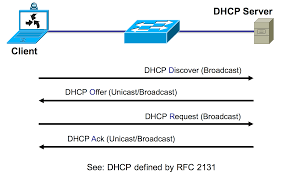

# Obtaining IP / ARP / DHCP

## IP Address assignment
- MAC Address (6 bytes) : data link layer (L3)
    - first 3 bytes: Organizational Unique Identifier
    - last 3 bytes: Vendor Assigned (NIC Cards, Interfaces)
- IP Network (4 bytes): network layer (L2)


## Static addressing 
... 

## Dynamic addressing - DHCP

**DHCP = Dynamic Host Configuration Protocol**

defined range of IP addresses (scope) on A DHCP server

### Process



- Client Request : **DHPC Discover** / UDP Broadcast 
- Server Response : **DHPC Offer**  / UDP Broadcast 
    - IP Address
    - Lease time
    - DHCP Server IP
    - Address
- Client Request : **DHPC Request**
- Server Response : **DHPC Ack** 
    - Gateway
    - Ip of other servers
    - ...


## Address Resolution Protocol (ARP)


- ARP enables a computer to **find the MAC address** of the computer that is associated with an **IP address**
- In order for devices to communicate, the sending devices need both **IP addresses** & the **MAC addresses** of the destination devices.
- When they try to communicate with devices whose IP addreses they know, they must determine the MAC addresses
- ARP table stores in RAM

:::: tabs
::: tab Windows
```sh
arp -a # see arp table
```
:::


::: tab Mac
```sh
arp -a # see arp table
```
:::
::::


Destination local


[Find Device or IP Address using MAC Address](https://www.pcwdld.com/find-device-or-ip-address-using-mac-address#wbounce-modal)