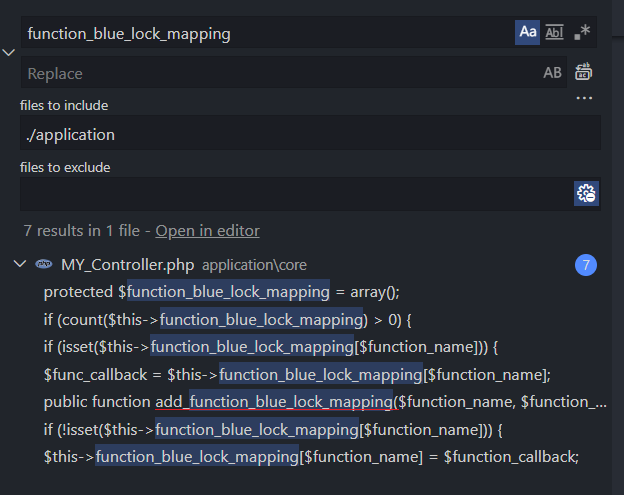
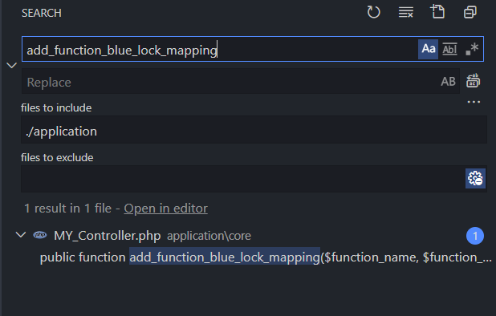

# Dead Code

Take a look at the function `_check_document_lock()`

```php
protected function _check_document_lock()
{
    if ($this->user_id != "" AND $this->tenant_id != "") {
        $this->load->library("B2BE_Lock");
        $this->b2be_lock->set_current_user_infor($this->user_id, $this->tenant_id);
        if (count($this->function_blue_lock_mapping) > 0) {
            // 20 lines of code
        }
    }
}
```

The elements in `function_blue_lock_mapping` attribute which decides that method detail will be execute or not 

```php
if (count($this->function_blue_lock_mapping) > 0)
```

## Look up involved things

Try finding what related to `function_blue_lock_mapping` in our project




Ok, I found a new method that involved that `function_blue_lock_mapping` attribute. And other results are all in 2 methods `_check_document_lock` and `add_function_blue_lock_mapping`

Do a look up for the `add_function_blue_lock_mapping` method



No place uses this method.

Until now, I have 99.99% to admit that code is dead. Because there is few ways to execute the method not from the source code =)) We're working with PHP - the super dynamic language. 


## What should we do?

Of course, will remove that code to protect our eyes.

## Conclusion

I have no idea how to find the deadcode automatically. I'm just curious about how the `_check_document_lock` method works and find it out.
