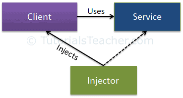

# DI & DI-Container

Make sure you understand [Dependency Inversion Principle](./dip.html) before you continue read this.

Make it clear before we go deeper:
- Dependency Inversion Principle is a principle (I introduced in this [post](./dip.html) )
- Dependency Injection is a pattern for writing better code
- A Dependency Injection container is a tool to help injecting dependencies

## Dependency Injection



The Dependency Injection pattern involves 3 types of classes:

- **Client Class**: *uses* the `service class` (depends on the service class)
- **Service Class**: *provides* service to the `client class` (dependency).
- **Injector Class**: *injects* the `service class object` into the `client class`.

So, **Dependency Injection Container** is the Injector.

*When writing code, don't forget the DIP, we still have an **Abstraction** that `Client Class` &` Service Class` depends on.*


## Use DI-Container in Webportal

I choose the [php-di](https://packagist.org/packages/php-di/php-di#5.4.6) to be the DI Container because it's easy to use. PHP only - no require Domain-Specific Language (DSL) to use.

There're 3 actions when using DI-Container
- register components with the container
- resolve components
- release components from the container (most of PHP Containers ignore this)

### Subject 

Assume I have **GatewayFacade** in `securitymaintenance` module that force other modules must call it when to reuse functions from `securitymaintenance`.

:::: tabs

::: tab Service
The abstraction of service places at `application/modules/securitymaintenance/gateway/GatewayFacade.php`

```php
<?php
namespace Wp3Module\securitymaintenance\gateway;

interface GatewayFacade 
{
    function isUserInactiveInAllowDays($userId);
}
```

The detail places at `application/modules/securitymaintenance/gateway/GatewayFacadeImpl.php`

```php
<?php
namespace Wp3Module\securitymaintenance\gateway;

class GatewayFacadeImpl implements GatewayFacade 
{   
    /**
     * @return boolean
     */
    function isUserInactiveInAllowDays($userId) {
        // code implementation
    }
}
```
:::

::: tab Client
The client places at `application/modules/core/services/InactiveUserSweeper.php`

```php
<?php
namespace Wp3Module\core\services;
use Wp3Module\securitymaintenance\gateway\GatewayFacade;

class InactiveUserSweeper 
{   

    private $sercurityGateway;

    function __construct(GatewayFacade $sercurityGateway) 
    {
        $this->sercurityGateway = $sercurityGateway;
    }

    function execute($userId) 
    {
        $users = $this->getActiveUsers(); /// from a repository 

        foreach($users as $user) {
            if ($this->isUserInactiveInAllowDays($user)) {
                continue;
            }

            $this->disableUser($user);
        }
    }

    private function isUserInactiveInAllowDays($user) 
    {
        return $this->sercurityGateway->isUserInactiveInAllowDays($user->ID)
    }

    /// more code
}
```
:::
::::

If you wonder where the namespace `Wp3Module\securitymaintenance\gateway` come from, [read this](./autoload.html).


### Set up

We're using PHP 5.6. Thus, let's install the version 5.4.6 of php-di.

```
composer require php-di/php-di:5.4.6
```

### Register

:::: tabs

::: tab "Main Config"

Append this line to the file `application/config/autoload.php`. 

```php
require_once __DIR__ . '/di/index.php';
```

---

At `application/config/di/index.php`

Create an instance of DI Container with components from `components.php` file then make it global. 

```php
<?php
use DI\ContainerBuilder;

$containerBuilder = new ContainerBuilder();

$containerBuilder->addDefinitions(__DIR__ . '/components.php');
$container = $containerBuilder->build();

$GLOBALS['DI_Container'] = $container;
```

---

At `application/config/di/components.php`

This file collects the DI config from other modules (through function `module_di_config`).  Module `securitymaintenance` is used in example below. 

```php
<?php
if (!function_exists('module_di_config')) {
    function module_di_config($module_name) {
        $destPath = APPPATH . "modules/$module_name/config/di.php";
        return file_exists($destPath) ? require_once($destPath) : [];
    }
}

$securityProfileComponents = module_di_config('securitymaintenance'); // for examples

return array_merge(
    $securityProfileComponents, 
    []
);
```

function `module_di_config` will try to look up the `di.php` in config folder and return the array of items.
:::

::: tab "Components Config"

*These files must return an array.*

At `application/modules/securitymaintenance/config/di.php`

```php{6}
<?php
use Wp3Module\securitymaintenance\gateway\GatewayFacade;
use Wp3Module\securitymaintenance\gateway\GatewayFacadeImpl;

return [
    GatewayFacade::class => DI\object(GatewayFacadeImpl::class),
];
```

At `application/modules/core/config/di.php`

```php
<?php
use Wp3Module\core\services\InactiveUserSweeper;

return [
    InactiveUserSweeper::class => DI\object(InactiveUserSweeper::class),
];
```

Don't worry about the Performance. Here is [the thing](https://github.com/PHP-DI/PHP-DI/blob/5.4/doc/performances.md) that's useful for your concern.

:::

::::


### Resolve

Try it at `application/controllers/Cronjobs.php`. Actually, you can use the `DI_Container` anywhere after set it global.

```php{13}
<?php
use Wp3Module\core\services\InactiveUserSweeper;

class Cronjobs 
{
    //... code
    //... code
    //... code

    function _run_check_inactive_user() 
    {
        $container = $GLOBALS['DI_Container'];
        $service = $container->get(InactiveUserSweeper::class); // resolve
        $service->execute(); // use that resolved object
    }
}
```

Are you surprise? In constructor of `InactiveUserSweeper` it requires `GatewayFacade`, right? 

It's a benifit called `Autowiring` when you use a DI-Container. This feature is based on [Reflection class](http://php.net/manual/en/book.reflection.php) to grab type-hint of params on contructor then inject the corresponded class. 

Of course, can turn it of by

```php
$containerBuilder->useAutowiring(false);
```

### Release

There is no available method to release components in PHP-DI Container. Because all of things are stored in PHP memory just exist in lifetime of the request. 

## Conclusion

Hope you understand clearly the *DIP* & *DI* & *DI Container* after reading this.

These concepts are **very important**. 

Handle dependencies is **very important**. 

[Code dependencies are the devil](https://www.freecodecamp.org/news/code-dependencies-are-the-devil-35ed28b556d/), be careful what deals with devil.

## References

- [Dependency Injection](https://www.tutorialsteacher.com/ioc/dependency-injection)
- [PHP-DI Documentation](https://github.com/PHP-DI/PHP-DI/tree/5.4/doc)
