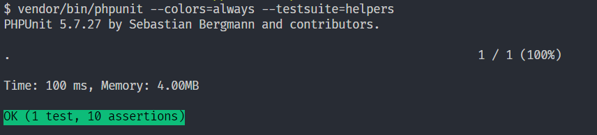
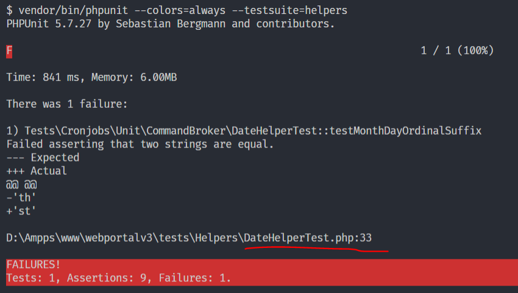

# Refactoring Overview


Take a look at the function `ordinal_suffix()` 

```php
function ordinal_suffix($num)
{
    $number = abs($num);
    $lastChar = substr($num, -1, 1);
    switch ($lastChar)
    {
        case '1' : return ($num == '11') ? 'th' : 'st';
        case '2' : return ($num == '12') ? 'th' : 'nd';
        case '3' : return ($num == '13') ? 'th' : 'rd';
    }
    return 'th';
}
```

Let's see 
- function & Param names are vague, because it only works with `$num` below 100
- `$number` is useless
- `switch` combine with `ternary operator (?)` make logical complexity 

## Refactor
- Rename for function & param & variables for more descriptive
- Remove var `$number`
- Use an associative array a.k.a Map a.k.a Dictionary to remove control flow `switch` 
- Apply [early-return](./early-return.html) pattern

```php
function month_day_ordinal_suffix($month_day)
{
    $month_day .= ''; // type casting
    $special_days = ['11', '12', '13'];
    if (in_array($month_day, $special_days)) {
        return 'th';
    }

    $lastchar_suffix_map = [
        '1' => 'st',
        '2' => 'nd',
        '3' => 'rd',
        // others are 'th'
    ];

    $lastchar = substr($month_day, -1, 1);
    $found_in_map = isset($lastchar_suffix_map[$lastchar]);
    return $found_in_map ? $lastchar_suffix_map[$lastchar] : 'th';
}
```

## Unit Test

To make sure after refactoring the function still works correctly, we should have tests. It's better if you can write test cases before refactoring.

### Create a new file at `/tests/Helpers/DateHelperTest.php`

```php
<?php
namespace Tests\Helpers;
use PHPUnit\Framework\TestCase;

// set up the required constant 
if (!defined('BASEPATH')) {
    define('BASEPATH', __DIR__ . "/../../");
}

// include the specific file to test
require BASEPATH . 'application/helpers/application_helper.php';

class DateHelperTest extends TestCase
{

    function testMonthDayOrdinalSuffix()
    {
        // test cases will place here
    }
}
```

Add test cases to `testMonthDayOrdinalSuffix` function

```php
function testMonthDayOrdinalSuffix()
{
    // last char with 1 cases
    $this->assertEquals('st', \month_day_ordinal_suffix(1));
    $this->assertEquals('th', \month_day_ordinal_suffix(11));
    $this->assertEquals('st', \month_day_ordinal_suffix(21));
    $this->assertEquals('st', \month_day_ordinal_suffix(31));

    // last char with 2 cases
    $this->assertEquals('nd', \month_day_ordinal_suffix(2));
    $this->assertEquals('th', \month_day_ordinal_suffix(12));
    $this->assertEquals('nd', \month_day_ordinal_suffix(22));

    // last char with 3 cases
    $this->assertEquals('rd', \month_day_ordinal_suffix(3));
    $this->assertEquals('th', \month_day_ordinal_suffix(13));
    $this->assertEquals('rd', \month_day_ordinal_suffix(23));


    // other cases
    $this->assertEquals('th', \month_day_ordinal_suffix(7));
    $this->assertEquals('th', \month_day_ordinal_suffix(13));
    $this->assertEquals('th', \month_day_ordinal_suffix(30));
}
```

### Run the test

Add these code to file `/phpunit.xml` if not exists

```xml
<testsuites>
    <testsuite name="helpers">
        <directory>./tests/Helpers/</directory>
    </testsuite>
</testsuites>
```

Open terminal and run the test

```
vendor/bin/phpunit --colors=always --testsuite=helpers
```

### Test result 

It will be like this if all test cases pass



And when failing:



Come back to the test case check the issue then make it green.


**Good luck!**