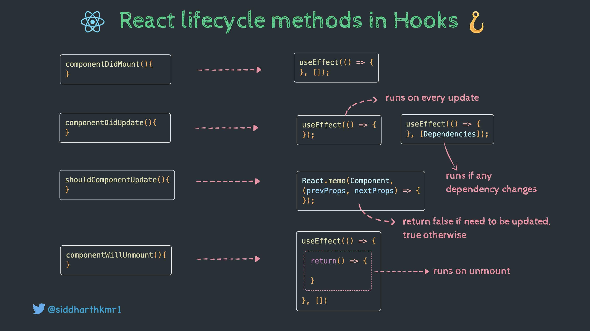

# React notes

## Smart vs Pure Components

**different names**
Often also preferred as other different names: 
- smart vs dumb components
- container vs presentation components
- stateful vs stateless component

**functions**
- Smart components are ones that has direct access to store (e.g import) and doesn't contain any styling.
- Pure components are components without inner state. They only receives react props from outside and render accordingly. 

**coding rules of thumb**
Pure components are predictable, keep the code base into simple understandable unit, and therefore, maintainable.

Pure components are hugely not attached to (mobx) store business logics so they are reusable in different business context given similar UI.

We need to make use the best of it as much as possible:
- Prefer pure components over smart components whenever possible.
- **DO NOT MIX** pure component with smart component.
- Pure component should have story written in storybook with all possible realistic scenarios of props value inputs.
- Created storybook story scenarios must have ui-regression test cases.

## Naming Convention

> There are only two hard problems in Computer Science: cache invalidation and naming things — Phil Karlton

There are 3 most common naming conventions:
- Camel case for file names, and pascal case for component names
- Kebab case for file names, and pascal case for component names
- Pascal case for both file names, and component names
- [BEM for class name](https://getbem.com/introduction/)

## Style component

### Inline Styles

```jsx
const styles = {
    backgroundColor: 'red',
    color: 'blue'
}
return (<div style={styles}>some text</div>)
```

:::: tabs
::: tab Pros
- Easy to implement, especially in small projects
- Do not need an external stylesheet meaning one less page to render
- Easily implement JavaScript logic in the styles
- Easy to debug, just find the element from chrome dev tools and implement the styles.
- If you put number as a value, React will automatically convert that into px
:::

::: tab Cons
- Extremely difficult to reuse and maintain
- A lot of CSS functionality can not be implemented in inline styling like pseudo classes, pseudo elements, media queries, key frames or other advanced functionality like nested styling etc.
- In a react app, there are many files being rendered, so with all the inline styles, it effects performance negatively
:::
::::

### Global CSS file

```jsx
import React from 'react';
import './App.css';
import MyApp from './MyApp';

const App = (props) => {
   return <div className="app">
            <MyApp />
          </div>
}
export default App
```

:::: tabs
::: tab Pros
- A very good strategy to build fast, small projects which require less maintenance and low budget resources
- Just one CSS file to render as compared to many CSS files like CSS modules (explained later)
- Very fast to implement styles in small projects
- Build HTML CSS templates
- Feel comfortable working outside ReactJS in vanilla JavaScript projects
- Good to improve frontend development skills with small not so serious since you understand how advance naming patterns and legacy coding patterns without fancy libraries are made with discipline of following the template guidelines
:::

::: tab Cons
- Extremely difficult to maintain
- Adding new features is a nightmare
- Satisfies only specific use cases
- Need to learn naming conventions otherwise problems occur. BEM notation and utility classes specifically. If not followed properly then name clashing is extremely common.
- No JavaScript logic can be implemented hence dynamic styling is a challenge. (I do not support using var() in reactjs projects)
- Theming is extremely difficult
:::
::::

### SASS/SCSS

:::: tabs
::: tab Pros
- Very smooth learning curve and very easy to learn after CSS
- Involves learning arrays, objects, exports, project folder structure, logic, mixins, functions, nested styles, which in turn helps us have an introduction to programming and algorithmic thinking, as opposed to learning JavaScript right after raw CSS.
- Legacy projects and class based components are often styled using SASS and since SASS did not have many breaking changes in their syntax, even projects more than 5 years old are using SASS as their styling solution. Hence learning SASS is a huge asset. Also, old versions of React do not support modern libraries like emotion or styled components. Even have separate Web Pack configuration for CSS modules.
- Since a lot of legacy projects are done in SASS, another advantage is the huge community support and fixes for many known issues.
- With constants and all the superpower functionality on top of CSS, it helps you build themes for projects even on scale if done properly.
:::

::: tab Cons
- Even though SASS has logic inside its styling, it still has no way of including JavaScript in it’s styles. Hence you are dependent on conditional class names to apply dynamic styling. You can follow this stack overflow thread to understand how to use CLSX conditionally render style in SASS.
- Need to understand SASS complete logic before understand even the basic structure
- Even though this is a first, since SASS is dependent on theme building with utility classes and BEM notations, debugging becomes a challenge in SASS.
- Debugging a dirty architecture is a nightmare. Imagine debugging a React app which is built on SASS and developed by a person (even you) who does not yet know best practices and folder patterns. Since SASS is not compatible with browser develop tools as mentioned above, you become very handicapped.
- Requires knowledge of BEM and utility classes to implement efficiently.
- Since SASS is programmed a lot on legacy projects, you have a probability of getting to debug a project implemented with bad coding practices. Especially since SASS is adored by beginners generally.
- SASS is heavy on performance because all the code has to be compiled into a CSS style sheet before production.
- SASS is not compatible with other React libraries
- Class names can clash
:::
::::

### CSS modules

```
Component.jsx
Component.module.css
```

```jsx
import React from 'react'
import styles from './Component.module.css'
const Component = (props) => {
     return (<div className={styles.button}>Hello</div>)
}
export default Component
```

:::: tabs
::: tab Pros
- Supports reusable React structure. If its corresponding component is reusable then the style will be reusable
- No name clashing, hence good maintainability
- Less project size, good for performance as compared to SASS.
- Easy for new developers to improve a specific component by overriding styles based on class name
:::

::: tab Cons
- Zero connection to the component states and hence, no logical pattern inside it.
- Involves Web Pack specific configuration for legacy react projects which can be tiresome for new developers to learn.
- No JavaScript possible
- Difficult to attach multiple classes to single component due to Object structure. Can be possible using Array.join(), follow this stack overflow thread to learn. This, however should be avoided
- Less support from community due to senior develops opting for other styling options. (SASS or CSS-in-JS).
- Not compatible with theme
- Not scalable
:::
::::

### CSS-in-JS
- [JSS](https://cssinjs.org/?v=v10.10.0)
- [@emotion/react](https://www.npmjs.com/package/@emotion/react)
- [styled-components](https://styled-components.com/)

```jsx
const Button = styled.a`
  /* This renders the buttons above... Edit me! */
  display: inline-block;
  border-radius: 3px;
  padding: 0.5rem 0;
  margin: 0.5rem 1rem;
  width: 11rem;
  background: transparent;
  color: white;
  border: 2px solid white;

  /* The GitHub button is a primary button
   * edit this to target it specifically! */
  ${props => props.$primary && css`
    background: white;
    color: black;
  `}
`
```

:::: tabs
::: tab Pros
- The most modern use cases of styling a react application are present in CSS-in-JS approach.
- You can use themes and a lot of other states and props directly into your styling solutions.
- For using variables (even themes), you can pass them using arrow function syntax which is consistent with the react syntax. Moreover, this follows the modern functional paradigm and hence is extremely user friendly
- Supports server side rendering and even has typescript support.
- **Lazy loading** is enabled in CSS-in-JS approach, due to which styles are only loaded when required. This is a major plus for performance
- Is compatible with all the modern libraries
- It has all the functionality from SASS as well as JavaScript, hence giving the best of both worlds. Moreover, all the logic is done in JavaScript so you do not need to learn any extra syntax (like SASS) to perform logic.
- Styled components has the smoothest learning curve and the most updated documentation.
- Many different types of architecture are possible
- Extremely scalable and very easy to maintain
- No name clashing because of local scope
- Good and active community
:::

::: tab Cons
- A little hard to debug because of the unique class names in browser developer tools
- Not compatible with older ReactJS versions hence not very common in legacy projects. Even below React v16, you start to have some major compatibility problems.
- CSS-in-JS parses all the style definitions into plain vanilla CSS and put everything inside style tag in index.html file. This will increase html file size.
- We can’t use other CSS utilities like SCSS, LESS and PostCSS.
:::
::::

## State Management Libraries

### react-redux


Redux is a predictable state container for JavaScript apps. It helps you write applications that behave consistently, run in different environments (client, server, and native), and are easy to test.

The main idea behind Redux is that the state of whole application is stored in a single global "store", and modification to the state are made by using "actions" that are dispatched to the store. The store then updates its state based on these actions and provides the updated state to the React components that need it. This architecture makes it easier to manage the state of a complex application, and ensures that the application's behavior is predictable and easy to debug.

React-Redux is designed to work with the Redux state management library and provides bindings and utilitis for using Redux with React.

By using React-Redux, you can take advantage of the benefits of both React and Redux, and build scalable, maintainable applications with a clean and organized codebase.

### Mobx


MobX is a battle-tested library that makes state management simple and scalable by transparently applying functional reactive programming.

MobX is a library for reactively managing the state of applications based on functional reactive programming. It provides tools to make the development of complex, data-driven user interfaces more manageable and efficient, as well as allowing developers to detect changes in their applications more effectively.

Additionally, MobX provides observables, computed values, and other state-management tools that track any changes to the state of the application in real time and can be used to create reliable and predictable applications

[Detail](./mobx.md)

## Lifetime Diagram
### Class version

:::: tabs

::: tab Hooks


:::

::: tab Class

:::

::::

## Avoid re-render
- Memoization using `useMemo()` and `useCallback()` Hooks
- API Call Optimization with [React Query](https://tanstack.com/query/latest/docs/react/overview)
- Creating Memoized Selectors with [Reselect](https://www.npmjs.com/package/reselect)
- Replace `useState()` with `useRef()`

[5 Ways to Avoid React Component Re-Renderings](https://blog.bitsrc.io/5-ways-to-avoid-react-component-re-renderings-90241e775b8c)

## Folder structure

[Full here](https://www.robinwieruch.de/react-folder-structure/)


## Others
- [Setting up ESLint in React](https://medium.com/@RossWhitehouse/setting-up-eslint-in-react-c20015ef35f7)
- [How to Test React Components](https://www.freecodecamp.org/news/testing-react-hooks/)
- [How to Code Your React App with TypeScript](https://www.freecodecamp.org/news/how-to-code-your-react-app-with-typescript/)
- [Best React State Management Libraries](https://fe-tool.com/awesome-react-state-management)
- [What is the right way to use Jquery in React?](https://stackoverflow.com/questions/51304288/what-is-the-right-way-to-use-jquery-in-react#:~:text=No.,div%3E%20and%20sets%20its%20text.)
- [Best Practices With React Hooks](https://www.smashingmagazine.com/2020/04/react-hooks-best-practices/)
- [Why custom react hooks could destroy your app performance](https://www.developerway.com/posts/why-custom-react-hooks-could-destroy-your-app-performance)