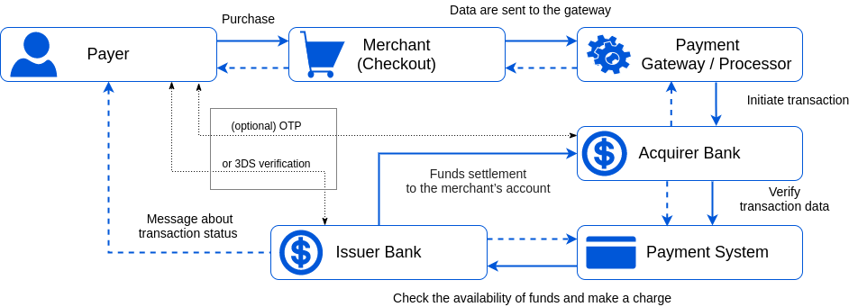
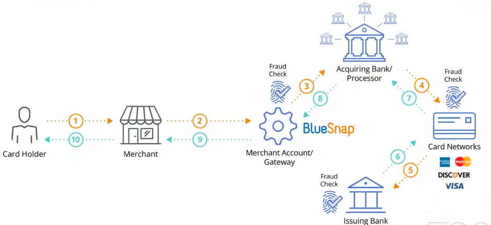
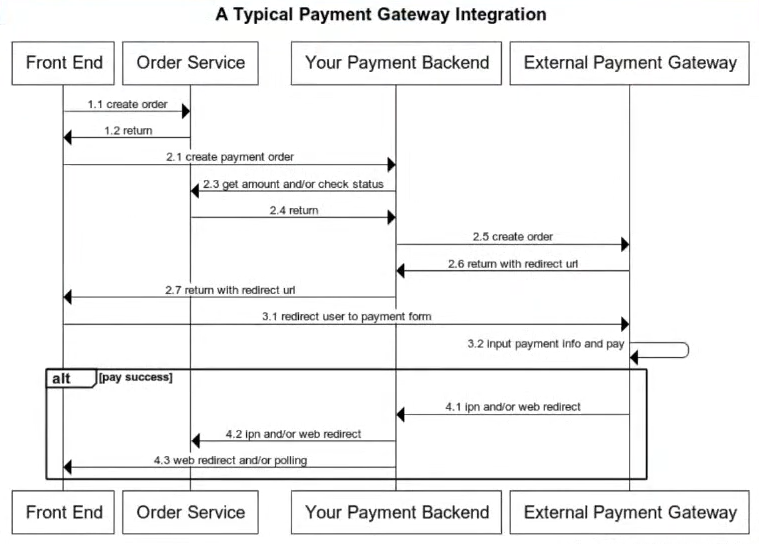
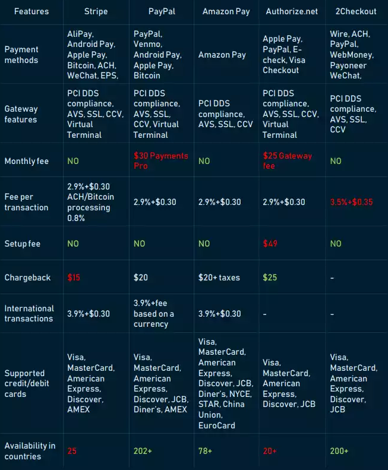

# Payment notes 


## Payment flow

- **Payer / Card holder** that decides to pay for the service.
- **Merchant** (business owner or service provider) to whose account the funds are transmitted.
- **Acquirer** processes payments on behalf of the merchant and routes them through the **Card Networks** (such as Visa or Mastercard) to the issuing bank. 
- Seldom acquirers may attract third party providers to help process payments. Payment service providers (PSP) can offer the organisation of payment reception, Internet acquiring, agency cooperation scheme, act as international or local companies, have different conditions for opening accounts.
- **Issuer bank** that extends cards to consumers on behalf of the card networks.


:::: tabs 

::: tab Pic1

:::

::: tab Pic2

:::
::::

1. The customer places an order, fills in all necessary card (account) data for payment, and press a 'Pay' button.
2. The encrypted data are sent to a payment gateway that collects payment details, initiates a transaction and sends data to an acquirer. Yet, the acquirer by itself may act as a payment gateway in several cases.
3. After confirming transaction data and, optionally, checking the payer by OTP verification, the acquirer transfer data to a payment system.
4. The payment system validates the transaction data and passes them to an issuer bank.
5. The issuer also checks the authorisation request and responds to the payment processor with the transaction status or error details. Before this, the issuer bank may request 3DS verification from the payer.
6. Through the payment gateway, the transaction status is returned to the merchant.
7. The merchant displays a status page with the transaction status (accepted or denied). And the issuer bank also sends an appropriate message to the customer.
8. Within a day or a couple of days, during clearing process, the issuing bank transfers funds to the merchant's account.

## Integration


*Typicla Payment gateway integration*

### Authorization & Capture

- **Authorization**  The bank checks for sufficient funds and, if successful, holds the amount on the customer’s account to guarantee it or the merchant.
- **Capture** The money moves from the issuing bank to the merchant’s account. 


Separating authorization and capture is useful if you need to take additional actions between confirming that a customer is able to pay and collecting their payment. For example, if you’re selling stock-limited items, you may need to confirm that an item purchased by your customer using Checkout is still available before capturing their payment and fulfilling the purchase. 


### [Stripe: Separate authorization & capture](https://stripe.com/docs/payments/accept-a-payment?platform=web&ui=checkout#auth-and-capture)

```js{10}
const session = await stripe.checkout.sessions.create({
  line_items: [
    {
      price: '{{PRICE_ID}}',
      quantity: 1,
    },
  ],
  mode: 'payment',
  payment_intent_data: {
    capture_method: 'manual',
  },
  success_url: 'https://example.com/success.html',
  cancel_url: 'https://example.com/cancel.html',
});
```

To capture an uncaptured payment use [capture API](https://stripe.com/docs/api/payment_intents/capture)

```js
const paymentIntent = await stripe.paymentIntents.capture(
  'pi_3NDBAc2eZvKYlo2C0KIz0yl1'
);
```

### [Mollie: Two flows: authorized and paid](https://docs.mollie.com/orders/status-changes#two-flows-authorized-and-paid)


We take action `cancel` the payment when `authorized`, `refund` if payment `paid`, `completed`, `shipping`. 
- `refund` action could be charged double (from the original payment, and the refund payment)
- increase action `cancel` to avoid being charged
- [Cancel order lines](https://docs.mollie.com/reference/v2/orders-api/cancel-order-lines)


### Avoid missing payment status changes  

1. Redirect - a request from FE to BE
2. Instant Payment notification (IPN) / Webhooks  - a request from PSP to your BE
3. Polling - a request from your BE to PSP (be carefully with ratelimit)

*Note*: Use a distributed lock to avoid race-condition if implement multi ways to fulfill the payment.


**See more**
- [Mollie: Payment status changes](https://docs.mollie.com/payments/status-changes)
- [Mollie: Order status changes](https://docs.mollie.com/orders/status-changesges)
- [Stripe: How payment intents work](https://stripe.com/docs/payments/intents)

::: danger Stripe Failed Payment
A **failed** payemnt intent of Stripe can become a **succeeded** after payer retries.
::: 


### Tokenization


::: danger ⚠️⚠️⚠️ Can a Merchant Store Credit Card Information?
To answer briefly, yes, merchants can store credit card information.

The long answer is that merchants must be **PCI compliant** to store their credit card data. However, there’s also some data you can keep and some you can’t make sure you securely handle your customers’ credit card information.

[Read more: PCI requirements for storing credit card](https://www.pcidssguide.com/pci-requirements-for-storing-credit-card-information/)
:::

::: tip Use Tokenization
Tokenization is the process uses to collect sensitive card or bank account details, or personally identifiable information (PII), directly from your customers in a secure manner. 

**A token representing this information is returned to your server to use**. You should use our recommended payments integrations to perform this process **client-side**. This ensures that no sensitive card data touches your server, and allows your integration to operate in a PCI-compliant way.

:::

Note: Card Token is valid in 1 hour


Read more: 
- [Stripe - Token Management (Beta)](https://stripe.com/docs/issuing/controls/token-management)
- [Stripe - Save payment method details](https://stripe.com/docs/payments/accept-a-payment?platform=web&ui=checkout#save-payment-method-details)
- [Mollie - Create payment (Credit card)](https://docs.mollie.com/reference/v2/payments-api/create-payment#credit-card)


### Recurring payments

::: warning Reducing the risk of chargebacks
To reduce the risk of chargebacks, it’s recommended to communicate how often and how much the customer will be charged as clearly as possible. We suggest notifying the customer a couple of days in advance of the next payment, for example by sending them an email.
:::

**Types**:
- Subscriptions: billings, recurring donations, ...
- Installments: let you split a payment into a few recurring charges

**Refs**: 
- [Mollie Recurring ](https://docs.mollie.com/payments/recurring)
- [Stripe Recurring payments](https://stripe.com/docs/recurring-payments)

## Avoid double charge

When we design the payment system, it is important to guarantee that the payment system executes a payment order exactly-once.

At the first glance, exactly-once delivery seems very hard to tackle, but if we divide the problem into two parts, it is much easier to solve. Mathematically, an operation is executed exactly-once if:

1. It is executed at least once.
2. At the same time, it is executed at most once.

```
Exactly-once = Retry + Idempotency 
```

- Retry: Occasionally, we need to retry a payment transaction due to network errors or timeout. Retry provides the **at-least-once** guarantee.
- Idempotency: From an API standpoint, idempotency means clients can make the same call repeatedly and produce the same result.  

For communication between clients (web and mobile applications) and servers, an idempotency key is usually a unique value that is generated by clients and expires after a certain period of time.


<!-- https://www.altexsoft.com/blog/business/payment-gateway-integration/ -->


## Payment security

The table below summarizes techniques that are commonly used in payment security.

Problem | Solution
---- | -------
Request/response eavesdropping | Use HTTPS
Data tampering | Enforce encryption and integrity monitoring
Man-in-the-middle attack | Use SSL and authentication certificates
Data loss | Database replication across multiple regions and take snapshot of data
Distributed denial-of-service attack (DDoS) | Rate limiting and firewall
Card theft |  Tokenization. Instead of using real card numbers, tokens are stored and used for payment
PCI compliance | PCI DSS is an information security standard for organizations that handle branded credit cards
Fraud | Address verification, card verification value (CVV), user behavior analysis, etc.


## Popular PSP(s)



## Database Design 

### Never Use Floating-Point / Double Data types for Monetary Calculations!


Floating point values, or even (Double precision floating point format), should be avoided when using a currency amount with fractions (like Dollars and cents), in its nature, it cannot be stored exactly as is in memory. 

Say we want to store 0.1 dollars, any floating-point data type can not store it as is, it get’s stored as an approximation (0.10000000149….). 

When doing a series of math operations, some problem can rise, that is called (loss of significance), the errors can be amplified and cause trouble 🧐.
the solution is simple in swift, use NSNumber

```
let myBalance = 12.333
let decimal: Decimal = NSNumber(floatLiteral: 12.333).decimalValue
let result = decimal / 3
```


- [Monetary value in integer over decimal datatype](https://dba.stackexchange.com/questions/248815/monetary-value-in-integer-over-decimal-datatype)
- [best data type is for storing money values](https://laracasts.com/discuss/channels/laravel/best-data-type-is-for-storing-money-values)

## Acronyms 
- PCI DSS = Payment Card Industry Data Security Standard
- PSP = Payment Service Provider 
- CVV = Card Verification Value