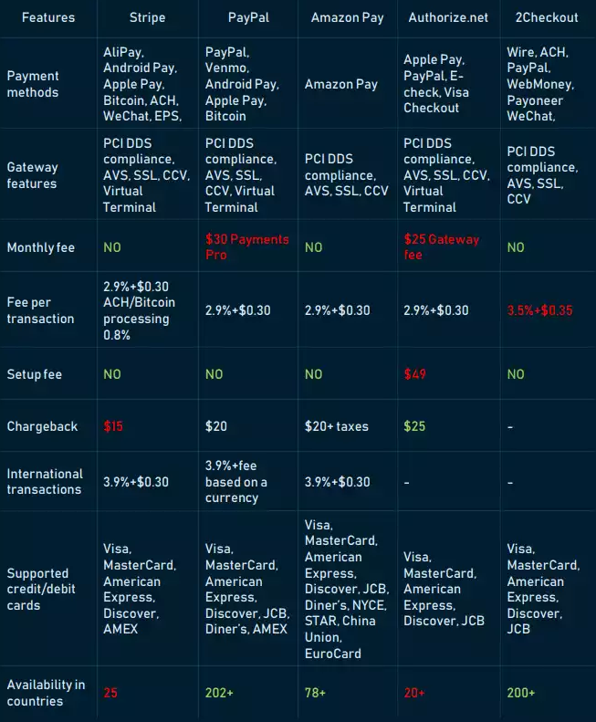

# Payment Service Providers (PSPs)

## Popular PSPs

## Types

### 1. Traditional Banks
- **Role**: Many banks offer payment processing services to their merchant customers, either directly or through partnerships with third-party PSPs.   
- **Advantages**: Established trust, comprehensive financial services.   
- **Disadvantages**: Potentially higher fees, slower onboarding process.

### 2. Independent PSPs
- **Role**: Standalone companies specializing in payment processing services.   
- **Advantages**: Flexibility, advanced features, competitive pricing.   
- **Disadvantages**: Might lack the comprehensive financial services of banks.

### 3. Payment Gateways
- **Role**: Focus solely on providing payment gateway services, enabling merchants to securely accept online payments.   
- **Advantages**: Easy integration, wide range of payment options.   
- **Disadvantages**: Limited to payment processing, additional services might be required.

### 4. Aggregators
- **Role**: Combine multiple payment methods and present them as a single solution to merchants.
- **Advantages**: Simplified integration, access to various payment options.
- **Disadvantages**: Potentially higher fees, less control over payment processing.

### 5. Merchant Acquirers
- **Role**: Handle the authorization and settlement of credit and debit card transactions.   
- **Advantages**: Direct access to card networks, potential for lower fees.
- **Disadvantages**: Complex setup, higher operational costs.

### Additional Types**:
- **Mobile Payment Processors**: Specialize in processing payments made through mobile devices.
- **E-wallet Providers**: Offer digital wallet services for storing and transferring funds.

## Payment Processor vs. Payment Gateway

While both are essential components of electronic transactions, payment processors and payment gateways serve distinct roles.   

### Payment Gateway
- **The interface**: A payment gateway is the online equivalent of a physical point-of-sale terminal.   
- **Collects information:** It securely collects customer payment information (card number, expiration date, CVV).   
- **Transmits data**: Encrypts and sends this information to the payment processor.   
- **Provides feedback**: Communicates the transaction's approval or decline back to the merchant.   

### Payment Processor
- **The backend**: Handles the complex process of routing and processing the transaction.   
- **Verifies information**: Checks the validity of the payment information.   
- **Authorizes transaction**: Communicates with the customer's bank to authorize the purchase.   
- **Transfers funds**: Facilitates the transfer of funds from the customer's bank to the merchant's account.   
- **Fraud prevention**: Implements security measures to protect against fraudulent transactions.

### Summarization
- **Payment gateway**: The customer-facing part of the transaction.
- **Payment processor**: The behind-the-scenes engine that makes it happen.