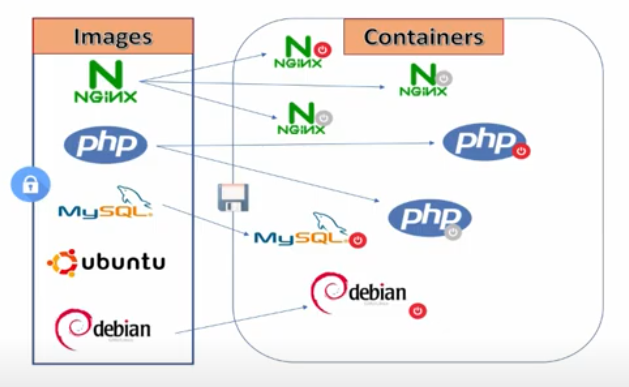

# Docker
[[toc]]


## Terms

- **Docker Hub**: store Docker Image
- **Docker Engine**: create **Docker Image** & run **Docker Container**
- **Docker Machine**: create **Docker Engine** on Server
- **Docker Compose**: run application by defining Docker Container configuration in file
- **Docker Image**: (immutable)
- **Docker Container**: … 

## Image



:::: tabs
::: tab "List All"
```
docker images
```
:::

::: tab Pull
```
docker pull <image:tag>
# E.g: 
docker pull centos:6.10 
```
Default tag: `latest`
:::

::: tab Inspect
```
docker inspect  <ID or NAME>
``` 
:::

::: tab Remove
```
docker rm <ID or NAME>

docker rm -f <ID or NAME>
```
:::

::: tab Save/Load

Save
```
docker save --output <filename> <ID or NAME>
# e.g:
docker save --output myimage.tar khank-ubuntu
```

Load
```
docker load -i <filename>
```

Rename
```
docker tag f <image-name:tag>
```
:::
::::


## Container

:::: tabs
::: tab "List All"

List running container only 
```
docker ps 
```

All of list, includes hidden ones

```
docker ps -a 
```
:::

::: tab Start/Stop

```
docker start <ID or NAME>
```

```
docker stop  <ID or NAME>
```
:::

::: tab Attach/Detach

Attach
```
docker attach <ID>
```
Detach
```
Ctrl + P, Ctrl + Q
```
:::

::: tab Remove
```
docker rm -f <ID or NAME>
```
:::

::: tab "IP Address"
```
docker inspect -f '{{range .NetworkSettings.Networks}}{{.IPAddress}}{{end}}' <ID or NAME>
```
:::
::::

### Save as Image

Container must be stoped before committing.
```
docker commit <container-name> <new-image-name:tag>
```

### Run

:::: tabs


::: tab "Expose Port"
```
docker run -d -p 5801:5800 --name vnc1 myvnc 
```

multi ports

```
docker run -d -p 5801:5801 -p 5802:5802 .....
```
:::

::: tab Volume

```
docker run -it -v <path-host>:<container-path> <ID or NAME>
# E.g:
docker run -it -v /Users/nguyenkhank/Desktop/jav:/home/dulieu ubuntu
```

Use the same data:

```
docker run -it --name C2 --volumes-from C1 ubuntu:latest
```
:::

::::

### With Volume

```
docker run -it --name <container-name> --mount source=<volume-name>,target=<container-path> <image-name:tag>
# E.g:
docker run -it --name C1 --mount source=D1,target=/home/dulieu ubuntu:16.0.4
```

Case volume mounted with device

```
docker run -it --name <container-name> --mount source=<volume-name>,target=<container-path> <image-name:tag>
# E.g:
docker run -it --name C1 -v DISK1:/home/dulieu ubuntu:16.0.4
```

## Volume

:::: tabs

::: tab List
```
docker volume ls
```
:::

::: tab Create
```
docker volume create <Volume-name>
# E.g:
docker volume create D1
```

Mount to device path
```
docker create --opt device=<path-host> --opt type=none --opt o=bind <volume-name>
# E.g
docker create --opt device=/Users/nguyenkhank/Desktop/jav --opt type=none --opt o=bind DISK1
```
:::

::: tab Info
```
docker volume inspect <Volume-name>
# E.g
docker volume inspect D1
```
:::

::: tab Remove
```
docker volume rm <Volume-name>
# E.g
docker volume rm D1
```
:::
::::


## Network

[Detail](https://www.tutorialspoint.com/docker/docker_networking.htm)
[Detail](https://docs.docker.com/engine/reference/commandline/network_connect/#:~:text=Connect%20a%20container%20to%20a%20network%20when%20it%20starts,connect%20it%20to%20a%20network.)

:::: tabs

::: tab "List All"
```
docker network ls 
```
:::

::: tab "Create New"

```
docker network create –-driver DRIVER_NAME name 
# E.g
docker network create –-driver bridge new_nw 
```

- **drivername** − This is the name used for the network driver.
- **name** − This is the name given to the network.
:::

::: tab Connect
```
docker network connect <NetworkName>  <container-name>
# E.g
docker network connect my_network my_container
```
:::

::: tab Inspect
```
docker network inspect <NetworkName> 
```
:::

::::


### Other

**Info** 
```
docker info
docker -v
```

**Help**
```
docker image --help
```

**Search**
```
docker search <keyword>
```
