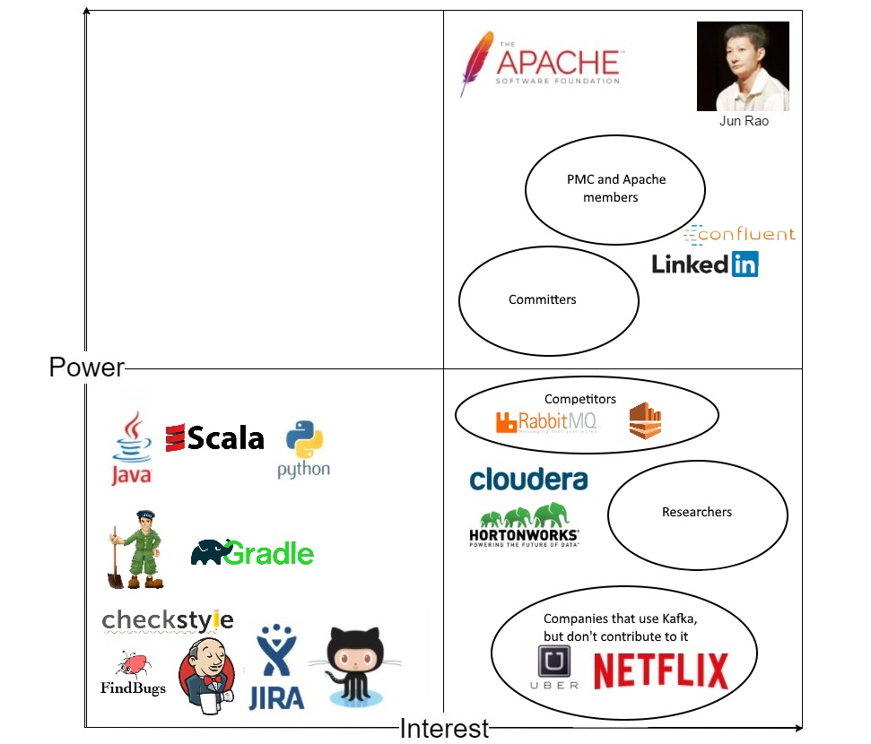
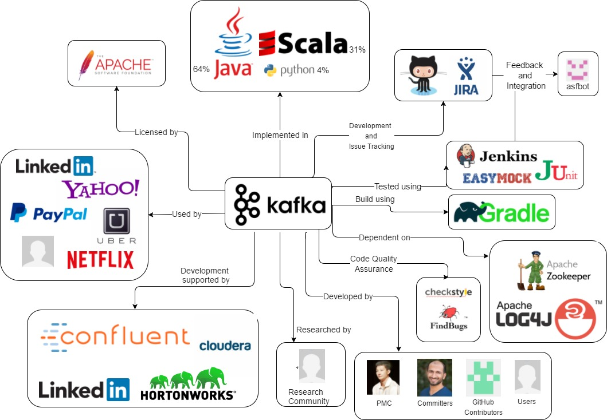
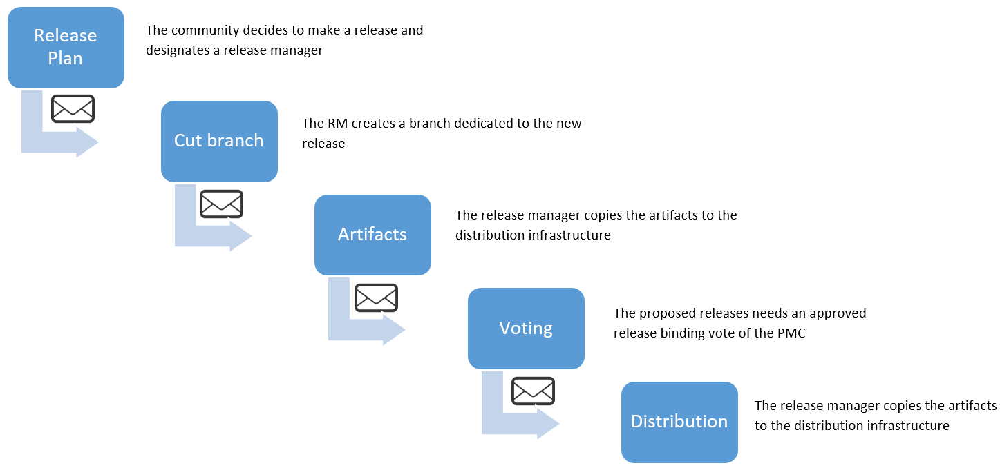
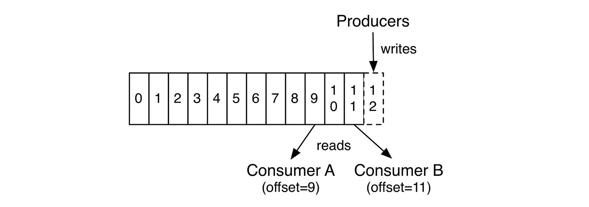
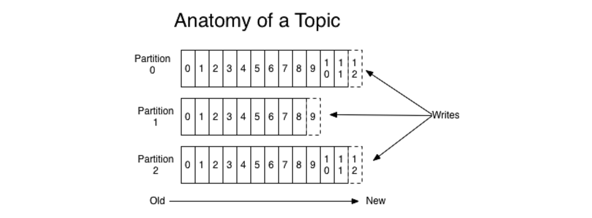

# Kafka overview

## Abstract
[Apache Kafka](https://kafka.apache.org/) is an open source streaming platform, which allows to publish, store and process streams of information. The software is widely used by companies such as LinkedIn and Spotify and has a large and active development community. This chapter aims at analyzing the software and its development from three viewpoints, i.e. the context view, the development view and the information view as defined by Rozanski and Woods. We thereby try to create a knowledge base, for the current state of the project as well as its evolution.

We found that the Apache Kafka project has a rich environment of stakeholders with regard to its use and development, which even includes researchers. Furthermore we elaborate upon the module structure of Kafka and discuss the strong standardization of development, testing and release management practices of Kafka, that overall has a reasonable and consciously maintained amount of technical debt. Finally, we have concluded that Kafka is overall an example of a neat software project of large scale. However, a few improvements could still be implemented, especially with regard to architectural documentation.

## 1. Introduction

Streaming has become an essential way of sharing the data over the internet, which allows to view and process the content before it has been fully transmitted. The application of streaming in most of the companies is done separately for each two platforms or modules, which causes a high number of dependencies and processes to maintain and supervise. Moreover, most of the programs focus on a stream delivery, which does not suffice the needs of large companies. A solution for these problems that includes additional functionality can be found in Apache Kafka.

Apache Kafka is an open source streaming platform, which allows to publish, store and process streams of information across multiple entities.
Moreover, these actions are executed in a distributed manner, which allows it to adhere to parallelism, fault tolerance and high scalability of the processes. Finally, Kafka is designed to bring together multiple sources of data as well as many destinations, making it simple to adapt as a broker for the data streaming.

This chapter aims at analyzing Kafka as a software project based on viewpoints and perspectives defined by Rozanski and Woods. To this end we discuss the stakeholders surrounding Kafka and their power and interest in section 2. A more elaborate view of it's environment in terms of a context view is discussed in section 3. Afterwards, in section 4, we have a closer look at the architecture of, development practices adopted in and technical debt accumulated by Kafka. We elaborate upon the information viewpoint in section 5, discussing the structure, flow, ownership and guarantees with regard to information in Kafka. We furthermore discuss various views in a timely perspective in section 6. Finally, we conclude our findings in section 7.

## 2. Stakeholders

In this section we discuss the stakeholders involved in Apache Kafka, the official structure as an Apache software project and identify its two official stakeholders.

### Kafka, an Apache Software Project

Since Kafka is a project of the Apache Software Foundation (ASF), the foundation holds the copyright on all Apache code including the code in the Kafka codebase. In their own bylaws and in accordance with 'the Apache Way', Kafka distinguishes two project roles: the Committers and the Project Management Committee (PMC). The Committers are responsible for the project’s technical management and have access to and responsibility for all of Kafka’s source code repository. The PMC is responsible for the technical direction and oversight of the project and reports quarterly to the Board of Directors of ASF. All of the PMC members are also Committers.

### Classifying Stakeholders

Rozanski and Woods have classified stakeholders into a framework of stakeholder classes. Based on this, we present an overview of how the various stakeholders in Apache Kafka could be classified into these stakeholder groups below.

Class of stakeholders | Role(s) and concern(s) | Kafka stakeholder
----------------------| ------------------------| -------------------
Acquirers  | Oversee the procurement of the system or product | PMC
Assessors   | Oversee the system’s conformance to standards and legal regulation | PMC
Communicators | Explain the system to other stakeholders via its documentation and training materials | PMC and Committers, but also developers and system administrators that use Kafka that communicate through the Apache Kafka website and documentation
Developers | Construct and deploy the system from specifications (or lead the teams that do this) | PMC (in the form of development managers), Committers and other GitHub contributors as core developers
Maintainers | Manage the evolution of the system once it is operational | PMC and Committers
Production Engineers | Design, deploy, and manage the hardware and software environments | Third party software organizations such as JIRA, Jenkins, Gradle, CheckStyle, ect.
Suppliers | Build and/or supply the hardware, software, or infrastructure on which the system will run | JVM, Scala, Apache Zookeeper, Clients
Support Staff | Provide support to users for the product or system when it is running | PMC and Committers, but also individual developers active in the Kafka's users mailing lists
System Administrators | Run the system once it has been deployed | System administrators at companies that use Kafka
Testers | Test the system to ensure that it is suitable for use | PMC and Committers vote for approval, Users also contribute to (context specific) testing and the creation of issues, as well as Developers in general
Users | Define the system’s functionality and ultimately make use of it | Confluent and LinkedIn seem to play a major role in defining functionality, a [multitude of (large) companies](https://cwiki.apache.org/confluence/display/KAFKA/Powered+By) are regular users
Researchers | Work with or on the system from a research perspective, Apache Kafka is thereby a separate object of study or used in a larger system under study | An active community of researchers - Kafka is stated in [over 800 papers](https://scholar.google.nl/scholar?hl=nl&q=%22Apache+Kafka%22&btnG=&lr=) that may also be PMC members, Committers or other developers
Competitors | Offer (a subset of) similar functionalities as Kafka | Traditional messaging platforms such as ZeroMQ and RabbitMQ, related modern messaging platforms such as Amazon Kinesis and Apache Flink

### Power versus Interest

We extend upon the previous classification of stakeholders to include the power and interest of the various stakeholders. We do so by means of a power interest grid, of which the result is shown below. For an explanation of images that were not introduced yet but are depicted in this grid, we direct the reader to section 3.

The third party software used by Kafka can be divided in three groups, all in the lower left quadrant of the power interest grid. The group having the least power and interest consists of GitHub, JIRA, CheckStyle, FindBugs and Jenkins. Less easy to replace are Gradle, Ducktape and Zookeeper, as they have less alternatives that could be used with regard to Kafka's usage. The third group is formed by the programming languages, again this group has no interest in Kafka, but does have more power as the whole codebase consists of them, i.e. they are hardly replaceable.

More interest - but hardly any power - resides with companies such as Netflix that use Kafka, but do not officially contribute. Developers on products such as HortonWorks and Cloudera - which include Kafka in their core - and researchers that study Apache Kafka itself or use it in their research generally contribute more and therefore have a larger amount of power. We define competitors of Kafka to have a similar amount of interest, but somewhat more power as they can steer the development process of Kafka (e.g. by adopting new features).

In the quadrant containing the most interest and power, we can furthermore see a growth of both from simple developers to Committers to PMC members to Kafka's Vice President Jun Rao. As early explained, the ASF holds a significant amount of power, although it's interest may be less compared to e.g. LinkedIn and Confluent from which Kafka originated and still gains much steering and development contributions.

## 3. Context View

This section describes the system's scope and responsibilities as well as relations with its environment consisting of users and external entities.

### System Scope and Responsibilities

The system scope and responsibilities define what the system should do in order to fulfil its objective. These include the following:

- Enabling users to publish and subscribe to streams of records. In this respect it is similar to a message queue or enterprise messaging system.
- Enabling users to store streams of records in a fault-tolerant way.
- Enabling users to process streams of records as they occur.
- Enabling users to build real-time streaming data pipelines that reliably get data between systems or applications
- Enabling users to build real-time streaming applications that transform or react to the streams of data

### External Entities

There are several external entities surrounding Kafka's environment. Here, we first elaborate upon them and display them in an overview afterwards.
- The organisation that has started the project: LinkedIn.
- Owner of the project: Apache Software Foundation.
- The license of the project: Apache Licence 2.0.
- Programming languages used in the project: Java (63.7%), Scala (31.3%), Python (4.2%), Other (0.8%)
- The services used for development and issue tracking: GitHub and JIRA.
- The test entities: EasyMock and JUnit software used to develop test cases. The other test entities through which automated testing is applied are Ducktape and Jenkins.
- The code quality assurance tools: Checkstyle and FindBugs for codestyle and bugs respectively.
- The integration software: ASFBot, which integrates GitHub with JIRA.
- Users: companies that use the Kafka platform in their own processes e.g. Spotify, Uber and Netflix, which may also actively contribute to the project, e.g. LinkedIn and Cloudera.
- The development community: consisting of PMC members, Committers, Users, Researchers and other GitHub contributors
- The entities upon which the software is dependent: e.g. Zookeeper and Log4J. The complete list of dependencies can be found at the build.gradle file.

## 4. Development View

"The development viewpoint describes the architecture that supports the software development process" [10]. It can be applied to all systems that have significant software development involved in their creation. We will present an overview of the modules that are part of Kafka, elaborate upon the adopted standardization of design through the as-designed and as-implemented development views and discuss the key architectural styles we identified. We will furthermore discuss the standardization of testing and the release management and how the various actors are involved in these processes.

### Module Overview

Over the past years Apache Kafka has seen a rapid growth in terms of the components and functionalities it offers. As further described in the Evolution section the codebase of the project has grown equally big. The following section therefore aims to display how the source code is organized currently (v0.10.2.0) from a high level perspective.

As mentioned before, the project is implemented in Java as well as Scala. However, most functionalities of the message broker core is written in Scala, whereas packages built on top of that, such as clients or streaming, are written in Java. Through this separation the Core component can be trusted with the characteristics that the Kafka project values most, i.e. handling data feeds with high-throughput and low-latency while ensuring persistency and fault tolerance across clusters. The Scala code is grouped under kafka/core and displayed in the center of Figure 3. As shown in that figure, all other major components extend the Kafka core with further functionalities and interfaces.

- [org.apache.kafka.streams](https://docs.confluent.io/platform/current/streams/overview.html): is a library for building scalable stream processing applications on top of Apache Kafka.
- **org.apache.kafka.connect**: is a framework for reliably streaming data between Apache Kafka and other data systems and allows to use already existing connector implementations for common data sources. Through these interfaces it possible to deliver data from Kafka topics into secondary indexes like Elasticsearch or into batch systems such as Hadoop for offline analysis.
- **org.apache.kafka.clients**: This module provides the two main interfaces through which applications access data in the cluster, the Producer API and the [Consumer API].
- **org.apache.kafka.common**: The Common module provides essential tools that are used by the other modules as well as user apps, e.g. for De-Serialization, performance metrics, error handling, communication protocols and server configuration.

### Standards in Kafka

In such a complex system it is important to standardize the design of key aspects in order to ensure the maintainability and reliability of the resulting product.

#### Standardization of Design

In this section we analyze how Kafka has standardized the way design decisions are made.

Kafka has standardized the design process by requiring a Kafka Improvement Proposal (KIP) for changing any public API or major feature, as defined in their Wiki. A KIP is created as a Wiki entry by the person proposing the changes and then discussed in the mailing list. A KIP should motivate the proposed changes and discuss alternative solutions. The goal is that the integrators as well as the community can ensure that changes have the correct impact on the project. General coding guidelines are also given on their webpage. Lastly, it should be mentioned that many software projects define the use of common design patterns in development. Also in Kafka these patterns are employed though their use not fully standardized, rather this is guided by the use of KIPs and coding guidelines.

#### Standardization of Testing

Testing in Kafka is highly standardized and automated. There are two main tools used by the developers. The first is [Ducktape tool](https://github.com/jhclark/ducttape), a distributed testing framework, which provides the runner, result reporter and additional utilities. Furthermore, the Jenkins system has been incorporated to enable automated tests (see example) in the cloud for different builds of the system. The main difference in use of these two systems is that Jenkins is mainly used for the integration of pull requests, while Ducktape tests may be triggered by a developer at any time, locally. However, it requires bringing up a cluster of virtual machines using 10G RAM.

Considering test writing, with every feature introduced to the system, there are test cases added as well, to make sure that only parts of code that well covered by tests are merged into the system, see example [pull request](https://github.com/apache/kafka/pull/2540). The official guidelines for making contributions that match the test standards can be found in the [documentation](https://cwiki.apache.org/confluence/display/KAFKA/Contributing+Code+Changes). Moreover, the newly introduced test cases are merged to the test cases with most pull requests merged to the system.

The most significant test cases are run over night on a regular basis to ensure that the vital parts of the systems are not corrupted. Next to that, all the test cases are run with every pull request on GitHub. This is executed automatically using Jenkins.

Finally, performance tests are executed as well, to analyze common statistics, logs and server side metrics, as described on the [website](https://cwiki.apache.org/confluence/display/KAFKA/Performance+testing). These tests are automated and incorporated into frequently updated metrics that are monitored to make sure that the system is stable and efficient.

#### Release Management

Management of Apache Kafka releases is standardized even more than it's design and testing processes, as will be discussed in this section. On the [Release Process page](https://cwiki.apache.org/confluence/display/KAFKA/Release+Process) for Committers, which follows the ASF [Release Creation Process](https://infra.apache.org/release-publishing.html), it is specified that a new release requires careful preparation regarding implementation and documentation, but also approval to become reality. The person that actually manages the release process is called the [Release Manager](https://infra.apache.org/release-publishing.html#release_manager) (RM). The release process consists of five major steps in which the RM, but also the Kafka development community and of course the PMC play a part. Below you can find an overview of these steps that are discussed more elaborately on Kafka's release process webpage, as well as an overview of past and future release plans.

*Figure 4: The Release Process in Apache Kafka*

As an extension of the above, it was decided to move to a time-based release plan, as described on the [dedicated Wiki page](https://cwiki.apache.org/confluence/display/KAFKA/Time+Based+Release+Plan) starting with Apache Kafka 0.10.1.0 (October 2016). The motivation to do so was to create a quicker and more predictable development cycle, with higher transparency. However, time pressure and specified time holes between releases form the downside of this approach. Nonetheless, it was decided that the benefits outweigh the cons of this process.

### Technical Debt

In this section, we discuss the technical debt (a term first identified by Cunningham [6]) with regard to Apache Kafka. The subsections respectively describe the debt identified in the system with regard to defects, code-style, testing and documentation.

#### Defect Debt

In the Apache Kafka project, [FindBugs](https://findbugs.sourceforge.net/) is used to automatically detect defects in the form of bugs. However, for a truly critic technical debt collector, it may be good to know that Kafka does not let FindBugs check for all types of bugs, as can be seen in the exclude XML file. Though, we found these omissions not to have a significant impact on the judgement of FindBugs, although the reason for exclusion is not stated explicitly. In our FindBugs runs, we have found a considerable small relative amount of bugs in the FindBugs reports (less than 100 High Priority and less than 3000 Medium Priority Warnings in over 100000 analyzed lines of source code). The parts of code with highest defect debt are related to the core functionality of Kafka, while, minority of them to the external entities. However, since these warnings are well-visible and well-maintained by the Kafka development community (mainly through fixes labelled as "MINOR"), we conclude that the technical debt with regard to defects is pretty low.

#### Codestyle Debt

Similar to the adoption of FindBugs for defects, Kafka has adopted [CheckStyle](https://checkstyle.sourceforge.io/) to control the style of code throughout its codebase. Although we found some severe violations around (e.g. a cyclomatic complexity of 35), we have concluded that Apache Kafka does not have much debt with regard to the code-style. However, we have to state that Kafka both has relaxed some of the default values of CheckStyles' parameters (as specified in the [checkstyle XML file](https://github.com/apache/kafka/blob/trunk/checkstyle/checkstyle.xml)) and instruments CheckStyle to suppress some files (see the suppressions XML file). On the other hand, the relaxed parameters are within an appropriate range with regard to the default values. The amount of debt is again mainly accumulated for the core of the system, while for the external packages it is much less visible.

#### Testing Debt

Testing debt of Apache Kafka was mainly investigated in terms of test coverage based on the JaCoCo Java code coverage library. Firstly, we have analyzed the test coverage for different modules and concluded that some of them accumulated testing debt. One of the main issues when it comes to the test coverage is connected to the streams module, which is a major part of the system. This was mainly caused by its continuous development in the previous releases 0.10.1.0 and 0.10.2.0. This debt is being paid by extending the tests for the related classes. Another module with a low test coverage, yet, much lower importance for the project is log4j-appender. Therefore, we conclude that the developers put much higher focus in having low testing debt in terms of the Kafka core functionalities, while the external libraries are much less tested and have accumulated quite a significant amount of debt.

#### Documentation Debt

Even though there are various, spreaded knowledge sources of the project, there is no clear document describing the architectural design of the system, which constantly changes. Despite the fact that it would be extremely hard to maintain such documentation when keeping in mind how often new features are introduced, the project currently highly discourages an understanding of the design, which is in our view accumulated documentation debt.

## 5. Information View

The Information view can be used to answer, at an architectural level, questions about how the system will store, manipulate, manage, and distribute information. This section therefore aims to provide an overview over the key architectural concepts that govern the information structure, flow and ownership of Kafka.

### Information Structure and Flow

As explained in Rozanski and Woods, an architect's challenge is to focus on the right aspects of information structure and to leave the details to the data modelers and data designers. For this purpose, as described in their documentation , Kafka has introduced a core abstraction for a collection of records — the topic.

#### Topics

Kafka categorizes data feeds by topics. It is the conceptual unit, which all reads and writes go through. A log is a simple, append-only data structure which contains a sequence of ordered records, whereas each entry is assigned to a unique number called offset. Thanks to the strict ordering inside a log, the record offset can be used as a timestamp where a log gets decoupled from any time system. Since records are immutable, Kafka is able to serve multiple users to read at any offset simultaneously. Similarly, it allows multiple producers to write to a topic at the same time, by simply appending the records to the logs.

*Figure 5: The log structure, showing simultaneous reads.*

#### Partitioning
In order to improve scalability and fault tolerance, Kafka divides topics into multiple partitions. This not only allows to move replicas across machines to guarantee fault tolerance, but it is also a way to parallelize the consumption of messages. Each client – be it on consumer or producer side – will split the burden of processing the topic between themselves, such that one member will only be concerned with messages in the partition it is assigned to. Thus, the throughput of the system will scale linearly with the Kafka cluster size.

*Figure 6: Partitioned log structure.*

### Information Ownership

As argued by Rozanski and Woods, it especially important to be able to reason about the synchronicity and recency of records when data is physically distributed across multiple data stores and accessed in different ways. We therefore analyze the theoretical guarantees given by Apache Kafka.

#### Distribution

The partitions of the log are distributed over the servers in the Kafka cluster with each server handling data and requests for a share of the partitions. Each partition is replicated across a configurable number of servers for fault tolerance.

#### Guarantees

As a resume from the descriptions above we list guarantees of Kafka regarding message delivery, fault tolerance and ordering.

*Delivery Model*: Kafka guarantees at-least-once delivery by default and allows the user to implement at-most-once delivery by disabling retries on the producer and committing its offset prior to processing a batch of messages.

Exactly-once delivery requires co-operation with the destination storage system, but Kafka provides the offset which makes implementing this straight-forward

*Fault Tolerance*: It is guaranteed that any successfully published message will not be lost and can be consumed. Furthermore, a topic with replication factor N will tolerate N-1 server failures without losing any messages.

However there is no guarantee for the producer that a message is fully published in case of a network error

*Message Ordering*: The use of a log with sequential numbers for each entry (offset) guarantees that messages from a producer to a topic partition will be appended in the order they are sent. Subsequently, consumers see messages in the order they are stored in the log

#### Replication

To satisfy the guarantees (see above), Apache Kafka supports replication on log partitions level. Replication of topics is executed across a configurable number of other Kafka servers (a.k.a. nodes), whereas each topic has an associated leader node. Producers send data directly to the leader node. A leader node can have zero or more follower nodes which are responsible for replicating the entries of the active log. An incoming message needs to be replicated by every in-sync follower before any other consumer can consume this message. A fully replicated message is therefore considered as *committed*

## 6. Evolution and Outlook

Apache Kafka was initially developed at LinkedIn and subsequently released as an open source project under the umbrella of the Apache Software Foundation. The following sections will put Kafka in an evolutional perspective more elaborately.

### History of Kafka

At some point in the history of LinkedIn, the system landscape was overwhelmed by point-to-point pipelines, each delivering data to a single destination where data was required. Messages were written to aggregated files and then copied to ETL servers and further loaded into data warehousing and batch processing clusters. As a result, the company faced inevitable delays in adding new types of activity data. But integrating new features into the existing system landscape was not the only hassle. The detection time of operational problems noticeably increased over time as a result of ever-increasing pressure on the latency of the data warehouse processes. At this point, stream processing seemed to be the answer to those problems. However, providing continuous data with the current system architecture was not feasible at that point anymore – due to complexity – and thus, the need for a central platform that can provide continuous- and batch data was born.

First attempts towards a piece of infrastructure that can serve stream and batch processing systems were made by consulting classical message broker applications such as ActiveMQ. During tests under full production load they ran into several significant problems as the queue backed up beyond what could be kept in memory. Further difficulties were faced with ActiveMQ’s built in persistence mechanism that lead to very long restart times. According to LinkedIn, it would have been possible to provide enough buffer to keep the ActiveMQ brokers above water but would have required hundreds of servers to process a subset of activity data. Eventually, the engineers decided to a custom tailored messaging infrastructure, targeting high-volume, scale-out deployment that can serve batch- and stream processing systems.

In early 2011 LinkedIn open sourced Apache Kafka, and soon after, on 23 October 2012, the graduation from the Apache Incubator followed. The released state of the application allowed LinkedIn to migrate their entire set of point-to-point queues, reaching above the entire space of their system landscape, into a well structured central message hub which would allow to scale easily while attaching new systems that provide or demand data. 

In November 2014, the engineers who worked on Kafka at LinkedIn, Jun Rao, Jay Kreps and Neha Narkhede, co-founded a new company, Confluent Inc., with a focus on Kafka. The company focusses on building a streaming platform around Apache Kafka. Besides, Confluent is actively contributing to the open source project.

### Evolution of Development Practices

When Kafka was open sourced, the project consisted of 163.181 lines of code. Prior the Apache graduation, a refactoring was applied which lead to a total of 140.864 lines of code. Since then, with the help of the open source community, the project increased by more than a factor of two, up to 298.375 lines of code, as of today (03.04.2017).

The project was initially written entirely in Scala. Over the course of the past few year, however, a great part of the components were re-implemented in Java 8. Likewise, newly introduced components such as "streaming" were implement in Java from the very beginning. Furthermore, Apache Kafka tries to avoid as much third party dependencies as possible. For example, the extensive use of Zookeeper early in the project, acting not only as a intermediary for the broker core but also for the clients, was abolished to a great extent.

### Evolution of Testing

At the beginning of the Apache Kafka development, multiple separate stand-alone programs were created for testing of features. The more new features were introduced, the harder testing appeared to be, because some of these programs became obsolete over time: see this [issue](https://issues.apache.org/jira/browse/KAFKA-875?jql=project%20%3D%20KAFKA%20AND%20text%20~%20%22System%20Test%22).

In 2015, there has been a turning point of the project. At that time a proposal for the Test practice improvement has been [issued](https://cwiki.apache.org/confluence/display/KAFKA/System+Test+Improvements), which lead to unification and automation of testing. The Confluent’s Ducktape system has been selected as a system that best matches the needs of the project. Further, continuous integration with Jenkins system has been established for an effective testing, for instance for each Pull Request on GitHub.

## 7. Conclusions

In its early days, Kafka came as a solution for struggles with moving data at LinkedIn. Later on, it became an Apache project and currently it is widely adopted by a multitude of big companies. From a contextual point of view, it can be concluded that Kafka has a rich environment of stakeholders that use and/or contribute to Kafka. In this environment, we also identified the entities through which Kafka is developed, ranging from programming languages and testing tools, to automated feedback and integration bots. With regard to development, we have identified that documentation debt surrounding the architecture of Kafka from a medium level perspective has been accumulated. Apart from this technical debt, Kafka's codebase was found to have hardly any debt and a good quality. But Kafka is not just a good software project, it is actually one of the big players in the domain of message brokers.

## Refs 

https://delftswa.gitbooks.io/desosa-2017/content/kafka/chapter.html