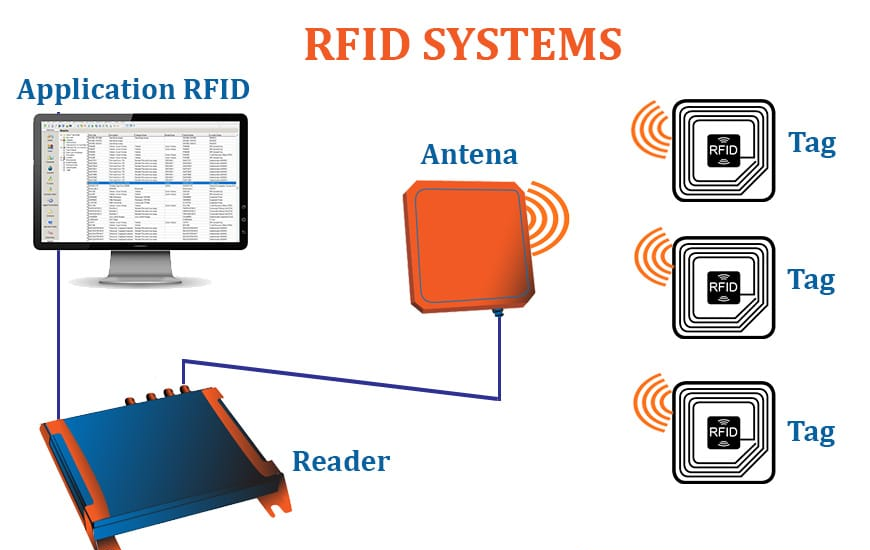

# RFID Notes

Radio Frequency Identification (RFID) technology uses radio waves to **identify** people or objects.

There is a device that reads information contained in a wireless device or “tag” from a distance without making any physical contact or requiring a line of sight.

## Ứng dụng

- Sách
- Thẻ ngân hàng 
- Hộ chiếu điện tử
- Làm khoá điện tử
- Hệ thống đỗ xe tự động
    - kiểm tra việc vào ra của ô tô, ghi lại thời gian đỗ,
    - xác định sự hiện hữ của các chỗ trống và
    - đảm bảo việc thanh toán tiền đỗ xe.
- Hệ thống EAS (electronic article surveillance - điện tử kiểm tra đối tượng)
    - Chip label barcode vào cuốn sách để tránh mất
- SmartKey và SmartStart: cho phép chủ xe có thể mở cửa và khởi động xe mà ko cần lấy chìa khoá ra khỏi túi.

## Thành phần hệ thống RFID

- Chip / Tag RFID (sắt từ )
    - DST (Digital Signature Tag - nhãn với chữ ký số): bộ nhớ + bộ xử lý đơn giản
- Anten RFID
- Reader machine - máy đọc
- Processing machine - Máy xử lý dữ liệu

Nguyên tắc chia ra 2 lớp lớn:

- Hệ thống 1 bit : lưu trên chip 2 trạng thái 0, 1
- Hệ thống N-bit: thông tin lớn hơn (id, name, ...)

## Phân loại tags

### Tags by Frequency
- RFID tần số thấp (LF): 30KHz đến 300KHz, phạm vi đọc là 10 cm. Theo dõi sự phát triển của vật nuôi trong ngành chăn nuôi
- RFID tần số cao (HF): 3MHz đến 30MHz, 10cm đến 1m. Ứng dụng trong thanh toán và truyền dữ liệu.
- RFID tần số siêu cao (UHF): 300MHz đến 3GHz, phạm vi đọc tới 12m. Ứng dụng trong nhiều lĩnh vực như quản lý và kiểm tra hàng hóa, cấu hình thiết bị truyền thông vô tuyến.

### Tags by Active / Passive

**Cấu tạo chung**
- **Ăng ten** bên trong của thẻ
- Vi mạch (Microchip) hoặc mạch tích hợp (IC – Integrated Circuit)

**Active RFID tag**: 
Thẻ RFID chủ động sở hữu nguồn năng lượng riêng (bằng pin) bên trong cho phép thẻ có phạm vi đọc cực dài cũng như bộ nhớ lớn. Thông thường, pin của thẻ có tuổi thọ từ 3 – 5 năm.

2 loại nhỏ 
- **Transponder**: đầu đọc sẽ gửi tín hiệu trước, và sau đó các Thẻ Transponder sẽ gửi tín hiệu trở lại với thông tin liên quan
- **Beacon**: thẻ sẽ không đợi tín hiệu của đầu đọc

**Passive RFID tag**: 
Thẻ RFID thụ động không có nguồn điện bên trong.

Đúng như tên gọi, thẻ RFID thụ động sẽ chờ tín hiệu từ đầu đọc. Đầu đọc sẽ truyền năng lượng đến ăng-ten và chuyển nó thành sóng RF

Phạm vi đọc của hệ thống thụ động này khá giới hạn – không quá 10m. 

### RFID UHF Gen 2
Thẻ UHF RFID Class 1 Gen 2 được gọi tắt là **Gen 2**

**TID Number**
 -  Transponder ID (TID) - được đánh số theo thứ tự cho mục đích nhận dạng

Nói chung, để xác thực một thẻ bị nghi ngờ là giả mạo, hãy đọc bộ nhớ **EPC** và bộ nhớ **TID** và ghi lại cả hai số.

**Password**

Hai chức năng mật khẩu hiện khả dụng trên thẻ Class 1 Gen 2 là: `Access Code` và `Kill Code`. Cả hai loại mật khẩu đều được lưu trữ trên khối bộ nhớ dành riêng và được mã hóa trước bằng các số 0.

### NFC
NFC là một nhánh trong công nghệ RFID HF (RFID tần số cao) và cùng hoạt động dưới tần số là 13.56 MHz. Tiêu chuẩn và giao thức của chuẩn NFC cũng được dựa theo các tiêu chuẩn RFID được ghi chú trong bộ quy chuẩn ISO/IEC 14443, FeLiCa và ISO/IEC 18092.

Nói tóm tắt ta có thể coi NFC là một tập hợp con của RFID, tức là, RFID có khoảng cách truyền thông trong phạm vi 10cm hoặc 4inch có thể coi là NFC. 

## Read more
[Các vấn đề và giải pháp bảo mật cho thẻ RFID](http://vn.rfidtagcn.com/info/security-issues-and-solutions-for-rfid-tags-34307806.html)
[Các biện pháp bảo mật của thẻ RFID UHF](https://rfidstore.vn/cac-bien-phap-bao-mat-cua-the-rfid-uhf/)
[RFID Tags là gì – Cấu tạo thẻ RFID – Các loại thẻ RFID](https://itgtechnology.vn/the-rfid-tags/)